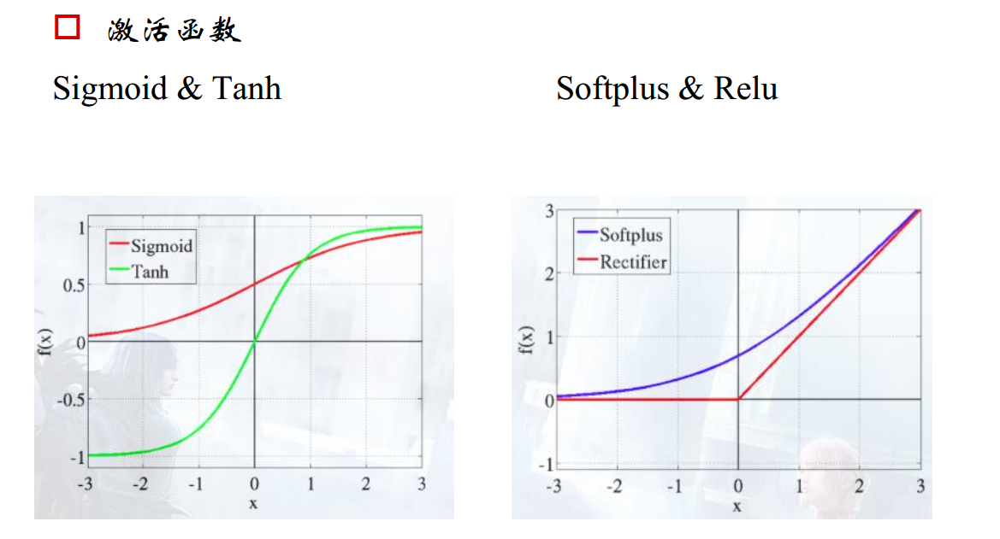
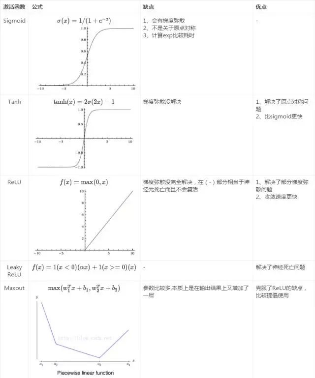
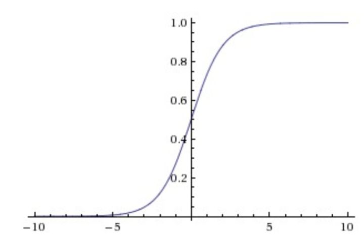
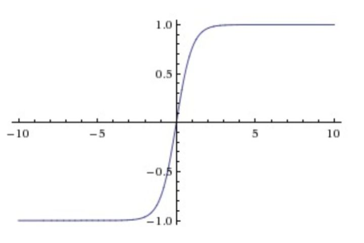
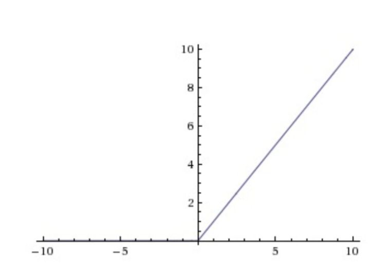
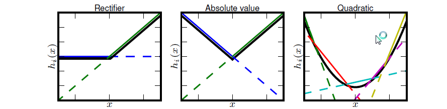
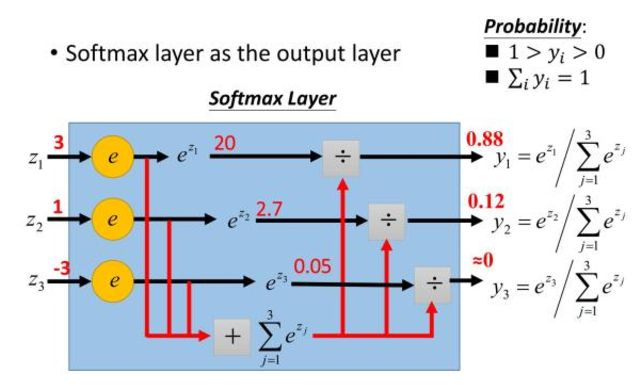

### 什么是激活函数?

激活函数(Activation functions)对于人工神经网络模型去学习、理解非常复杂和非线性的函数来说具有十分重要的作用。

它们将非线性特征引入到我们的网络中。其主要目的是将A-NN模型中一个节点的输入信号转换成一个输出信号。该输出信号现在被用作下一个层的输入。

如果我们不运用激活函数的话，则输出信号将仅仅是一个简单的线性函数。线性方程是很容易解决的，但是它们的复杂性有限，并且从数据中学习复杂函数映射的能力更小。

一个没有激活函数的神经网络将只不过是一个线性回归模型罢了，它功率有限，并且大多数情况下执行的并不好。我们希望我们的神经网络不仅仅可以学习和计算线性函数，而且还要比这复杂得多。

同样是因为没有激活函数，我们的神经网络将无法学习和模拟其他复杂类型的数据，例如图像、视频、音频、语音等。这就是为什么我们要使用人工神经网络技术，诸如深度学习，来理解一些复杂的事情，一些相互之间具有很多隐藏层的非线性问题，而这也可以帮助我们了解复杂的数据。

### 那么为什么我们需要非线性函数?

非线性函数是那些一级以上的函数，而且当绘制非线性函数时它们具有曲率。现在我们需要一个可以学习和表示几乎任何东西的神经网络模型，以及可以将输入映射到输出的任意复杂函数。

神经网络被认为是通用函数近似器。这意味着它们可以计算和学习任何函数。几乎我们可以想到的任何过程都可以表示为神经网络中的函数计算。

而这一切都归结于这一点，我们需要应用激活函数f(x)，以便使网络更加强大，增加它的能力，使它可以学习复杂的事物，复杂的表单数据，以及表示输入输出之间非线性的复杂的任意函数映射。因此，使用非线性激活函数，我们便能够从输入输出之间生成非线性映射。

激活函数的另一个重要特征是：它应该使可以区分的。我们需要这样做，以便在网络中向后推进以计算相对于权重的误差梯度时执行反向优化策略，然后相应地使用梯度下降或任何其他优化技术优化权重以减少误差。

### 激活函数

激活函数的发展经历了Sigmoid->Tanh->ReLU->Leaky ReLU->Maxout这样的过程，还有一个特殊的激活函数Softmax，因为它只会被用在网络中的最后一层，用来进行最后的分类和归一化。

#### Sigmoid

它输入实数值并将其"挤压"到0到1范围内，适合输出为概率的情况，但是现在已经很少有人在构建神经网络的过程中使用sigmoid。

存在问题：

- Sigmoid函数饱和使梯度消失。当神经元的激活在接近0或1处时会饱和，在这些区域梯度几乎为0，这就会导致梯度消失，几乎就有没有信号通过神经传回上一层。

- Sigmoid函数的输出不是零中心的。因为如果输入神经元的数据总是正数，那么关于ω的梯度在反向传播的过程中，将会要么全部是正数，要么全部是负数，这将会导致梯度下降权重更新时出现z字型的下降。

#### Tanh

它将实数值压缩到[-1,1]之间。

存在问题：

- Tanh解决了Sigmoid的输出是不是零中心的问题，但仍然存在饱和问题。为了防止饱和，现在主流的做法会在激活函数前多做一步batch normalization，尽可能保证每一层网络的输入具有均值较小的、零中心的分布。

#### ReLU

相较于sigmoid和tanh函数，ReLU对于随机梯度下降的收敛有巨大的加速作用；sigmoid和tanh在求导时含有指数运算，而ReLU求导几乎不存在任何计算量。

对比sigmoid类函数主要变化是：

1. 单侧抑制；

1. 相对宽阔得兴奋边界；

1. 稀疏激活性。

存在问题：

ReLU单元比较脆弱并且可能"死掉"，而且是不可逆的，因此导致了数据多样化的丢失。通过合理设置学习率，会降低神经元"死掉"的概率。

#### Leaky ReLU

Leaky ReLU非线性函数图像如下图所示。这样做目的是使负轴信息不会全部丢失，解决了ReLU神经元"死掉"的问题。

#### Maxout

Maxout非线性函数图像如下图所示。Maxout具有ReLU的优点，如计算简单，不会饱和，同时又没有ReLU的一些缺点，如容易死掉。

存在问题：

每个神经元的参数double，这就导致整体参数的数量激增。

#### Softmax

Softmax用于多分类神经网络输出，目的使让大的更大。

Softmax使Sigmoid的拓展，当类别数k=2时，Softmax回归退化为Logistic回归。