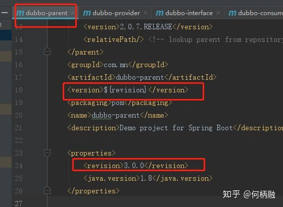
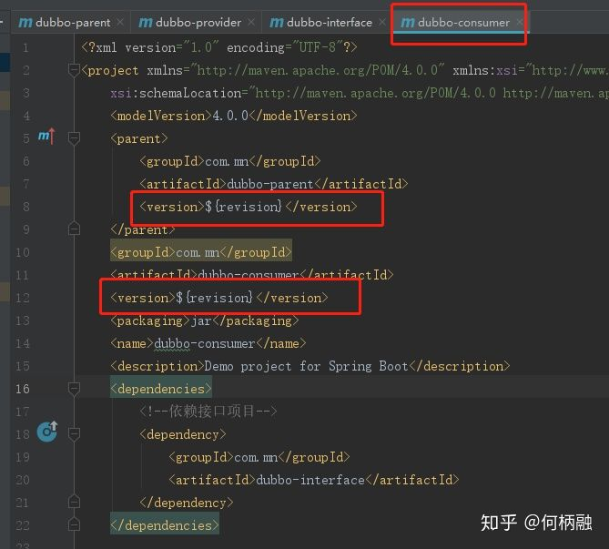
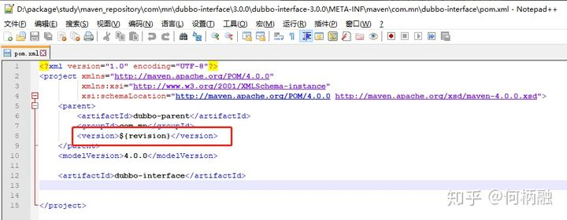

### 发现问题

当项目分为多个子包时，通常都会引用同一个 

- 子包


- 父包


可以看到，在子包中要写死父包的版本号，这样一来，每次进行版本号更迭时，都要对每个子包进行一次修改。

### 解决问题

首先，父包的作用就是统一管理版本，那么理想中的状态就是，当我们修改了父包的版本后，所有子包都会生效，即放弃使用子包中写死的这种写法。在 

- 父包



- 子包



到这一步，已经基本实现了父包的统一管理，但是在install、deploy的时候会出现问题，在打包后的pom文件中 



为了解决这个问题，可以在父包中引入 

```
<plugin>
        <groupId>org.codehaus.mojo</groupId>
        <artifactId>flatten-maven-plugin</artifactId>
        <version>1.1.0</version>
        <configuration>
                <updatePomFile>true</updatePomFile>
                <flattenMode>resolveCiFriendliesOnly</flattenMode>
        </configuration>
        <executions>
                <execution>
                        <id>flatten</id>
                        <phase>process-resources</phase>
                        <goals>
                                <goal>flatten</goal>
                        </goals>
                </execution>
                <execution>
                        <id>flatten.clean</id>
                        <phase>clean</phase>
                        <goals>
                                <goal>clean</goal>
                        </goals>
                </execution>
        </executions>
</plugin>
```

在install后，会发现项目目录中多了 

至此，通过使用 