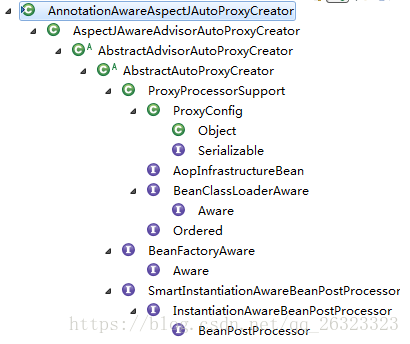

> AOP(Aspect Oriented Programming)是通过动态代理实现的，动态代理又分为JDK动态代理和CGLIB动态代理


### AOP功能简单实现

依赖

```java
<parent>
    <groupId>org.springframework.boot</groupId>
    <artifactId>spring-boot-starter-parent</artifactId>
    <version>1.5.3.RELEASE</version>
</parent>	   
<dependency>      
    <groupId>org.springframework.boot</groupId>  
    <artifactId>spring-boot-starter-aop</artifactId>  
</dependency>
```

创建接口及其实现类

```java
public interface Person {
    void say();
}
public class Student implements Person{
    public void say(){
        System.out.println("这是一个苦逼的程序员");
    }
}
```

创建切面类

```java
@Aspect
public class AspectJTest {
 
	@Pointcut("execution(* *.say(..))")
	public void test(){}
	
	@Before("test()")
	public void before(){
		System.out.println("before test..");
	}
	
	@After("test()")
	public void after(){
		System.out.println("after test..");
	}
	
	@Around("test()")
	public Object around(ProceedingJoinPoint p){
		System.out.println("before1");
		Object o = null;
		try {
			o = p.proceed();
		} catch (Throwable e) {
			e.printStackTrace();
		}
		System.out.println("after1");
		return o;
	}
}
```

创建beans.xml

```java
<?xml version="1.0" encoding="UTF-8"?>
<beans xmlns="
    xmlns:xsi="
    xmlns:aop="
    xsi:schemaLocation="
        
        
 
	<aop:aspectj-autoproxy/>
    <bean id="student" class="test.Student"/>
	<bean class="test.AspectJTest"/>
</beans>
```

测试

```java
public class Test {
 
	public static void main(String[] args) {
 
		ClassPathXmlApplicationContext ac = new ClassPathXmlApplicationContext("beans.xml");
		Person bean2 = (Person)ac.getBean("student");
		bean2.say();
	}
}
```

输出

```java
    before1
    before test..
    这是一个苦逼的程序员
    after1
    after test..
```

总结：AOP功能的使用还是比较简单的，把相关bean注入到Spring容器中，编写好相应的Aspect类即可

### 分析AOP功能源码之前

1. 在使用ApplicationContext相关实现类加载bean的时候，会针对所有单例且非懒加载的bean，在构造ApplicationContext的时候就会创建好这些bean，而不会等到使用的时候才去创建。这也就是单例bean默认非懒加载的应用

1. 读者需要了解BeanPostProcessor的相关使用，所有实现BeanPostProcessor接口的类，在初始化bean的时候都会调用这些类的方法，一般用于在bean初始化前或后对bean做一些修改。而AOP的功能实现正式基于此，在bean初始化后创建针对该bean的proxy，然后返回给用户该proxy

1. 结合以上两点，被代理后的bean，实际在ApplicationContext构造完成之后就已经被创建完成，getBean()的操作直接从singletonObjects中获取即可

### AOP源码架构分析

#### 寻找 

但凡注解都有对应的解析器，以用来解析该注解的行为。全局搜索之后可发现

```java
public class AopNamespaceHandler extends NamespaceHandlerSupport {
	@Override
	public void init() {
		// In 2.0 XSD as well as in 2.1 XSD.
		registerBeanDefinitionParser("config", new ConfigBeanDefinitionParser());
		registerBeanDefinitionParser("aspectj-autoproxy", new AspectJAutoProxyBeanDefinitionParser());// 就是该段代码
		registerBeanDefinitionDecorator("scoped-proxy", new ScopedProxyBeanDefinitionDecorator());
 
		// Only in 2.0 XSD: moved to context namespace as of 2.1
		registerBeanDefinitionParser("spring-configured", new SpringConfiguredBeanDefinitionParser());
	}
}
```

#### 了解AspectJAutoProxyBeanDefinitionParser对应的行为

```java
class AspectJAutoProxyBeanDefinitionParser implements BeanDefinitionParser {
 
	@Override
	public BeanDefinition parse(Element element, ParserContext parserContext) {
        // 1.注册proxy creator
		AopNamespaceUtils.registerAspectJAnnotationAutoProxyCreatorIfNecessary(parserContext, element);
		extendBeanDefinition(element, parserContext);
		return null;
	}
    ...
    
    // registerAspectJAnnotationAutoProxyCreatorIfNecessary()
    public static void registerAspectJAnnotationAutoProxyCreatorIfNecessary(
			ParserContext parserContext, Element sourceElement) {
        // 注册行为主要内容
		BeanDefinition beanDefinition = AopConfigUtils.registerAspectJAnnotationAutoProxyCreatorIfNecessary(
				parserContext.getRegistry(), parserContext.extractSource(sourceElement));
		useClassProxyingIfNecessary(parserContext.getRegistry(), sourceElement);
		registerComponentIfNecessary(beanDefinition, parserContext);
	}
 
    // registerAspectJAnnotationAutoProxyCreatorIfNecessary()
	public static BeanDefinition registerAspectJAnnotationAutoProxyCreatorIfNecessary(BeanDefinitionRegistry registry, Object source) {
        // 主要就是为了注册AnnotationAwareAspectJAutoProxyCreator类
		return registerOrEscalateApcAsRequired(AnnotationAwareAspectJAutoProxyCreator.class, registry, source);
	}
 
    // 注册类相关代码
    private static BeanDefinition registerOrEscalateApcAsRequired(Class<?> cls, BeanDefinitionRegistry registry, Object source) {
		Assert.notNull(registry, "BeanDefinitionRegistry must not be null");
		if (registry.containsBeanDefinition(AUTO_PROXY_CREATOR_BEAN_NAME)) {
			BeanDefinition apcDefinition = registry.getBeanDefinition(AUTO_PROXY_CREATOR_BEAN_NAME);
			if (!cls.getName().equals(apcDefinition.getBeanClassName())) {
				int currentPriority = findPriorityForClass(apcDefinition.getBeanClassName());
				int requiredPriority = findPriorityForClass(cls);
				if (currentPriority < requiredPriority) {
					apcDefinition.setBeanClassName(cls.getName());
				}
			}
			return null;
		}
        
        // 类似于我们在使用BeanFactory.getBean()时候的操作，生成一个RootBeanDefinition，然后放入map中
		RootBeanDefinition beanDefinition = new RootBeanDefinition(cls);
		beanDefinition.setSource(source);
		beanDefinition.getPropertyValues().add("order", Ordered.HIGHEST_PRECEDENCE);
		beanDefinition.setRole(BeanDefinition.ROLE_INFRASTRUCTURE);
		registry.registerBeanDefinition(AUTO_PROXY_CREATOR_BEAN_NAME, beanDefinition);
		return beanDefinition;
	}
```

总结：通过以上的代码分析，可知，AspectJAutoProxyBeanDefinitionParser主要的功能就是将AnnotationAwareAspectJAutoProxyCreator注册到Spring容器中，把bean交给Spring去托管。

AnnotationAwareAspectJAutoProxyCreator的功能我们大胆猜测一下：应该也就是生成对象的代理类的相关功能，这个我们接下来再看。

#### 分析AnnotationAwareAspectJAutoProxyCreator主要行为

通过查看AnnotationAwareAspectJAutoProxyCreator的类层次结构，可知，其实现了BeanPostProcessor接口，实现类为AbstractAutoProxyCreator

类层次结构如下：



#### AbstractAutoProxyCreator主要方法

```java
@Override
public Object postProcessBeforeInitialization(Object bean, String beanName) {
    return bean;
}
// 主要看这个方法，在bean初始化之后对生产出的bean进行包装
@Override
public Object postProcessAfterInitialization(Object bean, String beanName) throws BeansException {
    if (bean != null) {
        Object cacheKey = getCacheKey(bean.getClass(), beanName);
        if (!this.earlyProxyReferences.contains(cacheKey)) {
            return wrapIfNecessary(bean, beanName, cacheKey);
        }
    }
    return bean;
}
// wrapIfNecessary
protected Object wrapIfNecessary(Object bean, String beanName, Object cacheKey) {
    if (beanName != null && this.targetSourcedBeans.contains(beanName)) {
        return bean;
    }
    if (Boolean.FALSE.equals(this.advisedBeans.get(cacheKey))) {
        return bean;
    }
    if (isInfrastructureClass(bean.getClass()) || shouldSkip(bean.getClass(), beanName)) {
        this.advisedBeans.put(cacheKey, Boolean.FALSE);
        return bean;
    }
    // Create proxy if we have advice.
    // 意思就是如果该类有advice则创建proxy，
    Object[] specificInterceptors = getAdvicesAndAdvisorsForBean(bean.getClass(), beanName, null);
    if (specificInterceptors != DO_NOT_PROXY) {
        this.advisedBeans.put(cacheKey, Boolean.TRUE);
        // 1.通过方法名也能简单猜测到，这个方法就是把bean包装为proxy的主要方法，
        Object proxy = createProxy(
                bean.getClass(), beanName, specificInterceptors, new SingletonTargetSource(bean));
        this.proxyTypes.put(cacheKey, proxy.getClass());
        // 2.返回该proxy代替原来的bean
        return proxy;
    }
    this.advisedBeans.put(cacheKey, Boolean.FALSE);
    return bean;
}
```

总结：

1. 通过AspectJAutoProxyBeanDefinitionParser类将AnnotationAwareAspectJAutoProxyCreator注册到Spring容器中

1. AnnotationAwareAspectJAutoProxyCreator类的postProcessAfterInitialization()方法将所有有advice的bean重新包装成proxy

### 创建proxy过程分析

通过之前的代码结构分析，我们知道，所有的bean在返回给用户使用之前都需要经过AnnotationAwareAspectJAutoProxyCreator类的postProcessAfterInitialization()方法，而该方法的主要作用也就是将所有拥有advice的bean重新包装为proxy，那么我们接下来直接分析这个包装为proxy的方法即可，看一下bean如何被包装为proxy，proxy在被调用方法时，是具体如何执行的

以下是AbstractAutoProxyCreator.wrapIfNecessary(Object bean, String beanName, Object cacheKey)中的createProxy()代码片段分析

```java
protected Object createProxy(
        Class<?> beanClass, String beanName, Object[] specificInterceptors, TargetSource targetSource) {
    if (this.beanFactory instanceof ConfigurableListableBeanFactory) {
        AutoProxyUtils.exposeTargetClass((ConfigurableListableBeanFactory) this.beanFactory, beanName, beanClass);
    }
    // 1.创建proxyFactory，proxy的生产主要就是在proxyFactory做的
    ProxyFactory proxyFactory = new ProxyFactory();
    proxyFactory.copyFrom(this);
    if (!proxyFactory.isProxyTargetClass()) {
        if (shouldProxyTargetClass(beanClass, beanName)) {
            proxyFactory.setProxyTargetClass(true);
        }
        else {
            evaluateProxyInterfaces(beanClass, proxyFactory);
        }
    }
    // 2.将当前bean适合的advice，重新封装下，封装为Advisor类，然后添加到ProxyFactory中
    Advisor[] advisors = buildAdvisors(beanName, specificInterceptors);
    for (Advisor advisor : advisors) {
        proxyFactory.addAdvisor(advisor);
    }
    proxyFactory.setTargetSource(targetSource);
    customizeProxyFactory(proxyFactory);
    proxyFactory.setFrozen(this.freezeProxy);
    if (advisorsPreFiltered()) {
        proxyFactory.setPreFiltered(true);
    }
    // 3.调用getProxy获取bean对应的proxy
    return proxyFactory.getProxy(getProxyClassLoader());
}
```

创建何种类型的Proxy？JDKProxy还是CGLIBProxy？

```java
// getProxy()方法
public Object getProxy(ClassLoader classLoader) {
    return createAopProxy().getProxy(classLoader);
}
// createAopProxy()方法就是决定究竟创建何种类型的proxy
protected final synchronized AopProxy createAopProxy() {
    if (!this.active) {
        activate();
    }
    // 关键方法createAopProxy()
    return getAopProxyFactory().createAopProxy(this);
}
// createAopProxy()
public AopProxy createAopProxy(AdvisedSupport config) throws AopConfigException {
    // 1.config.isOptimize()是否使用优化的代理策略，目前使用与CGLIB
    // config.isProxyTargetClass() 是否目标类本身被代理而不是目标类的接口
    // hasNoUserSuppliedProxyInterfaces()是否存在代理接口
    if (config.isOptimize() || config.isProxyTargetClass() || hasNoUserSuppliedProxyInterfaces(config)) {
        Class<?> targetClass = config.getTargetClass();
        if (targetClass == null) {
            throw new AopConfigException("TargetSource cannot determine target class: " +
                    "Either an interface or a target is required for proxy creation.");
        }
        // 2.如果目标类是接口或者是代理类，则直接使用JDKproxy
        if (targetClass.isInterface() || Proxy.isProxyClass(targetClass)) {
            return new JdkDynamicAopProxy(config);
        }
        // 3.其他情况则使用CGLIBproxy
        return new ObjenesisCglibAopProxy(config);
    }
    else {
        return new JdkDynamicAopProxy(config);
    }
}
```

JdkDynamicAopProxy/getProxy()方法

```java
final class JdkDynamicAopProxy implements AopProxy, InvocationHandler, Serializable// JdkDynamicAopProxy类结构，由此可知，其实现了InvocationHandler，则必定有invoke方法，来被调用，也就是用户调用bean相关方法时，此invoke()被真正调用
    // getProxy()
    public Object getProxy(ClassLoader classLoader) {
		if (logger.isDebugEnabled()) {
			logger.debug("Creating JDK dynamic proxy: target source is " + this.advised.getTargetSource());
		}
		Class<?>[] proxiedInterfaces = AopProxyUtils.completeProxiedInterfaces(this.advised, true);
		findDefinedEqualsAndHashCodeMethods(proxiedInterfaces);
        
        // JDK proxy 动态代理的标准用法
		return Proxy.newProxyInstance(classLoader, proxiedInterfaces, this);
	}
```

invoke()方法

```java
public Object invoke(Object proxy, Method method, Object[] args) throws Throwable {
		MethodInvocation invocation;
		Object oldProxy = null;
		boolean setProxyContext = false;
 
		TargetSource targetSource = this.advised.targetSource;
		Class<?> targetClass = null;
		Object target = null;
 
		try {
            // 1.以下的几个判断，主要是为了判断method是否为equals、hashCode等Object的方法
			if (!this.equalsDefined && AopUtils.isEqualsMethod(method)) {
				// The target does not implement the equals(Object) method itself.
				return equals(args[0]);
			}
			else if (!this.hashCodeDefined && AopUtils.isHashCodeMethod(method)) {
				// The target does not implement the hashCode() method itself.
				return hashCode();
			}
			else if (method.getDeclaringClass() == DecoratingProxy.class) {
				// There is only getDecoratedClass() declared -> dispatch to proxy config.
				return AopProxyUtils.ultimateTargetClass(this.advised);
			}
			else if (!this.advised.opaque && method.getDeclaringClass().isInterface() &&
					method.getDeclaringClass().isAssignableFrom(Advised.class)) {
				// Service invocations on ProxyConfig with the proxy config...
				return AopUtils.invokeJoinpointUsingReflection(this.advised, method, args);
			}
 
			Object retVal;
 
			if (this.advised.exposeProxy) {
				// Make invocation available if necessary.
				oldProxy = AopContext.setCurrentProxy(proxy);
				setProxyContext = true;
			}
 
			// May be null. Get as late as possible to minimize the time we "own" the target,
			// in case it comes from a pool.
			target = targetSource.getTarget();
			if (target != null) {
				targetClass = target.getClass();
			}
 
			// 2.获取当前bean被拦截方法链表
			List<Object> chain = this.advised.getInterceptorsAndDynamicInterceptionAdvice(method, targetClass);
 
			// 3.如果为空，则直接调用target的method
			if (chain.isEmpty()) {
				Object[] argsToUse = AopProxyUtils.adaptArgumentsIfNecessary(method, args);
				retVal = AopUtils.invokeJoinpointUsingReflection(target, method, argsToUse);
			}
            // 4.不为空，则逐一调用chain中的每一个拦截方法的proceed
			else {
				// We need to create a method invocation...
				invocation = new ReflectiveMethodInvocation(proxy, target, method, args, targetClass, chain);
				// Proceed to the joinpoint through the interceptor chain.
				retVal = invocation.proceed();
			}
 
			...
			return retVal;
		}
		...
	}
```

拦截方法真正被执行调用invocation.proceed()

```java
public Object proceed() throws Throwable {
		//	We start with an index of -1 and increment early.
		if (this.currentInterceptorIndex == this.interceptorsAndDynamicMethodMatchers.size() - 1) {
			return invokeJoinpoint();
		}
 
		Object interceptorOrInterceptionAdvice =
				this.interceptorsAndDynamicMethodMatchers.get(++this.currentInterceptorIndex);
		if (interceptorOrInterceptionAdvice instanceof InterceptorAndDynamicMethodMatcher) {
			// Evaluate dynamic method matcher here: static part will already have
			// been evaluated and found to match.
			InterceptorAndDynamicMethodMatcher dm =
					(InterceptorAndDynamicMethodMatcher) interceptorOrInterceptionAdvice;
			if (dm.methodMatcher.matches(this.method, this.targetClass, this.arguments)) {
				return dm.interceptor.invoke(this);
			}
			else {
				// Dynamic matching failed.
				// Skip this interceptor and invoke the next in the chain.
				return proceed();
			}
		}
		else {
			// It's an interceptor, so we just invoke it: The pointcut will have
			// been evaluated statically before this object was constructed.
			return ((MethodInterceptor) interceptorOrInterceptionAdvice).invoke(this);
		}
	}
```

总结：依次遍历拦截器链的每个元素，然后调用其实现，将真正调用工作委托给各个增强器

### 总结

纵观以上过程可知：实际就是为bean创建一个proxy，JDKproxy或者CGLIBproxy，然后在调用bean的方法时，会通过proxy来调用bean方法

重点过程可分为：

1. 通过AspectJAutoProxyBeanDefinitionParser类AnnotationAwareAspectJAutoProxyCreator注册到Spring容器中

1. AnnotationAwareAspectJAutoProxyCreator类的postProcessAfterInitialization()方法将所有有advice的bean重新包装成proxy

1. 调用bean方法时通过proxy来调用，proxy依次调用增强器的相关方法，来实现方法切入