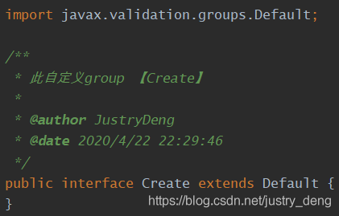
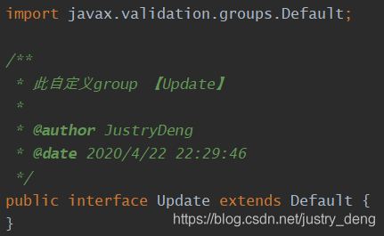
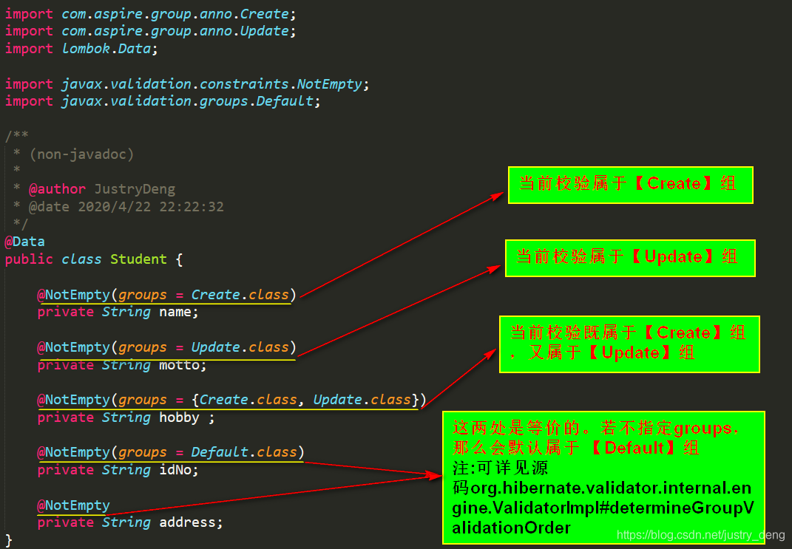
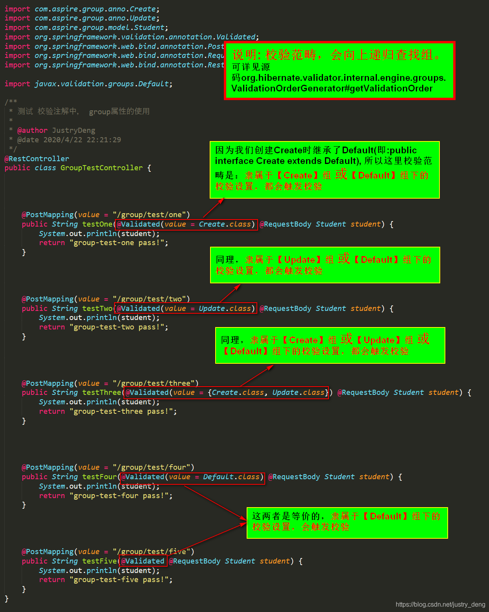
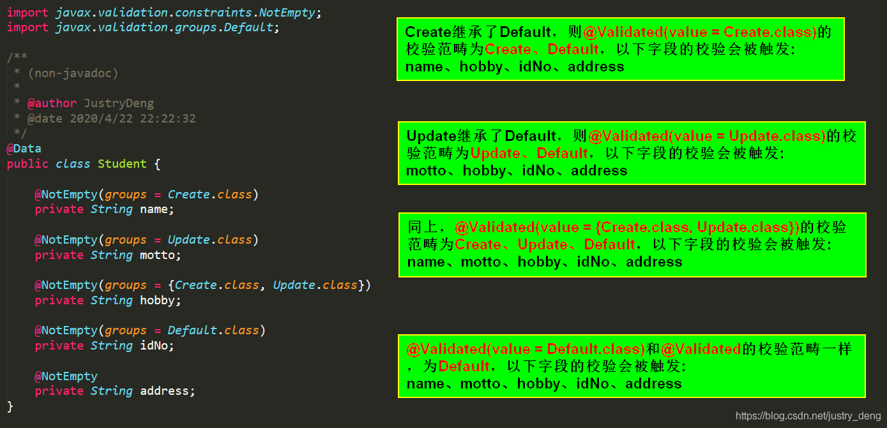

### 一、为何使用？

在业务代码开发过程中，一般都会对 

```
public String add(UserVO userVO) {
    if(userVO.getAge() == null){
        return "年龄不能为空";
    }
    if(userVO.getAge() > 120){
        return "年龄不能超过120";
    }
    if(userVO.getName().isEmpty()){
        return "用户名不能为空";
    }
    // 省略一堆参数校验...
    return "OK";
}
```

这样的写法没有对与不对之说，更多给人的感觉就是灵活但是不够优雅。

试想当有100个参数需要校验时，可能光校验就要写几百行代码，可读性比较差，一些通用的校验逻辑也应该提取出来作为公共方法。

那么，在Spring的生态中，已经有了比较优雅的解决方案，那就是 

### 二、如何使用？

#### 2.1 pom依赖

```
<dependency>
    <groupId>org.springframework.boot</groupId>
    <artifactId>spring-boot-starter-validation</artifactId>
</dependency>
```

#### 2.2 校验时机

@Validated与@Valid的功能大部分类似，两者的不同主要在于：

- @Valid属于javax下的，而@Validated属于spring下。

- @Valid支持嵌套校验，而@Validated不支持。

- @Validated支持分组，而@Valid不支持。

- @Validated用在类型、方法和方法参数上，但是不能用在成员属性（字段）上。

- @Valid用在方法、构造函数、方法参数和成员属性（字段）上。

> 当@Validated/@valid添加到Controller上时，则代表整个controller的参数都需要验证。当@Validated/@valid添加到参数对象前时，则代表对该参数需要验证。


#### 2.3 校验注解

| 注解 | 功能 | 
| -- | -- |
| @AssertFalse | 可以为null,如果不为null的话必须为false | 
| @AssertTrue | 可以为null,如果不为null的话必须为true | 
| @DecimalMax | 设置不能超过最大值 | 
| @DecimalMin | 设置不能超过最小值 | 
| @Digits | 设置必须是数字且数字整数的位数和小数的位数必须在指定范围内 | 
| @Future | 日期必须在当前日期的未来 | 
| @Past | 日期必须在当前日期的过去 | 
| @Max | 最大不得超过此最大值 | 
| @Min | 最大不得小于此最小值 | 
| @NotNull | 不能为null，可以是空 | 
| @Null | 必须为null | 
| @Pattern | 必须满足指定的正则表达式 | 
| @Size | 集合、数组、map等的size()值必须在指定范围内 | 
| @Email | 必须是email格式 | 
| @Length | 长度必须在指定范围内 | 
| @NotBlank | 字符串不能为null,字符串trim()后也不能等于“” | 
| @NotEmpty | 不能为null，集合、数组、map等size()不能为0；字符串trim()后可以等于“” | 
| @Range | 值必须在指定范围内 | 
| @URL | 必须是一个URL | 


#### 2.4 分组校验

在很多时候，同一个模型可能会在多处被用到，但每处的校验场景又不一定相同(如：新增用户接口、修改用户接口，参数都是User模型，在新增时User中name字段不能为空，userNo字段可以为空；在修改时User中name字段可以为空，userNo字段不能为空)。我们可以用groups来实现：同一个模型在不同场景下，(动态区分)校验模型中的不同字段。

默认校验的分组是 

1. 自定义分组





注意：继承Default并不是必须的。只是说，如果继承了Default，那么@Validated(value = Create.class)的校验范畴就为【Create】和【Default】；如果没继承Default，那么@Validated(value = Create.class)的校验范畴只为【Create】，而@Validated(value = {Create.class, Default.class})的校验范畴才为【Create】和【Default】。

1. 设置分组



注意：Default组和无参构造机制类似，当没有指定分组时，会默认当前校验属于Default组,但是一旦主动给当前校验指定了分组(如上图中的name字段，主动指定了属于Create组)，那么就不会再额外指定属于Default组了。

3. 指定分组





#### 2.5 递归校验

如果 UserVO 类中增加一个 OrderVO 类的属性，而 OrderVO 中的属性也需要校验，就用到递归校验了，只要在相应属性上增加@Valid注解即可实现（对于集合同样适用）

```
public class UserVO {
    @NotBlank(message = "name 不能为空",groups = Update.class)
    private String name;
    //需要递归校验的OrderVO
    @Valid
    private OrderVO orderVO;
    // 省略其他代码...
}
```

#### 2.6 自定义校验

**Spring Validation**

##### 2.6.1 自定义注解

```
@Target({ElementType.FIELD})
@Retention(RetentionPolicy.RUNTIME)
@Documented
@Constraint(validatedBy = {HaveNoBlankValidator.class})// 标明由哪个类执行校验逻辑
public @interface HaveNoBlank {
    // 校验出错时默认返回的消息
    String message() default "字符串中不能含有空格";
    Class<?>[] groups() default { };
    Class<? extends Payload>[] payload() default { };
}
public class HaveNoBlankValidator implements ConstraintValidator<HaveNoBlank, String> {
    @Override
    public boolean isValid(String value, ConstraintValidatorContext context) {
        // null 不做检验
        if (value == null) {
            return true;
        }
        if (value.contains(" ")) {
            // 校验失败
            return false;
        }
        // 校验成功
        return true;
    }
}
```

##### 2.6.2 自定义逻辑

借助 

```
public class PersonGroupSequenceProvider implements DefaultGroupSequenceProvider<Person> {
    @Override
    public List<Class<?>> getValidationGroups(Person bean) {
        List<Class<?>> defaultGroupSequence = new ArrayList<>();
        defaultGroupSequence.add(Person.class); // 这一步不能省,否则Default分组都不会执行了，会抛错的
        if (bean != null) { // 这块判空请务必要做
            Integer age = bean.getAge();
            System.err.println("年龄为：" + age + "，执行对应校验逻辑");
            if (age >= 20 && age < 30) {
                defaultGroupSequence.add(Person.WhenAge20And30Group.class);
            } else if (age >= 30 && age < 40) {
                defaultGroupSequence.add(Person.WhenAge30And40Group.class);
            }
        }
        return defaultGroupSequence;
    }
}
```

```
@GroupSequenceProvider(PersonGroupSequenceProvider.class)
@Getter
@Setter
@ToString
public class Person {
    @NotNull
    private String name;
    @NotNull
    @Range(min = 10, max = 40)
    private Integer age;
    @NotNull(groups = {WhenAge20And30Group.class, WhenAge30And40Group.class})
    @Size(min = 1, max = 2, groups = WhenAge20And30Group.class)
    @Size(min = 3, max = 5, groups = WhenAge30And40Group.class)
    private List<String> hobbies;
    /**
     * 定义专属的业务逻辑分组
     */
    public interface WhenAge20And30Group {
    }
    public interface WhenAge30And40Group {
    }
}
```