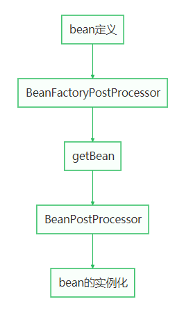

### bean定义

> Q：什么是bean定义？
> class属性创建对象所在类的全路径，决定最终实例化为哪个对象
> autowireMode属性AUTOWIRE_NO：默认装配模式，需要使用注解手动注入AUTOWIRE_BY_NAME：通过set方法，并且set方法的名称需要和bean的name一致AUTOWIRE_BY_TYPE：通过set方法,并且再根据bean的类型，注入属性，是通过类型配置AUTOWIRE_CONSTRUCTOR：通过构造器注入
> Q：什么时候bean定义？通过包扫描（@ComponentScans、@Controller、@Service等）@Bean，@Import
> Q：bean定义存储在哪里？存储在BeanDefinitionMap<beanName,BeanDefinition>


### BeanFactoryPostProcessor

> 在bean还没实例化时，spring提供了一个拓展的机会，可以修改bean定义的属性。


### BeanPostProcessor

> bean初始化之前干点什么，之后又干点什么。


### bean的生命周期



### @Import的三种方式

```java
@Import(value={B.class})
```

1. 普通的类

```java
public class A{
    public A();
}
```

1. 实现了ImportBeanDefinitionRegister的类

```java
public class B implements ImportBeanDefinitionRegistrar {
    @override
    public void registerBeanDefinitions(AnnotationMetadata importingClassMetadata, BeanDefinitionRegistry registry) {
        RootBeanDefinition rootBeanDefinition = new RootBeanDefinition(A.class);
        registry.registerBeanDefinition("A",rootBeanDefinition)
    }
}
```

1. 实现了ImportSelector（可以一次导入多个bean定义）

```java
public class C implements ImportSelector {
    @overried
    public String[] selectImports(AnnotationMetadata importingClassMetadata) {
        return new String[]{"com.test.A","com.test.B"}
    }
}
```

### Spring Factories实现原理

> spring-core包里定义了SpringFactoriesLoader类，这个类实现了检索META-INF/spring.factories文件，并获取指定接口的配置的功能。在这个类中定义了两个对外的方法：loadFactories 根据接口类获取其实现类的实例，这个方法返回的是对象列表。loadFactoryNames 根据接口获取其接口类的名称，这个方法返回的是类名的列表。上面的两个方法的关键都是从指定的ClassLoader中获取spring.factories文件，并解析得到类名列表，具体代码如下


```java
private static Map<String, List<String>> loadSpringFactories(@Nullable ClassLoader classLoader) {
        MultiValueMap<String, String> result = cache.get(classLoader);
        if (result != null) {
            return result;
        }
        try {
            Enumeration<URL> urls = (classLoader != null ?
                    classLoader.getResources(FACTORIES_RESOURCE_LOCATION) :
                    ClassLoader.getSystemResources(FACTORIES_RESOURCE_LOCATION));
            result = new LinkedMultiValueMap<>();
            while (urls.hasMoreElements()) {
                URL url = urls.nextElement();
                UrlResource resource = new UrlResource(url);
                Properties properties = PropertiesLoaderUtils.loadProperties(resource);
                for (Map.Entry<?, ?> entry : properties.entrySet()) {
                    String factoryClassName = ((String) entry.getKey()).trim();
                    for (String factoryName : StringUtils.commaDelimitedListToStringArray((String) entry.getValue())) {
                        result.add(factoryClassName, factoryName.trim());
                    }
                }
            }
            cache.put(classLoader, result);
            return result;
        }
        catch (IOException ex) {
            throw new IllegalArgumentException("Unable to load factories from location [" +
                    FACTORIES_RESOURCE_LOCATION + "]", ex);
        }
    }
```

从代码中我们可以知道，在这个方法中会遍历整个ClassLoader中所有jar包下的spring.factories文件。也就是说我们可以在自己的jar中配置spring.factories文件，不会影响到其它地方的配置，也不会被别人的配置覆盖。spring.factories的是通过Properties解析得到的，所以我们在写文件中的内容都是安装下面这种方式配置的：

```java
com.xxx.interface=com.xxx.classname
```

### @EnableAutoConfiguration

```java
@Import(AutoConfigurationImportSelector.class)
```

```java
@Override
public String[] selectImports(AnnotationMetadata 
annotationMetadata) {
    if (!isEnabled(annotationMetadata)) {
        return NO_IMPORTS;
    }
    AutoConfigurationMetadata autoConfigurationMetadata = AutoConfigurationMetadataLoader..loadMetadata(this.beanClassLoader);
    AutoConfigurationEntry autoConfigurationEntry = getAutoConfigurationEntry(autoConfigurationMetadata,annotationMetadata);
    return StringUtils.toStringArray(autoConfigurationEntry.getConfigurations());
}
```

### 怎么自动？

> 通过SPI的机制，读取spring.factories，把各个场景下的配置类返回给ioc容器，ioc容器解析配置类中的@BeanQ：什么是SPI？Service Provider Interface，是一种服务发现机制。它通过在ClassPath路径下的META-INF/services文件夹查找文件，自动加载文件里所定义的类。


### 装配什么？

> bean定义


### 什么是自动装配？

> 批量加载bean定义
