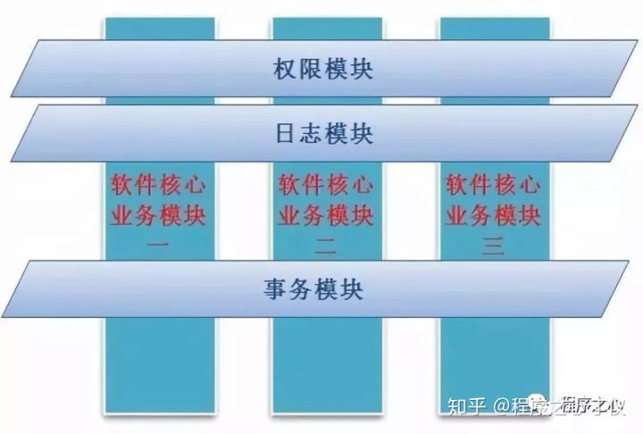

# 基本概念

为什么需要面向切面编程？面向对象编程解决了封装问题，但同时也带来了新问题，如何增强对象的方法？比如，一个接口 A 可能有多个实现类 A1、A2、……、An，如何为多个实现类的同一个方法打印日志或者做权限管理？普通的面向对象思路一般是封装一个工具类，然后加到所有方法里，一旦需要做的增强比较多代码就会很臃肿，难以维护。因此，才有了面向切面编程。

下面的图展示了面向切面编程的思想，面向对象编程通过封装、继承和多态实现了业务逻辑，而面向切面编程把业务流程横刀切开在切面上处理特定事务。一横一竖，切面的称呼就是这样来的。



从上图也可以看出面向切面编程不属于业务逻辑的一部分，而是与具体业务无关的特定事务，如日志、权限等。面向切面编程有以下几个概念需要理解：

1. Aspect(切面)：通常是一个类，里面可以定义切入点和通知；

1. JointPoint(连接点)：程序执行过程中明确的点，一般是方法的调用；

1. Advice(通知)：AOP在特定的切入点上执行的增强处理，可以是前置处理、后置处理、异常处理等；

1. Pointcut(切入点)：就是带有通知的连接点，在程序中主要体现为书写切入点表达式；

1. AOP代理：AOP框架创建的对象，代理就是目标对象的加强。

1. 织入：把切面应用到目标对象来创建新的代理对象的过程。

织入一般发生在如下几个时机：

1. 编译时：当一个类文件被编译时进行织入，这需要特殊的编译器才可以做的到，例如AspectJ的织入编译器；

1. 类加载时：使用特殊的ClassLoader在目标类被加载到程序之前增强类的字节代码；

1. 运行时：切面在运行的某个时刻被织入。

# Spring AOP

Spring 提供了专门的依赖包来支持 AOP 。Spring中的AOP代理可以是JDK动态代理，也可以是CGLIB代理。代理的生成，管理及其依赖关系都是由IOC容器负责，Spring默认使用JDK动态代理，在需要代理类而不是代理接口的时候，Spring会自动切换为使用CGLIB代理。

Spring 提供了多种实现AOP的方式：

1. 基于接口实现的切面：实现接口的方法，定义切入点和通知；

1. 基于注解的切面：基于 @Aspect、@Pointcut、@Before、@AfterReturning 等注解的 AOP 方式；

1. 基于 XML 的切面：使用 xml 中的 aop 命名空间，如 aop:aspect；

## Advisor接口

这里介绍使用比较多比较简单的基于接口方式，其他几种类型不做介绍。Spring 使用 Advisor 接口表示一般切面，包含了 Advice，但是没有切入点。

```
public interface Advisor {
    //获取 Advice
    Advice getAdvice();
    //暂不用
    boolean isPerInstance();
}
```

## PointcutAdvisor接口

PointcutAdvisor 接口继承了 Advisor，代表具有切入点的切面，它包含Advice 和 Pointcut 两个类。基于 PointcutAdvisor 接口即可定义切面，可以通过类、方法名、注解等信息灵活地定义切面的连接点，提供更具适用性的切面。

```
public interface PointcutAdvisor extends Advisor {
    //获取 Pointcut
    Pointcut getPointcut();
}
```

Spring 提供了 PointcutAdvisor 接口的 6 个实现类，定义了 6 种切面类型，如下：

- DefaultPointcutAdvisor：最常用的切面类型，它可以通过任意Pointcut和Advice定义一个切面；

- NameMatchMethodPointcutAdvisor：通过该类可以定义按方法名定义切点的切面：

- RegexpMethodPointcutAdvisor：对于按正则表达式匹配方法名进行切点定义的切面，可以通过扩展该实现类进行操作；

- StaticMethodMatcherPointcutAdvisor：静态方法匹配器切点定义的切面；

- AspecJExpressionPointcutAdvisor：用于Aspecj切点表达式定义切点的切面；

- AspecJPointcutAdvisor：用于AspecJ语法定义切点的切面。

Spring AOP 提供了 Pointcut 接口多种内置实现，我们可以基于这些实现定义切入点。常用的实现包括：

- StaticMethodMatcherPointcut：静态匹配方法，实现方法级别的切入，非运行时切入，默认情况下匹配所有的类；

- DynamicMethodMatcherPointcut：动态匹配方法，实现方法级别的切入，运行时切入，默认情况下匹配所有的类；

- AnnotationMatchingPointcut：基于注解匹配；

- ExpressionPointcut：支持AspectJ切点表达式语法；

- ControlFlowPointcut：控制流程切点，根据程序执行堆栈的信息查看目标方法是否由某一个方法直接或间接发起调用，以此判断是否为匹配的连接点；

- ComposablePointcut：复合切点，为创建多个切点而提供的方便操作类。它所有的方法都返回ComposablePointcut类，这样，我们就可以使用链接表达式对其进行操作。

Spring AOP 提供了 Advice 接口多个子接口来支持增强。如下所示：

- 接口 MethodBeforeAdvice：在目标方法调用之前调用的Advice；

- 接口 AfterReturningAdvice：在目标方法调用并返回之后调用的Advice；

- 接口 MethodInterceptor：在目标方法的整个执行前后有效,并且有能力控制目标方法的执行；

- 接口 ThrowsAdvice：在目标方法抛出异常时调用的Advice；

# AOP注意事项

- AOP 不宜处理耗时太久的操作：AOP 作为切面应该专注于处理简单的事务，如打印日志。耗时过多的操作不宜放在 AOP 中进行，如果一定需要处理，应该做异步处理。

- AOP 不宜抛出异常：AOP 的操作不能影响正常的业务逻辑，因此一定要加 catch，确保 AOP 本身的异常不影响正常业务。

- AOP 不能出现循环：尤其是打印日志的切面，一定要避免循环。AOP 中出现错误需要打印日志的时候，尽量单独打印，避免循环。

# 代码实现

- 添加pom依赖

```
<dependency>
    <groupId>org.springframework.boot</groupId>
    <artifactId>spring-boot-starter-web</artifactId>
</dependency>
<dependency>
    <groupId>org.springframework.boot</groupId>
    <artifactId>spring-boot-starter-aop</artifactId>
</dependency>
```

- 实现MethodInterceptor

```
public class TestInterceptor implements MethodInterceptor {
    @Override
    public Object invoke(MethodInvocation invocation) throws Throwable {
        System.out.println("this is before");
        Object proceed = invocation.proceed();
        System.out.println("this is after");
        return proceed;
    }
}
```

- 注入AspectJExpressionPointcutAdvisor

```
@Configuration
public class TestConfig {
    //从配置文件中加载切点表达式
    @Value("${pointcut:@annotation(cn.blueisacat.demo.annotation.Test2)}")
    private String pointcut;
    @Bean
    public AspectJExpressionPointcutAdvisor getAspectJExpressionPointcutAdvisor() {
        AspectJExpressionPointcutAdvisor aspectJExpressionPointcutAdvisor = new AspectJExpressionPointcutAdvisor();
        aspectJExpressionPointcutAdvisor.setExpression(pointcut);
        aspectJExpressionPointcutAdvisor.setAdvice(new TestInterceptor());
        return aspectJExpressionPointcutAdvisor;
    }
}
```

# Aspect表达式

## 表达式分类

- wildcards(通配符)

- operators(运算符)

- designators(指示器)

### wildcards(通配符)

- * 匹配任意数量的字符

- + 匹配制定类及其子类

- .. 匹配任意数的子包（多级目录）或者参数

### operators(运算符)

- && 与

- || 或

- ! 非

### designators(指示器)

1. execution()
入参：方法匹配模式串
说明：表示满足某一匹配模式的所有目标类方法连接点。如execution(* greetTo(..))表示所有目标类中的greetTo()方法。
匹配模式串：execution(<修饰符>? <返回类型> <包名>?<方法名>(<参数>)异常?)，其中带问号的都是可选的


1. @annotation()
入参：方法注解类名
说明：表示标注了特定注解的目标方法连接点。如@annotation(com.baobaotao.anno.NeedTest)表示任何标注了@NeedTest注解的目标类方法。


1. args()
入参：类名
说明：通过判别目标类方法运行时入参对象的类型定义指定连接点。如args(com.baobaotao.Waiter)表示所有有且仅有一个按类型匹配于Waiter的入参的方法。


1. @args()
入参：类型注解类名
说明：通过判别目标方法的运行时入参对象的类是否标注特定注解来指定连接点。如@args(com.baobaotao.Monitorable)表示任何这样的一个目标方法：它有一个入参且入参对象的类标注@Monitorable注解。


1. within()
入参：类名匹配串
说明：表示特定域下的所有连接点。如within(com.baobaotao.service.*) 表示com.baobaotao.service包中的所有连接点，也即包中所有类的所有方法，而within(com.baobaotao.service.*Service)表示在com.baobaotao.service包中，所有以Service结尾的类的所有连接点。


1. target()
入参：类名
说明：假如目标类按类型匹配于指定类，则目标类的所有连接点匹配这个切点。如通过target(com.baobaotao.Waiter)定义的切点，Waiter、以及Waiter实现类NaiveWaiter中所有连接点都匹配该切点。


1. @within()
入参：类型注解类名
说明：假如目标类按类型匹配于某个类A，且类A标注了特定注解，则目标类的所有连接点匹配这个切点。   如@within(com.baobaotao.Monitorable)定义的切点，假如Waiter类标注了@Monitorable注解，则Waiter以及Waiter实现类NaiveWaiter类的所有连接点都匹配。


1. @target()
入参：类型注解类名
说明：目标类标注了特定注解，则目标类所有连接点匹配该切点。如@target(com.baobaotao.Monitorable)，假如NaiveWaiter标注了@Monitorable，则NaiveWaiter所有连接点匹配切点。


1. this()
入参：类名
说明：代理类按类型匹配于指定类，则被代理的目标类所有连接点匹配切点。这个函数比较难理解，这里暂不举例，留待后面详解。


#### 匹配方法

1. 修饰符匹配(modifier-pattern)(可选)

```
    //匹配所有public修饰的方法
    @Pointcut("execution(public * **(..))")
    public void exTest1(){}
```

1. 返回值匹配(returnType-pattern)

```
    //匹配所有String或者void返回值的方法
    @Pointcut("execution(String||void **(..))")
    public void exTest2(){}
```

1. 包路径匹配(package-pattern)

```
    //com包下的所有类的方法
    @Pointcut("execution(* com.*.*(..))")
    public void exTest3(){}
    //如果不使用..匹配到了类级别的名字,需要类.方法名.............
    //com包下的所有子包的所有类的方法
    @Pointcut("execution(* com..*(..))")
    public void exTest4(){}
    //com包下的所有子包的ProductService类的方法
    @Pointcut("execution(* com..ProductService.*(..))")
    public void exTest5(){}
```

1. 方法名匹配(methodName-pattern)

```
    //匹配所有test名字开头的方法
    @Pointcut("execution(* test*(..))")
    public void exTest6(){}
    //匹配所有包含test名字的方法
    @Pointcut("execution(* *test*(..))")
    public void exTest7(){}
```

1. 参数匹配(args-pattern)

```
    //匹配所有参数列表的方法
    @Pointcut("execution(* *(..))")
    public void exTest8(){}
    //匹配无参数列表的方法
    @Pointcut("execution(* *())")
    public void exTest9(){}
```

1. 异常匹配(throwsException-pattern)

```
    //匹配所有抛过异常的方法
    @Pointcut("execution(* *()throws *)")
    public void exTest10(){}
    //只匹配所有抛出空指针异常的方法
    @Pointcut("execution(* *()throws NullPointerException)")
    public void exTest11(){}
```

#### 匹配注解

1. @annotation()：方法注解匹配

```
    //方法注解匹配,匹配所有带AspectAnnotation注解的方法
    @Pointcut("@annotation(com.tiglle.manage.annotation.AspectAnnotation)")
    public void test(){
    }
```

1. @target()：类注解匹

```
    //匹配所有使用了AspectAnnotation注解的  类 的所有方法(要求注解的RetentionPolicy的级别为CLASS)
    @Pointcut("@within(com.tiglle.manage.AspectAnnotation)")
    public void withinMatch(){}
```

1. @arges()：类注解匹配

```
    //匹配所有使用了AspectAnnotation注解的  类 的所有方法(要求注解的RetentionPolicy的级别为RUNTIME)
    @Pointcut("@target(com.tiglle.manage.AspectAnnotation)")
    public void targetMatch(){}
```

1. @within()：参数注解匹配

```
    //匹配所有使用了AspectAnnotation注解的  参数 的方法
    @Pointcut("@args(com.tiglle.manage.AspectAnnotation)")
    public void argsMatch(){}
```

#### 匹配包/类

1. within()

```
//匹配TestService类中的所有方法
@Pointcut("within(com.tiglle.service.TestService)")
public voud test(){}
//匹配com/tiglle/包下所有包和子包中的类中的所有方法
@Pointcut("within(com.tiglle..*)")
public voud test(){}
```

#### 匹配对象

1. this()：匹配代理对象(或普通类)和其子类

```
    //匹配代理对象和普通对象及其所有子类的方法
    @Pointcut("this(com.tiglle.manage.service.ProductService)")
    public void thisMatch(){
    }
```

1. target()：匹配原始对象(或普通类)和其子类

```
    //匹配目标对象和普通对象及其所有子类的方法
    @Pointcut("target(com.tiglle.manage.service.ProductService)")
    public void targetMatch(){
    }
```

1. bean()：根据bean的名称进行匹配

```
    //根据spring容器的bean的名称(id)匹配,(不匹配子类)
    @Pointcut("bean(productService)")
    public void beanMatch(){
    }
```

#### 匹配参数

1. 匹配spring容器所有此参数类型和列表的方法(String,Long)

```
    //匹配spring容器所有此参数类型和列表的方法(String,Long)
    @Pointcut("args(String,Long)")
    public void argsMatch(){}
```

1. 匹配spring容器所有此参数类型和列表的方法(Long)

```
    //匹配spring容器所有此参数类型和列表的方法(Long)
    @Pointcut("args(Long)")
    public void argsMatch1(){}
```

1. 匹配spring容器所有此参数类型和列表的方法(第一个为Long,后面随意)

```
    //匹配spring容器所有此参数类型和列表的方法(第一个为Long,后面随意)
    @Pointcut("args(Long,..)")
    public void argsMatch2(){}
```

1. 匹配spring容器所有此参数类型和列表的方法(前面随意,最后一个为Long)

```
    //匹配spring容器所有此参数类型和列表的方法(前面随意,最后一个为Long)
    @Pointcut("args(..,Long)")
    public void argsMatch3(){}
```

1. 匹配spring容器所有此参数类型和列表的方法(无参数列表)

```
    //匹配spring容器所有此参数类型和列表的方法(无参数列表)
    @Pointcut("args()")
    public void argsMatch4(){}
```

1. 匹配spring容器所有此参数类型和列表的方法(任意参数列表(包括无参数))

```
    //匹配spring容器所有此参数类型和列表的方法(任意参数列表(包括无参数))
    @Pointcut("args(..)")
    public void argsMatch5(){}
```