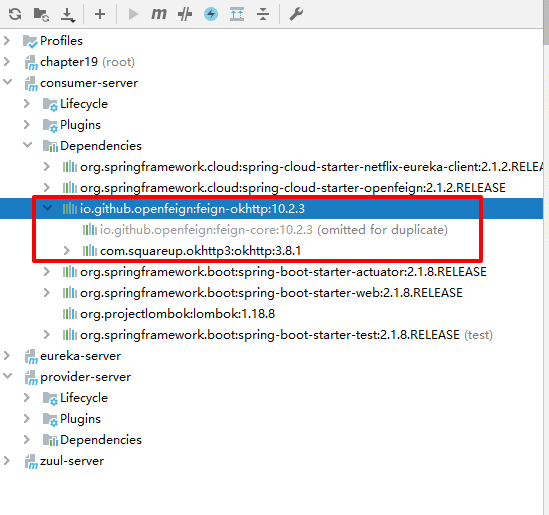

> Springboot: 2.1.6.RELEASE
> SpringCloud: Greenwich.SR1
> 如无特殊说明，本系列教程全采用以上版本


# 1. 什么是 okhttp ？

okhttp 是由 square 公司开源的一个 http 客户端。在 Java 平台上，Java 标准库提供了 HttpURLConnection 类来支持 HTTP 通讯。不过 HttpURLConnection 本身的 API 不够友好，所提供的功能也有限。大部分 Java 程序都选择使用 Apache 的开源项目 HttpClient 作为 HTTP 客户端。Apache HttpClient 库的功能强大，使用率也很高。

# 2. 为什么要使用 okhttp ？

okhttp 的设计初衷就是简单和高效，这也是我们选择它的重要原因之一。它的优势如下：

- 支持 HTTP/2 协议。

- 允许连接到同一个主机地址的所有请求，提高请求效率。

- 共享Socket，减少对服务器的请求次数。

- 通过连接池，减少了请求延迟。

- 缓存响应数据来减少重复的网络请求。

- 减少了对数据流量的消耗。

- 自动处理GZip压缩。

# 3. 实战目标

- Feign 中使用 okhttp 替代 httpclient

- Zuul 中使用 okhttp 替代 httpclient

# 4. 在 Feign 中使用 okhttp

首先介绍一下工程结构，本演示工程包含 provider-server、consumer-server、eureka-server 和 zuul-server 。

## 4.1 consumer-server 依赖 pom.xml 如下

```
<dependencies>
    <dependency>
        <groupId>org.springframework.cloud</groupId>
        <artifactId>spring-cloud-starter-netflix-eureka-client</artifactId>
    </dependency>
    <dependency>
        <groupId>org.springframework.cloud</groupId>
        <artifactId>spring-cloud-starter-openfeign</artifactId>
    </dependency>
    <dependency>
        <groupId>io.github.openfeign</groupId>
        <artifactId>feign-okhttp</artifactId>
    </dependency>
</dependencies>
```

- feign-okhttp 这里无需指定版本，目前引入的 feign-okhttp 版本为 10.2.3 ，而 okhttp 的版本为 3.8.1 ,如图：



## 4.2 配置文件 application.yml

```
feign:
  httpclient:
    enabled: false
  okhttp:
    enabled: true
```

- 在配置文件中需关闭 feign 对 httpclient 的使用并开启 okhttp 。

## 4.3 配置类 OkHttpConfig.java

```
@Configuration
@ConditionalOnClass(Feign.class)
@AutoConfigureBefore(FeignAutoConfiguration.class)
public class OkHttpConfig {
    @Bean
    public OkHttpClient okHttpClient(){
        return new OkHttpClient.Builder()
                .connectTimeout(30, TimeUnit.SECONDS)
                .readTimeout(30, TimeUnit.SECONDS)
                .writeTimeout(30, TimeUnit.SECONDS)
                .retryOnConnectionFailure(true)
                .connectionPool(new ConnectionPool(10 , 5L, TimeUnit.MINUTES))
                .addInterceptor(new OkHttpLogInterceptor())
                .build();
    }
}
```

- 在配置类中将 OkHttpClient 注入 Spring 的容器中，这里我们指定了连接池的大小，最大保持连接数为 10 ，并且在 5 分钟不活动之后被清除。

- 笔者这里配置了一个 okhttp 的日志拦截器。

## 4.4 日志拦截器 OkHttpLogInterceptor.java

```
@Slf4j
public class OkHttpLogInterceptor implements Interceptor {
    @Override
    public Response intercept(Chain chain) throws IOException {
        log.info("OkHttpUrl : " + chain.request().url());
        return chain.proceed(chain.request());
    }
}
```

- 这里实现的接口是 okhttp3.Interceptor ，并不是 Spring Boot 中的 Interceptor。

- 笔者这里仅简单打印了 okhttp 请求的路径，如果有业务校验权限等需求可以放在拦截器中实现。

# 5. 在 Zuul 中使用 okhttp

## 5.1 pom.xml 加入 okhttp 依赖

```
<dependency>
    <groupId>io.github.openfeign</groupId>
    <artifactId>feign-okhttp</artifactId>
</dependency>
```

## 5.2 配置文件开启 okhttp

```
ribbon:
  http:
    client:
      enabled: false
  okhttp:
    enabled: true
```

- 因为 Zuul 的负载均衡实现是通过 Ribbon 实现的，所以 Http 客户端的配置自然也是对 Ribbon 组件的配置。

# 6. 测试

我们修改 idea 启动配置，分别在 8000 和 8001 端口启动 provider-server ，并且顺次启动其余工程，打开浏览器访问链接：[http://localhost:8080/consumer/hello](http://localhost:8080/consumer/hello) ，多次刷新，可以看到 Hello Spring Cloud! Port : 8000 和 Hello Spring Cloud! Port : 8001 交替书出现，可以证明负载均衡已经成功，可以查看 consumer-server 的日志，如下：

```
2019-09-23 23:15:27.097  INFO 10536 --- [nio-9000-exec-5] c.s.c.intercepter.OkHttpLogInterceptor   : OkHttpUrl : 
2019-09-23 23:15:27.593  INFO 10536 --- [nio-9000-exec-6] c.s.c.intercepter.OkHttpLogInterceptor   : OkHttpUrl : 
2019-09-23 23:15:27.942  INFO 10536 --- [nio-9000-exec-7] c.s.c.intercepter.OkHttpLogInterceptor   : OkHttpUrl : 
2019-09-23 23:15:28.251  INFO 10536 --- [nio-9000-exec-9] c.s.c.intercepter.OkHttpLogInterceptor   : OkHttpUrl : 
2019-09-23 23:15:47.877  INFO 10536 --- [nio-9000-exec-8] c.s.c.intercepter.OkHttpLogInterceptor   : OkHttpUrl : 
```

可以看到我们刚才自定义的日志正常打印，证明现在访问确实是通过 okhttp 来进行访问的。