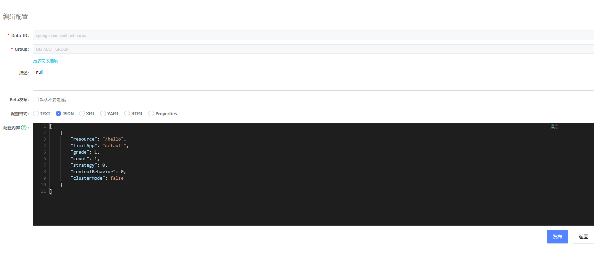
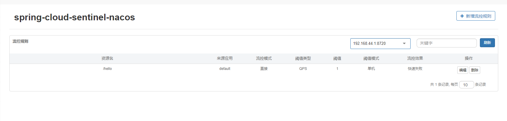

前面几篇文章较为详细的介绍了Sentinel的使用姿势，还没看过的小伙伴可以访问以下链接查看：

- 《Spring Cloud Alibaba | Sentinel：分布式系统的流量防卫兵基础实战》

- 《Spring Cloud Alibaba | Sentinel：分布式系统的流量防卫兵进阶实战》

但是依然无法满足我们日常的生产需要，其中，非常重要的一点就是限流规则的配置是存在当前应用的内存中的，每次我们重启应用以后，我们在Sentinel控制台中配置的规则就丢失了，下面，我们就介绍一下Sentinel规则持久化的方式。

Sentinel为我们提供了两种方式对规则进行修改：

- 通过 API 直接修改 (loadRules)

- 通过 DataSource 适配不同数据源修改

loadRules() 方法只接受内存态的规则对象，但更多时候规则存储在文件、数据库或者配置中心当中。DataSource 接口给我们提供了对接任意配置源的能力。相比直接通过 API 修改规则，实现 DataSource 接口是更加可靠的做法。

DataSource 扩展常见的实现方式有:

- 拉模式：客户端主动向某个规则管理中心定期轮询拉取规则，这个规则中心可以是 RDBMS、文件，甚至是 VCS 等。这样做的方式是简单，缺点是无法及时获取变更；

- 推模式：规则中心统一推送，客户端通过注册监听器的方式时刻监听变化，比如使用 Nacos、Zookeeper 等配置中心。这种方式有更好的实时性和一致性保证。

Sentinel 目前支持以下数据源扩展：

- Pull-based: 文件、Consul (since 1.7.0)

- Push-based: ZooKeeper, Redis, Nacos, Apollo

这里，我们重点介绍一下Sentinel基于Nacos实现动态规则。

# 1. Sentinel基于Nacos动态规则实战

## 1.1 创建子工程sentinel_nacos

工程依赖pom.xml如下：

```
<dependency>
    <groupId>org.springframework.boot</groupId>
    <artifactId>spring-boot-starter-web</artifactId>
</dependency>
<dependency>
    <groupId>com.alibaba.csp</groupId>
    <artifactId>sentinel-datasource-nacos</artifactId>
</dependency>
```

## 1.2 配置文件application.yml如下

```
server:
  port: 10000
spring:
  application:
    name: spring-cloud-sentinel-nacos
  cloud:
    nacos:
      discovery:
        server-addr: 192.168.44.129:8848
    sentinel:
      transport:
        dashboard: localhost:8080
        port: 8720
      datasource:
        ds:
          nacos:
            server-addr: 192.168.44.129:8848
            dataId: spring-cloud-sentinel-nacos
            groupId: DEFAULT_GROUP
            rule-type: flow
            namespace: 8282c713-da90-486a-8438-2a5a212ef44f
```

- spring.cloud.sentinel.transport.dashboard：Sentinel控制台的访问地址。

- spring.cloud.sentinel.datasource.ds.nacos.server-addr：nacos的访问地址。

- spring.cloud.sentinel.datasource.ds.nacos.dataId：nacos中存储规则的groupId。

- spring.cloud.sentinel.datasource.ds.nacos.groupId：nacos中存储规则的dataId。

- spring.cloud.sentinel.datasource.ds.nacos.rule-type：用来定义存储的规则类型,不可为空。

- spring.cloud.sentinel.datasource.ds.nacos.namespace：nacos中存储规则的namespace。

由于版本迭代关系，本示例中的配置信息不一定适用于所有版本，可以通过分析DataSourcePropertiesConfiguration、NacosDataSourceProperties和AbstractDataSourceProperties这三个配置来得出具体配置内容，会更为准确。

例如，本示例中的配置来源于NacosDataSourceProperties和AbstractDataSourceProperties。

NacosDataSourceProperties源码如下：

```
public class NacosDataSourceProperties extends AbstractDataSourceProperties {
    private String serverAddr;
    @NotEmpty
    private String groupId = "DEFAULT_GROUP";
    @NotEmpty
    private String dataId;
    private String endpoint;
    private String namespace;
    private String accessKey;
    private String secretKey;
    // 代码省略...
}
```

AbstractDataSourceProperties源码如下：

```
public class AbstractDataSourceProperties {
    @NotEmpty
    private String dataType = "json";
    @NotNull
    private RuleType ruleType;
    private String converterClass;
    @JsonIgnore
    private final String factoryBeanName;
    @JsonIgnore
    private Environment env;
}
```

笔者这里仅配置一个不可为空并且没有默认值的ruleType，有关ruleType的取值可以查看com.alibaba.cloud.sentinel.datasource.RuleType，这是一个枚举类型。

## 1.3 创建一个接口测试类HelloController.java如下

```
@RestController
public class HelloController {
    @GetMapping("/hello")
    public String hello(HttpServletRequest request) {
        return "Hello, port is: " + request.getLocalPort();
    }
}
```

## 1.4 配置Nacos配置中心

配置内容如图：



注意其中配置的Data ID和Group要和程序中配置的保持一致。格式选择JSON，填入的内容如下：

```
[
    {
        "resource": "/hello",
        "limitApp": "default",
        "grade": 1,
        "count": 1,
        "strategy": 0,
        "controlBehavior": 0,
        "clusterMode": false
    }
]
```

可以看到上面配置规则是一个数组类型，数组中的每个对象是针对每一个保护资源的配置对象，每个对象中的属性解释如下：

- resource：资源名，即限流规则的作用对象。

- limitApp：流控针对的调用来源，若为 default 则不区分调用来源。

- grade：限流阈值类型，QPS 或线程数模式，0代表根据并发数量来限流，1代表根据QPS来进行流量控制。

- count：限流阈值

- strategy：判断的根据是资源自身，还是根据其它关联资源 (refResource)，还是根据链路入口

- controlBehavior：流控效果（直接拒绝 / 排队等待 / 慢启动模式）

- clusterMode：是否为集群模式

## 1.5 测试

正常启动子工程，打开浏览器访问几次[http://localhost:10000/hello](http://localhost:10000/hello) ，速度快一些可以发现已经限流了，限流后页面显示如下：

```
Blocked by Sentinel (flow limiting)
```

正面限流配置成功，这时我们打开Sentinel控制台，看一下流量规则限制，已经有一条数据了，是我们在Nacos中配置的数据，如图：



注意：

在Sentinel动态规则整合了Nacos以后，对于修改接口流量控制就有两个地方了，一个是Sentinel的控制台，还有一个是Nacos的控制台。

但是要谨记，在当前版本中，在Sentinel控制台中修改了规则，将不会同步至Nacos的配置中心，而在Nacos中修改了配置规则，则会通过在客户端的Listener来是同步Sentinel控制台。所以，在整合了Nacos做动态规则存储后需要注意两点：

- Sentinel控制台中修改规则：仅存在于服务的内存中，不会修改Nacos中的配置值，重启后恢复原来的值。

- Nacos控制台中修改规则：服务的内存中规则会更新，Nacos中持久化规则也会更新，重启后依然保持。

建议各位堵住最好在Nacos控制台做规则的修改操作，尽量避免直接在Sentinel控制台中直接做规则修改。