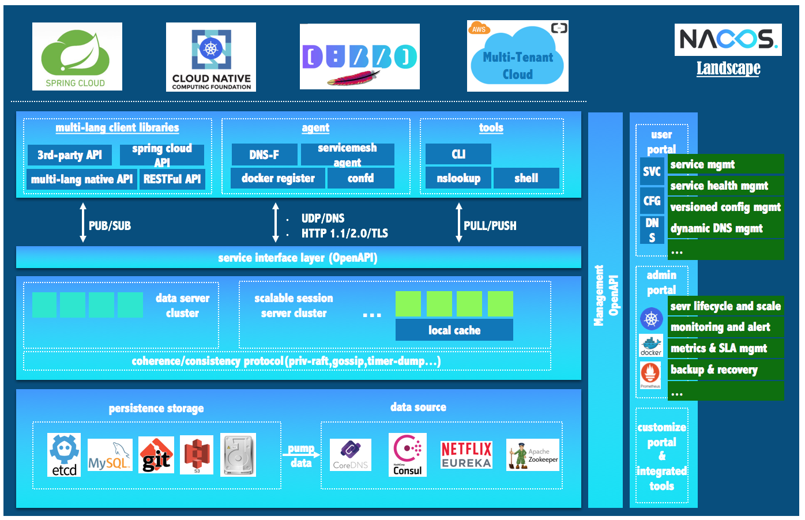
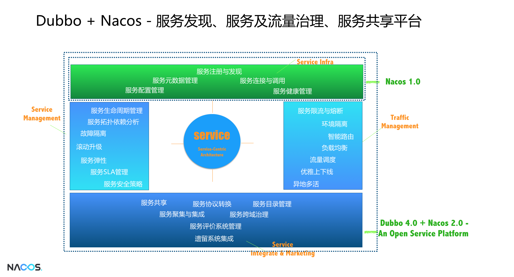
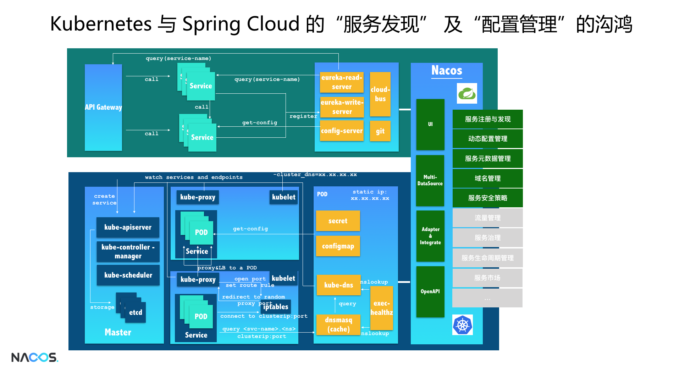
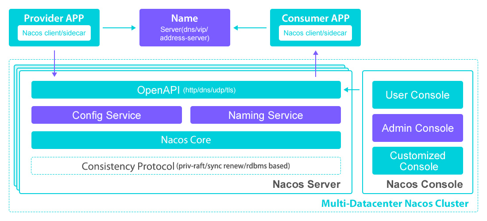
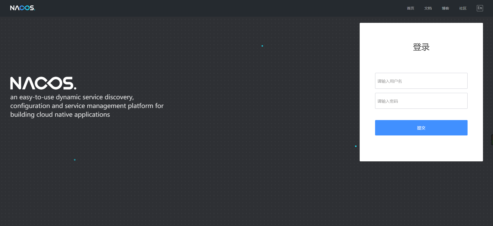
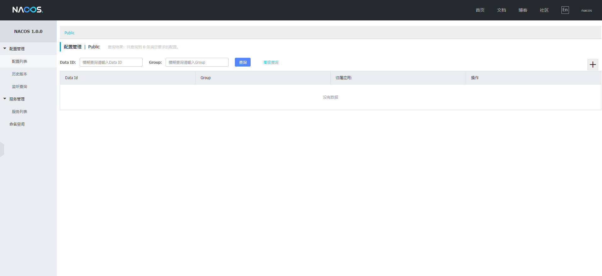

# 1. 什么是Nacos？

Nacos 是阿里巴巴推出来的一个新开源项目，这是一个更易于构建云原生应用的动态服务发现、配置管理和服务管理平台。

Nacos 如果要和SpringCloud的一个组件最对比的话，毋庸置疑，作用一定是和注册中心Eureka是一样的，但是我这里为什么称Nacos为服务中心，因为Nacos更偏向于服务，Nacos除了和Eureka一样有服务的注册和发现意外，同时还拥有了配置管理，服务上下线等功能的配置。

Nacos 致力于发现、配置和管理微服务。Nacos 提供了一组简单易用的特性集，帮助您快速实现动态服务发现、服务配置、服务元数据及流量管理。

Nacos 更敏捷和容易地构建、交付和管理微服务平台。 Nacos 是构建以“服务”为中心的现代应用架构 (例如微服务范式、云原生范式) 的服务基础设施。

Nacos全景图：



目前Nacos的最新稳定版本为V1.1.0，开源团队对Nacos的规划如下：

## 1.1 Nacos 1.0

主要目标有两个：

1. 构建简单易用的，服务相关的工具集，包括服务发现、配置管理、服务元数据存储、推送、一致性及元数据管理等；

1. 与包括Spring Cloud、Kubernetes、Dubbo等开源生态做无缝的融合与支持，同时给这些生态带来很多面向生产时需要的优秀特性。

## 1.2 Nacos 2.0

主要关注在统一服务管理、服务共享及服务治理体系的开放的服务平台的建设上，主要包括两个方面:

- Dubbo 4.0 + Nacos 2.0 开放的服务平台



- Kubernetes + Spring Cloud 统一服务管理



# 2. Nacos 架构及概念



## 2.1 服务 (Service)

服务是指一个或一组软件功能（例如特定信息的检索或一组操作的执行），其目的是不同的客户端可以为不同的目的重用（例如通过跨进程的网络调用）。Nacos 支持主流的服务生态，如 Kubernetes Service、gRPC|Dubbo RPC Service 或者 Spring Cloud RESTful Service.

## 2.2 服务注册中心 (Service Registry)

服务注册中心，它是服务，其实例及元数据的数据库。服务实例在启动时注册到服务注册表，并在关闭时注销。服务和路由器的客户端查询服务注册表以查找服务的可用实例。服务注册中心可能会调用服务实例的健康检查 API 来验证它是否能够处理请求。

## 2.3 服务元数据 (Service Metadata)

服务元数据是指包括服务端点(endpoints)、服务标签、服务版本号、服务实例权重、路由规则、安全策略等描述服务的数据

## 2.4 服务提供方 (Service Provider)

是指提供可复用和可调用服务的应用方

## 2.5 服务消费方 (Service Consumer)

是指会发起对某个服务调用的应用方

## 2.6 配置 (Configuration)

在系统开发过程中通常会将一些需要变更的参数、变量等从代码中分离出来独立管理，以独立的配置文件的形式存在。目的是让静态的系统工件或者交付物（如 WAR，JAR 包等）更好地和实际的物理运行环境进行适配。配置管理一般包含在系统部署的过程中，由系统管理员或者运维人员完成这个步骤。配置变更是调整系统运行时的行为的有效手段之一。

## 2.7 配置管理 (Configuration Management)

在数据中心中，系统中所有配置的编辑、存储、分发、变更管理、历史版本管理、变更审计等所有与配置相关的活动统称为配置管理。

## 2.8 名字服务 (Naming Service)

提供分布式系统中所有对象(Object)、实体(Entity)的“名字”到关联的元数据之间的映射管理服务，例如 ServiceName -> Endpoints Info, Distributed Lock Name -> Lock Owner/Status Info, DNS Domain Name -> IP List, 服务发现和 DNS 就是名字服务的2大场景。

## 2.9 配置服务 (Configuration Service)

在服务或者应用运行过程中，提供动态配置或者元数据以及配置管理的服务提供者。

# 3. Nacos简单搭建

上面介绍了这么多，这里我们来聊一下如何搭建Nacos服务。

## 3.1 环境准备

Nacos 依赖 Java 环境来运行。如果您是从代码开始构建并运行Nacos，还需要为此配置 Maven环境，请确保是在以下版本环境中安装使用:

1. 64 bit OS，支持 Linux/Unix/Mac/Windows，推荐选用 Linux/Unix/Mac。

1. 64 bit JDK 1.8+。

1. Maven 3.2.x+。

## 3.2 下载源码或者安装包

可以通过源码和发行包两种方式来获取 Nacos。

### 3.2.1 从 Github 上下载源码方式

```
git clone 
cd nacos/
mvn -Prelease-nacos clean install -U  
ls -al distribution/target/
// change the $version to your actual path
cd distribution/target/nacos-server-$version/nacos/bin
```

### 3.2.2 下载编译后压缩包方式

可以从 最新稳定版本 下载 nacos-server-$version.zip 包。

## 3.3 启动服务器

### 3.3.1 Linux/Unix/Mac

启动命令(standalone代表着单机模式运行，非集群模式):

```
sh startup.sh -m standalone
```

### 3.3.2 Windows

启动命令：

```
cmd startup.cmd
```

或者双击startup.cmd运行文件。

## 3.4 测试服务器

服务启动后，访问地址：[http://ip:port/nacos](http://ip:port/nacos)



使用nacos/nacos登录



Nacos单机版服务就启动成功了。

## 3.5 关闭服务器

### 3.5.1 Linux/Unix/Mac

```
sh shutdown.sh
```

### 3.5.2 Windows

```
cmd shutdown.cmd
```

或者双击shutdown.cmd运行文件。