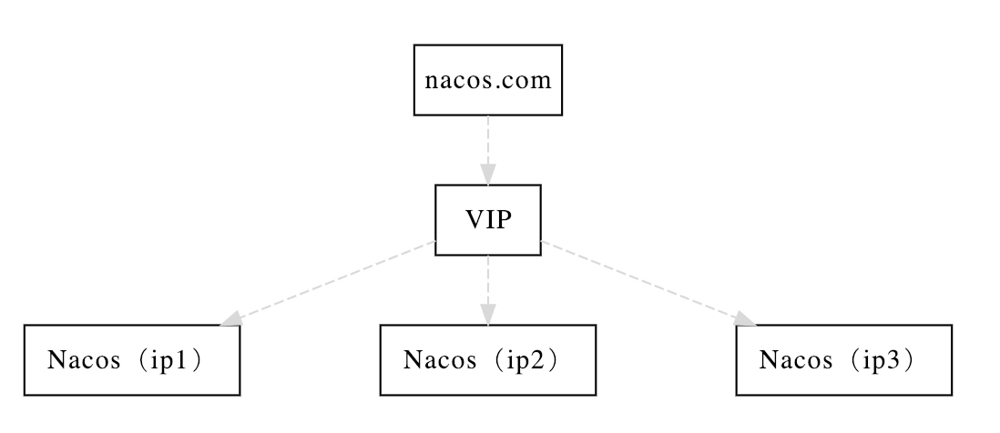

# 1. Nacos支持三种部署模式

- 单机模式 – 用于测试和单机试用。

- 集群模式 – 用于生产环境，确保高可用。

- 多集群模式 – 用于多数据中心场景。

以上是官方提供的三种部署方式：单机模式对于企业来讲，仅可用于测试环境或者开发环境，不可用于生产环境；对于中小型企业来讲，生产环境选择集群模式已经足够，无需选择多集群模式，除非是做机房灾备，可以在两个机房部署两个集群。

单机模式的部署方式在前面的文章中已经介绍过，在0.7版本之前，在单机模式时nacos使用嵌入式数据库实现数据的存储，不方便观察数据存储的基本情况。0.7版本增加了支持mysql数据源能力，具体的操作步骤：

- 准备一台Mysql数据库，版本要求：5.6.5+

- 初始化mysql数据库，数据库初始化文件：nacos-mysql.sql，或者如下：

```
/******************************************/
/*   数据库全名 = nacos_config   */
/*   表名称 = config_info   */
/******************************************/
CREATE TABLE `config_info` (
  `id` bigint(20) NOT NULL AUTO_INCREMENT COMMENT 'id',
  `data_id` varchar(255) NOT NULL COMMENT 'data_id',
  `group_id` varchar(255) DEFAULT NULL,
  `content` longtext NOT NULL COMMENT 'content',
  `md5` varchar(32) DEFAULT NULL COMMENT 'md5',
  `gmt_create` datetime NOT NULL DEFAULT '2010-05-05 00:00:00' COMMENT '创建时间',
  `gmt_modified` datetime NOT NULL DEFAULT '2010-05-05 00:00:00' COMMENT '修改时间',
  `src_user` text COMMENT 'source user',
  `src_ip` varchar(20) DEFAULT NULL COMMENT 'source ip',
  `app_name` varchar(128) DEFAULT NULL,
  `tenant_id` varchar(128) DEFAULT '' COMMENT '租户字段',
  `c_desc` varchar(256) DEFAULT NULL,
  `c_use` varchar(64) DEFAULT NULL,
  `effect` varchar(64) DEFAULT NULL,
  `type` varchar(64) DEFAULT NULL,
  `c_schema` text,
  PRIMARY KEY (`id`),
  UNIQUE KEY `uk_configinfo_datagrouptenant` (`data_id`,`group_id`,`tenant_id`)
) ENGINE=InnoDB DEFAULT CHARSET=utf8 COLLATE=utf8_bin COMMENT='config_info';
/******************************************/
/*   数据库全名 = nacos_config   */
/*   表名称 = config_info_aggr   */
/******************************************/
CREATE TABLE `config_info_aggr` (
  `id` bigint(20) NOT NULL AUTO_INCREMENT COMMENT 'id',
  `data_id` varchar(255) NOT NULL COMMENT 'data_id',
  `group_id` varchar(255) NOT NULL COMMENT 'group_id',
  `datum_id` varchar(255) NOT NULL COMMENT 'datum_id',
  `content` longtext NOT NULL COMMENT '内容',
  `gmt_modified` datetime NOT NULL COMMENT '修改时间',
  `app_name` varchar(128) DEFAULT NULL,
  `tenant_id` varchar(128) DEFAULT '' COMMENT '租户字段',
  PRIMARY KEY (`id`),
  UNIQUE KEY `uk_configinfoaggr_datagrouptenantdatum` (`data_id`,`group_id`,`tenant_id`,`datum_id`)
) ENGINE=InnoDB DEFAULT CHARSET=utf8 COLLATE=utf8_bin COMMENT='增加租户字段';
/******************************************/
/*   数据库全名 = nacos_config   */
/*   表名称 = config_info_beta   */
/******************************************/
CREATE TABLE `config_info_beta` (
  `id` bigint(20) NOT NULL AUTO_INCREMENT COMMENT 'id',
  `data_id` varchar(255) NOT NULL COMMENT 'data_id',
  `group_id` varchar(128) NOT NULL COMMENT 'group_id',
  `app_name` varchar(128) DEFAULT NULL COMMENT 'app_name',
  `content` longtext NOT NULL COMMENT 'content',
  `beta_ips` varchar(1024) DEFAULT NULL COMMENT 'betaIps',
  `md5` varchar(32) DEFAULT NULL COMMENT 'md5',
  `gmt_create` datetime NOT NULL DEFAULT '2010-05-05 00:00:00' COMMENT '创建时间',
  `gmt_modified` datetime NOT NULL DEFAULT '2010-05-05 00:00:00' COMMENT '修改时间',
  `src_user` text COMMENT 'source user',
  `src_ip` varchar(20) DEFAULT NULL COMMENT 'source ip',
  `tenant_id` varchar(128) DEFAULT '' COMMENT '租户字段',
  PRIMARY KEY (`id`),
  UNIQUE KEY `uk_configinfobeta_datagrouptenant` (`data_id`,`group_id`,`tenant_id`)
) ENGINE=InnoDB DEFAULT CHARSET=utf8 COLLATE=utf8_bin COMMENT='config_info_beta';
/******************************************/
/*   数据库全名 = nacos_config   */
/*   表名称 = config_info_tag   */
/******************************************/
CREATE TABLE `config_info_tag` (
  `id` bigint(20) NOT NULL AUTO_INCREMENT COMMENT 'id',
  `data_id` varchar(255) NOT NULL COMMENT 'data_id',
  `group_id` varchar(128) NOT NULL COMMENT 'group_id',
  `tenant_id` varchar(128) DEFAULT '' COMMENT 'tenant_id',
  `tag_id` varchar(128) NOT NULL COMMENT 'tag_id',
  `app_name` varchar(128) DEFAULT NULL COMMENT 'app_name',
  `content` longtext NOT NULL COMMENT 'content',
  `md5` varchar(32) DEFAULT NULL COMMENT 'md5',
  `gmt_create` datetime NOT NULL DEFAULT '2010-05-05 00:00:00' COMMENT '创建时间',
  `gmt_modified` datetime NOT NULL DEFAULT '2010-05-05 00:00:00' COMMENT '修改时间',
  `src_user` text COMMENT 'source user',
  `src_ip` varchar(20) DEFAULT NULL COMMENT 'source ip',
  PRIMARY KEY (`id`),
  UNIQUE KEY `uk_configinfotag_datagrouptenanttag` (`data_id`,`group_id`,`tenant_id`,`tag_id`)
) ENGINE=InnoDB DEFAULT CHARSET=utf8 COLLATE=utf8_bin COMMENT='config_info_tag';
/******************************************/
/*   数据库全名 = nacos_config   */
/*   表名称 = config_tags_relation   */
/******************************************/
CREATE TABLE `config_tags_relation` (
  `id` bigint(20) NOT NULL COMMENT 'id',
  `tag_name` varchar(128) NOT NULL COMMENT 'tag_name',
  `tag_type` varchar(64) DEFAULT NULL COMMENT 'tag_type',
  `data_id` varchar(255) NOT NULL COMMENT 'data_id',
  `group_id` varchar(128) NOT NULL COMMENT 'group_id',
  `tenant_id` varchar(128) DEFAULT '' COMMENT 'tenant_id',
  `nid` bigint(20) NOT NULL AUTO_INCREMENT,
  PRIMARY KEY (`nid`),
  UNIQUE KEY `uk_configtagrelation_configidtag` (`id`,`tag_name`,`tag_type`),
  KEY `idx_tenant_id` (`tenant_id`)
) ENGINE=InnoDB DEFAULT CHARSET=utf8 COLLATE=utf8_bin COMMENT='config_tag_relation';
/******************************************/
/*   数据库全名 = nacos_config   */
/*   表名称 = group_capacity   */
/******************************************/
CREATE TABLE `group_capacity` (
  `id` bigint(20) unsigned NOT NULL AUTO_INCREMENT COMMENT '主键ID',
  `group_id` varchar(128) NOT NULL DEFAULT '' COMMENT 'Group ID，空字符表示整个集群',
  `quota` int(10) unsigned NOT NULL DEFAULT '0' COMMENT '配额，0表示使用默认值',
  `usage` int(10) unsigned NOT NULL DEFAULT '0' COMMENT '使用量',
  `max_size` int(10) unsigned NOT NULL DEFAULT '0' COMMENT '单个配置大小上限，单位为字节，0表示使用默认值',
  `max_aggr_count` int(10) unsigned NOT NULL DEFAULT '0' COMMENT '聚合子配置最大个数，，0表示使用默认值',
  `max_aggr_size` int(10) unsigned NOT NULL DEFAULT '0' COMMENT '单个聚合数据的子配置大小上限，单位为字节，0表示使用默认值',
  `max_history_count` int(10) unsigned NOT NULL DEFAULT '0' COMMENT '最大变更历史数量',
  `gmt_create` datetime NOT NULL DEFAULT '2010-05-05 00:00:00' COMMENT '创建时间',
  `gmt_modified` datetime NOT NULL DEFAULT '2010-05-05 00:00:00' COMMENT '修改时间',
  PRIMARY KEY (`id`),
  UNIQUE KEY `uk_group_id` (`group_id`)
) ENGINE=InnoDB DEFAULT CHARSET=utf8 COLLATE=utf8_bin COMMENT='集群、各Group容量信息表';
/******************************************/
/*   数据库全名 = nacos_config   */
/*   表名称 = his_config_info   */
/******************************************/
CREATE TABLE `his_config_info` (
  `id` bigint(64) unsigned NOT NULL,
  `nid` bigint(20) unsigned NOT NULL AUTO_INCREMENT,
  `data_id` varchar(255) NOT NULL,
  `group_id` varchar(128) NOT NULL,
  `app_name` varchar(128) DEFAULT NULL COMMENT 'app_name',
  `content` longtext NOT NULL,
  `md5` varchar(32) DEFAULT NULL,
  `gmt_create` datetime NOT NULL DEFAULT '2010-05-05 00:00:00',
  `gmt_modified` datetime NOT NULL DEFAULT '2010-05-05 00:00:00',
  `src_user` text,
  `src_ip` varchar(20) DEFAULT NULL,
  `op_type` char(10) DEFAULT NULL,
  `tenant_id` varchar(128) DEFAULT '' COMMENT '租户字段',
  PRIMARY KEY (`nid`),
  KEY `idx_gmt_create` (`gmt_create`),
  KEY `idx_gmt_modified` (`gmt_modified`),
  KEY `idx_did` (`data_id`)
) ENGINE=InnoDB DEFAULT CHARSET=utf8 COLLATE=utf8_bin COMMENT='多租户改造';
/******************************************/
/*   数据库全名 = nacos_config   */
/*   表名称 = tenant_capacity   */
/******************************************/
CREATE TABLE `tenant_capacity` (
  `id` bigint(20) unsigned NOT NULL AUTO_INCREMENT COMMENT '主键ID',
  `tenant_id` varchar(128) NOT NULL DEFAULT '' COMMENT 'Tenant ID',
  `quota` int(10) unsigned NOT NULL DEFAULT '0' COMMENT '配额，0表示使用默认值',
  `usage` int(10) unsigned NOT NULL DEFAULT '0' COMMENT '使用量',
  `max_size` int(10) unsigned NOT NULL DEFAULT '0' COMMENT '单个配置大小上限，单位为字节，0表示使用默认值',
  `max_aggr_count` int(10) unsigned NOT NULL DEFAULT '0' COMMENT '聚合子配置最大个数',
  `max_aggr_size` int(10) unsigned NOT NULL DEFAULT '0' COMMENT '单个聚合数据的子配置大小上限，单位为字节，0表示使用默认值',
  `max_history_count` int(10) unsigned NOT NULL DEFAULT '0' COMMENT '最大变更历史数量',
  `gmt_create` datetime NOT NULL DEFAULT '2010-05-05 00:00:00' COMMENT '创建时间',
  `gmt_modified` datetime NOT NULL DEFAULT '2010-05-05 00:00:00' COMMENT '修改时间',
  PRIMARY KEY (`id`),
  UNIQUE KEY `uk_tenant_id` (`tenant_id`)
) ENGINE=InnoDB DEFAULT CHARSET=utf8 COLLATE=utf8_bin COMMENT='租户容量信息表';
CREATE TABLE `tenant_info` (
  `id` bigint(20) NOT NULL AUTO_INCREMENT COMMENT 'id',
  `kp` varchar(128) NOT NULL COMMENT 'kp',
  `tenant_id` varchar(128) default '' COMMENT 'tenant_id',
  `tenant_name` varchar(128) default '' COMMENT 'tenant_name',
  `tenant_desc` varchar(256) DEFAULT NULL COMMENT 'tenant_desc',
  `create_source` varchar(32) DEFAULT NULL COMMENT 'create_source',
  `gmt_create` bigint(20) NOT NULL COMMENT '创建时间',
  `gmt_modified` bigint(20) NOT NULL COMMENT '修改时间',
  PRIMARY KEY (`id`),
  UNIQUE KEY `uk_tenant_info_kptenantid` (`kp`,`tenant_id`),
  KEY `idx_tenant_id` (`tenant_id`)
) ENGINE=InnoDB DEFAULT CHARSET=utf8 COLLATE=utf8_bin COMMENT='tenant_info';
CREATE TABLE users (
    username varchar(50) NOT NULL PRIMARY KEY,
    password varchar(500) NOT NULL,
    enabled boolean NOT NULL
);
CREATE TABLE roles (
    username varchar(50) NOT NULL,
    role varchar(50) NOT NULL
);
INSERT INTO users (username, password, enabled) VALUES ('nacos', '$2a$10$EuWPZHzz32dJN7jexM34MOeYirDdFAZm2kuWj7VEOJhhZkDrxfvUu', TRUE);
INSERT INTO roles (username, role) VALUES ('nacos', 'ROLE_ADMIN');
```

- 修改conf/application.properties文件，增加支持mysql数据源配置（目前只支持mysql），添加mysql数据源的url、用户名和密码。

```
spring.datasource.platform=mysql
db.num=1
db.url.0=jdbc:mysql://127.0.0.1:3306/nacos?characterEncoding=utf8&connectTimeout=1000&socketTimeout=3000&autoReconnect=true
db.user=root
db.password=password
```

# 2. 集群模式下部署Nacos

## 2.1 架构图



## 2.2 下载源码或者安装包

从 Github 上下载源码方式

```
unzip nacos-source.zip
cd nacos/
mvn -Prelease-nacos clean install -U  
cd nacos/distribution/target/nacos-server-0.8.0/nacos/bin
```

下载编译后压缩包方式:

zip包：[https://github.com/alibaba/nacos/releases/download/1.1.0/nacos-server-1.1.0.ziptar.gz](https://github.com/alibaba/nacos/releases/download/1.1.0/nacos-server-1.1.0.ziptar.gz)包：[https://github.com/alibaba/nacos/releases/download/1.1.0/nacos-server-1.1.0.tar.gz](https://github.com/alibaba/nacos/releases/download/1.1.0/nacos-server-1.1.0.tar.gz)

```
 unzip nacos-server-1.1.0.zip 或者 tar -xvf nacos-server-1.1.0.tar.gz
 cd nacos/bin
```

## 2.3 配置集群配置文件

在nacos的解压目录nacos/的conf目录下，有配置文件cluster.conf.example，请将名称修改为:cluster.conf，每行配置成ip:port。（请配置3个或3个以上节点）

```
#it is ip
#example
192.168.0.1
192.168.0.2
192.168.0.3
```

## 2.4 配置 MySQL 数据库

生产使用建议至少主备模式，或者采用高可用数据库。

初始化语句和上面单机版保持一致。

application.properties 配置

```
# spring
server.contextPath=/nacos
server.servlet.contextPath=/nacos
server.port=8848
nacos.cmdb.dumpTaskInterval=3600
nacos.cmdb.eventTaskInterval=10
nacos.cmdb.labelTaskInterval=300
nacos.cmdb.loadDataAtStart=false
# metrics for prometheus
#management.endpoints.web.exposure.include=*
# metrics for elastic search
management.metrics.export.elastic.enabled=false
#management.metrics.export.elastic.host=
# metrics for influx
management.metrics.export.influx.enabled=false
#management.metrics.export.influx.db=springboot
#management.metrics.export.influx.uri=
#management.metrics.export.influx.auto-create-db=true
#management.metrics.export.influx.consistency=one
#management.metrics.export.influx.compressed=true
server.tomcat.accesslog.enabled=true
server.tomcat.accesslog.pattern=%h %l %u %t "%r" %s %b %D %{User-Agent}i
# default current work dir
server.tomcat.basedir=
## spring security config
### turn off security
#spring.security.enabled=false
#management.security=false
#security.basic.enabled=false
#nacos.security.ignore.urls=/**
nacos.security.ignore.urls=/,/**/*.css,/**/*.js,/**/*.html,/**/*.map,/**/*.svg,/**/*.png,/**/*.ico,/console-fe/public/**,/v1/auth/login,/v1/console/health/**,/v1/cs/**,/v1/ns/**,/v1/cmdb/**,/actuator/**,/v1/console/server/**
# nacos.naming.distro.taskDispatchThreadCount=1
# nacos.naming.distro.taskDispatchPeriod=200
# nacos.naming.distro.batchSyncKeyCount=1000
# nacos.naming.distro.initDataRatio=0.9
# nacos.naming.distro.syncRetryDelay=5000
# nacos.naming.data.warmup=true
# nacos.naming.expireInstance=true
spring.datasource.platform=mysql
db.num=1
db.url.0=jdbc:mysql://127.0.0.1:3306/nacos?characterEncoding=utf8&connectTimeout=1000&socketTimeout=3000&autoReconnect=true
db.user=root
db.password=password
```

## 2.5 启动服务

启动命令(在没有参数模式，是集群模式):

```
sh startup.sh
```

# 3. SpringCloud集成

先讲讲看网上的一些做法哈，修改application.yml的配置文件：

```
spring.cloud.nacos.config.server-addr=192.168.0.1:8848,192.168.0.2:8848,192.168.0.3:8848
```

这么写行不行能，我认为是可以的，但是有一点，就是如果Nacos换了ip或者整体要做迁移，那么所有使用这个Nacos的微服务的配置文件中的ip全都要进行更换，还需要重启，这对于整个微服务架构来讲耦合会非常大，违背了服务拆分的原则。

接下来就说我的方案了:

```
spring.cloud.nacos.config.server-addr=
```

这里我们使用域名去反向代理后面的Nacos服务，如果后面Nacos服务出现任何问题，我们只需要修改这个反向代理层即可，经过测试，这里的反向代理可以使用Nginx，包括后面如果需要做扩容或者迁移，都不会影响到目前的服务集群。

多集群模式我们这里不做过多讨论，目前暂无实践经验。