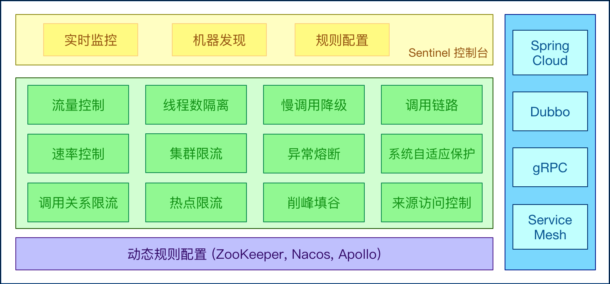
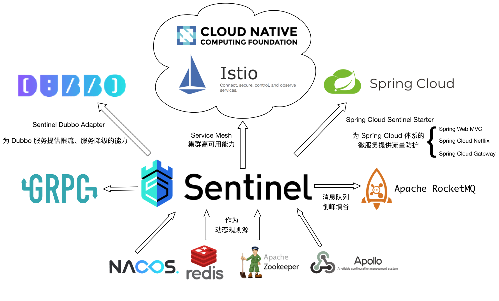

# 1. Sentinel 是什么？

Sentinel 是阿里中间件团队研发的面向分布式服务架构的轻量级高可用流量控制组件，最近正式开源。Sentinel 主要以流量为切入点，从流量控制、熔断降级、系统负载保护等多个维度来帮助用户保护服务的稳定性。讲到这里，可能很多人会有疑问：Sentinel 和之前常用的熔断降级库 Netflix Hystrix 有什么异同呢？如果不清楚什么是Hystrix的，可以看我签名的文章跟我学SpringCloud | 第四篇：熔断器Hystrix。

下面我们通过一张表格来了解一下Sentinel和Hystrix的区别：

|   | Sentinel | Hystrix | 
| -- | -- | -- |
| 隔离策略 | 基于并发数 | 线程池隔离/信号量隔离 | 
| 熔断降级策略 | 基于响应时间或失败比率 | 基于失败比率 | 
| 实时指标实现 | 滑动窗口 | 滑动窗口（基于 RxJava） | 
| 规则配置 | 支持多种数据源 | 支持多种数据源 | 
| 扩展性 | 多个扩展点 | 插件的形式 | 
| 基于注解的支持 | 支持 | 支持 | 
| 调用链路信息 | 支持同步调用 | 不支持 | 
| 限流 | 基于 QPS / 并发数，支持基于调用关系的限流 | 不支持 | 
| 流量整形 | 支持慢启动、匀速器模式 | 不支持 | 
| 系统负载保护 | 支持 | 不支持 | 
| 实时监控 API | 各式各样 | 较为简单 | 
| 控制台 | 开箱即用，可配置规则、查看秒级监控、机器发现等 | 不完善 | 
| 常见框架的适配 | Servlet、Spring Cloud、Dubbo、gRPC 等 | Servlet、Spring Cloud Netflix | 


简单看下来，Sentinel明显比Hystrix功能更为强大。

Sentinel 以流量为切入点，从流量控制、熔断降级、系统负载保护等多个维度保护服务的稳定性，所以被称为分布式系统的流量防卫兵。

# 2. Sentinel 的特征

- 丰富的应用场景： Sentinel 承接了阿里巴巴近 10 年的双十一大促流量的核心场景，例如秒杀（即突发流量控制在系统容量可以承受的范围）、消息削峰填谷、集群流量控制、实时熔断下游不可用应用等。

- 完备的实时监控： Sentinel 同时提供实时的监控功能。您可以在控制台中看到接入应用的单台机器秒级数据，甚至 500 台以下规模的集群的汇总运行情况。

- 广泛的开源生态： Sentinel 提供开箱即用的与其它开源框架/库的整合模块，例如与 Spring Cloud、Dubbo、gRPC 的整合。您只需要引入相应的依赖并进行简单的配置即可快速地接入 Sentinel。

- 完善的 SPI 扩展点： Sentinel 提供简单易用、完善的 SPI 扩展接口。您可以通过实现扩展接口来快速地定制逻辑。例如定制规则管理、适配动态数据源等。



# 3. Sentinel 的开源生态



Sentinel 分为两个部分:

- 核心库（Java 客户端）不依赖任何框架/库，能够运行于所有 Java 运行时环境，同时对 Dubbo / Spring Cloud 等框架也有较好的支持。

- 控制台（Dashboard）基于 Spring Boot 开发，打包后可以直接运行，不需要额外的 Tomcat 等应用容器。

# 4. 简单使用

## 4.1 项目依赖pom.xml

```
<!-- 
<dependency>
    <groupId>com.alibaba.csp</groupId>
    <artifactId>sentinel-core</artifactId>
    <version>1.6.2</version>
</dependency>
```

## 4.2 定义资源

接下来，我们把需要控制流量的代码用 Sentinel API SphU.entry("HelloWorld") 和 entry.exit() 包围起来即可。在下面的例子中，我们将 System.out.println("hello wolrd"); 作为资源，用 API 包围起来。参考代码如下:

```
public static void main(String[] args) {
    initFlowRules();
    while (true) {
        Entry entry = null;
        try {
            entry = SphU.entry("HelloWorld");
            /*业务逻辑 - 开始*/
            System.out.println("hello world");
            /*业务逻辑 - 结束*/
        } catch (BlockException e1) {
            /*流控逻辑处理 - 开始*/
            System.out.println("block!");
            /*流控逻辑处理 - 结束*/
        } finally {
            if (entry != null) {
                entry.exit();
            }
        }
    }
}
```

完成以上两步后，代码端的改造就完成了。

## 4.3 定义规则

接下来，通过规则来指定允许该资源通过的请求次数，例如下面的代码定义了资源 HelloWorld 每秒最多只能通过 20 个请求。

```
private static void initFlowRules(){
    List<FlowRule> rules = new ArrayList<>();
    FlowRule rule = new FlowRule();
    rule.setResource("HelloWorld");
    rule.setGrade(RuleConstant.FLOW_GRADE_QPS);
    // Set limit QPS to 20.
    rule.setCount(20);
    rules.add(rule);
    FlowRuleManager.loadRules(rules);
}
```

完成上面 3 步，Sentinel 就能够正常工作了。

## 4.4 Demo运行

Demo 运行之后，我们可以在日志 ~/logs/csp/${appName}-metrics.log.xxx 里看到下面的输出:

```
|--timestamp-|------date time----|-resource-|p |block|s |e|rt
1563351614000|2019-07-17 16:20:14|HelloWorld|20|560|20|0|2|0
1563351615000|2019-07-17 16:20:15|HelloWorld|20|1441|20|0|0|0
1563351616000|2019-07-17 16:20:16|HelloWorld|20|2724|20|0|0|0
1563351617000|2019-07-17 16:20:17|HelloWorld|20|2348|20|0|0|0
```

其中 p 代表通过的请求, block 代表被阻止的请求, s 代表成功执行完成的请求个数, e 代表用户自定义的异常, rt 代表平均响应时长。

可以看到，这个程序每秒稳定输出 "hello world" 20 次，和规则中预先设定的阈值是一样的。

Sentinel的简单使用就到这里结束了，更多的进阶使用欢迎关注后续的博客，谢谢。