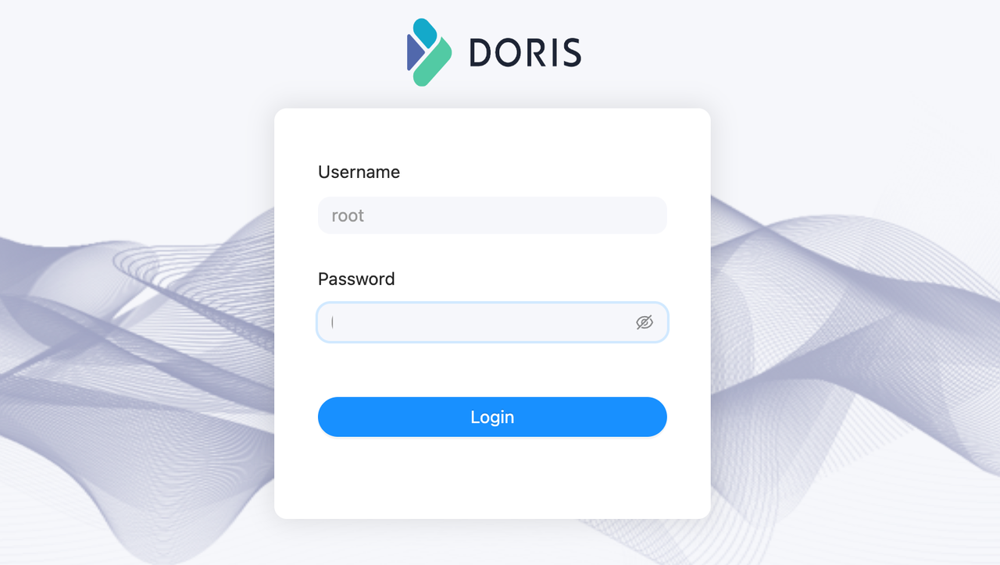
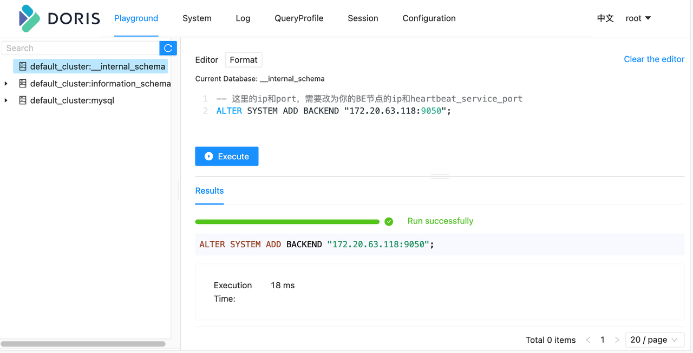

# 1.2.1 手动部署

手动部署 Doris 集群，通常要进行四步规划：

1. 软硬件环境检查：检查用户的硬件资源情况及操作系统兼容性
2. 操作系统检查：检查操作系统参数及配置
3. 集群规划：规划集群的 FE、BE 节点，预估使用资源情况
4. 集群部署：根据部署规划进行集群部署操作
5. 部署验证：登录并验证集群正确性

!!! tip 提示
    如果需要部署存算分离模式，在完成上述 1 2 3 步之后， 参考以下链接继续完成存算分离模式部署
    1. 存算分离部署前准备
    2. 存算分离基础模块部署
    3. 存算分离创建集群

## 1 软硬件环境检查

### 1.1 硬件检查

**CPU**

当安装 Doris 时，建议选择支持 AVX2 指令集的机器，以利用 AVX2 的向量化能力实现查询向量化加速。

运行以下命令，有输出结果，及表示机器支持 AVX2 指令集。

```shell
cat /proc/cpuinfo | grep avx2
```

如果机器不支持 AVX2 指令集，可以使用 no AVX2 的 Doris 安装包进行部署。

**内存**

Doris 没有强制的内存限制。一般在生产环境中，建议内存至少是 CPU 核数的 4 倍（例如，16 核机器至少配置 64G 内存）。在内存是 CPU 核数 8 倍时，会得到更好的性能。

**存储**

Doris 部署时数据可以存放在 SSD 或 HDD 硬盘或者对象存储中。

在以下几种场景中建议使用 SSD 作为数据存储：

* 大规模数据量下的高并发点查场景
* 大规模数据量下的高频数据更新场景

**文件系统**

ext4 和 xfs 文件系统均支持。

**网卡**

Doris 在进行计算过程涉及将数据分片分发到不同的实例上进行并行处理，会导致一定的网络资源开销。为了最大程度优化 Doris 性能并降低网络资源开销，强烈建议在部署时选用万兆网卡（10 Gigabit Ethernet，即 10GbE）或者更快网络。

### 1.2 服务器建议配置

Doris 支持运行和部署在 x86-64 架构的服务器平台或 ARM64 架构的服务器上。

**开发及测试环境**

| 模块 | CPU | 内存 | 磁盘 | 网络 | 实例数量（最低要求） |
| -- | -- | -- | -- | -- | -- |
| Frontend | 8 核 + | 8 GB+ | SSD 或 SATA，10 GB+ | 千兆/万兆网卡 | 1 |
| Backend | 8 核 + | 16 GB+ | SSD 或 SATA，50 GB+ | 千兆/万兆网卡 | 1 |

!!! tip 提示
    说明

    * 在验证测试环境中，可以将 FE 与 BE 部署在同一台服务器上
    * 一台机器上一般只建议部署一个 BE 实例，同时只能部署一个 FE
    * 如果需要 3 副本数据，那么至少需要 3 台机器各部署一个 BE 实例，而不是 1 台机器部署 3 个 BE 实例
    * 多个 FE 所在服务器的时钟必须保持一致，最多允许 5 秒的时钟偏差
    * 测试环境也可以仅使用一个 BE 进行测试。实际生产环境，BE 实例数量直接决定了整体查询延迟。

**生产环境**

| 模块 | CPU | 内存 | 磁盘 | 网络 | 实例数量（最低要求） |
| -- | -- | -- | -- | -- | -- |
| Frontend | 16 核 + | 64 GB+ | SSD 或 RAID 卡，100GB+ | 万兆网卡 | 1 |
| Backend | 16 核 + | 64 GB+ | SSD 或 SATA，100G+ | 万兆网卡 | 3 |

!!! tip 提示
    说明

    * 在生产环境中，如果 FE 与 BE 混布，需要注意资源争用问题，建议元数据存储与数据存储分盘存放
    * BE 节点可以配置多块硬盘存储，在一个 BE 实例上绑定多块 HDD 或 SSD 盘
    * 集群的性能与 BE 节点的资源有关，BE 节点越多，Doris 性能越好。通常情况下在 10 - 100 台机器上可以充分发挥 Doris 的性能

### 1.3 硬盘空间计算

在 Doris 集群中，FE 主要用于元数据存储，包括元数据 edit log 和 image。BE 的磁盘空间主要用于存放数据，需要根据业务需求计算。

| 组件 | 磁盘空间说明 |
| -- | -- |
| FE | 元数据一般在几百 MB 到几 GB，建议不低于 100GB |
| BE | Doris 默认 LZ4 压缩方式进行存储，压缩比在 0.3 - 0.5 左右磁盘空间需要按照总数据量 * 3（3 副本）计算需要预留出 40% 空间用作后台 compaction 以及临时数据的存储 |
| Broker | 如需部署 Broker，通常情况下可以将 Broker 节点与 FE / BE 节点部署在同一台机器上 |

### 1.4 Java 版本

Doris 的所有进程都依赖 Java。

在 2.1（含）版本之前，请使用 Java 8，推荐版本：`openjdk-8u352-b08-linux-x64` 。

从 3.0（含）版本之后，请使用 Java 17，推荐版本：`jdk-17.0.10_linux-x64_bin.tar.gz` 。

## 2 操作系统检查

### 2.1 关闭 swap 分区

在部署 Doris 时，建议关闭 swap 分区。swap 分区是内核发现内存紧张时，会按照自己的策略将部分内存数据移动到配置的 swap 分区，由于内核策略不能充分了解应用的行为，会对数据库性能造成较大影响。所以建议关闭。

通过以下命令可以临时或者永久关闭。

临时关闭，下次机器启动时，swap 还会被打开。

```shell
swapoff -a 
```

永久关闭，使用 Linux root 账户，注释掉 /etc/fstab 中的 swap 分区，然后重启即可彻底关闭 swap 分区。

```shell
# /etc/fstab
# <file system>        <dir>         <type>    <options>             <dump> <pass>
tmpfs                  /tmp          tmpfs     nodev,nosuid          0      0
/dev/sda1              /             ext4      defaults,noatime      0      1
# /dev/sda2              none          swap      defaults              0      0
/dev/sda3              /home         ext4      defaults,noatime      0      2
```

!!! warning 警告
    不建议使用设置 vm.swappiness = 0 的方式，因为这个参数在不同的 Linux 内核版本会有不同的语义，很多情况下不能完全关闭 swap。

### 2.2 检测和关闭系统防火墙

如果发现端口不通，可以试着关闭防火墙，确认是否是本机防火墙造成。如果是防火墙造成，可以根据配置的 Doris 各组件端口打开相应的端口通信。

```shell
sudo systemctl stop firewalld.service
sudo systemctl disable firewalld.service
```

### 2.3 配置 NTP 服务

Doris 的元数据要求时间精度要小于 5000ms，所以所有集群所有机器要进行时钟同步，避免因为时钟问题引发的元数据不一致导致服务出现异常。

通常情况下，可以通过配置 NTP 服务保证各节点时钟同步。

```shell
sudo systemctl start ntpd.service
sudo systemctl enable ntpd.service
```

### 2.4 设置系统最大打开文件句柄数

Doris 由于依赖大量文件来管理表数据，所以需要将系统对程序打开文件数的限制调高。

```shell
vi /etc/security/limits.conf 
* soft nofile 1000000
* hard nofile 1000000
```

!!! warning 警告
    当前用户需要退出当前 Session，并重新登录进入才能生效

### 2.5 修改虚拟内存区域数量为

修改虚拟内存区域至少 2000000

```shell
sysctl -w vm.max_map_count=2000000
```

### 2.6 关闭透明大页

在部署 Doris 时，建议关闭透明大页。

```shell
echo never > /sys/kernel/mm/transparent_hugepage/enabled
echo never > /sys/kernel/mm/transparent_hugepage/defrag
```

## 3 集群规划

### 3.1 端口规划

Doris 各个实例直接通过网络进行通讯，其正常运行需要网络环境提供以下的端口。管理员可以根据实际环境自行调整 Doris 的端口：

| 实例名称 | 端口名称 | 默认端口 | 通信方向 | 说明 |
| -- | -- | -- | -- | -- |
| BE | be_port | 9060 | FE --> BE | BE 上 thrift server 的端口，用于接收来自 FE 的请求 |
| BE | webserver_port | 8040 | BE <--> BE | BE 上的 http server 的端口 |
| BE | heartbeat_service_port | 9050 | FE --> BE | BE 上心跳服务端口（thrift），用于接收来自 FE 的心跳 |
| BE | brpc_port | 8060 | FE <--> BE，BE <--> BE | BE 上的 brpc 端口，用于 BE 之间通讯 |
| FE | http_port | 8030 | FE <--> FE，Client <--> FE | FE 上的 http server 端口 |
| FE | rpc_port | 9020 | BE --> FE，FE <--> FE | FE 上的 thrift server 端口，每个 fe 的配置需要保持一致 |
| FE | query_port | 9030 | Client <--> FE | FE 上的 MySQL server 端口 |
| FE | edit_log_port | 9010 | FE <--> FE | FE 上的 bdbje 之间通信用的端口 |
| Broker | broker_ipc_port | 8000 | FE --> Broker，BE --> Broker | Broker 上的 thrift server，用于接收请求 |

### 3.2 节点数量规划

**FE 节点数量**

FE 节点主要负责用户请求的接入、查询解析规划、元数据的管理、节点管理相关工作。

对于生产集群，一般至少需要部署 3 节点 FE 的高可用环境。FE 节点分为两种角色：

* Follower 节点参与选举操作，当 Master 节点宕机后，会选择一个可用的 Follower 节点成为新的 Master；
* Observer 节点仅从 Leader 节点同步元数据，不参与选举。可以横向扩展以提供元数据的读服务的扩展性。

通常情况下，建议部署 3 个 Follower 节点。在高并发的场景中，可以通过扩展 Observer 节点提高集群的连接数。

**BE 节点数量**

BE 节点负责数据的存储与计算。在生产环境中，一般会使用 3 副本存储数据，建议部署至少 3 个 BE 节点。

BE 节点可以横向扩容，通过扩展 BE 节点的数量，可以提高查询的性能与并发能力。

## 4 安装集群

### 4.1 部署 FE Master 节点

**创建元数据路径**

FE 元数据通常不超过 10GB，建议与 BE 节点数据存储在不同的硬盘上。

在解压安装包时，会默认附带 doris-meta 目录，建议可以创建独立的元数据目录并创建该目录到 doris-meta 的软连接。生产环境强烈建议单独指定目录不要放在 Doris 安装目录下，最好是单独的磁盘（如果有 SSD 最好），测试开发环境可以使用默认配置

```shell
## 选择独立于 BE 数据的硬盘，创建 FE 的元数据目录
mkdir -p <doris_meta_created>

## 创建 FE 的元数据目录软连接
ln -s <doris_meta_original> <doris_meta_created>
```

**修改 FE 配置文件**

FE 的配置文件在 FE 部署路径下的 conf 目录中，启动 FE 节点前需要修改 `conf/fe.conf`。

1. 修改 FE 元数据目录
    在配置文件中， `meta_dir` 指定元数据的存放位置。 `meta_dir` 默认放在 FE 的安装路径下。

    如果创建了 FE 元数据目录的软连接，无需配置该选项。
2. 绑定集群 IP
    在多网卡的环境中，需要显示配置 priority_networks 选项。

    ```shell
    priority_networks = 10.1.3.0/24
    ```

    这是一种 CIDR 的表示方式，该配置会指定 FE 使用的 IP。在配置 FQDN 的环境中，可以忽略该选项。
3. 调整 FE 内存
    在 fe.conf 中，默认 Java 最大堆内存为 8GB，建议生产环境调整至 16G 以上。在 `JAVA_OPTS` 参数中指定 `-Xmx` 选项可以调整 Java 最大堆内存。

    ```shell
        JAVA_OPTS="-Xmx16384m -XX:+UseMembar -XX:SurvivorRatio=8 -XX:MaxTenuringThreshold=7 -XX:+PrintGCDateStamps -XX:+PrintGCDetails -XX:+UseConcMarkSweepGC -XX:+UseParNewGC -XX:+CMSClassUnloadingEnabled -XX:-CMSParallelRemarkEnabled -XX:CMSInitiatingOccupancyFraction=80 -XX:SoftRefLRUPolicyMSPerMB=0 -Xloggc:$DORIS_HOME/log/fe.gc.log.$DATE"
    ```

4. 修改 Doris 大小写敏感参数 `lower_case_table_names`
    在 Doris 中默认表名大小写敏感。如果有对大小写不敏感的需求，需要在集群初始化时进行设置。表名大小写敏感在集群初始化完成后就无法再进行修改。详细参见变量文档中关于 `lower_case_table_names` 的介绍。

**启动 FE 进程**

通过以下命令可以启动 FE 进程

```shell
bin/start_fe.sh --daemon
```

FE 进程启动进入后台执行。日志默认存放在 `log/` 目录下。如启动失败，可以通过查看 `log/fe.log` 或者 log/fe.out 查看错误信息

**检查 FE 启动状态**

通过 MySQL Client 可以链接 Doris 集群。初始化用户为 `root` ，密码为空。

```shell
mysql -uroot -P<fe_query_port> -h<fe_ip_address>
```

链接到 Doris 集群后，可以通过 `show frontends` 命令查看 FE 的状态，通常要确认以下几项

* Alive 为 true 表示节点存活
* Join 为 true 表示节点加入到集群中，但不代表当前还在集群内（可能已失联）
* IsMaster 为 true 表示当前节点为 Master 节点

### 4.2 部署 FE 集群（可选）

在生产集群中，建议至少部署 3 个 Follower 节点。在部署过 FE Master 节点后，需要再部署两个 FE Follower 节点。

**创建元数据目录**

参考部署 FE Master 节点，创建 doris-meta 目录

**修改 FE Follower 节点配置文件**

参考部署 FE Master 节点，修改 FE 配置文件。通常情况下，可以直接复制 FE Master 节点的配置文件。

**在 Doris 集群中注册新的 FE Follower 节点**

在启动新的 FE 节点前，需要先在 FE 集群中注册新的 FE 节点。

```shell
## 链接任一存活的 FE 节点
mysql -uroot -P<fe_query_port> -h<fe_ip_address>

## 注册 FE Follower 节点
## fe_edit_log_port 可以从 fe.conf 中查看，默认为 9010
## 在 MySQL Client 中执行 ALTER SYSTEM 语句
ALTER SYSTEM ADD FOLLOWER "<fe_ip_address>:<fe_edit_log_port>"
```

如果要添加 observer 节点，可以使用 `ADD OBSERVER` 命令

```shell
## 注册 FE observer 节点，在 MySQL Client 中执行 ALTER SYSTEM 语句
ALTER SYSTEM ADD OBSERVER "<fe_ip_address>:<fe_edit_log_port>"
```

!!! warning 警告
    注意

    1. FE Follower（包括 Master）节点的数量建议为奇数，建议部署 3 个组成高可用模式。
    2. 当 FE 处于高可用部署时（1 个 Master，2 个 Follower），我们建议通过增加 Observer FE 来扩展 FE 的读服务能力
    3. 通常一个 FE 节点可以应对 10-20 台 BE 节点。建议总的 FE 节点数量在 10 个以下

**启动 FE Follower 节点**

通过以下命令，可以启动 FE Follower 节点，并自动同步元数据。

```shell
bin/start_fe.sh --helper <helper_fe_ip>:<fe_edit_log_port> --daemon
```

其中，helper_fe_ip 为当前 FE 集群中任一存活的节点。`--heper` 参数只应用于第一次启动 FE 时同步元数据，后续重启 FE 的操作不需要指定。

**判断 follower 节点状态**

与判断 FE master 节点状态的方式相同，添加注册 FE follower 节点后需要通过 `show frontends` 命令查看 FE 节点状态。与 Master 状态不同，`IsMaster` 的状态应为 false。

### 4.3 部署 BE

**创建数据目录**

BE 进程应用于数据的计算与存储。数据目录默认放在 `be/storage` 下。在生产环境中，通常使用独立的硬盘来存储数据，将 BE 数据与 BE 的部署文件置于不同的硬盘中。BE 支持数据分布在多盘上以更好的利用多块硬盘的 I/O 能力。

```shell
## 在每一块数据硬盘上创建 BE 数据存储目录
mkdir -p <be_storage_root_path>
```

**修改 BE 配置文件**

BE 的配置文件在 BE 部署路径下的 conf 目录中，启动 FE 节点前需要修改 `conf/be.conf` 。

1. 配置 Java 环境
    从 1.2 版本开始 Doris 支持 Java UDF 函数，BE 依赖于 Java 环境。需要预先配置操作系统 `JAVA_HOME` 环境变量，或者在 BE 配置文件中指定 Java 环境变量。

    ```shell
    ## 修改 be/conf/be.conf 的 Java 环境变量
    JAVA_HOME = <your-java-home-path>
    ```

2. 配置 BE 存储路径
    如需修改 BE 的存储路径，可以修改 storage_root_path 参数。在多路径之间使用英文分号 `;` 分隔 （最后一个目录不要加分号）。

    **冷热数据分级存储**

    Doris 支持冷热数据分级存储，将冷数据存储在 HDD 或对象存储中，热数据存储在 SSD 中。

    可以通过路径区别节点内的冷热数据存储目录，HDD（冷数据目录）或 SSD（热数据目录）。如果不需要 BE注意： 节点内的冷热机制，那么只需要配置路径即可，无需指定 medium 类型；也不需要修改 FE 的默认存储介质配置。

    在使用冷热数据分离功能时，需要在 `storage_root_path` 中使用 `medium` 选项。

    ```shell
    ## 在 storage_root_path 中使用 medium 指定磁盘类型
    ## /home/disk1/doris,medium:HDD： 表示该目录存储冷数据;
    ## /home/disk2/doris,medium:SSD： 表示该目录存储热数据;
    storage_root_path=/home/disk1/doris,medium:HDD;/home/disk2/doris,medium:SSD
    ```

    !!! warning 警告
        注意：

        1. 当指定存储路径的存储类型时，至少设置一个路径的存储类型为 HDD；
        2. 如未显示声明存储路径的存储类型，则默认全部为 HDD；
        3. 指定 HDD 或 SSD 存储类型与物理存储介质无关，只为区分存储路径的存储类型，即可以在 HDD 介质的盘上标记某个目录为 SSD；
        4. 存储类型 HDD 和 SSD 关键字须大写。
3. 绑定集群 IP
    在多网卡的环境中，需要显示配置 priority_networks 选项。在配置 FQDN 的环境中，可以忽略该选项。

    ```shell
    priority_networks = 10.1.3.0/24
    ```

**在 Doris 中注册 BE 节点**

在启动新的 BE 节点前，需要先在 FE 集群中注册新的 BE 节点。

```shell
## 链接任一存活的 FE 节点
mysql -uroot -P<fe_query_port> -h<fe_ip_address>

## 注册 BE 节点
## be_heartbeat_service_port 可以从 be.conf 中查看，默认为 9050
## 在 MySQL Client 中执行 ALTER SYSTEM 语句
ALTER SYSTEM ADD BACKEND "<be_ip_address>:<be_heartbeat_service_port>"
```

**启动 BE 进程**

通过以下命令可以启动 BE 进程

```shell
bin/start_be.sh --daemon
```

BE 进程启动进入后台执行。日志默认存放在 `log/` 目录下。如启动失败，可以通过查看 `log/be.log` 或者 `log/be.out` 查看错误信息

**查看 BE 启动状态**

在链接到 Doris 集群后，通过 `show backends` 命令查看 BE 的状态。

```shell
## 链接 Doris 集群
mysql -uroot -P<fe_query_port> -h<fe_ip_address>

## 查看 BE 状态，在 MySQL Client 中执行 show 命令
show backends;
```

通常情况下需要注意以下几项状态：

* Alive 为 true 表示节点存活
* TabletNum 表示该节点上的分片数量，新加入的节点会进行数据均衡，TabletNum 逐渐趋于平均

### 4.4 验证集群正确性

**登录数据库**

通过 MySQL Client 登录 Doris 集群。

```shell
## 链接 Doris 集群
mysql -uroot -P<fe_query_port> -h<fe_ip_address>
```

**检查 Doris 安装版本**

通过 show frontends 与 show backends 命令可以查看数据库版本情况。

```shell
## 查看 FE 各实例的版本，在 MySQL Client 中执行 show 命令
show frontends \G

## 查看 BE 各实例的版本，在 MySQL Client 中执行 show 命令
show backends \G
```

**修改 Doris 集群密码**

在创建 Doris 集群后，系统会自动创建 root 用户，并默认密码为空。建议在创建集群后为 root 用户重置一个新密码。

```sql
## 确认当前用户为 root，在 MySQL Client 中查看当前用户
select user();
+------------------------+
| user()                 |
+------------------------+
| 'root'@'192.168.88.30' |
+------------------------+

## 修改 root 用户密码，在 MySQL Client 中执行 set password 命令
SET PASSWORD = PASSWORD('doris_new_passwd');
```

**创建测试表并插入数据**

在新创建的集群中，可以创建表并插入数据以验证集群正确性。

```sql
## 创建测试数据库，在 MySQL Client 中执行 create database 语句
create database testdb;

## 创建测试表，在 MySQL Client 中执行 create table 语句
CREATE TABLE testdb.table_hash
(
    k1 TINYINT,
    k2 DECIMAL(10, 2) DEFAULT "10.5",
    k3 VARCHAR(10) COMMENT "string column",
    k4 INT NOT NULL DEFAULT "1" COMMENT "int column"
)
COMMENT "my first table"
DISTRIBUTED BY HASH(k1) BUCKETS 32;
```

Doris 兼容 MySQL 协议，可以使用 insert 语句插入数据。

```sql
## 插入部分测试数据，在 MySQL Client 中执行 insert into 语句
INSERT INTO testdb.table_hash VALUES
(1, 10.1, 'AAA', 10),
(2, 10.2, 'BBB', 20),
(3, 10.3, 'CCC', 30),
(4, 10.4, 'DDD', 40),
(5, 10.5, 'EEE', 50);

## 验证插入数据正确性，在 MySQL Client 中执行 select 语句
SELECT * from testdb.table_hash;
+------+-------+------+------+
| k1   | k2    | k3   | k4   |
+------+-------+------+------+
|    3 | 10.30 | CCC  |   30 |
|    4 | 10.40 | DDD  |   40 |
|    5 | 10.50 | EEE  |   50 |
|    1 | 10.10 | AAA  |   10 |
|    2 | 10.20 | BBB  |   20 |
+------+-------+------+------+
```

## 5 常见问题

### 5.1 什么是 priority_networks?

Doris 进程监听 IP 的 CIDR 格式表示的网段。如果部署的机器只有一个网段，可以不用配置。如果有两个或多个网段，务必做配置。

这个参数主要用于帮助系统选择正确的网卡 IP 作为自己的监听 IP。比如需要监听的 IP 为 192.168.0.1，则可以设置 priority_networks=192.168.0.0/24，系统会自动扫描机器上的所有 IP，只有匹配上 192.168.0.0/24 这个网段的才会去作为服务监听地址。这个参数也可以配置多个 CIDR 网段，比如 priority_networks = 10.10.0.0/16; 192.168.0.0/24。

!!! tip 提示
    为什么采用 priority_networks 来配置监听地址段，为啥不直接在配置文件中设置监听的 IP 地址？

    主要的原因是 Doris 作为一个分布式集群，同样的配置文件会在多个节点上部署，为了部署和更新等维护的方便性，尽量所有节点的配置文件一致。采用这种配置监听地址网段，然后启动的时候，依据这个网段去找到合适的监听 IP，这样就解决了每个机器在这个配置上都可以使用一个值的需求了。

### 5.2 新的 BE 节点需要手动添加到集群

BE 节点启动后，还需要通过 MySQL 协议或者内置的 Web 控制台，向 FE 发送命令，将启动的这个 BE 节点加入到集群。

!!! tip 提示
    FE 如何知道这个集群有哪些 BE 节点组成？

    Doris 作为一个分布式数据库，一般拥有众多 BE 节点，Doris 采用通过向 FE 发送添加 BE 节点的命令来添加相应的 BE，这个不同于 BE 节点自己知道 FE 节点的地址，然后主动汇报连接的方式。采用主动添加，FE 主动连接 BE 的方式，可以给集群管理带来更多益处，比如确定集群到底有哪些节点组成，比如可以主动下掉一个无法连接上的 BE 节点。

### 5.3 如何快速检测 FE 启动成功

可以通过下面的命令来检查 Doris 是否启动成功

```shell
# 重试执行下面命令，如果返回"msg":"success"，则说明已经启动成功
server1:apache-doris/fe doris$ curl http://127.0.0.1:8030/api/bootstrap
{"msg":"success","code":0,"data":{"replayedJournalId":0,"queryPort":0,"rpcPort":0,"version":""},"count":0}
```

### 5.4 Doris 提供内置的 Web UI 吗？

Doris FE 内置 Web UI。用户无须安装 MySQL 客户端，即可通过 Web UI 来完成诸如添加 BE/FE 节点，以及运行其它 SQL 查询。

在浏览器中输入 http://fe_ip:fe_port, 比如 <http://172.20.63.118:8030，打开> Doris 内置的 Web 控制台。

内置 Web 控制台，主要供集群 root 账户使用，默认安装后 root 账户密码为空。



比如，在 Playground 中，执行如下语句，可以完成对 BE 节点的添加。

```sql
ALTER SYSTEM ADD BACKEND "be_host_ip:heartbeat_service_port";
```



!!! tip 提示
    Playground 中执行这种和具体数据库/表没有关系的语句，务必在左侧库栏里随意选择一个数据库，才能执行成功，这个限制，稍后会去掉。

### 5.5 通过 Web UI 无法修改 root 密码

当前内置的 Web 控制台，还不能执行 SET 类型的 SQL 语句，所以，在 Web 控制台，当前还不能通过执行 `SET PASSWORD FOR 'root' = PASSWORD('your_password')` 类似语句来修改 `root` 的密码，可以通过 MySQL Client 来修改 `root` 账户的密码。
