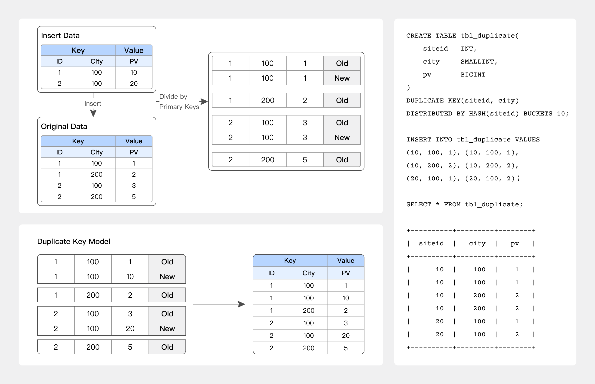
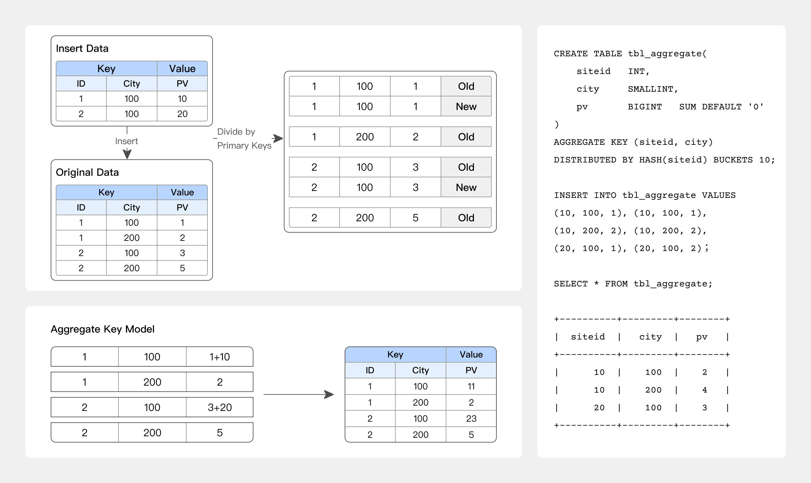

# 3.10 数据库建表最佳实践

## 1 数据表模型

!!! tip

    Doris 数据表模型上目前分为三类：DUPLICATE KEY, UNIQUE KEY, AGGREGATE KEY。

!!! tip

    推荐规约

    因为数据模型在建表时就已经确定，且无法修改。所以，选择一个合适的数据模型非常重要。
    
    1. Duplicate 适合任意维度的 Ad-hoc 查询。虽然同样无法利用预聚合的特性，但是不受聚合模型的约束，可以发挥列存模型的优势（只读取相关列，而不需要读取所有 Key 列）。
    
    2. Aggregate 模型可以通过预聚合，极大地降低聚合查询时所需扫描的数据量和查询的计算量，非常适合有固定模式的报表类查询场景。但是该模型对 count(*) 查询很不友好。同时因为固定了 Value 列上的聚合方式，在进行其他类型的聚合查询时，需要考虑语意正确性。

    3. Unique 模型针对需要唯一主键约束的场景，可以保证主键唯一性约束。但是无法利用物化等预聚合带来的查询优势。对于聚合查询有较高性能需求的用户，推荐使用自 1.2 版本加入的写时合并实现。

    4. 如果有部分列更新的需求，可以选择：

        * Unique 模型的 Merge-on-Write 模式

        * Aggregate 模型的 REPLACE_IF_NOT_NULL 聚合方式

### 1.1 DUPLICATE KEY 表模型



只指定排序列，相同的 KEY 行不会合并。

适用于数据无需提前聚合的分析业务：

* 原始数据分析

* 仅追加新数据的日志或时序数据分析

**最佳实践**

```sql
-- 例如 允许 KEY 重复仅追加新数据的日志数据分析
CREATE TABLE session_data
(
    visitorid   SMALLINT,
    sessionid   BIGINT,
    visittime   DATETIME,
    city        CHAR(20),
    province    CHAR(20),
    ip          varchar(32),
    brower      CHAR(20),
    url         VARCHAR(1024)
)
DUPLICATE KEY(visitorid, sessionid) -- 只用于指定排序列，相同的 KEY 行不会合并
DISTRIBUTED BY HASH(sessionid, visitorid) BUCKETS 10;
```

### 1.2 AGGREGATE KEY 表模型



AGGREGATE KEY 相同时，新旧记录进行聚合，目前支持的聚合方式：

1. SUM：求和，多行的 Value 进行累加。

2. REPLACE：替代，下一批数据中的 Value 会替换之前导入过的行中的 Value。

3. MAX：保留最大值。

4. MIN：保留最小值。

5. REPLACE_IF_NOT_NULL：非空值替换。和 REPLACE 的区别在于对于 null 值，不做替换。

6. HLL_UNION：HLL 类型的列的聚合方式，通过 HyperLogLog 算法聚合。

7. BITMAP_UNION：BIMTAP 类型的列的聚合方式，进行位图的并集聚合。

适合报表和多维分析业务：

* 网站流量分析

* 数据报表多维分析

**最佳实践**

```sql
-- 例如 网站流量分析
CREATE TABLE site_visit
(
    siteid      INT,
    city        SMALLINT,
    username    VARCHAR(32),
    pv BIGINT   SUM DEFAULT '0' -- PV 浏览量计算
)
AGGREGATE KEY(siteid, city, username) -- 相同的 KEY 行会合并，非 KEY 列会根据指定的聚合函数进行聚合
DISTRIBUTED BY HASH(siteid) BUCKETS 10;
```

### 1.3 UNIQUE KEY 表模型

UNIQUE KEY 相同时，新记录覆盖旧记录。在 1.2 版本之前，UNIQUE KEY 实现上和 AGGREGATE KEY 的 REPLACE 聚合方法一样，二者本质上相同，自 1.2 版本我们给 UNIQUE KEY 引入了 merge on write 实现，该实现有更好的聚合查询性能。

适用于有更新需求的分析业务：

* 订单去重分析

* 实时增删改同步

**最佳实践**

```sql
-- 例如 订单去重分析
CREATE TABLE sales_order
(
    orderid     BIGINT,
    status      TINYINT,
    username    VARCHAR(32),
    amount      BIGINT DEFAULT '0'
)
UNIQUE KEY(orderid) -- 相同的 KEY 行会合并
DISTRIBUTED BY HASH(orderid) BUCKETS 10;
```

## 2 索引

!!! tip

    索引用于帮助快速过滤或查找数据。目前主要支持两类索引：

    1. 内建自动创建的智能索引，包括前缀索引和 ZoneMap 索引。
    
    2. 用户手动创建的二级索引，包括倒排索引、bloomfilter 索引、ngram bloomfilter 索引 和 bitmap 索引。

### 2.1 前缀索引

在 Aggregate、Unique 和 Duplicate 三种数据模型中。底层的数据存储，是按照各自建表语句中，AGGREGATE KEY、UNIQUE KEY 和 DUPLICATE KEY 中指定的列进行排序存储的。而前缀索引，即在排序的基础上，实现的一种根据给定前缀列，快速查询数据的索引方式。

前缀索引是稀疏索引，不能精确定位到 Key 所在的行，只能粗粒度地定位出 Key 可能存在的范围，然后使用二分查找算法精确地定位 Key 的位置。

!!! tip

    推荐规约

    1. 建表时，正确的选择列顺序，能够极大地提高查询效率。
    
        因为建表时已经指定了列顺序，所以一个表只有一种前缀索引。这对于使用其他不能命中前缀索引的列作为条件进行的查询来说，效率上可能无法满足需求，这种情况，我们可以通过> 创建 物化视图 来人为的调整列顺序。

    2. 前缀索引的第一个字段一定是最常查询的字段，并且需要是高基数字段：

        * 分桶字段注意事项：这个一般是数据分布比较均衡的，也是经常使用的字段，最好是高基数字段

        * Int（4）+ Int（4） + varchar(50)，前缀索引长度只有 28

        * Int（4） + varchar(50) + Int（4），前缀索引长度只有 24

        * varchar(10) + varchar(50) ，前缀索引长度只有 30

        * 前缀索引（36 位）：第一个字段查询性能最好，前缀索引碰见 varchar 类型的字段，会自动截断前 20 个字符

        * 最常用的查询字段如果能放到前缀索引里尽可能放到前前缀索引里，如果不能，可以放到分桶字段里

    3. 前缀索引中的字段长度尽可能明确，因为 Doris 只有前 36 个字节能走前缀索引。

    4. 如果某个范围数据在分区分桶和前缀索引中都不好设计，可以考虑引入倒排索引加速。

### 2.2 ZoneMap 索引

ZoneMap 索引是在列存格式上，对每一列自动维护的索引信息，包括 Min/Max，null 值个数等等。在数据查询时，会根据范围条件过滤的字段按照 ZoneMap 统计信息选取扫描的数据范围。

例如对 age 字段进行过滤，查询语句如下：

```sql
SELECT * FROM table WHERE age > 0 and age < 51;
```

在没有命中 Short Key Index 的情况下，会根据条件语句中 age 的查询条件，利用 ZoneMap 索引找到应该扫描的数据 ordinary 范围，减少要扫描的 page 数量。

### 2.3 倒排索引

从 2.0.0 版本开始，Doris 支持倒排索引，可以用来进行文本类型的全文检索、普通数值日期类型的等值范围查询，快速从海量数据中过滤出满足条件的行。

**最佳实践**

```sql
-- 创建示例：可以表创建时指定或者创建后新增，如下创建表时指定
CREATE TABLE table_name
(
  columns_difinition,
  INDEX idx_name1(column_name1) USING INVERTED [PROPERTIES("parser" = "english|unicode|chinese")] [COMMENT 'your comment']
  INDEX idx_name2(column_name2) USING INVERTED [PROPERTIES("parser" = "english|unicode|chinese")] [COMMENT 'your comment']
  INDEX idx_name3(column_name3) USING INVERTED [PROPERTIES("parser" = "chinese", "parser_mode" = "fine_grained|coarse_grained")] [COMMENT 'your comment']
  INDEX idx_name4(column_name4) USING INVERTED [PROPERTIES("parser" = "english|unicode|chinese", "support_phrase" = "true|false")] [COMMENT 'your comment']
  INDEX idx_name5(column_name4) USING INVERTED [PROPERTIES("char_filter_type" = "char_replace", "char_filter_pattern" = "._"), "char_filter_replacement" = " "] [COMMENT 'your comment']
  INDEX idx_name5(column_name4) USING INVERTED [PROPERTIES("char_filter_type" = "char_replace", "char_filter_pattern" = "._")] [COMMENT 'your comment']
)
table_properties;

-- 使用示例：全文检索关键词匹配，通过 MATCH_ANY MATCH_ALL 完成
SELECT * FROM table_name WHERE column_name MATCH_ANY | MATCH_ALL 'keyword1 ...';
```

!!! tip

    推荐规约

    如果某个范围数据在分区分桶和前缀索引中都不好设计，可以考虑引入倒排索引加速。

!!! warning

    强制规约

    倒排索引在不同数据模型中有不同的使用限制：

    * Aggregate KEY 表模型：只能为 Key 列建立倒排索引。

    * Unique KEY 表模型：需要开启 merge on write 特性，开启后，可以为任意列建立倒排索引。

    * Duplicate KEY 表模型：可以为任意列建立倒排索引。

### 2.4 BloomFilter 索引

Doris 支持用户对取值区分度比较大的字段添加 BloomFilter 索引，适合在基数较高的列上进行等值查询的场景。

**最佳实践**

```sql
-- 创建示例：通过在建表语句的 PROPERTIES 里加上"bloom_filter_columns"="k1,k2,k3"
-- 例如下面我们对表里的 saler_id,category_id 创建了 BloomFilter 索引。
CREATE TABLE IF NOT EXISTS sale_detail_bloom  (
    sale_date date NOT NULL COMMENT "销售时间",
    customer_id int NOT NULL COMMENT "客户编号",
    saler_id int NOT NULL COMMENT "销售员",
    sku_id int NOT NULL COMMENT "商品编号",
    category_id int NOT NULL COMMENT "商品分类",
    sale_count int NOT NULL COMMENT "销售数量",
    sale_price DECIMAL(12,2) NOT NULL COMMENT "单价",
    sale_amt DECIMAL(20,2)  COMMENT "销售总金额"
)
Duplicate  KEY(sale_date, customer_id,saler_id,sku_id,category_id)
DISTRIBUTED BY HASH(saler_id) BUCKETS 10
PROPERTIES (
"bloom_filter_columns"="saler_id,category_id"
);
```

!!! warning

    强制规约

    1. 不支持对 Tinyint、Float、Double 类型的列建 BloomFilter 索引。

    2. BloomFilter 索引只对 in 和 = 过滤查询有加速效果。

    3. BloomFilter 索引必须在查询条件是 in 或者 =，并且是高基数（5000 以上）列上构建。

        * 首先 BloomFilter 适用于非前缀过滤

        * 查询会根据该列高频过滤，而且查询条件大多是 in 和 = 过滤

        * 不同于 Bitmap, BloomFilter 适用于高基数列。比如 UserID。因为如果创建在低基数的列上，比如“性别”列，则每个 Block 几乎都会包含所有取值，导致 BloomFilter 索引失去意义

        * 数据基数在一半左右

        * 类似身份证号这种基数特别高并且查询是等值（=）查询，使用 BloomFilter 索引能极大加速

### 2.5 NGram BloomFilter 索引

从 2.0.0 版本开始，Doris 为了提升LIKE的查询性能，增加了 NGram BloomFilter 索引。

**最佳实践**

```sql
-- 创建示例：表创建时指定
CREATE TABLE `nb_table` (
  `siteid` int(11) NULL DEFAULT "10" COMMENT "",
  `citycode` smallint(6) NULL COMMENT "",
  `username` varchar(32) NULL DEFAULT "" COMMENT "",
  INDEX idx_ngrambf (`username`) USING NGRAM_BF PROPERTIES("gram_size"="3", "bf_size"="256") COMMENT 'username ngram_bf index'
) ENGINE=OLAP
AGGREGATE KEY(`siteid`, `citycode`, `username`) COMMENT "OLAP"
DISTRIBUTED BY HASH(`siteid`) BUCKETS 10;

-- PROPERTIES("gram_size"="3", "bf_size"="256")，分别表示 gram 的个数和 bloom filter 的字节数。
-- gram 的个数跟实际查询场景相关，通常设置为大部分查询字符串的长度，bloom filter 字节数，可以通过测试得出，通常越大过滤效果越好，可以从 256 开始进行验证测试看看效果。当然字节数越大也会带来索引存储、内存 cost 上升。
-- 如果数据基数比较高，字节数可以不用设置过大，如果基数不是很高，可以通过增加字节数来提升过滤效果。
```

!!! warning

    强制规约

    1. NGram BloomFilter 只支持字符串列

    2. NGram BloomFilter 索引和 BloomFilter 索引为互斥关系，即同一个列只能设置两者中的一个

    3. NGram 大小和 BloomFilter 的字节数，可以根据实际情况调优，如果 NGram 比较小，可以适当增加 BloomFilter 大小

    4. 亿级别以上数据，如果有模糊匹配，使用倒排索引或者是 NGram Bloomfilter

### 2.6 Bitmap 索引

为了加速数据查询，Doris 支持用户为某些字段添加 Bitmap 索引，适合在基数较低的列上进行等值查询或范围查询的场景。

**最佳实践**

```sql
-- 创建示例：在 bitmap_table 上为 siteid 创建 Bitmap 索引
CREATE INDEX [IF NOT EXISTS] bitmap_index_name ON
bitmap_table (siteid)
USING BITMAP COMMENT 'bitmap_siteid';
```

!!! warning

    强制规约

    1. Bitmap 索引仅在单列上创建。

    2. Bitmap 索引能够应用在 Duplicate、Uniq 数据模型的所有列和 Aggregate模型的 key 列上。

    3. Bitmap 索引支持的数据类型如下：

        * TINYINT

        * SMALLINT

        * INT

        * BIGINT

        * CHAR

        * VARCHAR

        * DATE

        * DATETIME

        * LARGEINT

        * DECIMAL

        * BOOL

    4. Bitmap 索引仅在 Segment V2 下生效。当创建 Index 时，表的存储格式将默认转换为 V2 格式。

    5. Bitmap 索引必须在一定基数范围内构建，太高或者太低的基数都不合适

        * 适用于低基数的列上，建议在 100 到 100,000 之间，如：职业、地市等。重复度过高则对比其他类型索引没有明显优势；重复度过低，则空间效率和性能会大大降低。特定类型的> 查询例如 COUNT, OR, AND 等逻辑操作因为只需要进行位运算

        * 该索引更多的适合正交查询

## 3 字段类型

Doris 支持多种字段类型，例如精确去重 BITMAP、模糊去重 HLL、半结构化 ARRAY/MAP/JSON 和常见的数字、字符串和时间类型等。

!!! tip

    推荐规约

    1. VARCHAR

        * 变长字符串，长度范围为：1-65533 字节长度，以 UTF-8 编码存储的，因此通常英文字符占 1 个字节，中文字符占 3 个字节。

        * 这里存在一个误区，即 varchar(255) 和 varchar(65533) 的性能问题，这二者如果存的数据是一样的，性能也是一样的，建表时如果不确定这个字段最大有多长，建议直接使> 用 65533 即可，防止由于字符串过长导致的导入问题。

    2. STRING

        * 变长字符串，默认支持 1048576 字节（1MB），可调大到 2147483643 字节（2G），以 UTF-8 编码存储的，因此通常英文字符占 1 个字节，中文字符占 3 个字节。

        * 只能用在 Value 列，不能用在 Key 列和分区分桶列。

        * 适用于一些比较大的文本存储，一般如果没有这种需求的话，建议使用 VARCHAR，STRING 列无法用在 Key 列和分桶列，局限性比较大。

    3. 数值型字段：按照精度选择对应的数据类型即可，没有过于特殊的注意。

    4. 时间字段：这里需要注意的是，如果有高精度（毫秒值时间戳）需求，需要指明使用 datetime(6)，否则默认是不支持毫秒值时间戳的。

    5. 建议使用 JSON 数据类型代替字符串类型存放 JSON 数据的使用方式。

## 4 数据表创建


建表时除了要注意数据表模型、索引和字段类型的选择还需要注意分区分桶的设置。

**最佳实践**

```sql
-- 以 Unique 模型的 Merge-on-Write 表为例
-- Unique 模型的写时合并实现，与聚合模型就是完全不同的两种模型了，查询性能更接近于 duplicate 模型，
-- 在有主键约束需求的场景上相比聚合模型有较大的查询性能优势，尤其是在聚合查询以及需要用索引过滤大量数据的查询中。

-- 非分区表
CREATE TABLE IF NOT EXISTS tbl_unique_merge_on_write
(
    `user_id` LARGEINT NOT NULL COMMENT "用户id",
    `username` VARCHAR(50) NOT NULL COMMENT "用户昵称",
    `register_time` DATE COMMENT "用户注册时间",
    `city` VARCHAR(20) COMMENT "用户所在城市",
    `age` SMALLINT COMMENT "用户年龄",
    `sex` TINYINT COMMENT "用户性别",
    `phone` LARGEINT COMMENT "用户电话",
    `address` VARCHAR(500) COMMENT "用户地址"
)
UNIQUE KEY(`user_id`, `username`)
-- 3-5G 的数据量
DISTRIBUTED BY HASH(`user_id`) BUCKETS 10 
PROPERTIES (
-- 在 1.2.0 版本中，作为一个新的 feature，写时合并默认关闭，用户可以通过添加下面的 property 来开启
"enable_unique_key_merge_on_write" = "true" 
);

-- 分区表
CREATE TABLE IF NOT EXISTS tbl_unique_merge_on_write_p
(
    `user_id` LARGEINT NOT NULL COMMENT "用户id",
    `username` VARCHAR(50) NOT NULL COMMENT "用户昵称",
    `register_time` DATE COMMENT "用户注册时间",
    `city` VARCHAR(20) COMMENT "用户所在城市",
    `age` SMALLINT COMMENT "用户年龄",
    `sex` TINYINT COMMENT "用户性别",
    `phone` LARGEINT COMMENT "用户电话",
    `address` VARCHAR(500) COMMENT "用户地址"
)
UNIQUE KEY(`user_id`, `username`, `register_time`)
PARTITION BY RANGE(`register_time`) (
    PARTITION p00010101_1899 VALUES [('0001-01-01'), ('1900-01-01')), 
    PARTITION p19000101 VALUES [('1900-01-01'), ('1900-01-02')), 
    PARTITION p19000102 VALUES [('1900-01-02'), ('1900-01-03')),
    PARTITION p19000103 VALUES [('1900-01-03'), ('1900-01-04')),
    PARTITION p19000104_1999 VALUES [('1900-01-04'), ('2000-01-01')),
    FROM ("2000-01-01") TO ("2022-01-01") INTERVAL 1 YEAR, 
    PARTITION p30001231 VALUES [('3000-12-31'), ('3001-01-01')), 
    PARTITION p99991231 VALUES [('9999-12-31'), (MAXVALUE)) 
) 
-- 默认 3-5G 的数据量
DISTRIBUTED BY HASH(`user_id`) BUCKETS 10 
PROPERTIES ( 
-- 在 1.2.0 版本中，作为一个新的 feature，写时合并默认关闭，用户可以通过添加下面的 property 来开启
"enable_unique_key_merge_on_write" = "true", 
-- 动态分区调度的单位。可指定为 HOUR、DAY、WEEK、MONTH、YEAR。分别表示按小时、按天、按星期、按月、按年进行分区创建或删除。
"dynamic_partition.time_unit" = "MONTH",
-- 动态分区的起始偏移，为负数。根据 time_unit 属性的不同，以当天（星期/月）为基准，分区范围在此偏移之前的分区将会被删除（TTL）。如果不填写，则默认为 -2147483648，即不删除历史分区。
"dynamic_partition.start" = "-3000",
-- 动态分区的结束偏移，为正数。根据 time_unit 属性的不同，以当天（星期/月）为基准，提前创建对应范围的分区。
"dynamic_partition.end" = "10",
-- 动态创建的分区名前缀（必选）。
"dynamic_partition.prefix" = "p",
-- 动态创建的分区所对应的分桶数量。
"dynamic_partition.buckets" = "10", 
"dynamic_partition.enable" = "true", 
-- 动态创建的分区所对应的副本数量，如果不填写，则默认为该表创建时指定的副本数量 3。
"dynamic_partition.replication_num" = "3",
"replication_num" = "3"
);  

-- 分区创建查看
-- 实际创建的分区数需要结合 dynamic_partition.start、end 以及 PARTITION BY RANGE 的设置共同决定
show partitions from tbl_unique_merge_on_write_p;
```

!!! warning

    强制规约

    1. 数据库字符集指定 UTF-8，并且只支持 UTF-8。

    2. 表的副本数必须为 3（未指定副本数时，默认为 3）。

    3. 单个 Tablet（Tablet 数 = 分区数 *桶数* 副本数）的数据量理论上没有上下界，除小表（百兆维表）外需确保在 1G - 10G 的范围内：

        * 如果单个 Tablet 数据量过小，则数据的聚合效果不佳，且元数据管理压力大。

        * 如果数据量过大，则不利于副本的迁移、补齐，且会增加 Schema Change 或者 物化 操作失败重试的代价（这些操作失败重试的粒度是 Tablet）。

    4. 5 亿以上的数据必须设置分区分桶策略：
        
        * bucket 设置建议：
            
            * 大表的单个 Tablet 存储数据大小在 1G-10G 区间，可防止过多的小文件产生。
            
            * 百兆左右的维表 Tablet 数量控制在 3-5 个，保证一定的并发数也不会产生过多的小文件。
    
        * 没有办法分区的，数据又较快增长的，没办法按照时间动态分区，可以适当放大一下你的 Bucket 数量，按照你的数据保存周期（180 天）数据总量，来估算你的 Bucket 数量应该是多少，建议还是单个 Bucket 大小在 1-10G。
        
        * 对分桶字段进行加盐处理，业务上查询的时候也是要同样的加盐策略，这样能利用到分桶数据剪裁能力。
        
        * 数据随机分桶：
            
            * 如果 OLAP 表没有更新类型的字段，将表的数据分桶模式设置为 RANDOM，则可以避免严重的数据倾斜 (数据在导入表对应的分区的时候，单次导入作业每个 Batch 的数据将随机选择一个 Tablet 进行写入)。
            
            * 当表的分桶模式被设置为 RANDOM 时，因为没有分桶列，无法根据分桶列的值仅对几个分桶查询，对表进行查询的时候将对命中分区的全部分桶同时扫描，该设置适合对表数据整体的聚合查询分析而不适合高并发的点查询。
            
            * 如果 OLAP 表的是 Random Distribution 的数据分布，那么在数据导入的时候可以设置单分片导入模式（将 `load_to_single_tablet` 设置为 true），那么在大数据量的导入的时候，一个任务在将数据写入对应的分区时将只写入一个分片，这样将能提高数据导入的并发度和吞吐量，减少数据导入和 Compaction 导致的写放大问题，保障集群的稳定性。
        
        * 维度表：缓慢增长的，可以使用单分区，在分桶策略上使用常用查询条件（这个字段数据分布相对均衡）分桶。
        
        * 事实表
    
    5. 对于有大量历史分区数据，但是历史数据比较少，或者不均衡，或者查询概率的情况，使用如下方式将数据放在特殊分区。
    
        对于历史数据，如果数据量比较小我们可以创建历史分区（比如年分区，月分区），将所有历史数据放到对应分区里创建历史分区方式例如：`FROM ("2000-01-01") TO ("2022-01-01") INTERVAL 1 YEAR` ，具体参考：

        ```sql
        ( 
            PARTITION p00010101_1899 VALUES [('0001-01-01'), '1900-01-01')), 
            
            PARTITION p19000101 VALUES [('1900-01-01'), '1900-01-02')), 
            
            ... 
            
            PARTITION p19000104_1999 VALUES [('1900-01-04'), '2000-01-01')),
            
            FROM ("2000-01-01") TO ("2022-01-01") INTERVAL 1 YEAR, 
            
            PARTITION p30001231 VALUES [('3000-12-31'), '3001-01-01')), 
            
            PARTITION p99991231 VALUES [('9999-12-31'), (MAXVALUE)) 
            
        )
        ```
