# Doris vs Clickhouse
## 1 背景介绍
Apache Doris是由百度贡献的开源MPP分析型数据库产品，亚秒级查询响应时间，支持实时数据分析；分布式架构简洁，易于运维，可以支持10PB以上的超大数据集；可以满足多种数据分析需求，例如固定历史报表，实时数据分析，交互式数据分析和探索式数据分析等。

ClickHouse是俄罗斯的搜索公司Yandex开源的MPP架构的分析引擎，号称比事务数据库快100-1000倍，团队有计算机体系结构的大牛，最大的特色是高性能的向量化执行引擎，而且功能丰富、可靠性高。

京东当前都在大范围使用这两种分析引擎，总集群规模超过3000台服务器，涵盖了交易、流量、线下和大屏等各类场景。本文将结合京东团队的调研成果和几年的实践经验，对Doris和ClickHouse这两种分析引擎进行深入对比，验证广为流传的说法，供大家在场景选型或内核研发时提供一个参考，另外对于两者社区规划提供一定的借鉴。

## 2 差异和选择建议

### 2.1 Doris更优的方面
* 使用更简单，如建表更简单，SQL标准支持更好， Join性能更好，导数功能更强大
* 运维更简单，如灵活的扩缩容能力，故障节点自动恢复，社区提供的支持更好
* 分布式更强，支持事务和幂等性导数，物化视图自动聚合，查询自动路由，全面元数据管理

### 2.2 ClickHouse更优的方面
* 性能更佳，导入性能和单表查询性能更好，同时可靠性更好
* 功能丰富，非常多的表引擎，更多类型和函数支持，更好的聚合函数以及庞大的优化参数选项
* 集群管理工具更多，更好多租户和配额管理，灵活的集群管理，方便的集群间迁移工具

### 2.3 那么两者之间如何选择呢？
* 业务场景复杂数据规模巨大，希望投入研发力量做定制开发，选ClickHouse
* 希望一站式的分析解决方案，少量投入研发资源，选择Doris

另外， Doris源自在线广告系统，偏交易系统数据分析；ClickHouse起源于网站流量分析服务，偏互联网数据分析，但是这两类场景这两个引擎都可以覆盖。如果说两者不那么强的地方，ClickHouse的问题是使用门槛高、运维成本高和分布式能力太弱，需要较多的定制化和较深的技术实力，Doris的问题是性能差一些可靠性差一些，下面就深入分析两者的差异。

## 3 架构分析
从部署运维、分布式能力、数据导入、查询、存储和使用成本等方面进行对比，这部分会涉及到内核中的设计原理、方案和实现，了解这些原理会有助于理解上文的结论。

### 3.1 部署运维
#### 3.1.1 部署和日常运维
部署指部署集群，安装相关依赖和核心组件，修改配置文件，让集群正常运行起来；运维指日常集群版本更新，配置文件更改、扩缩容等相关事项。集群所需组件如下：
* 左侧是Doris的部署架构图，JDBC指接入协议，DNS是域名和请求分发系统。Managerment Panel是管控面。Frontend指前端模块简称FE，包含了SQL解析、查询计划、计划调度、元数据管理等功能，Backend指后端模块简称BE负责存储层、数据读取和写入，另外还有一个BrokerLoad导数组件最好是单独部署。所以，Doris一般只需要FE和BE两个组件。
* 右侧是ClickHouse的部署架构图，ClickHouse本身只有一个模块，就是ClickHouse Server，周边有两个模块，如ClickHouseProxy主要是转发请求、配额限制和容灾等，ZooKeeper这块负责分布式DDL和副本间数据同步，ClickHouseCopier负责集群和数据迁移，ClickHouse一般需要Server、ZooKeeper和CHProxy三个组件。
* 日常运维如更新版本、更改配置文件两者都需要依赖Ansible或者SaltStack来进行批量更新。两者都有部分配置文件可以热更新，不用重启节点，而且有Session相关参数可以设置可以覆盖配置文件。Doris有较多的SQL命令协助运维，比如增加节点，Doris中Add Backend即可，ClickHouse中需要更改配置文件并下发到各个节点上。

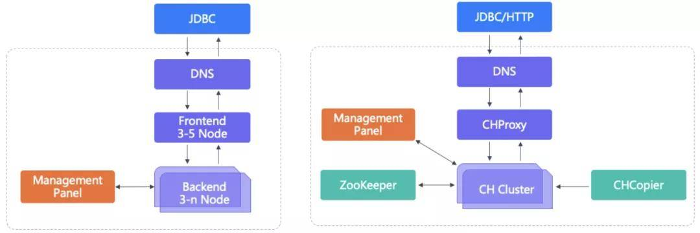

#### 3.1.2 多租户管理
ClickHouse的权限和Quota的粒度更细，可以很方便的支持多租户使用共享集群。比如可以设置查询内存、查询线程数量、查询超时等，以便来限制查询的大小；同时结合查询并发和一定时间窗口内的查询数量，以便来控制查询数量。多租户的方案，对发展中的业务非常友好，因为使用共享集群资源，可以快速动态调整配额，如果是独占集群资源利用率不高、扩容相对麻烦。

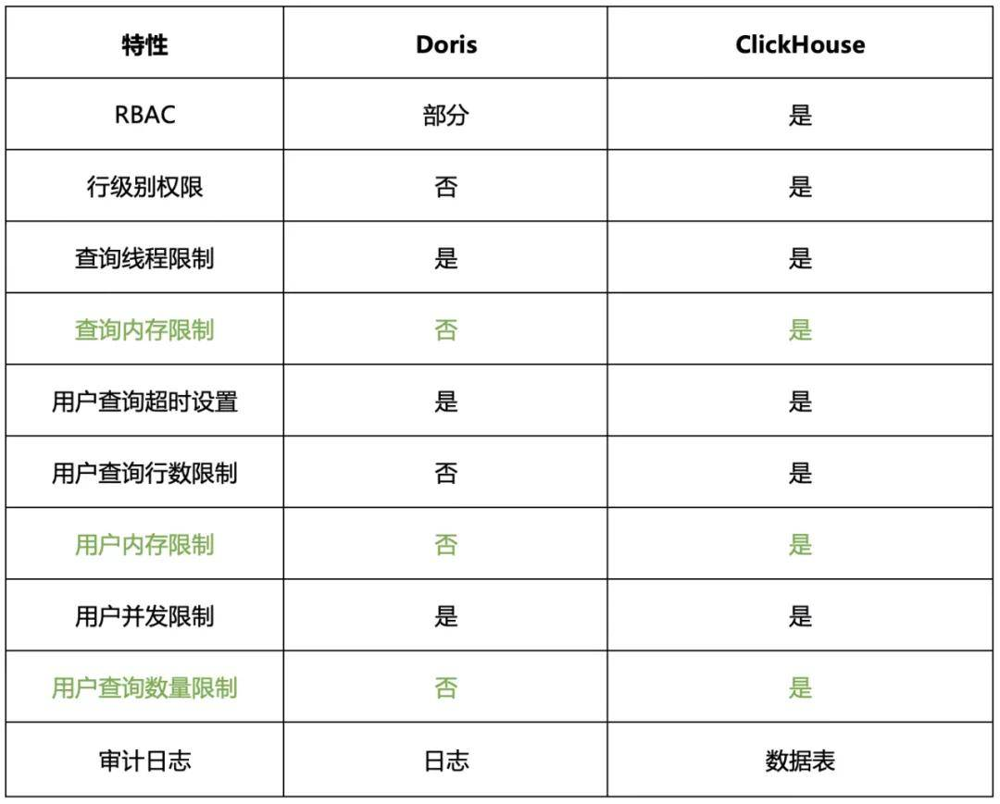

#### 3.1.3 集群迁移
Doris通过内置的backup/restore命令将数据和元数据备份到三方对象存储或者HDFS上，backup可以通过快照的方式完整导出一致性的数据和元数据，并且可以按照分区来实现增量备份，降低备份的成本。在Doris中，有一种变通的迁移集群的方法，把新机器分批加入到已有的集群，然后再把旧机器逐步下线，集群能够自动均衡，这个过程视集群数据量可能会持续数天。

ClickHouse有几个方法实现数据迁移，数据量大通过自带的Clickhouse-copier工具进行集群间的数据拷贝，实现数据的跨集群迁移，需要手工配置很多信息，我们做了一些完善和改进；数据量小通过SQL命令remote关键字实现跨集群的数据迁移。而官方对实现其他存储介质的备份和恢复的推荐是采用文件系统的snapshot实现，或者可以通过三方工具（[https://github.com/AlexAkulov/clickhouse-backup](https://github.com/AlexAkulov/clickhouse-backup)）来实现。

#### 3.1.4 扩容/缩容
Doris支持集群的在线动态扩缩容，通过内置的SQL命令 alter system add/decomission backends 即可进行节点的扩缩容，数据均衡的粒度是tablet，每个tablet大概是数百兆，扩容后表的tablet会自动拷贝到新的BE节点，如果在线扩容，应该小批量去增加BE，避免过于剧烈导致集群不稳定。

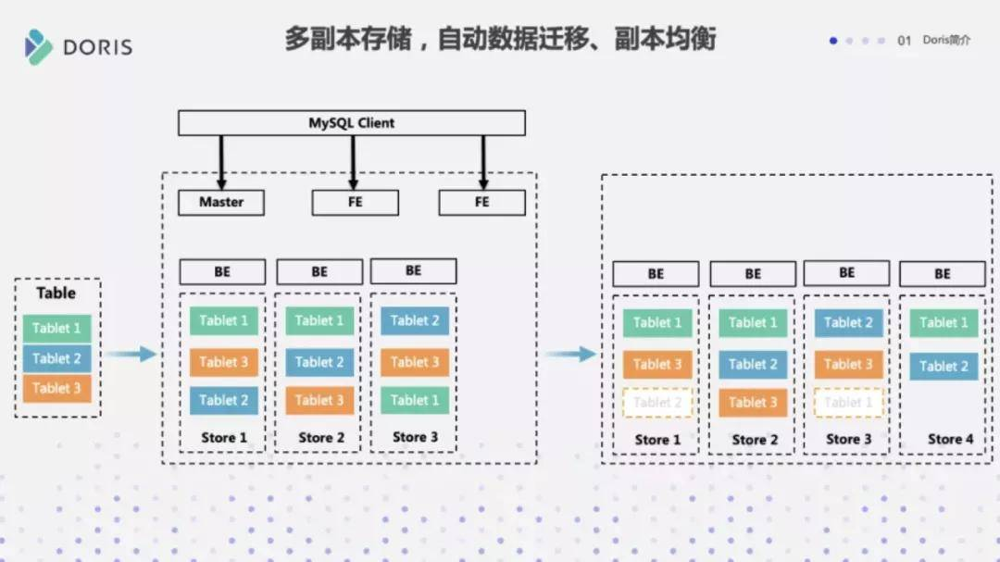

ClickHouse的扩容缩容复杂且繁琐，目前做不到自动在线操作，需要自研工具支持。扩容时需要部署新的节点，添加新分片和副本到配置文件中，并在新节点上创建元数据，如果是扩副本数据会自动均衡，如果是扩分片，需要手工去做均衡，或自研相关工具，让均衡自动进行。

### 3.2 分布式能力
#### 3.2.1 分布式协议和高可用
Doris在FrontEnd中包含元数据的管理能力，内置了BerkeleyDB JE HA组件，包含选举策略和副本数据同步，提供了FE的高可用方案。FE中管理的元数据也非常丰富，包含节点、集群、库、表和用户信息，以及分区、Tablet等数据信息，也包含事务、后台任务、DDL操作和导数相关任务等信息。

Doris的 FrontEnd可以部署3个Follwer + n个Oberserver（n>=0）的方式来实现元数据和访问连接的高可用，Follower参与选主，在有Follwer宕机时，会自动的选举出新节点保证读写高可用，Observer是只读的扩展节点，可以水平扩展实现读的扩展。BE通过多副本来实现高可用，一般来说也采取默认的三副本，写入的时候采用Quroum协议保证数据一致性。

Doris的元数据和数据多副本存储的，能自动复制具有自动灾备的能力，服务挂了可以自动重启，坏一块盘数据自动均衡，小范围的节点宕机不会影响集群对外的服务，但宕机后数据均衡过程会消耗集群资源，引发短时间的负载过高。架构如下图：

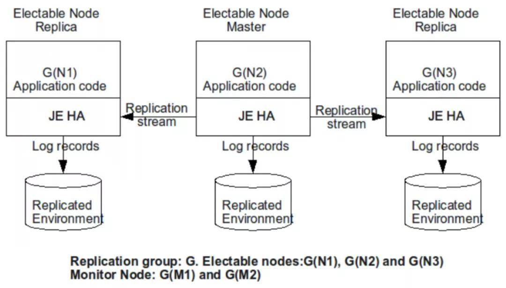

ClickHouse目前版本是基于ZooKeeper来存储元数据，包含分布式的DDL、表和数据Part信息，从元数据丰富程度来说稍弱，因为存储了大量细粒度的文件信息，导致ZooKeeper经常出现性能瓶颈，社区也有基于Raft协议的改进计划。ClickHouse依赖Zookeeper来实现数据的高可用，Zookeeper带来额外的运维复杂性的同时也有性能问题。

ClickHouse没有集中的元数据管理，每个节点分别管理，高可用一般依赖业务方来实现。ClickHouse中某个副本节点宕机，对查询和分布式表的导入没有影响，本地表导入要在导数程序中做灾备方案比如选择健康的副本，对DDL操作是有影响的，需要及时处理。

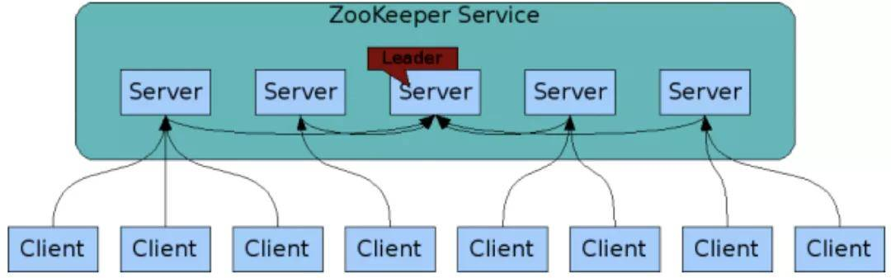

在分布式能力这块，Doris在内核侧已经实现，使用的代价更低；而ClickHouse需要依赖于外部配套的措施去保障，使用成本较高。

#### 3.2.2 事务支持
ACID指事务的原子性、一致性、隔离性和持久化，OLAP的事务体现在几个方面，一是导数，需要保证导数的原子性，同时也要保证明细数据和物化视图的数据一致性；二是元数据的变更，需要保证所有节点的元数据统一变更的强一致性；三是在节点间做数据均衡时，需要保证数据的一致性。

Doris提供了导入的事务支持，可以保证导数的幂等性，比如数据导入的原子性，如果有其他错误会自动回滚，同时相同标签的数据不会重复导入。基于导入事务的功能，Doris还实现了Flink-connector这样的外部组件可以实现数据导入不丢不重。两者均不支持通用TP场景中的BEGIN/END/COMMIT语义的事务，很明显有事务支持的Doris比无事务支持的ClickHouse要节省很多开发成本，因为在ClickHouse中，这一切都需要外部导数程序来保证。

ClickHouse不支持事务，需要在外部去做各种校验和检查，在导数这块能保证100万以内的原子性，但是不保证一致性，比如要更新某些字段或者更新物化视图，这个操作是后台异步的，需要显示指定关键字FINAL来查询最终数据，而且其他操作没有事务支持。

DDL操作两者都是异步的，但是Doris能保证各个节点元数据的一致性，但ClickHouse中保证不了，会出现局部节点元数据和其他节点不一致的情况。

### 3.3 数据导入
Doris中有RoutineLoad、BrokerLoad和StreamLoad等丰富内置的导数方式，这些功能非常好用，虽然无法处理复杂的ETL逻辑，但是支持简单过滤和转换函数，也能容忍少量的数据异常，同时支持ACID和导数幂等性。
* Routineload支持消费Kafka的实时数据，按每批条数、导入间隔和并发数等设置导数参数，用于实时数据的导入；
* Brokerload支持从HDFS上导入数据文件，用于离线导数，速度不是很快；
* Streamload是导数的底层接口，更加高级的功能可以外部程序处理后通过Steamload来导入。

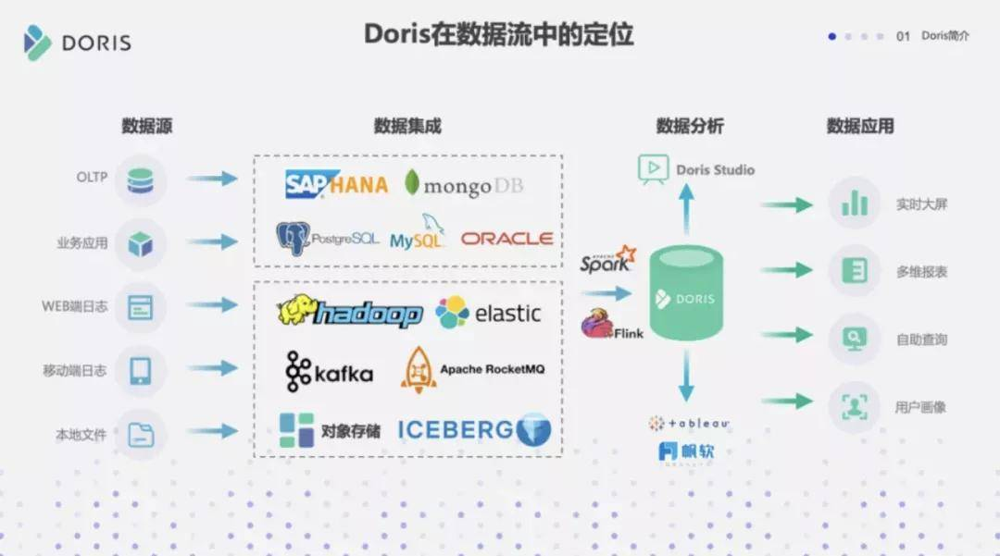

ClickHouse中并没有后台导数任务这一概念，它更多的是通过各种引擎去连接到各种存储系统中，。导数在1048576条以内是原子的，要么都生效，要么都失败，但是没有类似Doris中事务ID的概念，在Doris中相同的事务ID插入数据是无效的，这也避免了重复的导数，在CH中如果导数重复，只能删除重新导入。CH中比较有特色的是既可以写分布式表又可以写本地表。

导入性能因为ClickHouse可以导入本地表，而且没有事务的限制，所以导入性能差不多是节点磁盘写入的性能，而Doris的导数受限于只能分布式表的导入，导入性能差一些。

如果数据量少可以使用OLAP中的导数，数据量大逻辑复杂，一般使用Spark/Flink等外部计算引擎来做ETL和导数功能，主要是导数消耗集群资源。

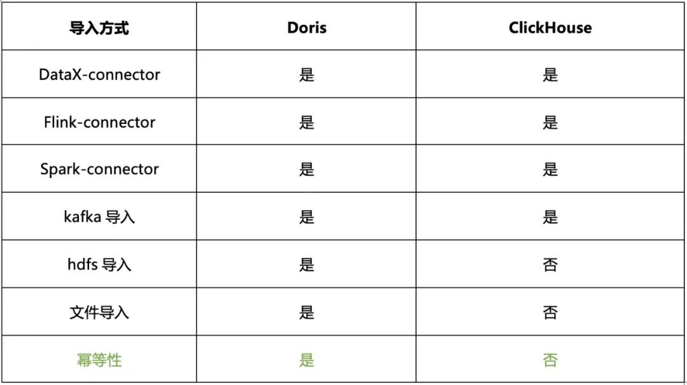

### 3.4 存储架构
#### 3.4.1 MVCC模型
Doris的存储部分参考GoogleMesa，采用的MVCC模式，MVCC指Multi-version concurrency control多版本控制，通过版本可以实现事务的两段提交，可以通过版本进行小文件合并，也可以在明细表和物化视图之间实现强一致性。

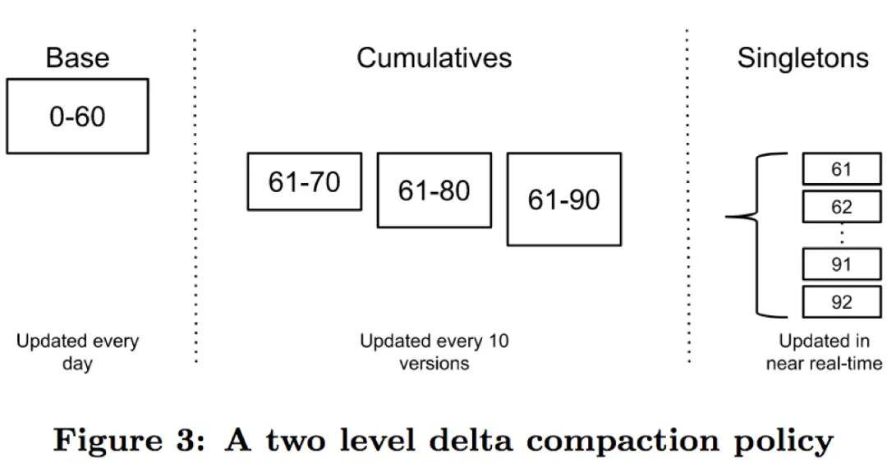

ClickHouse中也是类似，有两个操作，一种是Merge合并小的Part文件到一个大的Part，提升查询性能避免扫描多个小文件，合并过程类似上图。另外一种是Mutation就是在已有的Part中实现数据的变更或元数据的变更，如下图的SQL：

```sql
ALTER TABLE [db.]table DELETE WHERE filter_expr;
```

```sql
ALTER TABLE [db.]table UPDATE column1 = expr1 [, ...] WHERE filter_expr;
```

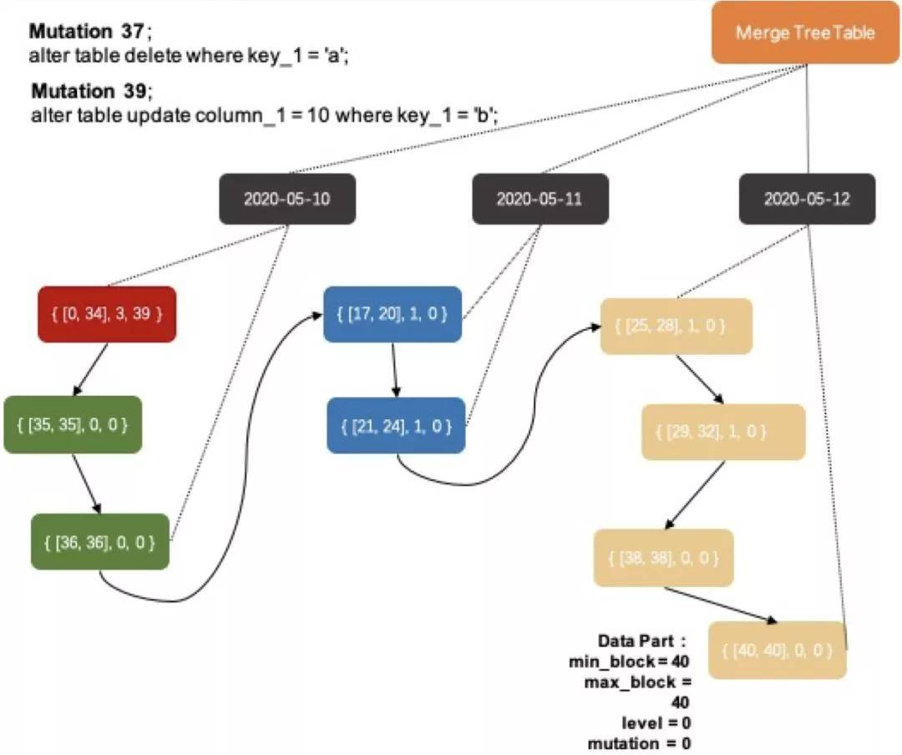

#### 3.4.2 存储结构
两者都是列存，列存的好处就是：
* 分析场景中需要读大量行但是少数几个列，只需要读取参与计算的列即可，极大的减低了IO，加速了查询
* 同一列中的数据属于同一类型，压缩效果显著，节省存储空间，降低了存储成本
* 高压缩比，意味着同等大小的内存能够存放更多数据，系统Cache效果更好

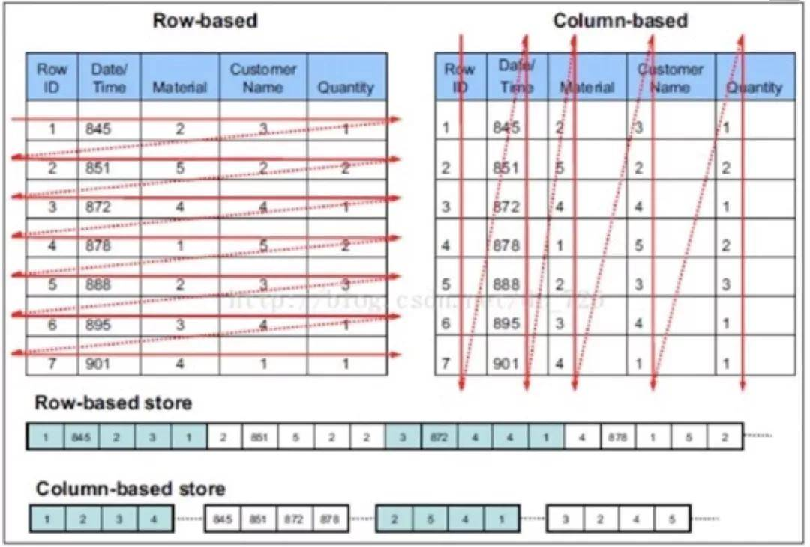

Doris的数据划分方式是Table、Partition、Bucket/Tablet、Segment几个部分，其中Partition代表数据的纵向划分分区一般是日期列，Bucket/Tablet一般指数据的横向切割分桶规则一般为某主键， Segment是具体的存储文件。Segment中包含数据和索引，数据部分包含多个列的数据按列存放，有三种索引：物理索引、稀疏索引和ZoneMap索引。

ClickHouse中分为DistributeTable、LocalTable、Partition、Shard、Part、Column几个部分，差不多能和Doris对应起来，区别就是CH中每个Column都对应一组数据文件和索引文件，好处就是命中系统Cache性能更高，不好的地方就是IO较高且文件数量较多，另外CH有Count索引，所以Count时命中索引会比较快。

通过分区分桶的方式可以让用户自定义数据在集群中的数据分布方式，降低数据查询的扫描量，方便集群的管理。分区作为数据管理的手段， Doris支持按照range分区，ClickHouse可以表达式来自定义。Doris可以通过动态分区的配置来按照时间自动创建新的分区，也可以做冷热数据的分级存储。ClickHouse通过distrubute引擎来进行多节点的数据分布，但是因为缺少bucket这一层，会导致集群的迁移扩容比较麻烦， Doris通过分桶的配置可以进一步对数据划分，方便数据的均衡和迁移。

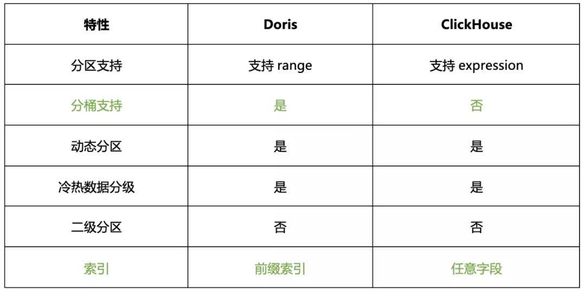

#### 3.4.3 表引擎/模型
两者都有典型的表类型（引擎类型）的支持
* Doris：可重复的Duplicated Key就是明细表，按维度聚合的Aggregate Key，唯一主键Unique Key，UniqueKey这个可以视为AggregateKey的特例，另外在这三种基础上可以建立Rollup（上卷），可以理解为物化视图。
* ClickHouse : 主要是MergeTree表引擎家族，主要是ReplicatedMergeTree带副本的、ReplacingMergeTree可以更新数据的和AggregatingMergeTree可以聚合数据，另外还有内存字典表可以加载数据字典、内存表可以加速查询或获得更好写入性能。CH比较特殊地方是分布式表和每个节点的本地表都要单独创建，物化视图无法自动路由。

另外，Doris新开发的Primary Key模型，对实时更新场景下的读性能进行了深度优化，在支持update语义的同时，避免了Unique key的sort merge开销。在实时update的压力下，查询性能跟是Unique key的3-15倍。类似的，相比ClickHouse的ReplicatedMergeTree，也避免了select final/optimize final的问题。

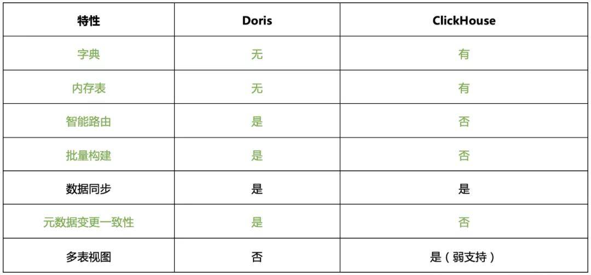

#### 3.4.4 数据类型
ClickHouse中存在较多的复杂类型的支持如Array/Nested/Map/Tuple/Enum等，这些类型能够满足一些特性场景，还是比较好用的。

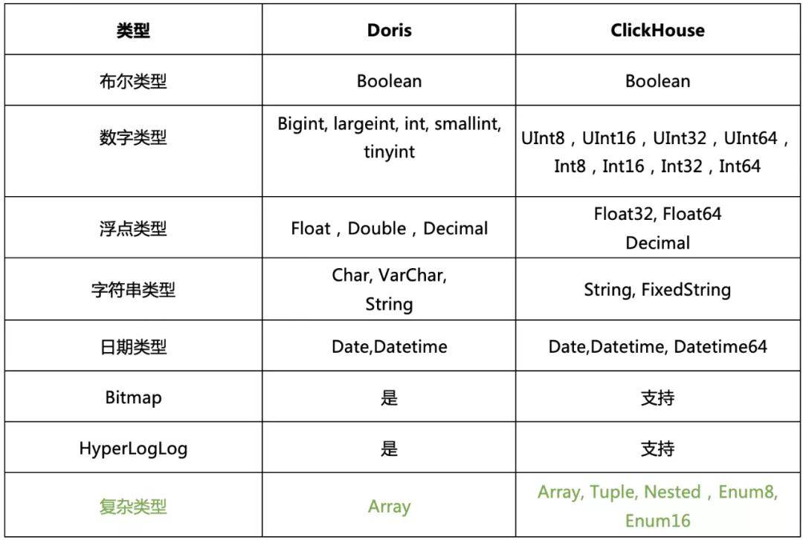

### 3.5 数据查询
#### 3.5.1 查询架构

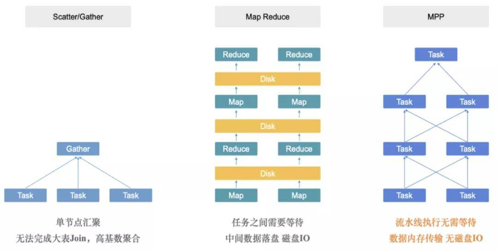

分布式查询指查询分布在多台服务器上的数据，就如同使用一张表一样，分布式Join比较繁琐，Doris的分布式Join有Local join，Broadcast join，Shuffle join，Hash join等方式。ClickHouse只有Local和Broadcast两种Join，这种架构比较简单，也限制了Join SQL的自由度，变通的方式是通过子查询和查询嵌套来实现多级的Join。

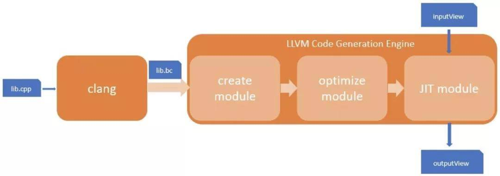

Doris和ClickHouse都支持向量化执行，向量化简单理解就是一批数据一批数据去执行，可以多行并发执行，同时也提升了CPU Cache命中率。在数据库领域，一直是Codegen和Vectorized并存，如下图是TPC-H的五个测试SQL，纵轴是查询时间，Type是编译执行，TW是向量化执行，可以看出两者在不同场景下，性能表现不一样。

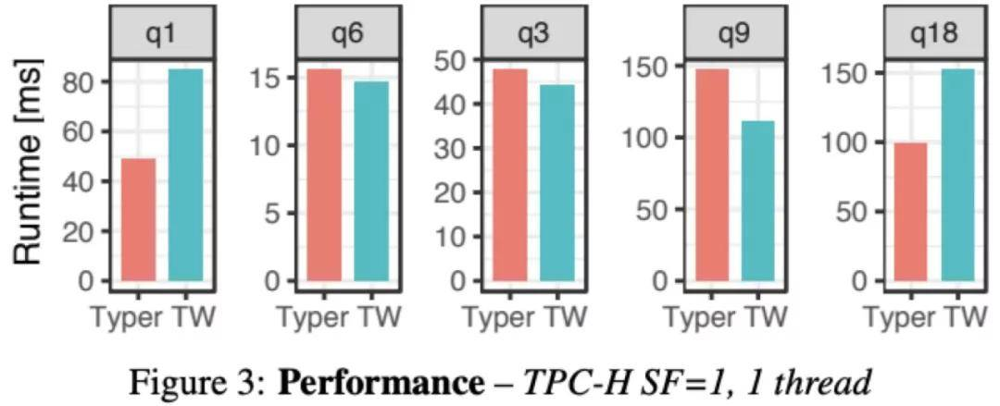

#### 3.5.2 并发能力
OLAP因为MPP架构，每一个SQL所有节点都会参与计算，以此来加速海量计算，因此一个集群的并发能力和单台没有太大的区别，所以，OLAP和数据库类似，并不是能够承担极高并发的系统。但是也并非毫无办法，比如通过增加副本数来达到承载较大并发的能力。比如4个分片1个副本，能承担100QPS，那么如果要承担500的QPS，则只需要把副本数扩展到5个副本即可。另外一点很重要的是查询能否利用到Cache，包括ResultCache，Page Cache和CPU Cache，这样并发还能提升一个很大的台阶。

Doris有两点比较优势，一是副本数的设置是在表级别的，只需要把并发大的表设置副本数多一些即可，当然副本数不能超过集群的节点数，而ClickHouse的副本数设置是集群级别的。

#### 3.5.3 SQL支持
Doris与MySQL语法兼容，支持SQL99规范以及部分SQL2003新标准(比如窗口函数，Grouping sets)。

ClickHouse部分支持SQL-2011 标准（[https://clickhouse.tech/docs/en/sql-reference/ansi/](https://clickhouse.tech/docs/en/sql-reference/ansi/)），但是由于Planner的一些限制，ClickHouse的多表关联需要对SQL做大量改写工作，比如需要手动下推条件到子查询中，所以复杂查询使用不太方便。

ClickHouse支持支持ODBC、JDBC、HTTP接口，Doris支持JDBC和ODBC接口。

#### 3.5.4 联邦查询

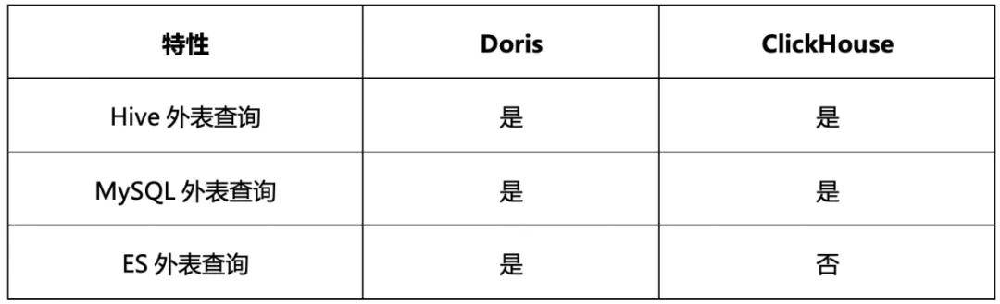

#### 3.5.5 函数支持

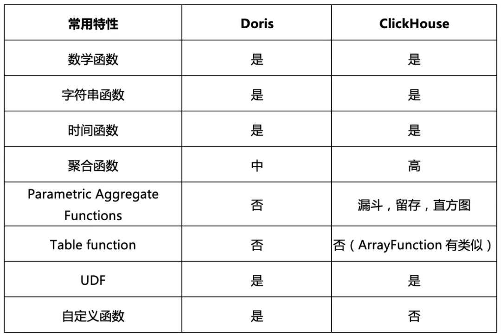

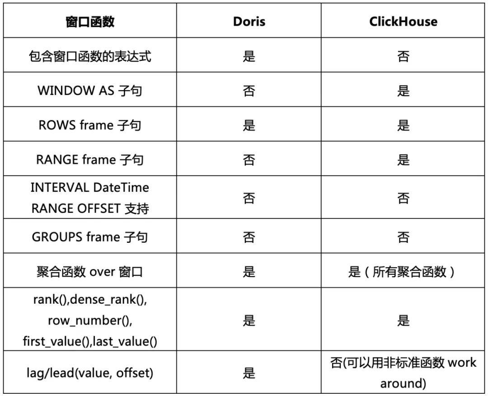

### 3.6 使用成本
#### 3.6.1 使用成本
Doris使用成本低，是一个强一致性元数据的系统，导数功能较为完备，查询SQL的标准兼容好无需额外的工作，弹性伸缩能力要好，而ClickHouse则需要做较多工作：
* ZooKeeper存在性能瓶颈导致集群规模不能特别大
* 基本无法做到弹性伸缩，纯手工扩缩容工作量巨大且容易出错
* 故障节点的容忍度较低，出现一个节点故障会引发某些操作失败
* 导数需要外部保证数据不重不丢，导数失败需要删了重导
* 元数据需要自己保证各个节点一致性，偶发性的不一致情况较多
* 分布式表和本地表有两套表结构，较多用户难以理解
* 多表Join SQL需要改写和优化，方言较多几乎是不兼容其他引擎的SQL

所以，在大规模实施ClickHouse时，需要研发一个比较好用的运维系统的支持，处理大部分的日常运维工作。

#### 3.6.2 代码框架
Doris整体架构分为FrontEnd和BackEnd，FE由Java编写，BE是C/C++，通信部分是BRPC。FE中包含了元数据、SQL Parser、Optimizer、Planner和Coodinator几个部分，BE中包含写入、存储、索引和查询执行部分。Doris的代码风格整体质量是比较高的，风格统一，有较为完善的单测用例，如果要在Doris上做二次开发，则需要熟悉Java或C++。

ClickHouse包含ClickHouse Client/Copier/Server这几个比较主要的模块，其中Client是日常使用的命令行客户端，Copier是数据迁移工具，Server是集群核心服务。Server部分包含Parser、Interpreter、Storage、Database、Function等模块。代码整体上是C++11以上的风格，大量使用Poco库，大量使用较新的语言特性。

因此ClickHouse对二次开发更加友好，技术栈单一，且测试框架完善，模块间互相依赖关系相对较小。

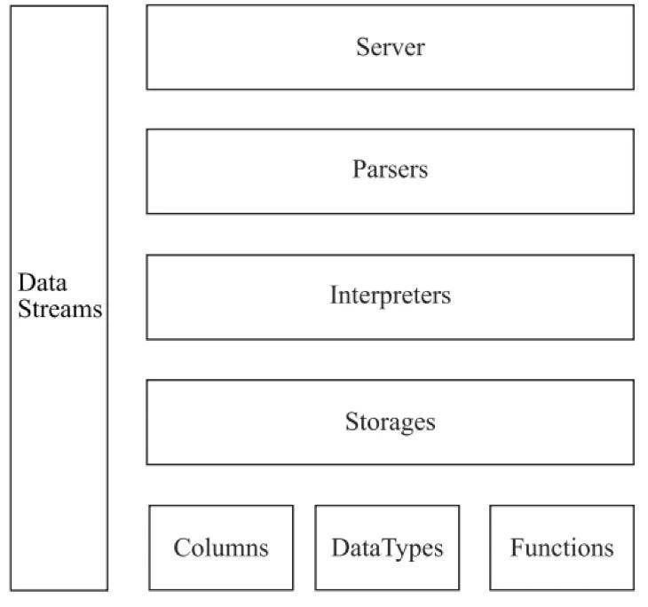

## 4 性能测试
TPC-DS测试是大数据领域比较常用的一个测试，24张表、99个SQL，可以生成不同容量的数据，京东内部常用来做不同引擎的对比测试。
* 这两个引擎都无法全部支持99个SQL，不支持的部分我们根据各个引擎不同特点，进行手工SQL改写让其能正确执行，Doris改动量较小，ClickHouse的多表关联几乎都要改写；
* 为了简化测试过程，我们挑选了9个关联查询的SQL，然后自己构造了9个单表查询的SQL，共18个SQL来测试性能；

### 4.1 举个例子
如下是一个典型的多表关联例子，在Doris中不需要做改动，但是在ClickHouse中，需要改为多个Global Inner Join来执行， ClickHouse的多表关联查询一般都需要改写。

```sql
--Doris/DorisDB SQL 1

select i_item_id, avg(cs_quantity) agg1, avg(cs_list_price) agg2, avg(cs_coupon_amt) agg3, avg(cs_sales_price) agg4

from catalog_sales, customer_demographics, date_dim, item, promotion

where cs_sold_date_sk = d_date_sk and

cs_item_sk = i_item_sk and

cs_bill_cdemo_sk = cd_demo_sk and

cs_promo_sk = p_promo_sk and

cd_gender = 'M' and

cd_marital_status = 'D' and

cd_education_status = 'Advanced Degree' and

(p_channel_email = 'N' or p_channel_event = 'N') and d_year = 1998

group by i_item_id order by i_item_id limit 10;

--ClickHouse SQL 1

select i_item_id, avg(cs_quantity) agg1, avg(cs_list_price) agg2, avg(cs_coupon_amt) agg3, avg(cs_sales_price) agg4 from catalog_sales_dist

global inner join (select cd_demo_sk from customer_demographics_dist where cd_gender = 'M' and cd_marital_status = 'D' and cd_education_status = 'Advanced Degree' )

on cs_bill_cdemo_sk = cd_demo_sk

global inner join (select d_date_sk from date_dim_dist where d_year = 1998 ) on cs_sold_date_sk = d_date_sk

global inner join ( select i_item_sk, i_item_id from item_dist ) on cs_item_sk = i_item_sk

global inner join ( select p_promo_sk from promotion_dist where p_channel_email = 'N' or p_channel_event = 'N') on cs_promo_sk = p_promo_sk

group by i_item_id order by i_item_id limit 10;
```

### 4.2 测试环境
* 硬件：3台32核/128G内存/HDD磁盘的服务器
* 软件：Doris 0.13.1、ClickHouse 21.3.13.1
* 配置：3个分片1副本，都是默认配置

### 4.3 测试总结
单表性能ClickHouse更好，无论是查询延时还是并发能力
多表性能Doris优势更明显，特别是复杂Join和大表Join大表的场景，另外ClickHouse需要改写SQL有一些工作量

### 4.4 单表延时和并发
单表的SQL都比较简单，大部分是全表分组group by之后avg/sum/count/count distinct的各种聚合，单表查询时间如下，可以看出整体上ClickHouse要明显好一些，同时，为了压测方便我们找了2个延时低的SQL Single4和Single5测试了一下不同并发下的QPS，发现也是ClickHouse更优一些。

ClickHouse的单表性能好，得益于向量化执行引擎，在数据密集情况下，利用内存的PageCache和CPU的L2 Cache可以大大加速查询过程。

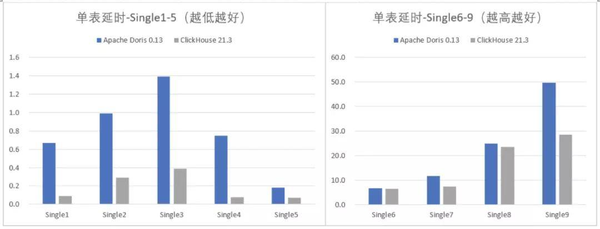

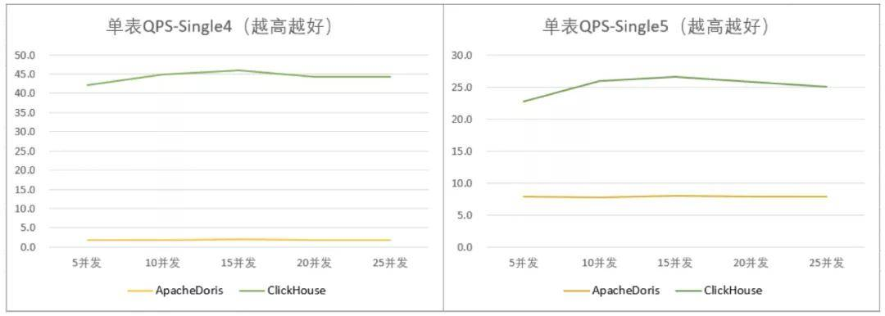

### 4.5 Join的延时和并发

从多表测试来看，Doris在Join6、Join7、Join8、Join9要好一些，Join3两者差不多，其他情况ClickHouse好一些。同样，我们挑选了2个延时低的SQL Join8和Join9做了一下并发测试，并发的测试结果和延时表现比较匹配，延时低的SQL测试并发时QPS同样高。

Doris多表关联有四种Join方式，BroadCast Join，Shuffle Join/Bucket Shuffle Join和Colocation Join，ClickHouse只有Global Join（就是BroadCast Join）和Local Join（对应Colocation Join），因此在大表Join大表时，要把右表广播到所有节点，性能可想而知。

Doris的执行计划对SQL进行了较多的优化，因此多表关联中的大部分情况，能找到最优的执行方式，因此多表关联性能较好一些，但是也并不是所有的关联SQL都要好。

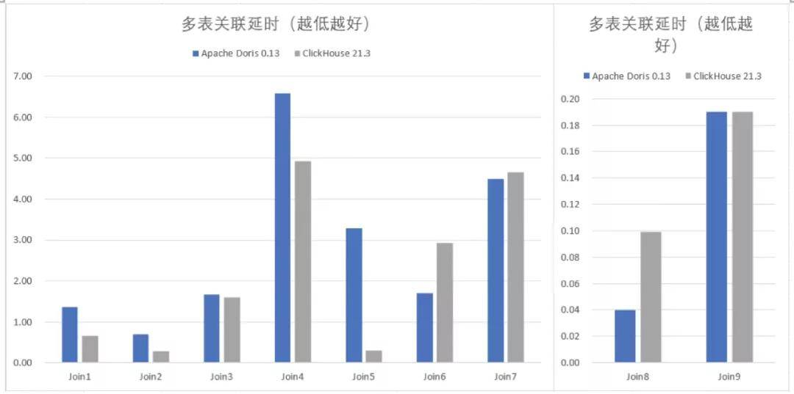

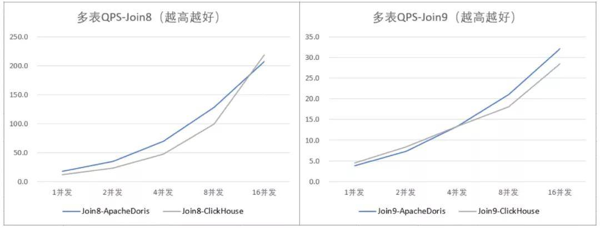

### 4.6 ClickHouse小表不同数据量下延时

通过上面的测试，大家肯定有疑问，不是说ClickHouse的Join性能不行么，为什么表现并不差呢？因此，贴一个去年做的一组ClickHouse大小表的测试供大家参考，就是用一个大表关联查询不同数据规模的小表，看Join性能情况怎么样。横轴是指小表的不同数据量，纵轴是执行时间。可以看出，因为Join机制不一样，ClickHouse的延时随小表数据量加大梯度更大，ClickHouse小表数据量1000万以内尚可，超过1000万性能比就比较差了。

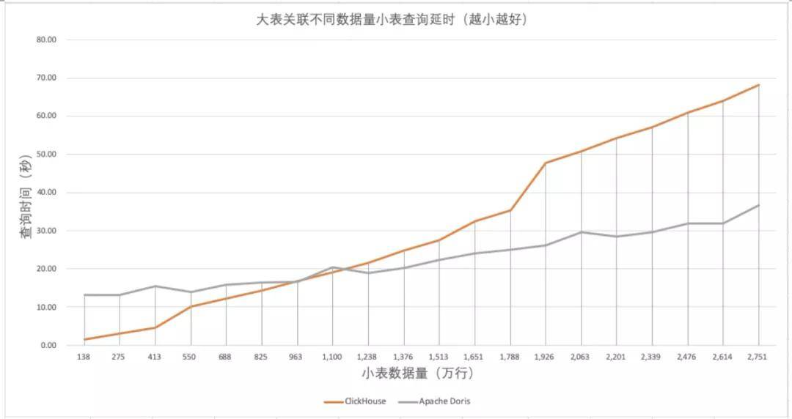

## 5 对比表格
上面的对比，是从大的几个方面来进行的，下面是比较详细的对比，绿色指我们觉得比较占优的部分。

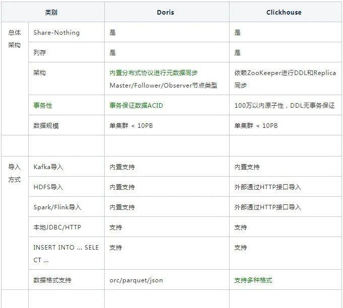

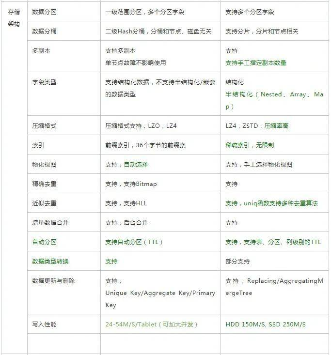

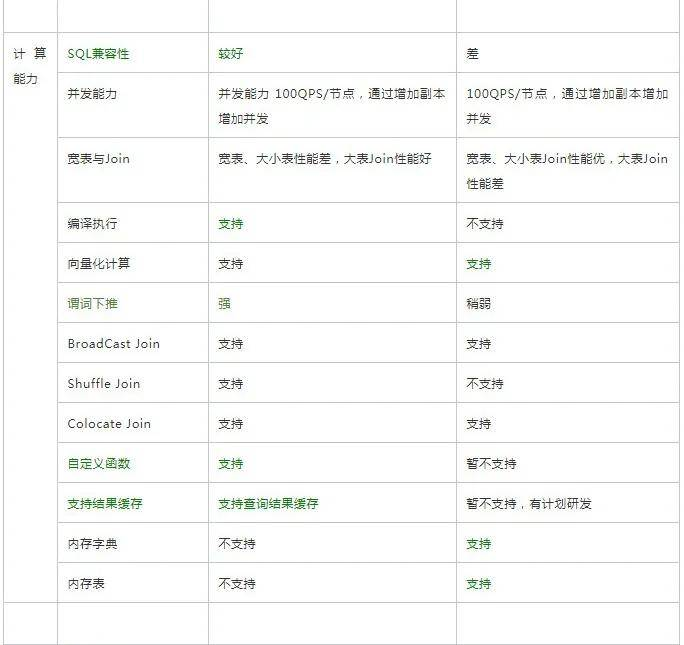

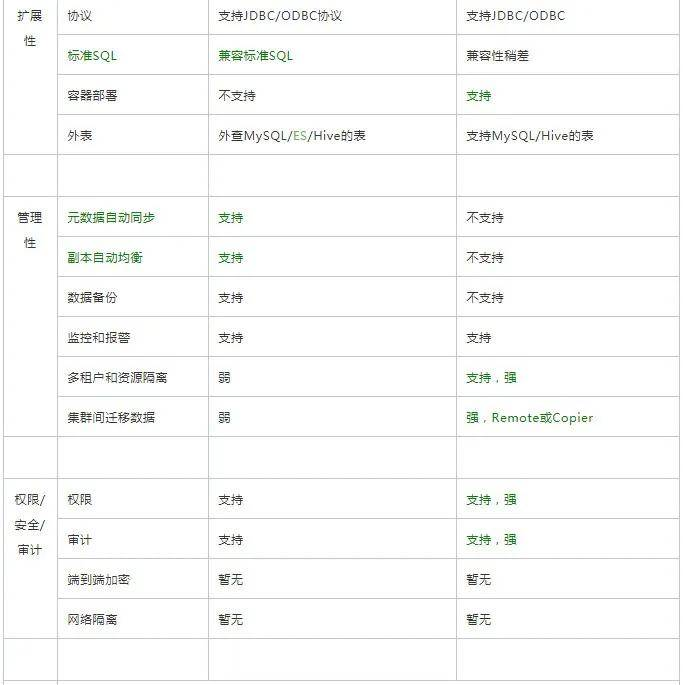

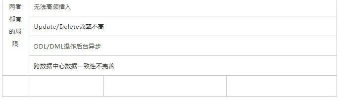

## 6 未来规划展望
Apache Doris从测试和使用的过程中看，性能非常不错，能满足京东在OLAP场景上的需求，后续会逐步上线到更多业务中使用，同时我们也会积极参与到Apache Doris开源社区建设中来，凭借京东在OLAP领域深厚的技术积累和实践经验，一起把Apache Doris这个项目发展成全球领先的分析型数据库项目。

ClickHouse在京东也有大规模的使用，在一些极端场景下表现非常出色，零事故支撑了数次大促，京东OLAP团队也在高可用方面有很多心得，自研了基于Raft的分布式元数据管理服务、在线扩缩容提升弹性能力和强大的管控面降低运维复杂度，未来会在云原生的OLAP方面继续努力，把ClickHouse打造为有京东特色的OLAP引擎。