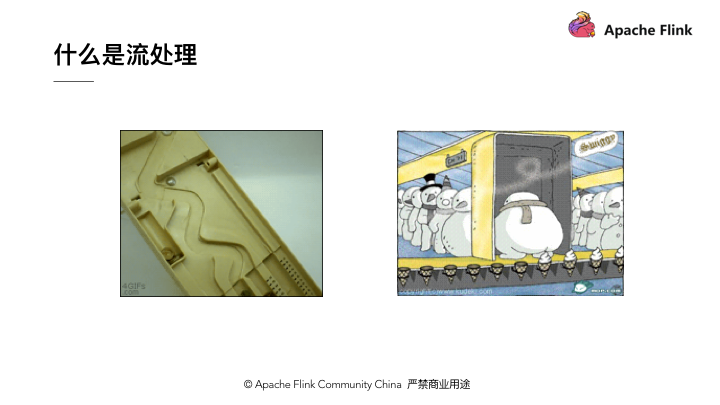
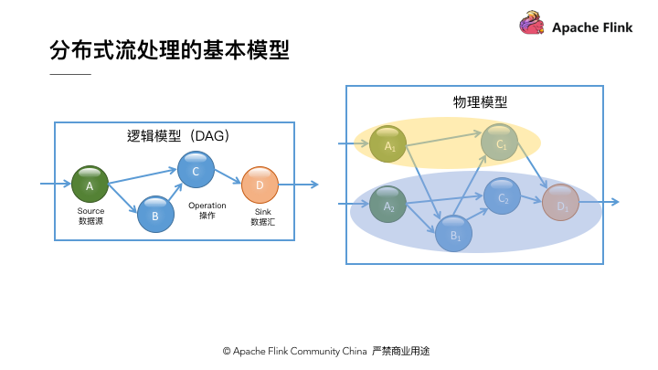
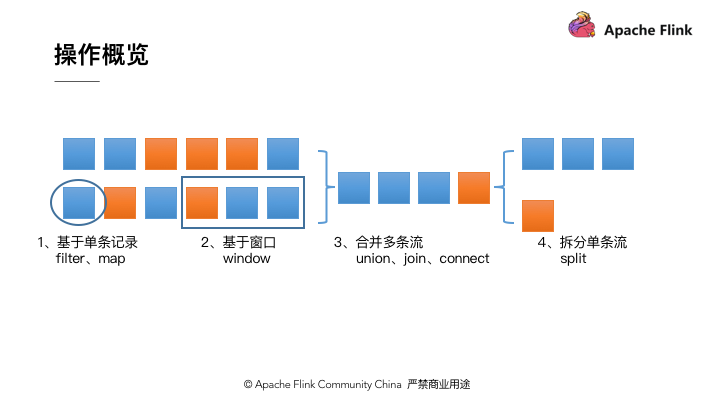
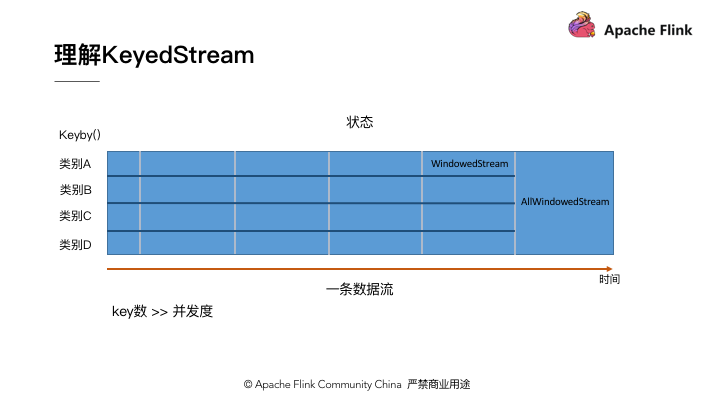
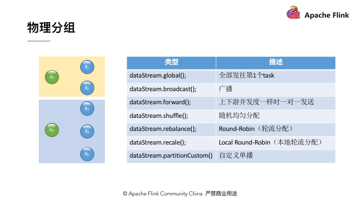
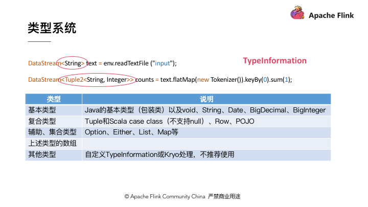
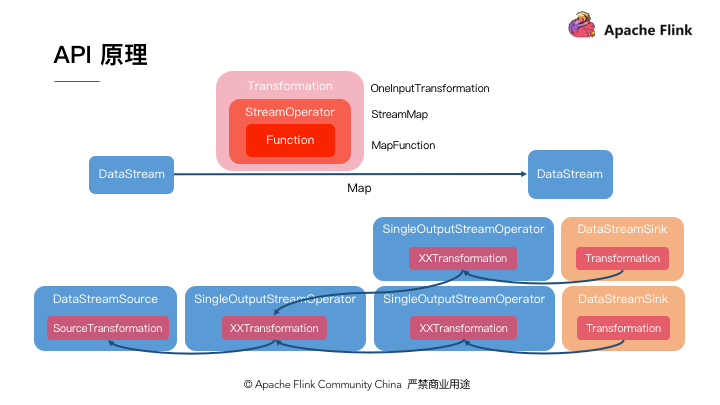

# 1. 流处理基本概念

对于什么是流处理，从不同的角度有不同的定义。其实流处理与批处理这两个概念是对立统一的，它们的关系有点类似于对于 Java 中的 ArrayList 中的元素，是直接看作一个有限数据集并用下标去访问，还是用迭代器去访问。



流处理系统本身有很多自己的特点。一般来说，由于需要支持无限数据集的处理，流处理系统一般采用一种数据驱动的处理方式。它会提前设置一些算子，然后等到数据到达后对数据进行处理。为了表达复杂的计算逻辑，包括 Flink 在内的分布式流处理引擎一般采用 DAG 图来表示整个计算逻辑，其中 DAG 图中的每一个点就代表一个基本的逻辑单元，也就是前面说的算子。由于计算逻辑被组织成有向图，数据会按照边的方向，从一些特殊的 Source 节点流入系统，然后通过网络传输、本地传输等不同的数据传输方式在算子之间进行发送和处理，最后会通过另外一些特殊的 Sink 节点将计算结果发送到某个外部系统或数据库中。



对于实际的分布式流处理引擎，它们的实际运行时物理模型要更复杂一些，这是由于每个算子都可能有多个实例。如图 2 所示，作为 Source 的 A 算子有两个实例，中间算子 C 也有两个实例。在逻辑模型中，A 和 B 是 C 的上游节点，而在对应的物理逻辑中，C 的所有实例和 A、B 的所有实例之间可能都存在数据交换。在物理模型中，我们会根据计算逻辑，采用系统自动优化或人为指定的方式将计算工作分布到不同的实例中。只有当算子实例分布到不同进程上时，才需要通过网络进行数据传输，而同一进程中的多个实例之间的数据传输通常是不需要通过网络的。

```java
# 示例1. Apache Storm 构造 DAG 计算图。Apache Storm 的接口定义更加“面向操作”，因此更加底层。 
TopologyBuilder builder = new TopologyBuilder(); 
builder.setSpout("spout", new RandomSentenceSpout(), 5); 
builder.setBolt("split", new SplitSentence(), 8).shuffleGrouping("spout"); 
builder.setBolt("count", new WordCount(), 12).fieldsGrouping("split", new Fields("word")); 
# 示例2. Apache Flink 构造 DAG 计算图。Apache Flink 的接口定义更加“面向数据”，因此更加高层。 StreamExecutionEnvironment env = StreamExecutionEnvironment.getExecutionEnvironment(); 
DataStream<String> text = env.readTextFile ("input"); 
DataStream<Tuple2<String, Integer>> counts = text.flatMap(new Tokenizer()).keyBy(0).sum(1); 
counts.writeAsText("output");
```

由于流处理的计算逻辑是通过 DAG 图来表示的，因此它们的大部分 API 都是围绕构建这种计算逻辑图来设计的。例如，对于几年前非常流行的 Apache Storm，它的 Word Count 的示例如表 1 所示。基于 Apache Storm 用户需要在图中添加 Spout 或 Bolt 这种算子，并指定算子之前的连接方式。这样，在完成整个图的构建之后，就可以将图提交到远程或本地集群运行。

与之对比，Apache Flink 的接口虽然也是在构建计算逻辑图，但是 Flink 的 API 定义更加面向数据本身的处理逻辑，它把数据流抽象成为一个无限集，然后定义了一组集合上的操作，然后在底层自动构建相应的 DAG 图。可以看出，Flink 的 API 要更“上层”一些。许多研究者在进行实验时，可能会更喜欢自由度高的 Storm，因为它更容易保证实现预想的图结构；而在工业界则更喜欢 Flink 这类高级 API，因为它使用更加简单。

# 2. Flink DataStream API 概览

基于前面对流处理的基本概念，本节将详细介绍 Flink DataStream API 的使用方式。我们首先还是从一个简单的例子开始看起。表3是一个流式 Word Count 的示例，虽然它只有 5 行代码，但是它给出了基于 Flink DataStream API 开发程序的基本结构。

```java
//1、设置运行环境 
StreamExecutionEnvironment env = StreamExecutionEnvironment.getExecutionEnvironment(); 
//2、配置数据源读取数据 
DataStream<String> text = env.readTextFile ("input"); 
//3、进行一系列转换 
DataStream<Tuple2<String, Integer>> counts = text.flatMap(new Tokenizer()).keyBy(0).sum(1); 
//4、配置数据汇写出数据 
counts.writeAsText("output"); 
//5、提交执行 
env.execute("Streaming WordCount");
```

为了实现流式 Word Count，我们首先要先获得一个 StreamExecutionEnvironment 对象。它是我们构建图过程中的上下文对象。基于这个对象，我们可以添加一些算子。对于流处理程度，我们一般需要首先创建一个数据源去接入数据。在这个例子中，我们使用了 Environment 对象中内置的读取文件的数据源。这一步之后，我们拿到的是一个 DataStream 对象，它可以看作一个无限的数据集，可以在该集合上进行一序列的操作。例如，在 Word Count 例子中，我们首先将每一条记录（即文件中的一行）分隔为单词，这是通过 FlatMap 操作来实现的。调用 FlatMap 将会在底层的 DAG 图中添加一个 FlatMap 算子。然后，我们得到了一个记录是单词的流。我们将流中的单词进行分组（keyBy），然后累积计算每一个单词的数据（sum(1)）。计算出的单词的数据组成了一个新的流，我们将它写入到输出文件中。

最后，我们需要调用 env#execute 方法来开始程序的执行。需要强调的是，前面我们调用的所有方法，都不是在实际处理数据，而是在构通表达计算逻辑的 DAG 图。只有当我们将整个图构建完成并显式的调用 Execute 方法后，框架才会把计算图提供到集群中，接入数据并执行实际的逻辑。

基于流式 Word Count 的例子可以看出，基于 Flink 的 DataStream API 来编写流处理程序一般需要三步：通过 Source 接入数据、进行一系统列的处理以及将数据写出。最后，不要忘记显式调用 Execute 方式，否则前面编写的逻辑并不会真正执行。



从上面的例子中还可以看出，Flink DataStream API 的核心，就是代表流数据的 DataStream 对象。整个计算逻辑图的构建就是围绕调用 DataStream 对象上的不同操作产生新的 DataStream 对象展开的。整体来说，DataStream 上的操作可以分为四类。第一类是对于单条记录的操作，比如筛除掉不符合要求的记录（Filter 操作），或者将每条记录都做一个转换（Map 操作）。第二类是对多条记录的操作。比如说统计一个小时内的订单总成交量，就需要将一个小时内的所有订单记录的成交量加到一起。为了支持这种类型的操作，就得通过 Window 将需要的记录关联到一起进行处理。第三类是对多个流进行操作并转换为单个流。例如，多个流可以通过 Union、Join 或 Connect 等操作合到一起。这些操作合并的逻辑不同，但是它们最终都会产生了一个新的统一的流，从而可以进行一些跨流的操作。最后， DataStream 还支持与合并对称的操作，即把一个流按一定规则拆分为多个流（Split 操作），每个流是之前流的一个子集，这样我们就可以对不同的流作不同的处理。


为了支持这些不同的流操作，Flink 引入了一组不同的流类型，用来表示某些操作的中间流数据集类型。完整的类型转换关系如图4所示。首先，对于一些针对单条记录的操作，如 Map 等，操作的结果仍然是是基本的 DataStream 类型。然后，对于 Split 操作，它会首先产生一个 SplitStream，基于 SplitStream 可以使用 Select 方法来筛选出符合要求的记录并再将得到一个基本的流。

类似的，对于 Connect 操作，在调用 streamA.connect(streamB)后可以得到一个专门的 ConnectedStream。ConnectedStream 支持的操作与普通的 DataStream 有所区别，由于它代表两个不同的流混合的结果，因此它允许用户对两个流中的记录分别指定不同的处理逻辑，然后它们的处理结果形成一个新的 DataStream 流。由于不同记录的处理是在同一个算子中进行的，因此它们在处理时可以方便的共享一些状态信息。上层的一些 Join 操作，在底层也是需要依赖于 Connect 操作来实现的。

另外，如前所述，我们可以通过 Window 操作对流可以按时间或者个数进行一些切分，从而将流切分成一个个较小的分组。具体的切分逻辑可以由用户进行选择。当一个分组中所有记录都到达后，用户可以拿到该分组中的所有记录，从而可以进行一些遍历或者累加操作。这样，对每个分组的处理都可以得到一组输出数据，这些输出数据形成了一个新的基本流。

对于普通的 DataStream，我们必须使用 allWindow 操作，它代表对整个流进行统一的 Window 处理，因此是不能使用多个算子实例进行同时计算的。针对这一问题，就需要我们首先使用 KeyBy 方法对记录按 Key 进行分组，然后才可以并行的对不同 Key 对应的记录进行单独的 Window 操作。KeyBy 操作是我们日常编程中最重要的操作之一，下面我们会更详细的介绍。



基本 DataStream 对象上的 allWindow 与 KeyedStream 上的 Window 操作的对比如图5所示。为了能够在多个并发实例上并行的对数据进行处理，我们需要通过 KeyBy 将数据进行分组。KeyBy 和 Window 操作都是对数据进行分组，但是 KeyBy 是在水平分向对流进行切分，而 Window 是在垂直方式对流进行切分。

使用 KeyBy 进行数据切分之后，后续算子的每一个实例可以只处理特定 Key 集合对应的数据。除了处理本身外，Flink 中允许算子维护一部分状态（State），在KeyedStream 算子的状态也是可以分布式存储的。由于 KeyBy 是一种确定的数据分配方式（下文将介绍其它分配方式），因此即使发生 Failover 作业重启，甚至发生了并发度的改变，Flink 都可以重新分配 Key 分组并保证处理某个 Key 的分组一定包含该 Key 的状态，从而保证一致性。

最后需要强调的是，KeyBy 操作只有当 Key 的数量超过算子的并发实例数才可以较好的工作。由于同一个 Key 对应的所有数据都会发送到同一个实例上，因此如果Key 的数量比实例数量少时，就会导致部分实例收不到数据，从而导致计算能力不能充分发挥。

# 3. 其它问题

除 KeyBy 之外，Flink 在算子之前交换数据时还支持其它的物理分组方式。如图 1 所示，Flink DataStream 中物理分组方式包括：

- Global: 上游算子将所有记录发送给下游算子的第一个实例。

- Broadcast: 上游算子将每一条记录发送给下游算子的所有实例。

- Forward：只适用于上游算子实例数与下游算子相同时，每个上游算子实例将记录发送给下游算子对应的实例。

- Shuffle：上游算子对每条记录随机选择一个下游算子进行发送。

- Rebalance：上游算子通过轮询的方式发送数据。

- Rescale：当上游和下游算子的实例数为 n 或 m 时，如果 n < m，则每个上游实例向ceil(m/n)或floor(m/n)个下游实例轮询发送数据；如果 n > m，则 floor(n/m) 或 ceil(n/m) 个上游实例向下游实例轮询发送数据。

- PartitionCustomer：当上述内置分配方式不满足需求时，用户还可以选择自定义分组方式。



除分组方式外，Flink DataStream API 中另一个重要概念就是类型系统。图 7 所示，Flink DataStream 对像都是强类型的，每一个 DataStream 对象都需要指定元素的类型，Flink 自己底层的序列化机制正是依赖于这些信息对序列化等进行优化。具体来说，在 Flink 底层，它是使用 TypeInformation 对象对类型进行描述的，TypeInformation 对象定义了一组类型相关的信息供序列化框架使用。



Flink 内置了一部分常用的基本类型，对于这些类型，Flink 也内置了它们的TypeInformation，用户一般可以直接使用而不需要额外的声明，Flink 自己可以通过类型推断机制识别出相应的类型。但是也会有一些例外的情况，比如，Flink DataStream API 同时支持 Java 和 Scala，Scala API 许多接口是通过隐式的参数来传递类型信息的，所以如果需要通过 Java 调用 Scala 的 API，则需要把这些类型信息通过隐式参数传递过去。另一个例子是 Java 中对泛型存在类型擦除，如果流的类型本身是一个泛型的话，则可能在擦除之后无法推断出类型信息，这时候也需要显式的指定。

在 Flink 中，一般 Java 接口采用 Tuple 类型来组合多个字段，而 Scala 则更经常使用 Row 类型或 Case Class。相对于 Row，Tuple 类型存在两个问题，一个是字段个数不能超过 25 个，此外，所有字段不允许有 null 值。最后，Flink 也支持用户自定义新的类型和 TypeInformation，并通过 Kryo 来实现序列化，但是这种方式可带来一些迁移等方面的问题，所以尽量不要使用自定义的类型。

# 4. 示例

然后，我们再看一个更复杂的例子。假设我们有一个数据源，它监控系统中订单的情况，当有新订单时，它使用 Tuple2<String, Integer> 输出订单中商品的类型和交易额。然后，我们希望实时统计每个类别的交易额，以及实时统计全部类别的交易额。

```java
public class GroupedProcessingTimeWindowSample {
    private static class DataSource extends RichParallelSourceFunction<Tuple2<String, Integer>> {
        private volatile boolean isRunning = true;
        @Override
        public void run(SourceContext<Tuple2<String, Integer>> ctx) throws Exception {
            Random random = new Random();
            while (isRunning) {
                Thread.sleep((getRuntimeContext().getIndexOfThisSubtask() + 1) * 1000 * 5);
                String key = "类别" + (char) ('A' + random.nextInt(3));
                int value = random.nextInt(10) + 1;
                System.out.println(String.format("Emits\t(%s, %d)", key, value));
                ctx.collect(new Tuple2<>(key, value));
            }
        }
        @Override
        public void cancel() {
            isRunning = false;
        }
    }
    public static void main(String[] args) throws Exception {
        StreamExecutionEnvironment env = StreamExecutionEnvironment.getExecutionEnvironment();
        env.setParallelism(2);
        DataStream<Tuple2<String, Integer>> ds = env.addSource(new DataSource());
        KeyedStream<Tuple2<String, Integer>, Tuple> keyedStream = ds.keyBy(0);
        keyedStream.sum(1).keyBy(new KeySelector<Tuple2<String, Integer>, Object>() {
            @Override
            public Object getKey(Tuple2<String, Integer> stringIntegerTuple2) throws Exception {
                return "";
            }
        }).fold(new HashMap<String, Integer>(), new FoldFunction<Tuple2<String, Integer>, HashMap<String, Integer>>() {
            @Override
            public HashMap<String, Integer> fold(HashMap<String, Integer> accumulator, Tuple2<String, Integer> value) throws Exception {
                accumulator.put(value.f0, value.f1);
                return accumulator;
            }
        }).addSink(new SinkFunction<HashMap<String, Integer>>() {
            @Override
            public void invoke(HashMap<String, Integer> value, Context context) throws Exception {
                  // 每个类型的商品成交量
                  System.out.println(value);
                  // 商品成交总量                
                  System.out.println(value.values().stream().mapToInt(v -> v).sum());
            }
        });
        env.execute();
    }
}
```

示例的实现如表4所示。首先，在该实现中，我们首先实现了一个模拟的数据源，它继承自 RichParallelSourceFunction，它是可以有多个实例的 SourceFunction 的接口。它有两个方法需要实现，一个是 Run 方法，Flink 在运行时对 Source 会直接调用该方法，该方法需要不断的输出数据，从而形成初始的流。在 Run 方法的实现中，我们随机的产生商品类别和交易量的记录，然后通过 ctx#collect 方法进行发送。另一个方法是 Cancel 方法，当 Flink 需要 Cancel Source Task 的时候会调用该方法，我们使用一个 Volatile 类型的变量来标记和控制执行的状态。

然后，我们在 Main 方法中就可以开始图的构建。我们首先创建了一个 StreamExecutioniEnviroment 对象。创建对象调用的 getExecutionEnvironment 方法会自动判断所处的环境，从而创建合适的对象。例如，如果我们在 IDE 中直接右键运行，则会创建 LocalStreamExecutionEnvironment 对象；如果是在一个实际的环境中，则会创建 RemoteStreamExecutionEnvironment 对象。

基于 Environment 对象，我们首先创建了一个 Source，从而得到初始的<商品类型，成交量>流。然后，为了统计每种类别的成交量，我们使用 KeyBy 按 Tuple 的第 1 个字段（即商品类型）对输入流进行分组，并对每一个 Key 对应的记录的第 2 个字段（即成交量）进行求合。在底层，Sum 算子内部会使用 State 来维护每个Key（即商品类型）对应的成交量之和。当有新记录到达时，Sum 算子内部会更新所维护的成交量之和，并输出一条<商品类型，更新后的成交量>记录。

如果只统计各个类型的成交量，则程序可以到此为止，我们可以直接在 Sum 后添加一个 Sink 算子对不断更新的各类型成交量进行输出。但是，我们还需要统计所有类型的总成交量。为了做到这一点，我们需要将所有记录输出到同一个计算节点的实例上。我们可以通过 KeyBy 并且对所有记录返回同一个 Key，将所有记录分到同一个组中，从而可以全部发送到同一个实例上。

然后，我们使用 Fold 方法来在算子中维护每种类型商品的成交量。注意虽然目前 Fold 方法已经被标记为 Deprecated，但是在 DataStream API 中暂时还没有能替代它的其它操作，所以我们仍然使用 Fold 方法。这一方法接收一个初始值，然后当后续流中每条记录到达的时候，算子会调用所传递的 FoldFunction 对初始值进行更新，并发送更新后的值。我们使用一个 HashMap 来对各个类别的当前成交量进行维护，当有一条新的<商品类别，成交量>到达时，我们就更新该 HashMap。这样在 Sink 中，我们收到的是最新的商品类别和成交量的 HashMap，我们可以依赖这个值来输出各个商品的成交量和总的成交量。

需要指出的是，这个例子主要是用来演示 DataStream API 的用法，实际上还会有更高效的写法，此外，更上层的 Table / SQL 还支持 Retraction 机制，可以更好的处理这种情况。



最后，我们对 DataStream API 的原理进行简要的介绍。当我们调用 DataStream#map 算法时，Flink 在底层会创建一个 Transformation 对象，这一对象就代表我们计算逻辑图中的节点。它其中就记录了我们传入的 MapFunction，也就是 UDF（User Define Function）。随着我们调用更多的方法，我们创建了更多的 DataStream 对象，每个对象在内部都有一个 Transformation 对象，这些对象根据计算依赖关系组成一个图结构，就是我们的计算图。后续 Flink 将对这个图结构进行进一步的转换，从而最终生成提交作业所需要的 JobGraph。

# 5. 总结

本文主要介绍了 Flink DataStream API，它是当前 Flink 中比较底层的一套 API。在实际的开发中，基于该 API 需要用户自己处理 State 与 Time 等一些概念，因此需要较大的工作量。后续课程还会介绍更上层的 Table / SQL 层的 API，未来 Table / SQL 可能会成为 Flink 主流的 API，但是对于接口来说，越底层的接口表达能力越强，在一些需要精细操作的情况下，仍然需要依赖于 DataStream API。