# 一、Window & Time 介绍

Apache Flink（以下简称 Flink） 是一个天然支持无限流数据处理的分布式计算框架，在 Flink 中 Window 可以将无限流切分成有限流，是处理有限流的核心组件，现在 Flink 中 Window 可以是时间驱动的（Time Window），也可以是数据驱动的（Count Window）。

下面的代码是在 Flink 中使用 Window 的两个示例

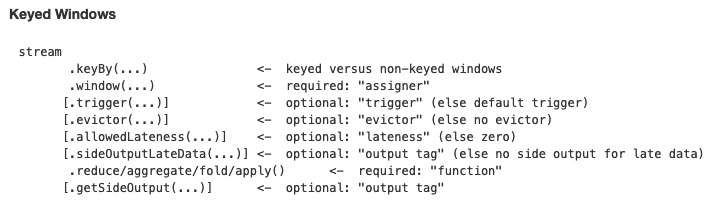

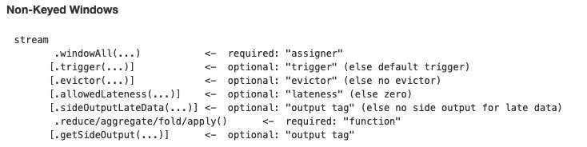

# 二、Window API 使用

从第一部分我们已经知道 Window 的一些基本概念，以及相关 API，下面我们以一个实际例子来看看怎么使用 Window 相关的 API。

代码来自 flink-examples

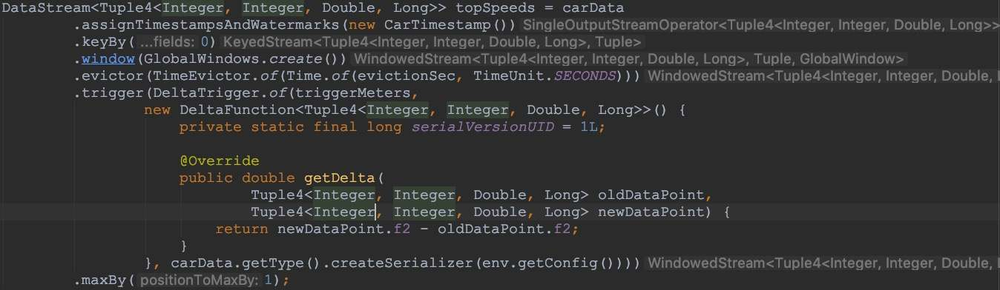

上面的例子中我们首先会对每条数据进行时间抽取，然后进行 keyby，接着依次调用 window()，evictor(), trigger() 以及 maxBy()。下面我们重点来看 window(), evictor() 和 trigger() 这几个方法。

## 2.1 WindowAssigner, Evictor 以及 Trigger

window 方法接收的输入是一个WindowAssigner， WindowAssigner 负责将每条输入的数据分发到正确的 window 中（一条数据可能同时分发到多个 Window 中），Flink 提供了几种通用的 WindowAssigner：tumbling window(窗口间的元素无重复），sliding window（窗口间的元素可能重复），session window 以及 global window。如果需要自己定制数据分发策略，则可以实现一个 class，继承自 WindowAssigner。

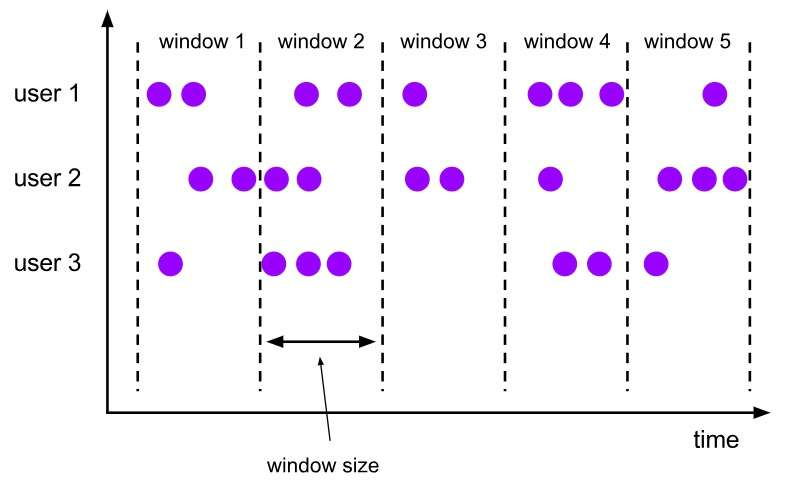

### Tumbling Window

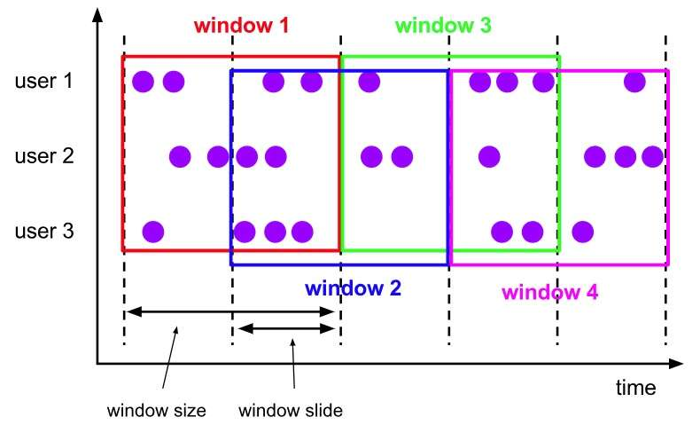

### Sliding Window

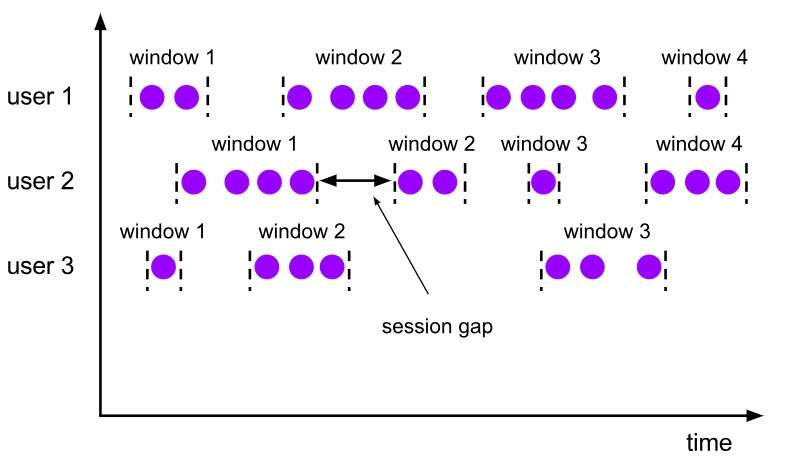

### Session Window

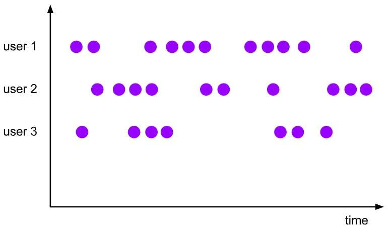

### Global Window

evictor 主要用于做一些数据的自定义操作，可以在执行用户代码之前，也可以在执行用户代码之后，更详细的描述可以参考 org.apache.flink.streaming.api.windowing.evictors.Evictor 的 evicBefore 和 evicAfter 两个方法。Flink 提供了如下三种通用的 evictor：

- CountEvictor 保留指定数量的元素

- DeltaEvictor 通过执行用户给定的 DeltaFunction 以及预设的 threshold，判断是否删除一个元素。

- TimeEvictor设定一个阈值 interval，删除所有不再 max_ts – interval 范围内的元素，其中 max_ts 是窗口内时间戳的最大值。

evictor 是可选的方法，如果用户不选择，则默认没有。

trigger 用来判断一个窗口是否需要被触发，每个 WindowAssigner 都自带一个默认的 trigger，如果默认的 trigger 不能满足你的需求，则可以自定义一个类，继承自 Trigger 即可，我们详细描述下 Trigger 的接口以及含义：

- onElement() 每次往 window 增加一个元素的时候都会触发

- onEventTime() 当 event-time timer 被触发的时候会调用

- onProcessingTime() 当 processing-time timer 被触发的时候会调用

- onMerge() 对两个 trigger 的 state 进行 merge 操作

- clear() window 销毁的时候被调用

上面的接口中前三个会返回一个 TriggerResult，TriggerResult 有如下几种可能的选择：

- CONTINUE 不做任何事情

- FIRE 触发 window

- PURGE 清空整个 window 的元素并销毁窗口

- FIRE_AND_PURGE 触发窗口，然后销毁窗口

## 2.2 Time & Watermark

了解完上面的内容后，对于时间驱动的窗口，我们还有两个概念需要澄清：Time 和 Watermark。

我们知道在分布式环境中 Time 是一个很重要的概念，在 Flink 中 Time 可以分为三种Event-Time，Processing-Time 以及 Ingestion-Time，三者的关系我们可以从下图中得知：

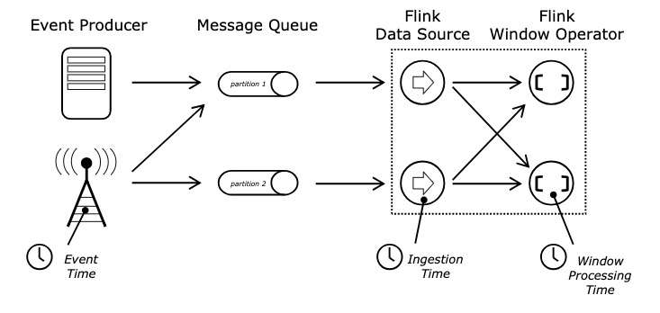

Event Time、Ingestion Time、Processing Time

Event-Time 表示事件发生的时间，Processing-Time 则表示处理消息的时间（墙上时间），Ingestion-Time 表示进入到系统的时间。

在 Flink 中我们可以通过下面的方式进行 Time 类型的设置env.setStreamTimeCharacteristic(TimeCharacteristic.ProcessingTime); // 设置使用 ProcessingTime

了解了 Time 之后，我们还需要知道 Watermark 相关的概念。

我们可以考虑一个这样的例子：某 App 会记录用户的所有点击行为，并回传日志（在网络不好的情况下，先保存在本地，延后回传）。A 用户在 11:02 对 App 进行操作，B 用户在 11:03 操作了 App，但是 A 用户的网络不太稳定，回传日志延迟了，导致我们在服务端先接受到 B 用户 11:03 的消息，然后再接受到 A 用户 11:02 的消息，消息乱序了。

那我们怎么保证基于 event-time 的窗口在销毁的时候，已经处理完了所有的数据呢？这就是 watermark 的功能所在。watermark 会携带一个单调递增的时间戳 t，watermark(t) 表示所有时间戳不大于 t 的数据都已经到来了，未来小于等于t的数据不会再来，因此可以放心地触发和销毁窗口了。下图中给了一个乱序数据流中的 watermark 例子

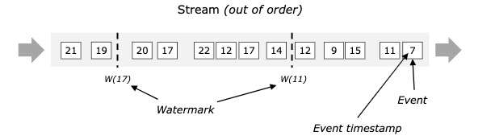

## 2.3 迟到的数据

上面的 watermark 让我们能够应对乱序的数据，但是真实世界中我们没法得到一个完美的 watermark 数值 — 要么没法获取到，要么耗费太大，因此实际工作中我们会使用近似 watermark — 生成 watermark(t) 之后，还有较小的概率接受到时间戳 t 之前的数据，在 Flink 中将这些数据定义为 “late elements”, 同样我们可以在 window 中指定是允许延迟的最大时间（默认为 0），可以使用下面的代码进行设置

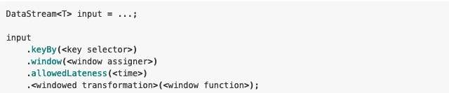

设置 allowedLateness 之后，迟来的数据同样可以触发窗口，进行输出，利用 Flink 的 side output 机制，我们可以获取到这些迟到的数据，使用方式如下：

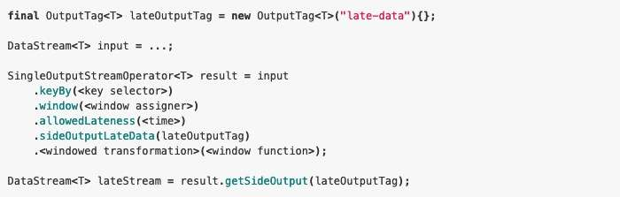

需要注意的是，设置了 allowedLateness 之后，迟到的数据也可能触发窗口，对于 Session window 来说，可能会对窗口进行合并，产生预期外的行为。

# 三、Window 内部实现

在讨论 Window 内部实现的时候，我们再通过下图回顾一下 Window 的生命周期

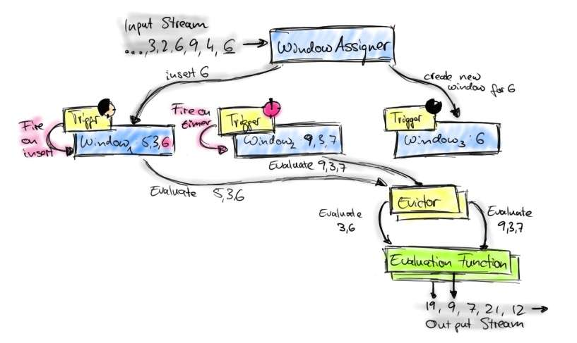

每条数据过来之后，会由 WindowAssigner 分配到对应的 Window，当 Window 被触发之后，会交给 Evictor（如果没有设置 Evictor 则跳过），然后处理 UserFunction。其中 WindowAssigner，Trigger，Evictor 我们都在上面讨论过，而 UserFunction 则是用户编写的代码。

整个流程还有一个问题需要讨论：Window 中的状态存储。我们知道 Flink 是支持 Exactly Once 处理语义的，那么 Window 中的状态存储和普通的状态存储又有什么不一样的地方呢？

首先给出具体的答案：从接口上可以认为没有区别，但是每个 Window 会属于不同的 namespace，而非 Window 场景下，则都属于 VoidNamespace ，最终由 State/Checkpoint 来保证数据的 Exactly Once 语义，下面我们从 org.apache.flink.streaming.runtime.operators.windowing.WindowOperator 摘取一段代码进行阐述

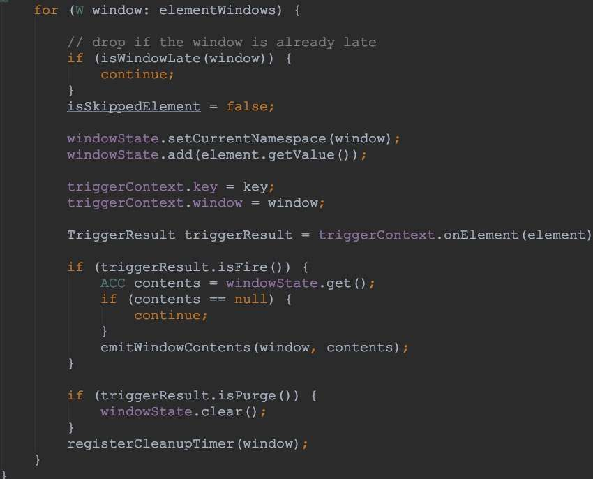

从上面我们可以知道，Window 中的的元素同样是通过 state 进行维护，然后由 Checkpoint 机制保证 Exactly Once 语义。

Time、Window 相关的所有内容都已经讲解完毕，主要包括为什么要有 Window； Window 中的三个核心组件：WindowAssigner、Trigger 和 Evictor；Window 中怎么处理乱序数据，乱序数据是否允许延迟，以及怎么处理迟到的数据；最后我们梳理了整个 Window 的数据流程，以及 Window 中怎么保证 Exactly Once 语义。