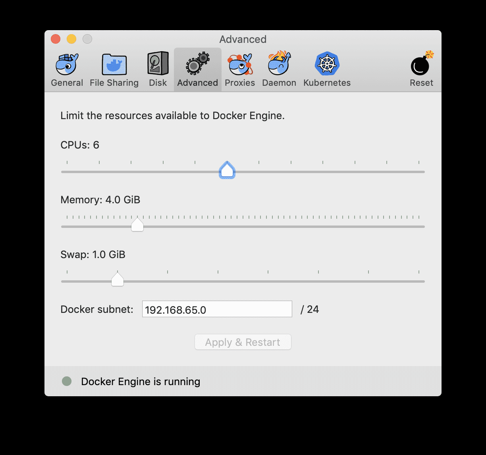
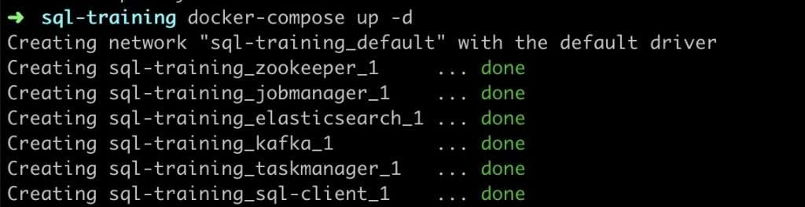
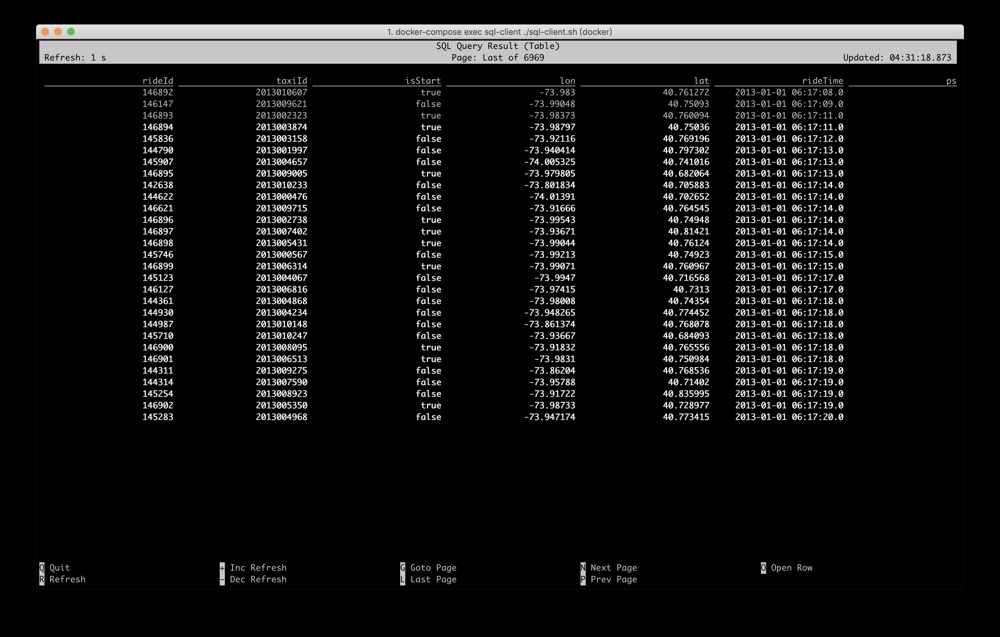
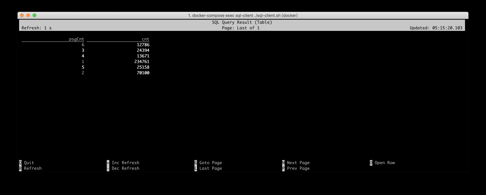
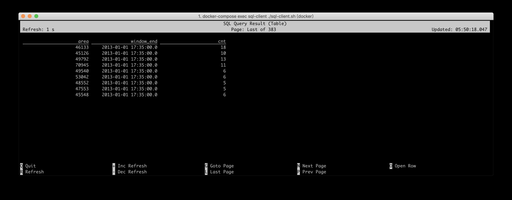
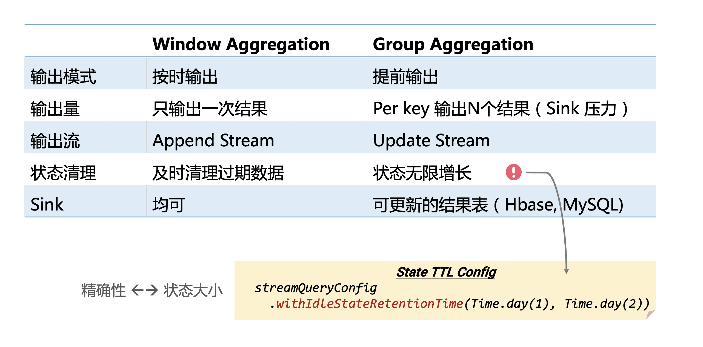
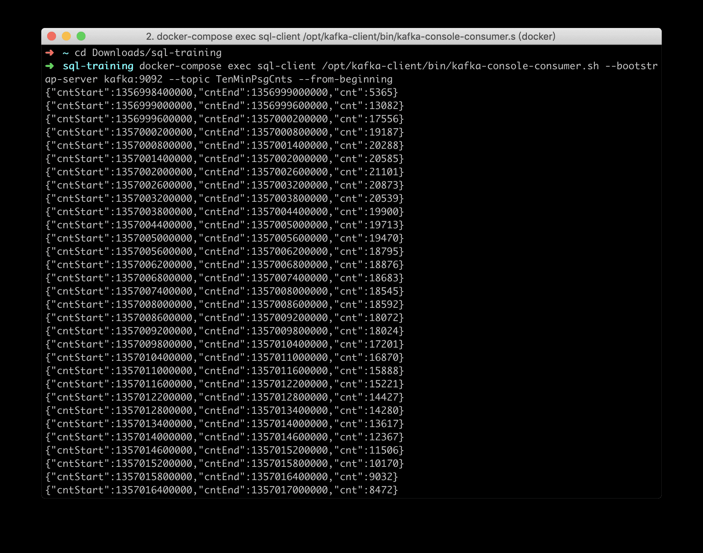

# Apache Flink 零基础入门（9）：Flink SQL 编程实践

## 1 通过本课你能学到什么？

本文将通过五个实例来贯穿 `Flink SQL` 的编程实践，主要会涵盖以下几个方面的内容。

1. 如何使用 `SQL CLI` 客户端

2. 如何在流上运行 `SQL` 查询

3. 运行 `window aggregate` 与 `non-window aggregate` ，理解其区别

4. 如何用 `SQL` 消费 `Kafka` 数据

5. 如何用 `SQL` 将结果写入 `Kafka` 和 `ElasticSearch`

本文假定您已具备基础的 `SQL` 知识。

## 2 环境准备

本文教程是基于 `Docker` 进行的，因此你只需要安装了 `Docker` 即可。不需要依赖 `Java` 、 `Scala` 环境、或是 `IDE` 。

注意： `Docker` 默认配置的资源可能不太够，会导致运行 `Flink Job` 时卡死。因此推荐配置 `Docker` 资源到 `3-4 GB` ， `3-4 CPUs` 。



本次教程的环境使用 `Docker Compose` 来安装，包含了所需的各种服务的容器，包括：

* `Flink SQL Client` ：用来提交 `query` ，以及可视化结果

* `Flink JobManager` 和 `TaskManager` ：用来运行 `Flink SQL` 任务。

* `Apache Kafka` ：用来生成输入流和写入结果流。

* `Apache Zookeeper` ： `Kafka` 的依赖项

* `ElasticSearch` ：用来写入结果

我们已经提供好了 `Docker Compose` 配置文件，可以直接下载 `docker-compose.yml` 文件。

然后打开命令行窗口，进入存放 `docker-compose.yml` 文件的目录，然后运行以下命令：

* `Linux & MacOS`

  ```shell
  docker-compose up -d
  ```

* `Windows`

  ```shell
  set COMPOSE_CONVERT_WINDOWS_PATHS=1
  docker-compose up -d
  ```

`docker-compose` 命令会启动所有所需的容器。第一次运行的时候， `Docker` 会自动地从 `Docker Hub` 下载镜像，这可能会需要一段时间（将近 `2.3GB` ）。之后运行的话，几秒钟就能启动起来了。运行成功的话，会在命令行中看到以下输出，并且也可以在 [http://localhost:8081](http://localhost:8081) 访问到 `Flink Web UI` 。



## 3 运行 Flink SQL CLI 客户端

运行下面命令进入 `Flink SQL CLI` 。

```shell
docker-compose exec sql-client ./sql-client.sh
```

该命令会在容器中启动 `Flink SQL CLI` 客户端。然后你会看到如下的欢迎界面。


## 4 数据介绍

`Docker Compose` 中已经预先注册了一些表和数据，可以运行 `SHOW TABLES;` 来查看。本文会用到的数据是 `Rides` 表，这是一张出租车的行车记录数据流，包含了时间和位置信息，运行 `DESCRIBE Rides;` 可以查看表结构。

```shell
Flink SQL> DESCRIBE Rides;
root
 |-- rideId: Long           // 行为ID (包含两条记录，一条入一条出）
 |-- taxiId: Long           // 出租车ID 
 |-- isStart: Boolean       // 开始 or 结束
 |-- lon: Float             // 经度
 |-- lat: Float             // 纬度
 |-- rideTime: TimeIndicatorTypeInfo(rowtime)     // 时间
 |-- psgCnt: Integer        // 乘客数
```

`Rides` 表的详细定义见

## 5 实例1：过滤

例如我们现在只想查看发生在纽约的行车记录。

注： `Docker` 环境中已经预定义了一些内置函数，如 `isInNYC(lon, lat)` 可以确定一个经纬度是否在纽约，

因此，此处我们可以使用 `isInNYC` 来快速过滤出纽约的行车记录。在 `SQL CLI` 中运行如下 `Query` ：

```shell
SELECT * FROM Rides WHERE isInNYC(lon, lat);
```

`SQL CLI` 便会提交一个 `SQL` 任务到 `Docker` 集群中，从数据源（ `Rides` 流存储在 `Kafka` 中）不断拉取数据，并通过



也可以到 [http://localhost:8081](http://localhost:8081) 查看 `Flink` 作业的运行情况。

## 6 实例2：Group Aggregate

我们的另一个需求是计算搭载每种乘客数量的行车事件数。也就是搭载 `1` 个乘客的行车数、搭载 `2` 个乘客的行车。当然，我们仍然只关心纽约的行车事件。

因此，我们可以按照乘客数

```shell
SELECT psgCnt, COUNT(*) AS cnt 
FROM Rides 
WHERE isInNYC(lon, lat)
GROUP BY psgCnt;
```

`SQL CLI` 的可视化结果如下所示，结果每秒都在发生变化。不过最大的乘客数不会超过 `6` 人。



## 7 实例3：Window Aggregate

为了持续地监测纽约的交通流量，需要计算出每个区块每 `5` 分钟的进入的车辆数。我们只关心至少有5辆车子进入的区块。

此处需要涉及到窗口计算（每 `5` 分钟），所以需要用到 `Tumbling Window` 的语法。 `每个区块` 所以还要按照 `toAreaId` 进行分组计算。 `进入的车辆数` 所以在分组前需要根据 `isStart` 字段过滤出进入的行车记录，并使用 `COUNT(*)` 统计车辆数。最后还有一个 `至少有 5 辆车子的区块` 的条件，这是一个基于统计值的过滤条件，所以可以用 `SQL HAVING` 子句来完成。

最后的 `Query` 如下所示：

```shell
SELECT 
  toAreaId(lon, lat) AS area, 
  TUMBLE_END(rideTime, INTERVAL '5' MINUTE) AS window_end, 
  COUNT(*) AS cnt 
FROM Rides 
WHERE isInNYC(lon, lat) and isStart
GROUP BY 
  toAreaId(lon, lat), 
  TUMBLE(rideTime, INTERVAL '5' MINUTE) 
HAVING COUNT(*) >= 5;
```

在 `SQL CLI` 中运行后，其可视化结果如下所示，每个 `area + window_end` 的结果输出后就不会再发生变化，但是会每隔 `5` 分钟会输出一批新窗口的结果。因为 `Docker` 环境中的 `source` 我们做了 `10` 倍的加速读取（相对于原始速度），所以演示的时候，大概每隔 `30` 秒就会输出一批新窗口。



## 8 Window Aggregate 与 Group Aggregate 的区别

从 `实例2` 和 `实例3` 的结果显示上，可以体验出来 `Window Aggregate` 与 `Group Aggregate` 是有一些明显的区别的。其主要的区别是， `Window Aggregate` 是当 `window` 结束时才输出，其输出的结果是最终值，不会再进行修改，其输出流是一个 `Append` 流。而 `Group Aggregate` 是每处理一条数据，就输出最新的结果，其结果是在不断更新的，就好像数据库中的数据一样，其输出流是一个 `Update` 流。

另外一个区别是， `window` 由于有 `watermark` ，可以精确知道哪些窗口已经过期了，所以可以及时清理过期状态，保证状态维持在稳定的大小。而 `Group Aggregate` 因为不知道哪些数据是过期的，所以状态会无限增长，这对于生产作业来说不是很稳定，所以建议对 `Group Aggregate` 的作业配上 `State TTL` 的配置。



例如统计每个店铺每天的实时 `PV` ，那么就可以将 `TTL` 配置成 `24+` 小时，因为一天前的状态一般来说就用不到了。

```shell
SELECT  DATE_FORMAT(ts, 'yyyy-MM-dd'), shop_id, COUNT(*) as pv
FROM T
GROUP BY DATE_FORMAT(ts, 'yyyy-MM-dd'), shop_id
```

当然，如果 `TTL` 配置地太小，可能会清除掉一些有用的状态和数据，从而导致数据精确性地问题。这也是用户需要权衡地一个参数。

## 9 实例4：将 Append 流写入 Kafka

上一小节介绍了 `Window Aggregate` 和 `Group Aggregate` 的区别，以及 `Append` 流和 `Update` 流的区别。在 `Flink` 中，目前 `Update` 流只能写入支持更新的外部存储，如 `MySQL` ， `HBase` ， `ElasticSearch` 。 `Append` 流可以写入任意地存储，不过一般写入日志类型的系统，如 `Kafka` 。

这里我们希望将 `每10分钟的搭乘的乘客数` 写入 `Kafka` 。

我们已经预定义了一张 `Kafka` 的结果表 `Sink_TenMinPsgCnts` （ `training-config.yaml` 中有完整的表定义）。

在执行 `Query` 前，我们先运行如下命令，来监控写入到 `TenMinPsgCnts topic` 中的数据：

```shell
docker-compose exec sql-client /opt/kafka-client/bin/kafka-console-consumer.sh --bootstrap-server kafka:9092 --topic TenMinPsgCnts --from-beginning
```

每 `10` 分钟的搭乘的乘客数可以使用 `Tumbling Window` 来描述，我们使用 `INSERT INTO Sink_TenMinPsgCnts` 来直接将 `Query` 结果写入到结果表。

```shell
INSERT INTO Sink_TenMinPsgCnts 
SELECT 
  TUMBLE_START(rideTime, INTERVAL '10' MINUTE) AS cntStart,  
  TUMBLE_END(rideTime, INTERVAL '10' MINUTE) AS cntEnd,
  CAST(SUM(psgCnt) AS BIGINT) AS cnt 
FROM Rides 
GROUP BY TUMBLE(rideTime, INTERVAL '10' MINUTE);
```

我们可以监控到 `TenMinPsgCnts topic` 的数据以 `JSON` 的形式写入到了 `Kafka` 中：



## 10 实例5：将 Update 流写入 ElasticSearch

最后我们实践一下将一个持续更新的 `Update` 流写入 `ElasticSearch` 中。我们希望将 `每个区域出发的行车数` ，写入到 `ES` 中。

我们也已经预定义好了一张 `Sink_AreaCnts` 的 `ElasticSearch` 结果表（ `training-config.yaml` 中有完整的表定义）。该表中只有两个字段 `areaId` 和 `cnt` 。

同样的，我们也使用 `INSERT INTO` 将 `Query` 结果直接写入到 `Sink_AreaCnts` 表中。

```shell
INSERT INTO Sink_AreaCnts 
SELECT toAreaId(lon, lat) AS areaId, COUNT(*) AS cnt 
FROM Rides 
WHERE isStart
GROUP BY toAreaId(lon, lat);
```

在 `SQL CLI` 中执行上述 `Query` 后， `Elasticsearch` 会自动地创建 `area-cnts` 索引。 `Elasticsearch` 提供了一个 `REST API` 。我们可以访问

* 查看

* 查看

* 返回

* 显示 `区块 49791` 的行车数：

随着 `Query` 的一直运行，你也可以观察到一些统计值（[http://localhost:9200/area-cnts/_stats](http://localhost:9200/area-cnts/_stats)

## 11 总结

本文带大家使用 `Docker Compose` 快速上手 `Flink SQL` 的编程，并对比 `Window Aggregate` 和 `Group Aggregate` 的区别，以及这两种类型的作业如何写入到外部系统中。感兴趣的同学，可以基于这个 `Docker` 环境更加深入地去实践，例如运行自己写的 `UDF` ， `UDTF` ， `UDAF` 。查询内置地其他源表等等。
