# Apache Flink 进阶教程（3）：Checkpoint 的应用实践

## 1 Checkpoint 与 state 的关系

`Checkpoint` 是从 `source` 触发到下游所有节点完成的一次全局操作。下图可以有一个对 `Checkpoint` 的直观感受，红框里面可以看到一共触发了 `569K` 次 `Checkpoint` ，然后全部都成功完成，没有 `fail` 的。

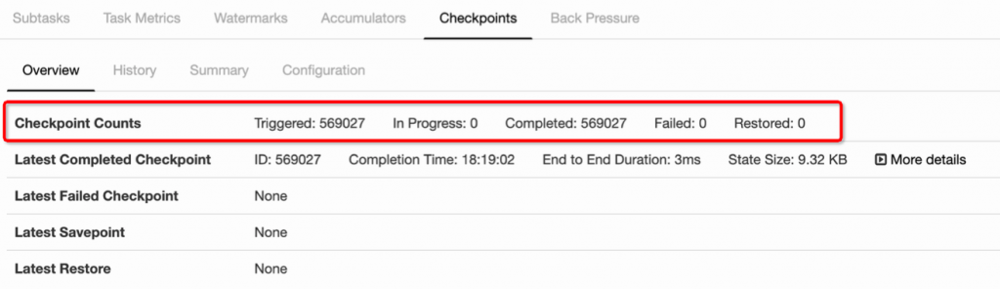

`state` 其实就是 `Checkpoint` 所做的主要持久化备份的主要数据，看下图的具体数据统计，其 `state` 也就 `9kb` 大小。

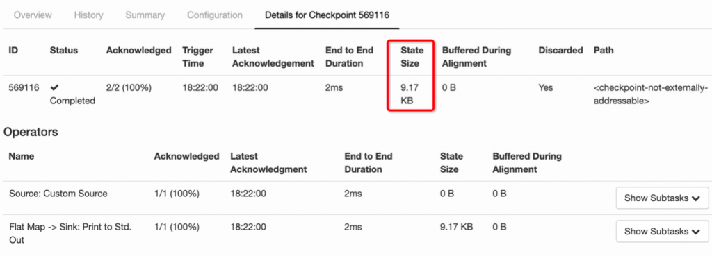

## 2 什么是 state

我们接下来看什么是 `state` 。先看一个非常经典的 `word count` 代码，这段代码会去监控本地的 `9000` 端口的数据并对网络端口输入进行词频统计，我们本地行动 `netcat` ，然后在终端输入 `hello world` ，执行程序会输出什么？

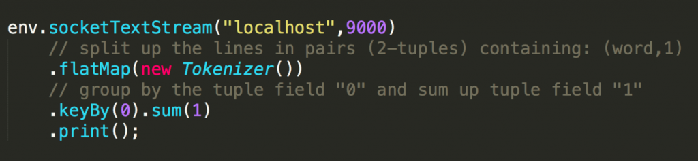

答案很明显，

那么问题来了，如果再次在终端输入 `hello world` ，程序会输入什么？

答案其实也很明显，

回顾一下刚才这段 `word count` 代码。 `keyby` 接口的调用会创建 `keyed stream` 对 `key` 进行划分，这是使用 `keyed state` 的前提。在此之后， `sum` 方法会调用内置的 `StreamGroupedReduce` 实现。

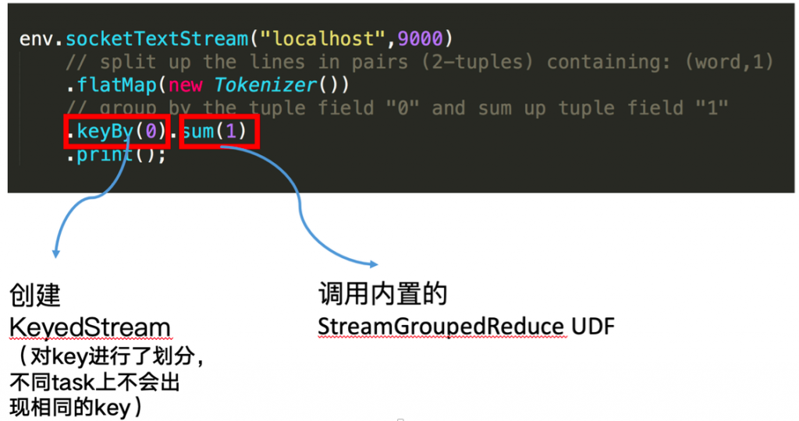

### 2.1 什么是 keyed state

对于 `keyed state` ，有两个特点：

* 只能应用于 `KeyedStream` 的函数与操作中，例如 `Keyed UDF` ， `window state`

* `keyed state` 是已经分区或划分好的，每一个 `key` 只能属于某一个 `keyed state`

对于如何理解已经分区的概念，我们需要看一下 `keyby` 的语义，大家可以看到下图左边有三个并发，右边也是三个并发，左边的词进来之后，通过 `keyby` 会进行相应的分发。例如对于 `hello word,hello` 这个词通过 `hash` 运算永远只会到右下方并发的 `task` 上面去。

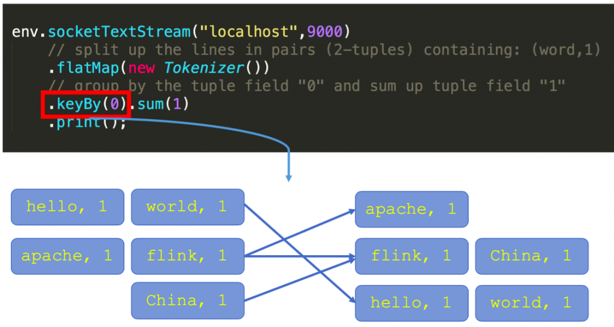

### 2.2 什么是 operator state

* 又称为 `non-keyed state` ，每一个 `operator state` 都仅与一个 `operator` 的实例绑定。

* 常见的 `operator state` 是 `source state` ，例如记录当前 `source` 的 `offset`

再看一段使用 `operator state` 的 `word count` 代码：

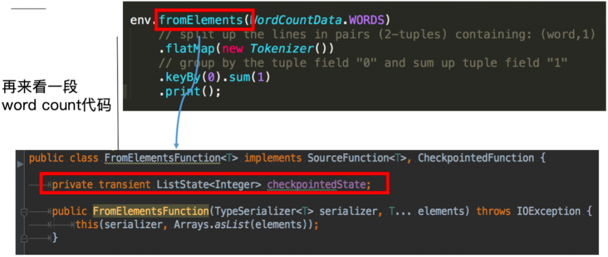

这里的

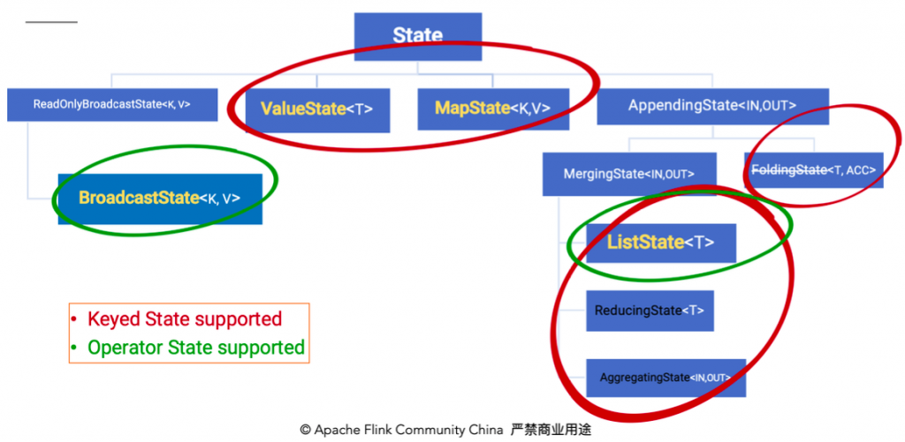

除了从这种分类的角度，还有一种分类的角度是从 `Flink` 是否直接接管：

* `Managed State` ：由 `Flink` 管理的 `state` ，刚才举例的所有 `state` 均是 `managed state`

* `Raw State` ： `Flink` 仅提供 `stream` 可以进行存储数据，对 `Flink` 而言 `raw state` 只是一些 `bytes` 在实际生产中，都只推荐使用 `managed state` ，本文将围绕该话题进行讨论。

## 3 如何在 Flink 中使用 state

下图就前文 `word count` 的 `sum` 所使用的

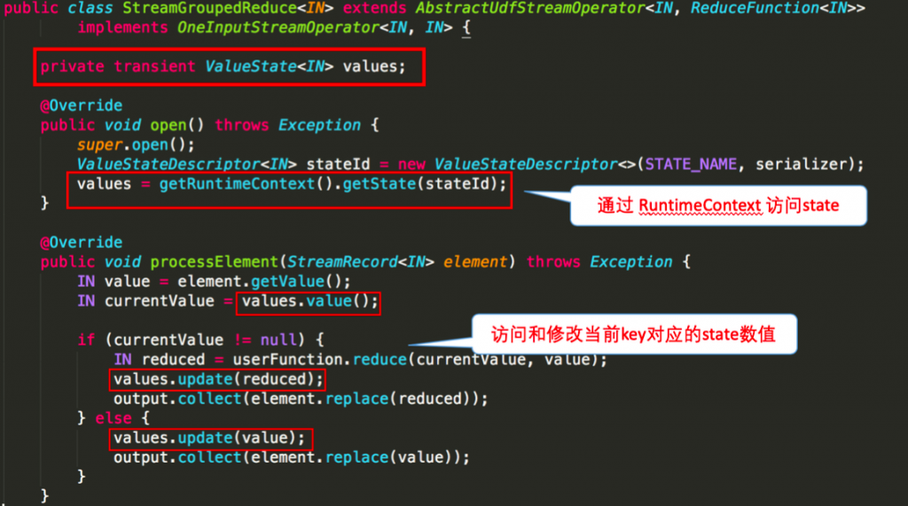

下图则对 `word count` 示例中的

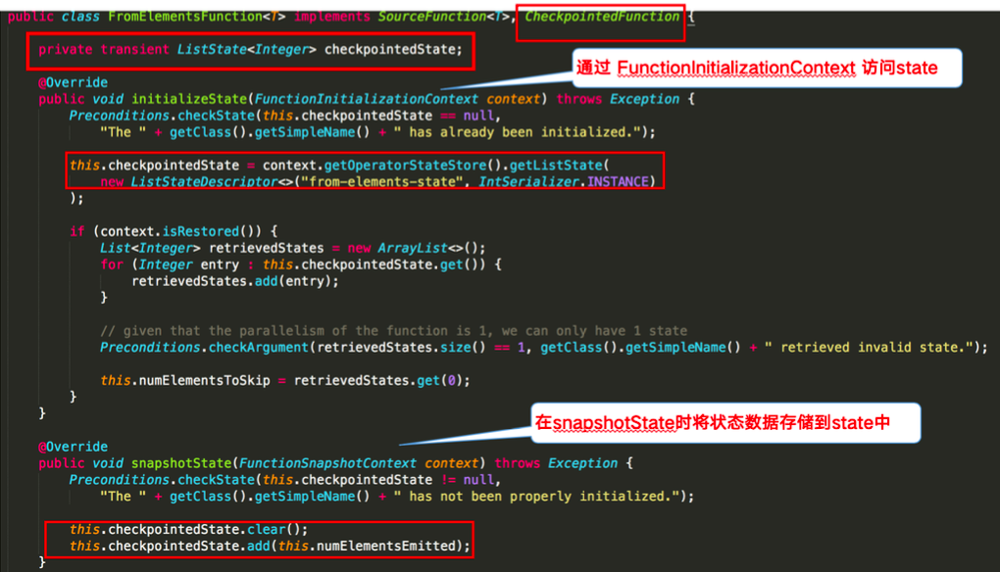

## 4 Checkpoint 的执行机制

在介绍 `Checkpoint` 的执行机制前，我们需要了解一下 `state` 的存储，因为 `state` 是 `Checkpoint` 进行持久化备份的主要角色。

### 4.1 Statebackend 的分类

下图阐释了目前 `Flink` 内置的三类 `state backend` ，其中

而

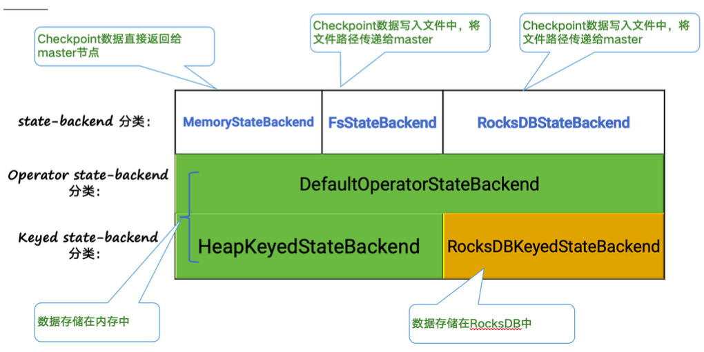

对于

* 支持异步 `Checkpoint` （默认）：存储格式 `CopyOnWriteStateMap`

* 仅支持同步 `Checkpoint` ：存储格式 `NestedStateMap`

特别在 `MemoryStateBackend` 内使用

对于

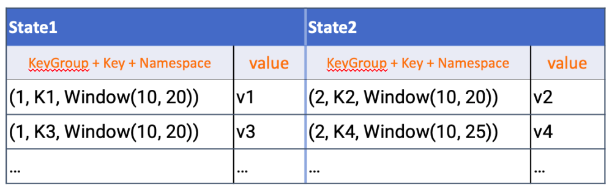

### 4.2 Checkpoint 执行机制详解

本小节将对 `Checkpoint` 的执行流程逐步拆解进行讲解，下图左侧是 `Checkpoint Coordinator` ，是整个 `Checkpoint` 的发起者，中间是由两个 `source` ，一个 `sink` 组成的 `Flink` 作业，最右侧的是持久化存储，在大部分用户场景中对应 `HDFS` 。

1. 第一步， `Checkpoint Coordinator` 向所有 `source` 节点 `trigger Checkpoint` 。

    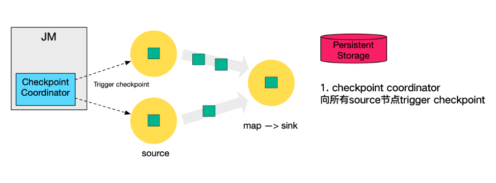

2. 第二步， `source` 节点向下游广播 `barrier` ，这个 `barrier` 就是实现 `Chandy-Lamport` 分布式快照算法的核心，下游的 `task` 只有收到所有 `input` 的 `barrier` 才会执行相应的 `Checkpoint` 。

    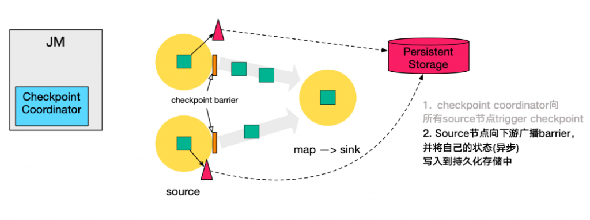

3. 第三步，当 `task` 完成 `state` 备份后，会将备份数据的地址（ `state handle` ）通知给 `Checkpoint coordinator` 。

    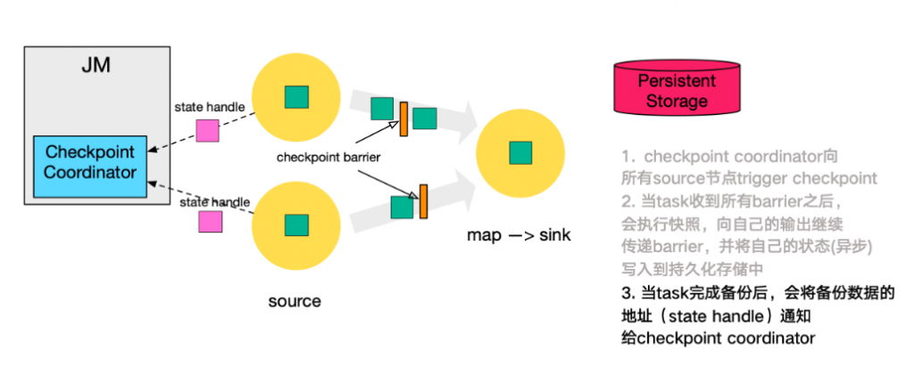

4. 第四步，下游的 `sink` 节点收集齐上游两个 `input` 的 `barrier` 之后，会执行本地快照，这里特地展示了 `RocksDB incremental Checkpoint` 的流程，首先 `RocksDB` 会全量刷数据到磁盘上（红色大三角表示），然后 `Flink` 框架会从中选择没有上传的文件进行持久化备份（紫色小三角）。

    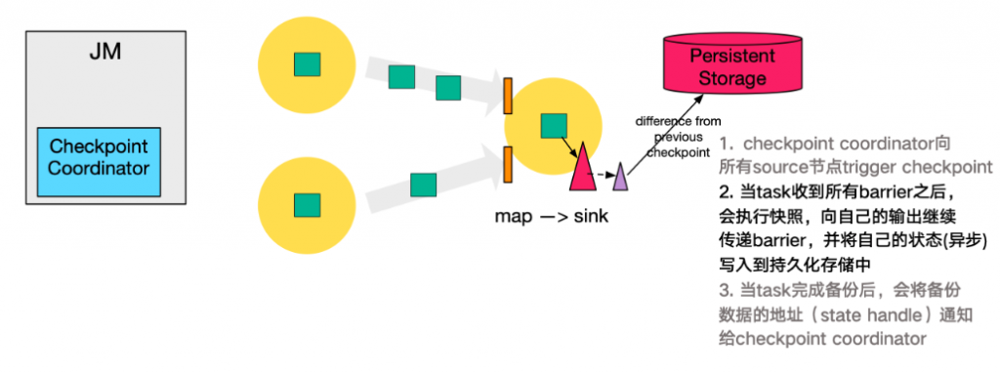

5. 同样的， `sink` 节点在完成自己的 `Checkpoint` 之后，会将 `state handle` 返回通知 `Coordinator` 。

    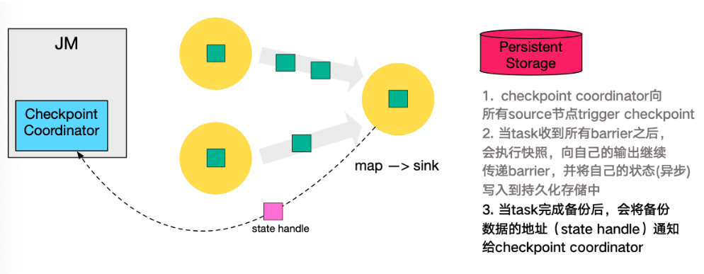

6. 最后，当 `Checkpoint coordinator` 收集齐所有 `task` 的 `state handle` ，就认为这一次的 `Checkpoint` 全局完成了，向持久化存储中再备份一个 `Checkpoint meta` 文件。

    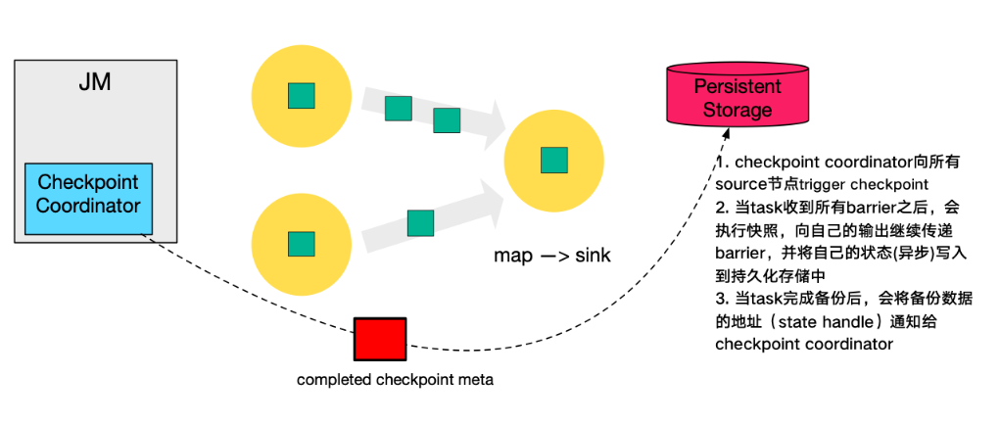

### 4.3 Checkpoint 的 EXACTLY_ONCE 语义

为了实现 `EXACTLY ONCE` 语义， `Flink` 通过一个 `input buffer` 将在对齐阶段收到的数据缓存起来，等对齐完成之后再进行处理。而对于 `AT LEAST ONCE` 语义，无需缓存收集到的数据，会对后续直接处理，所以导致 `restore` 时，数据可能会被多次处理。下图是官网文档里面就 `Checkpoint align` 的示意图：

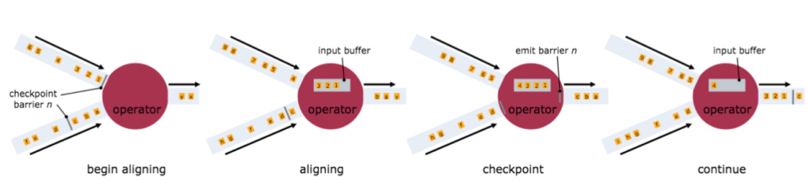

需要特别注意的是， `Flink` 的 `Checkpoint` 机制只能保证 `Flink` 的计算过程可以做到 `EXACTLY ONCE` ，端到端的 `EXACTLY ONCE` 需要 `source` 和 `sink` 支持。

### 4.4 Savepoint 与 Checkpoint 的区别

作业恢复时，二者均可以使用，主要区别如下：

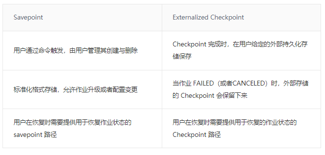
