# Apache Flink 进阶教程（9）：Flink Connector 开发

## 1 Flink Streaming Connector

`Flink` 是新一代流批统一的计算引擎，它需要从不同的第三方存储引擎中把数据读过来，进行处理，然后再写出到另外的存储引擎中。 `Connector` 的作用就相当于一个连接器，连接 `Flink` 计算引擎跟外界存储系统。 `Flink` 里有以下几种方式，当然也不限于这几种方式可以跟外界进行数据交换：

* 第一种： `Flink` 里面预定义了一些 `source` 和 `sink` 。

* 第二种： `Flink` 内部也提供了一些 `Boundled connectors` 。

* 第三种：可以使用第三方 `Apache Bahir` 项目中提供的连接器。

* 第四种：是通过异步 `IO` 方式。

下面分别简单介绍一下这四种数据读写的方式。

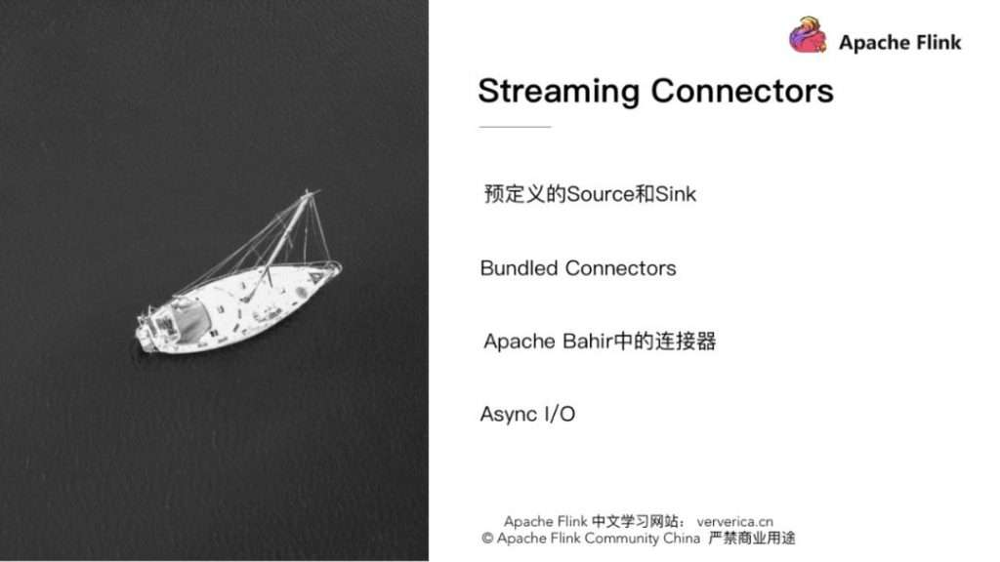

### 1.1 预定义的 source 和 sink

`Flink` 里预定义了一部分 `source` 和 `sink` 。在这里分了几类。


#### 1.1.1 基于文件的 source 和 sink

如果要从文本文件中读取数据，可以直接使用：

```shell
env.readTextFile(path)
```

就可以以文本的形式读取该文件中的内容。当然也可以使用：

```shell
env.readFile(fileInputFormat, path)
```

根据指定的 `fileInputFormat` 格式读取文件中的内容。

如果数据在 `Flink` 内进行了一系列的计算，想把结果写出到文件里，也可以直接使用内部预定义的一些 `sink` ，比如将结果已文本或 `csv` 格式写出到文件中，可以使用 `DataStream` 的 `writeAsText(path)` 和 `writeAsCsv(path)` 。

#### 1.1.2 基于 Socket 的 Source 和 Sink

提供 `Socket` 的 `host name` 及 `port` ，可以直接用 `StreamExecutionEnvironment` 预定的接口 `socketTextStream` 创建基于 `Socket` 的 `source` ，从该 `socket` 中以文本的形式读取数据。当然如果想把结果写出到另外一个 `Socket` ，也可以直接调用 `DataStream writeToSocket` 。

#### 1.1.3 基于内存 Collections、Iterators 的 Source

可以直接基于内存中的集合或者迭代器，调用 `StreamExecutionEnvironment fromCollection` 、 `fromElements` 构建相应的 `source` 。结果数据也可以直接 `print` 、 `printToError` 的方式写出到标准输出或标准错误。

详细也可以参考 `Flink` 源码中提供的一些相对应的 `Examples` 来查看异常预定义 `source` 和 `sink` 的使用方法，例如 `WordCount` 、 `SocketWindowWordCount` 。

### 1.2 Bundled Connectors

`Flink` 里已经提供了一些绑定的 `Connector` ，例如 `kafka source` 和 `sink` ， `Es sink` 等。读写 `kafka` 、 `es` 、 `rabbitMQ` 时可以直接使用相应 `connector` 的 `api` 即可。第二部分会详细介绍生产环境中最常用的 `kafka connector` 。

虽然该部分是 `Flink` 项目源代码里的一部分，但是真正意义上不算作 `Flink` 引擎相关逻辑，并且该部分没有打包在二进制的发布包里面。所以在提交 `Job` 时候需要注意， `job` 代码 `jar` 包中一定要将相应的 `connetor` 相关类打包进去，否则在提交作业时就会失败，提示找不到相应的类，或初始化某些类异常。

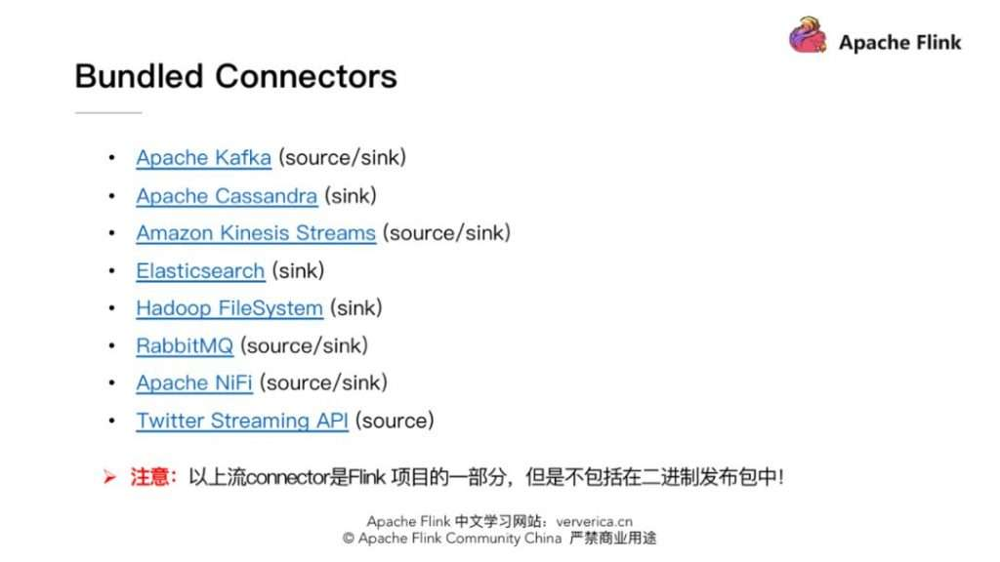

### 1.3 Apache Bahir 中的连接器

`Apache Bahir` 最初是从 `Apache Spark` 中独立出来项目提供，以提供不限于 `Spark` 相关的扩展或插件、连接器和其他可插入组件的实现。通过提供多样化的流连接器（ `streaming connectors` ）和 `SQL` 数据源扩展分析平台的覆盖面。如有需要写到 `flume` 、 `redis` 的需求的话，可以使用该项目提供的 `connector` 。

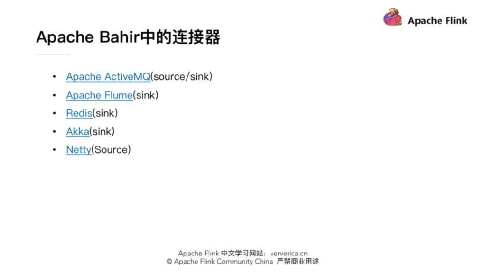

### 1.4 Async I/O

流计算中经常需要与外部存储系统交互，比如需要关联 `MySQL` 中的某个表。一般来说，如果用同步 `I/O` 的方式，会造成系统中出现大的等待时间，影响吞吐和延迟。为了解决这个问题，异步 `I/O` 可以并发处理多个请求，提高吞吐，减少延迟。

`Async` 的原理可参考官方文档：[https://ci.apache.org/projects/flink/flink-docs-release-1.3/dev/stream/asyncio.html](https://ci.apache.org/projects/flink/flink-docs-release-1.3/dev/stream/asyncio.html)

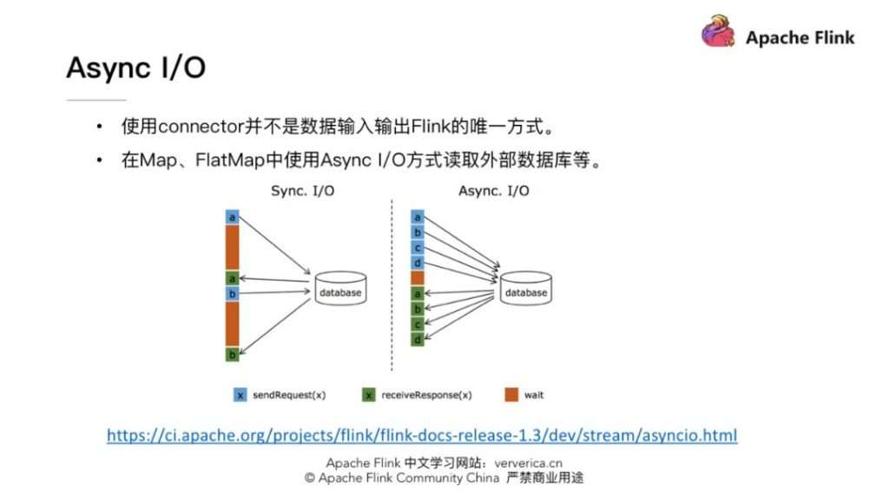

## 2 Flink Kafka Connector

本章重点介绍生产环境中最常用到的 `Flink kafka connector` 。使用 `Flink` 的同学，一定会很熟悉 `kafka` ，它是一个分布式的、分区的、多副本的、支持高吞吐的、发布订阅消息系统。生产环境环境中也经常会跟 `kafka` 进行一些数据的交换，比如利用 `kafka consumer` 读取数据，然后进行一系列的处理之后，再将结果写出到 `kafka` 中。这里会主要分两个部分进行介绍，一是 `Flink kafka Consumer` ，一个是 `Flink kafka Producer` 。

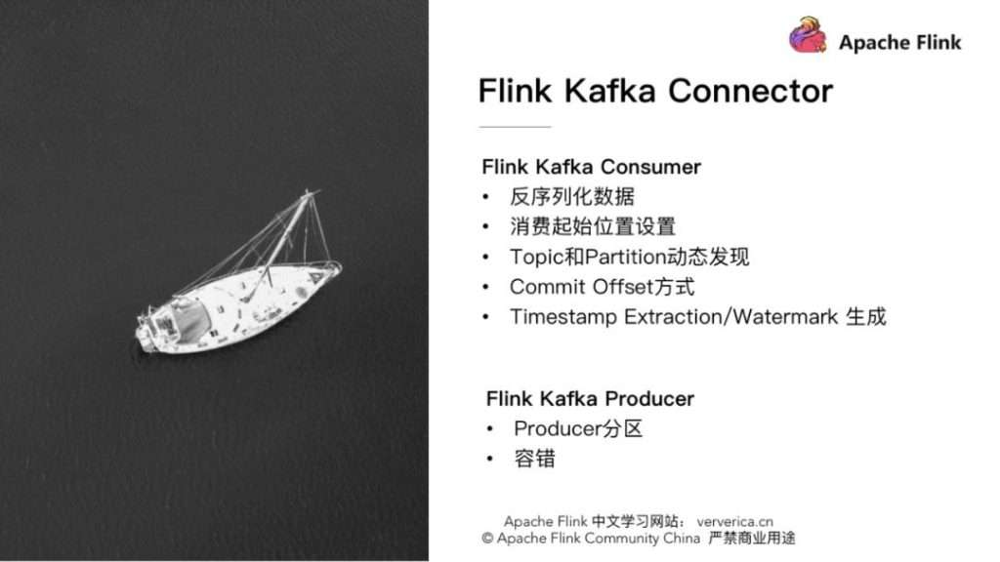

首先看一个例子来串联下 `Flink kafka connector` 。代码逻辑里主要是从 `kafka` 里读数据，然后做简单的处理，再写回到 `kafka` 中。

分别用红框框出如何构造一个 `Source sink Function` 。 `Flink` 提供了现成的构造 `FlinkKafkaConsumer` 、 `Producer` 的接口，可以直接使用。这里需要注意，因为 `kafka` 有多个版本，多个版本之间的接口协议会不同。 `Flink` 针对不同版本的 `kafka` 有相应的版本的 `Consumer` 和 `Producer` 。例如：针对 `08` 、 `09` 、 `10` 、 `11` 版本， `Flink` 对应的 `consumer` 分别是 `FlinkKafkaConsumer` `08` 、 `09` 、 `010` 、 `011` ， `producer` 也是。

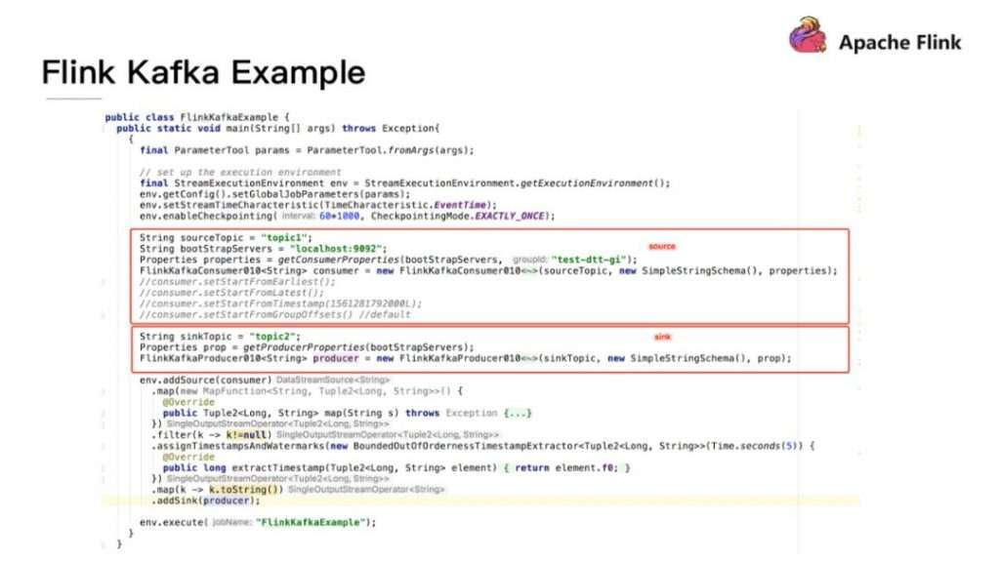

### 2.1 Flink kafka Consumer

#### 2.1.1 反序列化数据

因为 `kafka` 中数据都是以二进制 `byte` 形式存储的。读到 `Flink` 系统中之后，需要将二进制数据转化为具体的 `java` 、 `scala` 对象。具体需要实现一个 `schema` 类，定义如何序列化和反序列数据。反序列化时需要实现 `DeserializationSchema` 接口，并重写 `deserialize(byte[] message)` 函数，如果是反序列化 `kafka` 中 `kv` 的数据时，需要实现 `KeyedDeserializationSchema` 接口，并重写 `deserialize(byte[] messageKey,byte[] message,String topic,int partition, long offset)` 函数。

另外 `Flink` 中也提供了一些常用的序列化反序列化的 `schema` 类。例如， `SimpleStringSchema` ，按字符串方式进行序列化、反序列化。 `TypeInformationSerializationSchema` ，它可根据 `Flink` 的 `TypeInformation` 信息来推断出需要选择的 `schema` 。 `JsonDeserializationSchema` 使用 `jackson` 反序列化 `json` 格式消息，并返回 `ObjectNode` ，可以使用 `.get("property")` 方法来访问相应字段。

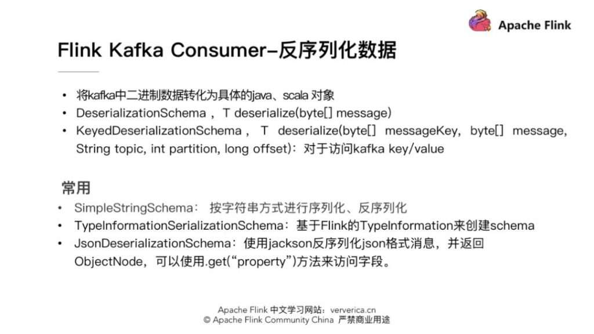

#### 2.1.2 消费起始位置设置

如何设置作业从 `kafka` 消费数据最开始的起始位置，这一部分 `Flink` 也提供了非常好的封装。在构造好的 `FlinkKafkaConsumer` 类后面调用如下相应函数，设置合适的起始位置。

* `setStartFromGroupOffsets` ，也是默认的策略，从 `group offset` 位置读取数据， `group offset` 指的是 `kafka broker` 端记录的某个 `group` 的最后一次的消费位置。但是 `kafka broker` 端没有该 `group` 信息，会根据 `kafka` 的参数 `auto.offset.reset` 的设置来决定从哪个位置开始消费。

* `setStartFromEarliest` ，从 `kafka` 最早的位置开始读取。

* `setStartFromLatest` ，从 `kafka` 最新的位置开始读取。

* `setStartFromTimestamp(long)` ，从时间戳大于或等于指定时间戳的位置开始读取。 `Kafka` 时戳，是指 `kafka` 为每条消息增加另一个时戳。该时戳可以表示消息在 `proudcer` 端生成时的时间、或进入到 `kafka broker` 时的时间。

* `setStartFromSpecificOffsets` ，从指定分区的 `offset` 位置开始读取，如指定的 `offsets` 中不存某个分区，该分区从 `group offset` 位置开始读取。此时需要用户给定一个具体的分区、 `offset` 的集合。

一些具体的使用方法可以参考下图。需要注意的是，因为 `Flink` 框架有容错机制，如果作业故障，如果作业开启 `checkpoint` ，会从上一次 `checkpoint` 状态开始恢复。或者在停止作业的时候主动做 `savepoint` ，启动作业时从 `savepoint` 开始恢复。这两种情况下恢复作业时，作业消费起始位置是从之前保存的状态中恢复，与上面提到跟 `kafka` 这些单独的配置无关。

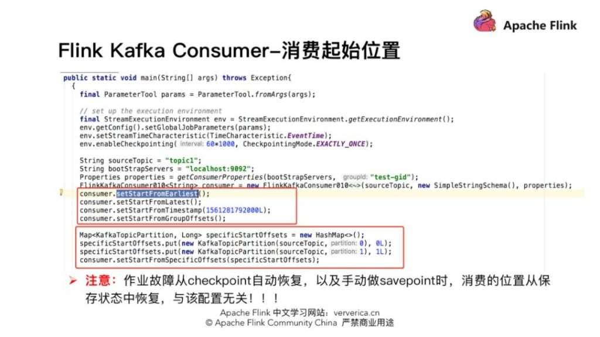

#### 2.1.3 topic 和 partition 动态发现

实际的生产环境中可能有这样一些需求，比如场景一，有一个 `Flink` 作业需要将五份数据聚合到一起，五份数据对应五个 `kafka topic` ，随着业务增长，新增一类数据，同时新增了一个 `kafka topic` ，如何在不重启作业的情况下作业自动感知新的 `topic` 。场景二，作业从一个固定的 `kafka topic` 读数据，开始该 `topic` 有 `10` 个 `partition` ，但随着业务的增长数据量变大，需要对 `kafka partition` 个数进行扩容，由 `10` 个扩容到 `20` 。该情况下如何在不重启作业情况下动态感知新扩容的 `partition` ？

针对上面的两种场景，首先需要在构建 `FlinkKafkaConsumer` 时的 `properties` 中设置 `flink.partition-discovery.interval-millis` 参数为非负值，表示开启动态发现的开关，以及设置的时间间隔。此时 `FlinkKafkaConsumer` 内部会启动一个单独的线程定期去 `kafka` 获取最新的 `meta` 信息。针对场景一，还需在构建 `FlinkKafkaConsumer` 时， `topic` 的描述可以传一个正则表达式描述的 `pattern` 。每次获取最新 `kafka meta` 时获取正则匹配的最新 `topic` 列表。针对场景二，设置前面的动态发现参数，在定期获取 `kafka` 最新 `meta` 信息时会匹配新的 `partition` 。为了保证数据的正确性，新发现的 `partition` 从最早的位置开始读取。

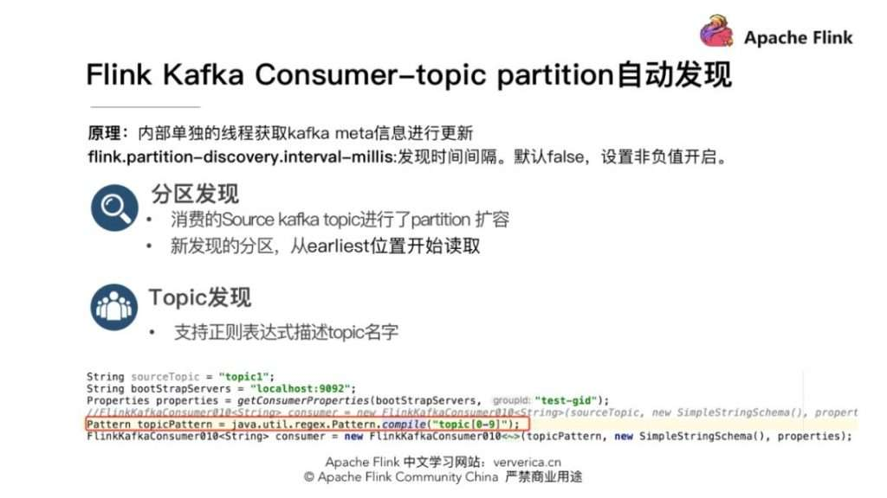

#### 2.1.4 commit offset 方式

`Flink kafka consumer commit offset` 方式需要区分是否开启了 `checkpoint` 。

如果 `checkpoint` 关闭， `commit offset` 要依赖于 `kafka` 客户端的 `auto commit` 。需设置 `enable.auto.commit` ， `auto.commit.interval.ms` 参数到 `consumer properties` ，就会按固定的时间间隔定期 `auto commit offset` 到 `kafka` 。

如果开启 `checkpoint` ，这个时候作业消费的 `offset` 是 `Flink` 在 `state` 中自己管理和容错。此时提交 `offset` 到 `kafka` ，一般都是作为外部进度的监控，想实时知道作业消费的位置和 `lag` 情况。此时需要 `setCommitOffsetsOnCheckpoints` 为 `true` 来设置当 `checkpoint` 成功时提交 `offset` 到 `kafka` 。此时 `commit offset` 的间隔就取决于 `checkpoint` 的间隔，所以此时从 `kafka` 一侧看到的 `lag` 可能并非完全实时，如果 `checkpoint` 间隔比较长 `lag` 曲线可能会是一个锯齿状。


#### 2.1.5 Timestamp Extraction/Watermark 生成

我们知道当 `Flink` 作业内使用 `EventTime` 属性时，需要指定从消息中提取时戳和生成水位的函数。

`FlinkKakfaConsumer` 构造的 `source` 后直接调用 `assignTimestampsAndWatermarks` 函数设置水位生成器的好处是此时是每个 `partition` 一个 `watermark assigner` ，如下图。 `source` 生成的时戳为多个 `partition` 时戳对齐后的最小时戳。此时在一个 `source` 读取多个 `partition` ，并且 `partition` 之间数据时戳有一定差距的情况下，因为在 `source` 端 `watermark` 在 `partition` 级别有对齐，不会导致数据读取较慢 `partition` 数据丢失。

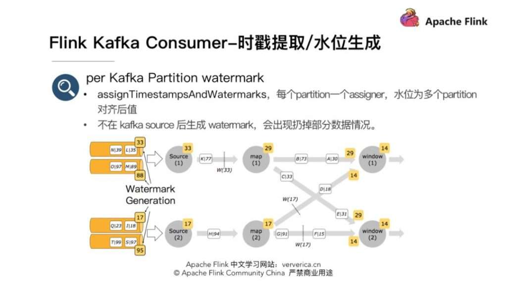

### 2.2 Flink kafka Producer

#### 2.2.1 Producer 分区

使用 `FlinkKafkaProducer` 往 `kafka` 中写数据时，如果不单独设置 `partition` 策略，会默认使用 `FlinkFixedPartitioner` ，该 `partitioner` 分区的方式是 `task` 所在的并发 `id` 对 `topic` 总 `partition` 数取余： `parallelInstanceId % partitions.length` 。

* 此时如果 `sink` 为 `4` ， `paritition` 为 `1` ，则 `4` 个 `task` 往同一个 `partition` 中写数据。但当 `sink task < partition` 个数时会有部分 `partition` 没有数据写入，例如 `sink task` 为 `2` ， `partition` 总数为 `4` ，则后面两个 `partition` 将没有数据写入。

* 如果构建 `FlinkKafkaProducer` 时， `partition` 设置为 `null` ，此时会使用 `kafka producer` 默认分区方式，非 `key` 写入的情况下，使用 `round-robin` 的方式进行分区，每个 `task` 都会轮循的写下游的所有 `partition` 。该方式下游的 `partition` 数据会比较均衡，但是缺点是 `partition` 个数过多的情况下需要维持过多的网络连接，即每个 `task` 都会维持跟所有 `partition` 所在 `broker` 的连接。


### 2.3 容错

`Flink kafka` `09` 、 `010` 版本下，通过 `setLogFailuresOnly` 为 `false` ， `setFlushOnCheckpoint` 为 `true` ，能达到 `at-least-once` 语义。 `setLogFailuresOnly` ，默认为 `false` ，是控制写 `kafka` 失败时，是否只打印失败的 `log` 不抛异常让作业停止。 `setFlushOnCheckpoint` ，默认为 `true` ，是控制是否在 `checkpoint` 时 `fluse` 数据到 `kafka` ，保证数据已经写到 `kafka` 。否则数据有可能还缓存在 `kafka` 客户端的 `buffer` 中，并没有真正写出到 `kafka` ，此时作业挂掉数据即丢失，不能做到至少一次的语义。

`Flink kafka 011` 版本下，通过两阶段提交的 `sink` 结合 `kafka` 事务的功能，可以保证端到端精准一次。详细原理可以参考：[https://www.ververica.com/blog/end-to-end-exactly-once-processing-apache-flink-apache-kafka](https://www.ververica.com/blog/end-to-end-exactly-once-processing-apache-flink-apache-kafka)

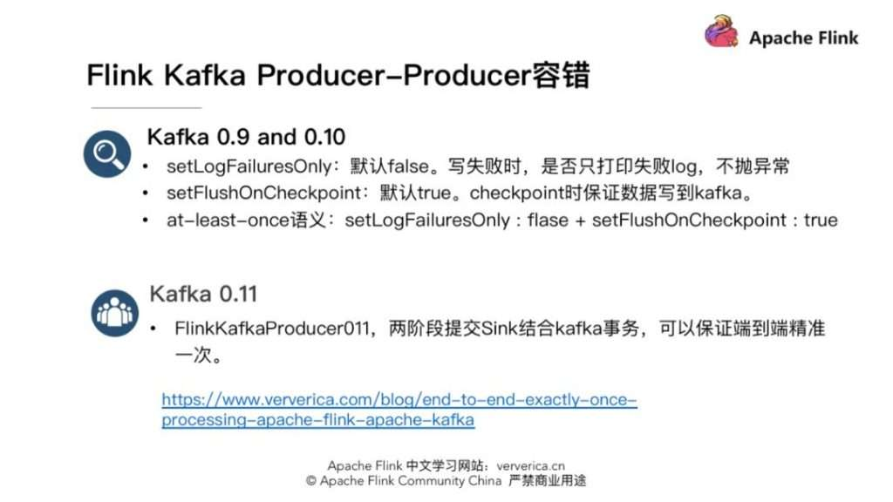

## 3 一些疑问与解答

Q：在 `Flink consumer` 的并行度的设置：是对应 `topic` 的 `partitions` 个数吗？要是有多个主题数据源，并行度是设置成总体的 `partitions` 数吗？

A：这个并不是绝对的，跟 `topic` 的数据量也有关，如果数据量不大，也可以设置小于 `partitions` 个数的并发数。但不要设置并发数大于 `partitions` 总数，因为这种情况下某些并发因为分配不到 `partition` 导致没有数据处理。

Q：如果 `partitioner` 传 `null` 的时候是 `round-robin` 发到每一个 `partition` ？如果有 `key` 的时候行为是 `kafka` 那种按照 `key` 分布到具体分区的行为吗？

A：如果在构造 `FlinkKafkaProducer` 时，如果没有设置单独的 `partitioner` ，则默认使用 `FlinkFixedPartitioner` ，此时无论是带 `key` 的数据，还是不带 `key` 。如果主动设置 `partitioner` 为 `null` 时，不带 `key` 的数据会 `round-robin` 的方式写出，带 `key` 的数据会根据 `key` ，相同 `key` 数据分区的相同的 `partition` ，如果 `key` 为 `null` ，再轮询写。不带 `key` 的数据会轮询写各 `partition` 。

Q：如果 `checkpoint` 时间过长， `offset` 未提交到 `kafka` ，此时节点宕机了，重启之后的重复消费如何保证呢？

A：首先开启 `checkpoint` 时 `offset` 是 `Flink` 通过状态 `state` 管理和恢复的，并不是从 `kafka` 的 `offset` 位置恢复。在 `checkpoint` 机制下，作业从最近一次 `checkpoint` 恢复，本身是会回放部分历史数据，导致部分数据重复消费， `Flink` 引擎仅保证计算状态的精准一次，要想做到端到端精准一次需要依赖一些幂等的存储系统或者事务操作。
