# 案例（1）：360 政企安全集团基于 Flink 的 PB 级数据即席查询实践

## 1 Threat Hunting 平台的架构与设计

第一部分内容大致分为三个部分，分别是：

* 平台的演进

* 架构设计

* 深入探索索引结构

### 1.1 平台的演进

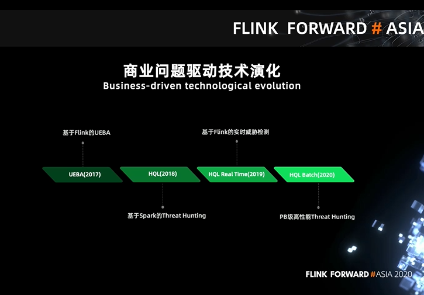

我们认为所有技术的演化和革新都需要具体的商业问题来驱动，以下是我们团队近几年基于 `Flink` 开发的几款产品：

* `2017` 年我们基于 `Flink DataStream` 开发了用户行为分析系统 `UEBA` ，它是通过接入企业 `IT` 拓扑的各类行为数据，比如身份认证数据、应用系统访问数据、终端安全数据、网络流量解析数据等等，以用户 / 资产为核心来进行威胁行为的实时检测，最后构建出用户威胁等级和画像的系统；

* `2018` 年基于 `UEBA` 的实施经验，我们发现安全分析人员往往需要一种手段来获取安全事件对应的原始日志，去进一步确认安全威胁的源头和解决方式。于是我们基于 `Spark` 开发了 `HQL` 来解决在离线模式下的数据检索问题，其中 `HQL` 可以认为是表达能力比 `SQL` 更加丰富的查询语言，大致可以看作是在 `SQL` 能力的基础上增加了算法类算；

* `2019` 年随着离线 `HQL` 在客户那边的使用，我们发现其本身就能够快速定义安全规则，构建威胁模型，如果在离线模式下写完语句后直接发布成在线任务，会大大缩短开发周期，加上 `Flink SQL` 能力相对完善，于是我们基于 `Flink SQL + CEP` 来升级了 `HQL` 的能力，产生了 `HQL RealTime` 版本；

* `2020` 年随着客户数据量的增大，很多已经达到了 `PB` 级，过往的解决方案导致离线的数据检索性能远远低于预期，安全分析人员习惯使用 `like` 和全文检索等模糊匹配操作，造成查询延时非常大。于是从今年开始，我们着重优化 `HQL` 的离线检索能力，并推出了全新的 `Threat Hunting` 平台。

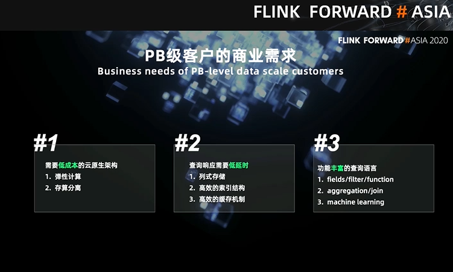

通过调查发现，拥有 `PB` 级数据规模的客户往往有以下几个商业需求：

* 第一是低成本的云原生架构。我们知道目前大部分的大数据架构都是基于 `hadoop` 的，其特点是数据就在计算节点上，能够减少大量网络开销，加速计算性能。但是整个集群为了做到资源均衡，往往需要相同的资源配置，且为了能够存储尽量多的数据，集群规模会很大, 所以这类架构在前期需要投入大量硬件成本。而存算分离和弹性计算则能够解决这一问题，因为磁盘的价格是远低于内存和 `CPU` 的，所以用廉价的磁盘存储搭配低配 `CPU` 和内存来存储数据，用少量高配机器来做计算，可以在很大程度上降低成本。

* 第二是低延时的查询响应。安全分析人员在做威胁检测时，大部分时间是即席查询，即通过过滤、 `join` 来做数据的检索和关联。为了能够尽快的获取查询结果，对应的技术方案是：列存/索引/缓存。列存不用多说了，是大数据领域常见的存储方案；在列存的基础上，高效的索引方案能够大量降低 `io` ，提高查询性能；而存算分析带来的网络延时可以由分布式缓存来弥补。

* 第三是需要丰富的查询能力，其中包括单行的 `fields/filter/udf` 等，多行的聚合 `join` ，甚至算法类的分析能力，这部分我们主要依赖于自己开发的分析语言 `HQL` 来提供。

### 1.2 架构设计

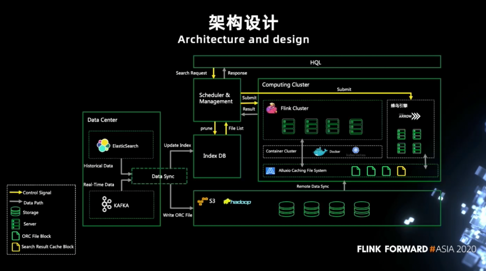

首先，数据是来自于已经存储在 `ES` 中的历史数据和 `kafka` 里的实时数据，其中 `ES` 里的历史数据我们通过自己开发的同步工具来同步， `kafka` 里的实时数据我们则通过 `Streaming File Sink` 写 `orc` 文件到存储集群。在数据同步的同时，我们会将这批数据的索引信息更新到数据库中。

安全分析人员会从前端页面通过写交互式分析语言 `HQL` 发起数据检索的请求，此时请求会进入调度系统，一旦开始执行作业，首先会将分析语句解析成算子列表，算子缓存算法会判断该次查询是否可以命中缓存系统中已有的缓存数据。

* 如果分析语句的输入是已经算好并且 `cache` 好了的中间结果，那么直接读取缓存来继续计算；

* 如果不能命中，证明我们必须从 `orc` 文件开始重新计算。

我们会先提取出查询语言的过滤条件或者是 `Join` 条件来做谓词下推，进入索引数据库中获得目前符合该查询的文件列表，随后将文件列表交给计算引擎来进行计算。计算引擎我们采用双引擎模式，其中复杂度高的语句我们通过 `Flink` 引擎来完成，其它较为简单的任务我们交给平台内部的 “蜂鸟引擎”。“蜂鸟引擎” 基于 `Apache arrow` 做向量化执行，加上 `LLVM` 编译，查询延迟会非常小。

由于整个系统的存算分离，为了加速数据读取，我们在计算集群节点上增加了 `alluxio` 来提供数据缓存服务，其中不仅缓存 `remote cluster` 上的数据，同时会缓存部分历史作业结果，通过算子缓存的算法来加速下次计算任务。

这里还需要强调两点：

* 第一点是索引数据库会返回一批符合该条件的文件列表，如果文件列表非常大的话，当前的 `Flink` 版本在构建 `job graph` 时，在获取 `Filelist Statistics` 逻辑这里在遍历大量文件的时候，会造成长时间无法构建出 `job graph` 的问题。目前我们对其进行了修复，后期会贡献给社区。

* 第二点是数据缓存那一块，我们的 `HQL` 之前是通过 `Spark` 来实现的。用过 `Spark` 的人可能知道， `Spark` 会把一个 `table` 来做 `cache` 或 `persist` 。我们在迁移到 `Flink` 的时候，也沿用了这个算子。 `Flink` 这边我们自己实现了一套，就是用户在 `cache table` 时,我们会把它注册成一个全新的 `table source` ，后面在重新读取的时候只会用这个新的 `table source` 来打通整个流程。

### 1.3 深入探索索引结构

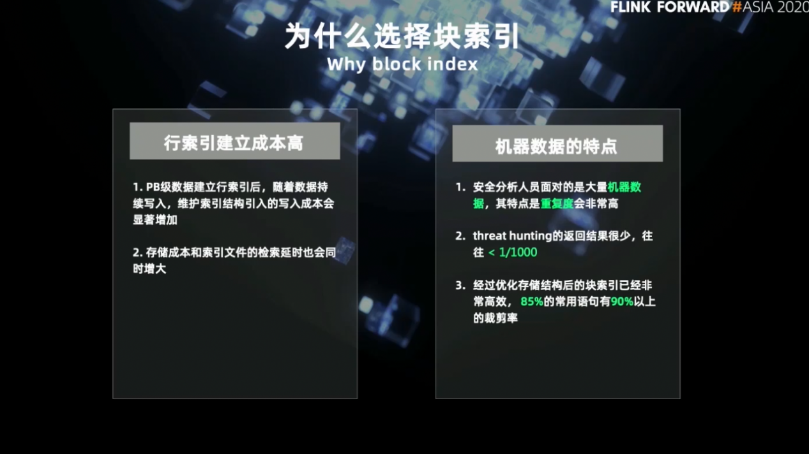

数据库为了加速数据检索，我们往往会事先为数据创建索引，再在扫描数据之前通过索引定位到数据的起始位置，从而加速数据检索。而传统数据库常见的是行索引，通过一个或若干字段创建索引，索引结果以树形结构存储，此类索引能够精确到行级别，索引效率最高。

某些大数据项目也支持了行索引，而它所带来的弊端就是大量的索引数据会造成写入和检索的延时。而我们平台处理的是机器数据，例如终端/网络这类数据，它的特点是重复度非常高，而安全分析的结果往往非常少，极少数的威胁行为会隐藏在海量数据里，占比往往会是 `1/1000` 甚至更少。

所以我们选择性价比更高的块索引方案，已经能够支撑目前的应用场景。目前通过客户数据来看, 索引能够为 `85%` 的语句提供 `90%` 以上的裁剪率，基本满足延时要求。

某些大数据平台是将索引数据以文件的形式存储在磁盘上，外加一些 `cache` 机制来加速数据访问，而我们是将索引数据直接存在了数据库中。主要有以下两个方面的考虑：

* 第一是 `transaction` 。我们知道列存文件往往是无法 `update` 的，而我们在定期优化文件分布时会做 `Merge File` 操作，为了保证查询一致性，需要数据库提供 `transaction` 能力。

* 第二是性能。数据库拥有较强的读写和检索能力，甚至可以将谓词下推到数据库来完成，数据库的高压缩比也能进一步节省存储。

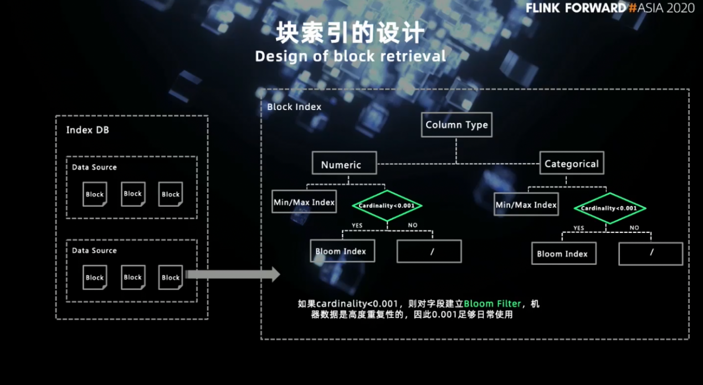

上图为块索引的设计。在我们的索引数据库中，我们把这些数据分为不同类别数据源，比如终端数据为一类数据源，网络数据为一类数据源，我们分类数据源的逻辑是他们是否拥有统一的 `Schema` 。就单个数据源来说，它以日期作为 `Partition` ， `Partition` 内部是大量的 `ORC` 小文件，具体到索引结构，我们会为每一个字段建 `min/max` 索引，基数小于 `0.001` 的字段我们建 `Bloom` 索引。

上文提到过，安全人员比较喜欢用 `like` 和全文检索。对于 `like` 这一块，我们也做了一些优化。全文检索方面，我们会为数据来做分词，来构建倒排索引，同时也会对于单个分词过后的单个 `item` 来做文件分布层面的位图索引。

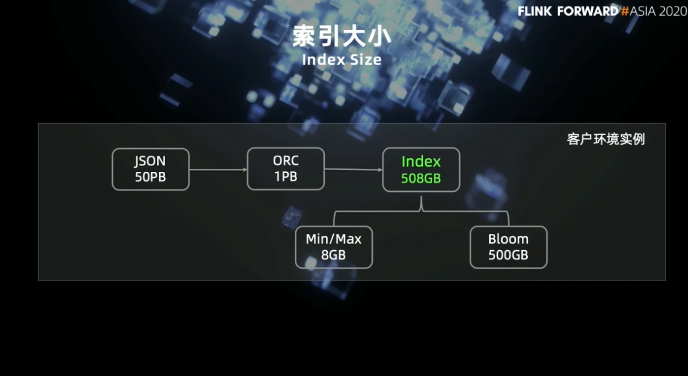

上图是一个索引大小的大致的比例假设， `JSON` 格式的原始日志大有 `50PB` ，转化成 `ORC` 大概是 `1PB` 左右。我们的 `Index` 数据是 `508GB` ， 其中 `8GB` 为 `Min/Max` 索引， `500GB` 为 `Bloom` 。加上上文提到的位图以及倒排，这个索引数据的占比会进一步加大。基于此，我们采用的是分布式的索引方案。

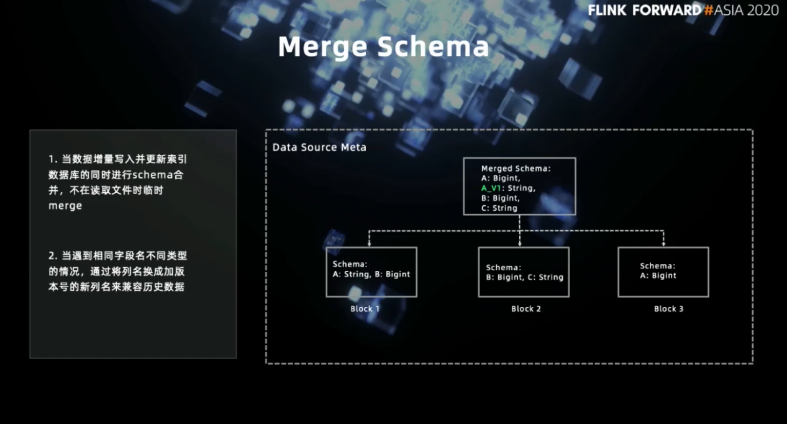

我们知道日志是在不断的进行变化的，对于有的数据员来说，他有时会增加字段或者减少字段，甚至有时字段类型也会发生变化。

那么我们采取这种 `Merge Schema` 模式方案，在文件增量写入的过程中，也就是在更新这批数据的索引信息的同时来做 `Schema Merge` 的操作。如图所示，在 `block123` 中，文件 `3` 是最后一个写入的。随着文件的不断写入，会组成一个全新的 `Merge Schema` 。可以看到 `B` 字段和 `C` 字段其实是历史字段，而 `A_V` 字段是 `A` 字段的历史版本字段，我们用这种方式来尽量多的让客户看到比较全的数据。最后基于自己开发的 `Input format` 加 `Merge Schema` 来构建一个新的 `table source` ，从而打通整个流程。

## 2 以降低 IO 为目标的优化与探索

上文介绍了为什么要选择块索引，那么接下来将具体介绍如何使用块索引。块索引的核心可以落在两个字上：“裁剪”。裁剪就是在查询语句被真正执行前就将无关的文件给过滤掉，尽可能减少进入计算引擎的数据量，从数据源端进行节流。

这张图展示了整个系统使用 `IndexDB` 来做裁剪流程：

* 第一步是解析查询语句。获取到相关的 `filter` ，可以看到最左边的 `SQL` 语句中有两个过滤条件，分别是 `src_address = 某个ip` ，  `occur_time > 某个时间戳` 。

* 第二步将查询条件带入 `Index DB` 对应数据源的 `meta` 表中去进行文件筛选。 `src_address` 是字符串类型字段，它会联合使用 `min/max` 和 `bloom` 索引进行裁剪。 `occur_time` 是数值类型字段并且是时间字段，我们会优先查找 `min/max` 索引来进行文件裁剪。需要强调的是，这里我们是将用户写的 `filter` 封装成了 `index db` 的查询条件，直接将 `filter pushdown` 到数据库中完成。

* 第三步在获取到文件列表后，这些文件加上前面提到的 `merged schema` 会共同构造成一个 `TableSource` 来交给 `Flink` 进行后续计算。

同时，构建 `source` 的时候，我们在细节上做了一些优化。比如在将 `filter` 传给 `ORC reader` 的时候，清除掉已经 `pushdown` 了的 `filter` ， 避免在引擎侧进行二次过滤。当然, 这里并不是将所有 `filter` 都清除掉了，我们保留了 `like` 表达式，关于 `like` 的 `filter pushdown` 会在后文介绍。

接下来着重介绍一下四大优化点：

* 第一点，数据在未排序的情况下，裁剪率是有理论上限的，我们通过在数据写入的时候使用 `hilbert` 曲线排序原始数据来提升裁剪率；

* 第二点，因为安全领域的特殊性，做威胁检测严重依赖 `like` 语法，所以我们对 `orc api` 进行了增强，使其支持了 `like` 语法的下推；

* 第三点，同样是因为使用场景严重依赖 `join` ，所以我们对 `join` 操作也做了相应的优化；

* 第四点，我们的系统底层支持多种文件系统，所以我们选取 `Alluxio` 这一成熟的云原生数据编排系统来做数据缓存，提高数据的访问局部性。

### 2.1 裁剪率的理论上限及 Hilbert 空间填充曲线

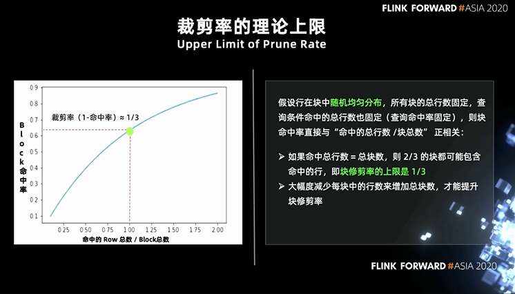

裁剪可以抽象成 `N` 个球扔进 `M` 个桶的概率问题，在这里我们直接说结论。假设行在块中随机均匀分布，所有块的总行数固定，查询条件命中的总行数也固定，则块命中率直接与命中的 `总行数 / 总块数` 正相关。

结论有两个：

* 第一点，如果命中 `总行数 = 总块数` ，即 `X` 轴值为 `1` 的时候，命中率为 `2/3` ， 也就是 `2/3` 的块，都包含命中的行，对应的块修剪率的上限是 `1/3` 。 `1/3` 是一个很低数值，但是由于它的前提是数据随机均匀分布，所以为了让数据分布更好，我们需要在数据写入时对原始数据进行排序。

* 第二点，假设命中总行数固定，那么大幅度减少每块中的行数来增加总块数，也能提升块修剪率。所以我们缩小了块大小。根据测试结果，我们设定每个文件的大小为： `16M` 。缩小文件大小是很简单的。针对排序，我们引入了 `hilbert` 空间填充曲线。

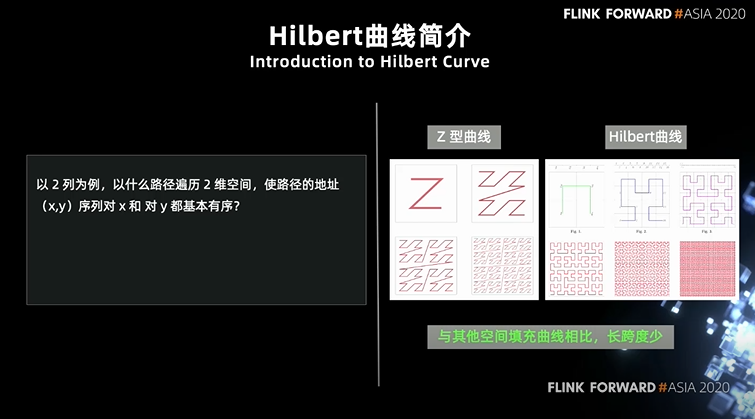

为什么使用 `hilbert` 曲线？主要是基于两点：

* 首先是，以什么路径遍历 `2` 维空间，使路径的地址序列对其中任一维度都基本有序？为什么要对每一列或者说子集都有序？因为系统在使用的过程中，查询条件是不固定的。数据写入时排序用到了 `5` 个字段，查询的时候可能只用到了其中的一个或两个字段。 `Hilbert` 排序能让多个字段做到既整体有序，又局部有序。

* 另外，空间填充曲线有很多，还有 `Z` 形曲线、蛇形曲线等等，大家可以看看右边这两张对比图。直观的看，曲线路径的长跨度跳跃越少越好，点的位置在迭代过程中越稳定越好。 而 `hilbert` 曲线在空间填充曲线里面综合表现最好。

`hilbert` 用法，就是实现一个 `UDF` ，输入列值，输出坐标值，然后根据坐标值排序。

我们抽样了客户环境所使用的 `1500` 条 `SQL` 语句，过滤掉了其中裁剪率为分之 `100%` 的相关语句，也就是没有命中文件的无效语句。然后还剩下 `1148` 条，我们使用这些语句做了裁剪率排序后，对裁剪率进行了对比，裁剪率 `95` 百分位从之前的 `68%` 提升到了 `87%` ，提升了 `19%` 。可能大家会觉得 `19%` 这个数值不是特别高，但如果我们带上一个基数，比如说 `10` 万个文件，这样看的话就会很可观了。

### 2.2 字典索引上 Like 的优化

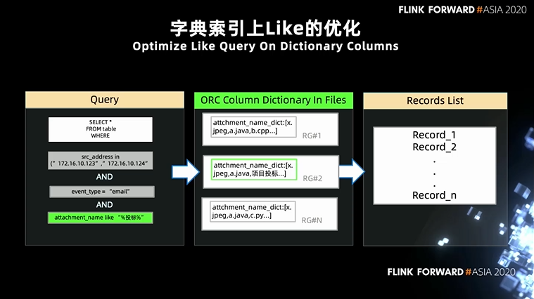

之前也有讲到安全行业的特殊性，我们做威胁检测的时候会严重依赖 `like` 查询。鉴于此，我们也对它做了优化。

* 首先我们为 `ORC api` 添加了 `like` 条件表达式，保证 `SQL` 中的 `like` 能下推到 `orc record reader` 中。

* 其次，重构了 `orc record reader` 的 `row group filter` 逻辑，如果发现是 `like` 表达式，首先读取该字段的 `dict steam` ，判断 `dict stream` 是否包含 `like` 目标字符串，如果字典中不存在该值，直接跳过该 `row group` ，不用读取 `data stream` 和 `length steam` ，能大幅提高文件读取速度。后期我们也考虑构建字典索引到索引数据库中，直接将字典过滤 `pushdown` 到数据库中完成。

例如图上所示，最左边的 `SQL` 中有三个表达式。前两个在上文中已经提到了，是将 `filter` 直接 `pushdown` 到 `index db` 中完成，我们交给 `orc reader` 的 `filter` 只有最后一个 `attachment_name like '%投标%'` ，真正需要读取的记录只是 `dict` 包含“投标”的 `row group` ，也就是做到了 `row group` 级别的过滤，进一步减少了需要进入计算引擎的数据量。

### 2.3 基于索引对 join 的优化

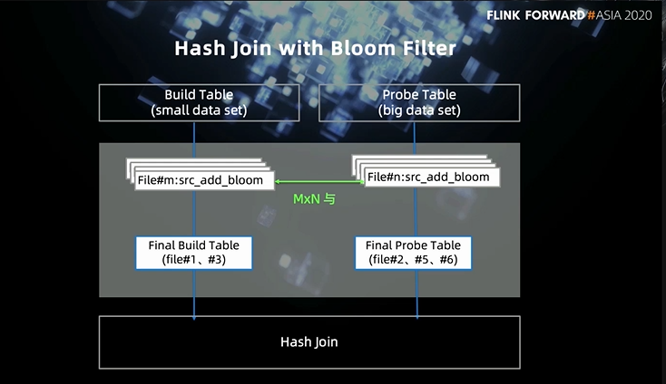

威胁情报的匹配中大量使用 `join` 操作，如果要加速 `join` 的性能，仅仅是 `where` 条件的 `filter pushdown` 是远远不够的。

`Flink` 中已经内置了许多 `join` 算法，比如 `broadcast join` ,  `hash join` 和 `sort merge join` 。其中， `sort merge join` 对预先排好序的表 `join` 非常友好，而上文有提到我们使用 `Hilbert` 曲线来对多字段进行联合排序，所以 `sort merge join` 暂时不在我们的优化范围之内。

另外，我们知道 `join` 的性能和左右表的大小正相关，而威胁情报 `join` 的稀疏度非常高，所以事先对左右表做裁剪，能够大幅减少进入 `join` 阶段的数据。

上文提到过我们已经为常见字段建立了 `bloom` 索引。那么利用这些已经创建好的 `bloom` ，来进行文件预过滤，就变得顺理成章，并且省掉了构建 `bloom` 的时间开销。

对于 `broadcast join` ，我们直接扫描小表，将小表记录依次进入大表所属文件的 `bloom` ，判断该数据块是否需要, 对数据量大的表做预裁剪。

对于 `hash join` ，正如我们看到的，我们可以预先对 `join key` 的文件级 `bloom` 做 `预join` 操作，具体就是将左表所属的某个文件的 `bloom` 依次与右表所属文件的 `bloom` 做 `与` 操作，只保留左右表能与后结果条数不为 `0` 的文件，再让各表剩余的文件进入引擎做后续计算。

比如说图上的这三张表，分别是 `table1` 、 `table2` 和 `table3` 。我们可以从 `index DB` 中获取到表的统计信息，也就是文件个数或者说是文件表的大小。图上就直接列的是文件个数： `table 1` 是 `1000` 个， 然后 `table 2` 是 `5` 万个文件， `table 3` 是 `3` 万个文件。

我们就是参照上一张图片里面的逻辑进行预 `join` ，然后预估 `join` 的成本。我们会让成本低的预 `join` 先进行，这样的话就能够大幅度减少中间结果，提升 `join` 的效率。

### 2.4 Alluxio 作为对象存储的缓存

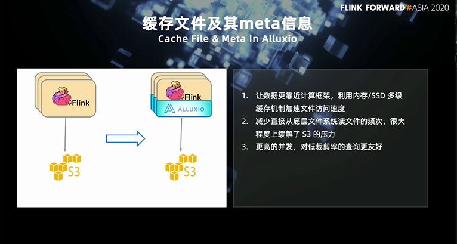

因为底层文件存储系统的多种多样，所以我们选取了 `Alluxio` 数据编排系统， `Alluxio` 的优点是让数据更靠近计算框架，利用内存或者 `SSD` 多级缓存机制加速文件访问，如果在完全命中 `cache` 的情况下，能够达到内存级 `IO` 的文件访问速度，减少直接从底层文件系统读文件的频次，很大程度上缓解了底层文件系统的压力。

对我们系统来说就是它带来了更高的并发，而且对低裁剪率的查询更友好，因为低裁剪率的话就意味着需要读取大量的文件。

如果这些文件在之前的查询中已经被 `load` 到 `cache` 里面，就能够大幅度的提升查询速度。

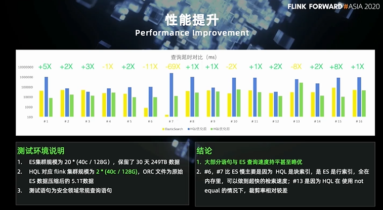

在做完这些优化以后，我们做了性能对比测试。我们选取了一个规模为 `249TB` 的 `es` 集群。它使用了 `20` 台服务器， `Flink` 使用了两台服务器，为了在图标上看到更直观的对比效果，我们选取了 `16` 条测试结果。

图表上红橙色的是 `es` ，蓝色的是 `HQL` 优化前，绿色的是 `HQL` 优化后。上面的数字标签是与 `es` 相比， `HQL` 的性能差值。比如第一个标签就意味着 `HQL` 的性能五倍于 `es` ，其中 `6` 号和 `7` 号比 `es` 慢，主要是因为 `HQL` 是块索引， `es` 是行索引，全在内存里面，所以可以做到超快的检索速度。 `13` 号是因为 `HQL` 在使用 `not equal` 的情况下，裁剪率相对较差。

总体说，优化效果是很明显的，大部分语句在与 `es` 查询速度相比是持平甚至略优的。完全满足客户对长周期数据存储和查询的期望。

## 3 未来规划

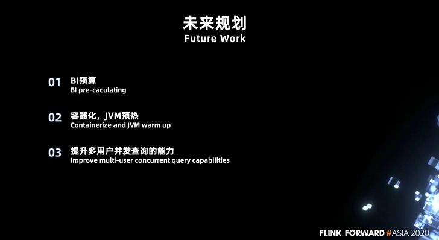

上图是未来规划。因为客户现场经常会涉及到很多的 `BI Dashboard` 运算和长周期运算报告的需求，所以我们下一步会考虑做 `BI` 预算，以及苏军提到的容器化和 `JVM` 预热，当然还有对标 `es` ，以及提升多用户并发查询的能力。
