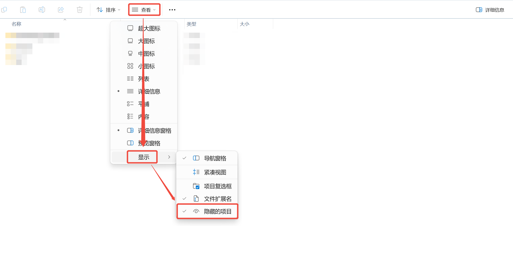
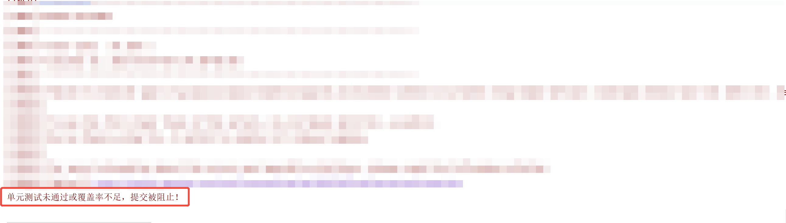

# Git单元测试插件使用教程

## 1 Git钩子介绍

`Git` 钩子（ `Git Hooks` ）是 `Git` 提供的一种强大的功能，它允许你在特定的重要动作（如提交、更新、推送等）发生时，自动执行一些自定义的脚本或操作。通过 `Git` 钩子，你可以自动化许多任务，比如代码检查、测试运行、通知发送等。

### 1.1 Git钩子分类

* 客户端钩子（ `Client-side hooks` ）

    运行在本地仓库中，主要用于控制提交流程或在提交后执行某些操作。

* 服务器端钩子（ `Server-side hooks` ）

    运行在远程仓库服务器上，主要用于控制推送操作或在推送后执行某些操作。

### 1.2 客户端钩子（Client-side hooks）

* `pre-commit`

    * 触发时机：在执行 `git commit` 命令之前。

    * 用途：检查代码质量（如运行测试、代码格式化）、阻止不符合规范的提交。

* `prepare-commit-msg`

    * 触发时机：在提交信息编辑器打开之前。

    * 用途：自动生成提交信息模板或修改提交信息。

* `commit-msg`

    * 触发时机：在提交信息保存后，但提交完成前。

    * 用途：验证提交信息格式是否符合规范。

* `post-commit`

    * 触发时机：在提交完成后。

    * 用途：发送通知、更新文档或执行后续操作。

* `pre-rebase`

    * 触发时机：在执行 `git rebase` 命令之前。

    * 用途：检查是否允许变基操作，或执行预检查。

* `post-checkout`

    * 触发时机：在执行 `git checkout` 或 `git switch` 之后。

    * 用途：更新工作目录、清理临时文件或安装依赖。

* `post-merge`

    * 触发时机：在执行 `git merge` 或 `git pull` 之后。

    * 用途：重新构建项目、更新子模块或清理合并冲突的文件。

* `pre-push`

    * 触发时机：在执行 `git push` 命令之前。

    * 用途：运行测试、检查代码质量或阻止不符合规范的推送。

* `pre-auto-gc`

    * 触发时机：在自动垃圾回收 `git gc --auto` 之前。

    * 用途：清理数据或配置垃圾回收条件。

* `sendemail-validate`

    * 触发时机：在 `git send-email` 发送邮件之前。

    * 用途：验证邮件内容或配置是否正确。

### 1.3 服务器端钩子（Server-side Hooks）

* `pre-receive`

    * 触发时机：在远程仓库接收到推送数据之前。

    * 用途：验证推送的代码是否符合规范（如分支命名、提交签名等）。

* `update`

    * 触发时机：在更新分支或标签时。

    * 用途：拒绝非法推送、记录分支变更历史或执行额外验证。

* `post-receive`

    * 触发时机：在远程仓库接收并处理完推送数据后。

    * 用途：触发部署、更新缓存或发送通知。

* `pre-rebase-verify`

    * 触发时机：在变基操作验证阶段。

    * 用途：检查变基操作是否符合规范（较少使用）。

* `post-update`

    * 触发时机：在更新引用（如分支或标签）后。

    * 用途：更新服务器端的元数据或触发其他操作（较少使用）。

## 2 Git钩子使用说明

### 2.1 脚本文件

使用 `pre-commit` 钩子在 `git` 提交之前进行单元测试。

复制以下内容，保存到本地，命名为 `pre-commit` 。

```shell
#!/bin/sh
# 执行 Maven 测试
mvn clean test

# 检查测试结果
if [ $? -ne 0 ]; then
  echo "单元测试未通过或覆盖率不足，提交被阻止！"
  exit 1
fi
```

添加 `jacoco-maven-plugin` 到 `pom.xml` 中。

```xml
<plugin>
    <groupId>org.jacoco</groupId>
    <artifactId>jacoco-maven-plugin</artifactId>
    <version>0.8.13</version>
    <configuration>
        <destFile>${project.build.directory}/coverage-reports/jacoco.exec</destFile>
        <dataFile>${project.build.directory}/coverage-reports/jacoco.exec</dataFile>
        <outputDirectory>${project.reporting.outputDirectory}/jacoco</outputDirectory>
        <excludes>
            <exclude>**/com/tongtech/alpha/core/**/*</exclude>
            <exclude>**/com/tongtech/alpha/web/**/*</exclude>
        </excludes>
        <includes>
            <include>**/*Controller*</include>
            <include>**/*ServiceImpl*</include>
        </includes>
    </configuration>
    <executions>
        <execution>
            <id>prepare-agent</id>
            <goals>
                <goal>prepare-agent</goal>
            </goals>
        </execution>
        <execution>
            <id>report</id>
            <phase>test</phase>
            <goals>
                <goal>report</goal>
            </goals>
        </execution>
        <execution>
            <id>check</id>
            <phase>test</phase>
            <goals>
                <goal>check</goal>
            </goals>
            <configuration>
                <rules>
                    <rule>
                        <element>BUNDLE</element>
                        <limits>
                            <limit>
                                <counter>LINE</counter>
                                <value>COVEREDRATIO</value>
                                <minimum>0.85</minimum>
                            </limit>
                        </limits>
                    </rule>
                </rules>
            </configuration>
        </execution>
    </executions>
</plugin>
```

### 2.2 配置脚本

1. 打开 `资源管理器`

2. 点击 `查看`

3. 点击 `显示`

4. 勾选 `隐藏的项目`



1. 复制 `pre-commit` 脚本

2. 打开 `项目目录`

3. 打开 `.git` 目录

4. 打开 `hooks` 目录

5. 粘贴 `pre-commit` 脚本

### 2.3 使用脚本

当 `单元测试` 不通过时：



只有当 `单元测试` 通过时，才能成功提交。
