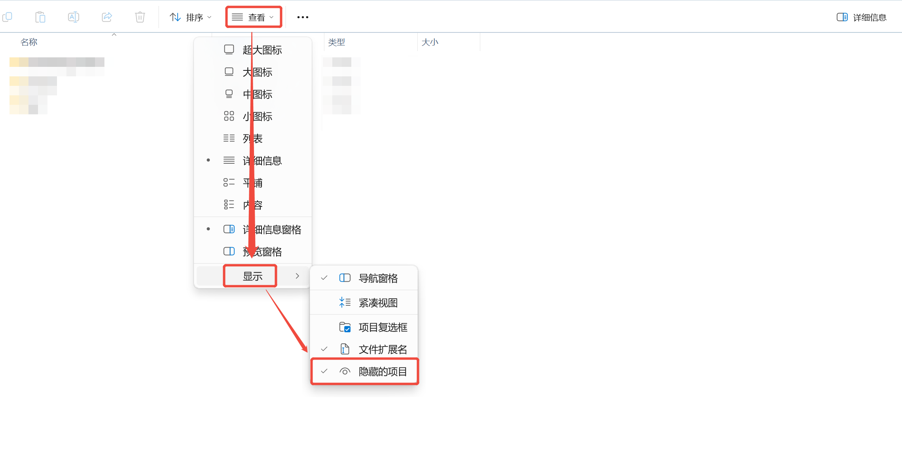

# Git提交规范使用教程

## 1 Git钩子介绍

`Git` 钩子（ `Git Hooks` ）是 `Git` 提供的一种强大的功能，它允许你在特定的重要动作（如提交、更新、推送等）发生时，自动执行一些自定义的脚本或操作。通过 `Git` 钩子，你可以自动化许多任务，比如代码检查、测试运行、通知发送等。

### 1.1 Git钩子分类

* 客户端钩子（ `Client-side hooks` ）

    运行在本地仓库中，主要用于控制提交流程或在提交后执行某些操作。

* 服务器端钩子（ `Server-side hooks` ）

    运行在远程仓库服务器上，主要用于控制推送操作或在推送后执行某些操作。

### 1.2 客户端钩子（Client-side hooks）

* `pre-commit`

    * 触发时机：在执行 `git commit` 命令之前。

    * 用途：检查代码质量（如运行测试、代码格式化）、阻止不符合规范的提交。

* `prepare-commit-msg`

    * 触发时机：在提交信息编辑器打开之前。

    * 用途：自动生成提交信息模板或修改提交信息。

* `commit-msg`

    * 触发时机：在提交信息保存后，但提交完成前。

    * 用途：验证提交信息格式是否符合规范。

* `post-commit`

    * 触发时机：在提交完成后。

    * 用途：发送通知、更新文档或执行后续操作。

* `pre-rebase`

    * 触发时机：在执行 `git rebase` 命令之前。

    * 用途：检查是否允许变基操作，或执行预检查。

* `post-checkout`

    * 触发时机：在执行 `git checkout` 或 `git switch` 之后。

    * 用途：更新工作目录、清理临时文件或安装依赖。

* `post-merge`

    * 触发时机：在执行 `git merge` 或 `git pull` 之后。

    * 用途：重新构建项目、更新子模块或清理合并冲突的文件。

* `pre-push`

    * 触发时机：在执行 `git push` 命令之前。

    * 用途：运行测试、检查代码质量或阻止不符合规范的推送。

* `pre-auto-gc`

    * 触发时机：在自动垃圾回收 `git gc --auto` 之前。

    * 用途：清理数据或配置垃圾回收条件。

* `sendemail-validate`

    * 触发时机：在 `git send-email` 发送邮件之前。

    * 用途：验证邮件内容或配置是否正确。

### 1.3 服务器端钩子（Server-side Hooks）

* `pre-receive`

    * 触发时机：在远程仓库接收到推送数据之前。

    * 用途：验证推送的代码是否符合规范（如分支命名、提交签名等）。

* `update`

    * 触发时机：在更新分支或标签时。

    * 用途：拒绝非法推送、记录分支变更历史或执行额外验证。

* `post-receive`

    * 触发时机：在远程仓库接收并处理完推送数据后。

    * 用途：触发部署、更新缓存或发送通知。

* `pre-rebase-verify`

    * 触发时机：在变基操作验证阶段。

    * 用途：检查变基操作是否符合规范（较少使用）。

* `post-update`

    * 触发时机：在更新引用（如分支或标签）后。

    * 用途：更新服务器端的元数据或触发其他操作（较少使用）。

## 2 Git钩子使用说明

### 2.1 脚本文件

使用 `commit-msg` 钩子对 `git` 提交信息进行校验。

复制以下内容，保存到本地，命名为 `commit-msg` 。

```shell
#!/bin/sh

# 检查commit message是否符合规定的格式

# 提供commit-msg文件的路径作为参数
COMMIT_MSG_FILE=$1

# 定义commit message的正则表达式规则
COMMIT_MSG_PATTERN="^(feat|fix|docs|style|refactor|perf|test|build|ci|chore|revert)(\(.+\))?: .*"

# 读取commit message文件的内容
COMMIT_MSG=$(cat "$COMMIT_MSG_FILE")

# 使用正则表达式匹配commit message
if ! echo "$COMMIT_MSG" | grep -E -q "$COMMIT_MSG_PATTERN"; then
  echo "##############失败原因##############"
  echo "commit message格式错误"
  echo "##############格式要求##############"
  echo "<更改类型>: <简短描述>"
  echo ""
  echo "[详细描述]"
  echo ""
  echo "[关闭问题]"
  echo "##############是否必填##############"
  echo "<>：必填"
  echo "[]：选填"
  echo "##############更改类型##############"
  echo "feat：新功能"
  echo "fix：错误修复"
  echo "docs：修改文档"
  echo "style：格式修改（不影响功能，例如空格、分号等格式修正）"
  echo "refactor：代码重构"
  echo "perf：代码优化"
  echo "test：新增测试"
  echo "build：构建依赖更改"
  echo "ci：更改 CI 配置文件或者脚本"
  echo "chore：杂项任务"
  echo "revert：代码回退"
  exit 1
fi

# 如果commit message符合规定的格式，脚本返回0作为成功的退出码
exit 0
```

### 2.2 配置脚本

1. 打开 `资源管理器`

2. 点击 `查看`

3. 点击 `显示`

4. 勾选 `隐藏的项目`



1. 复制 `commit-msg` 脚本

2. 打开 `项目目录`

3. 打开 `.git` 目录

4. 打开 `hooks` 目录

5. 粘贴 `commit-msg` 脚本

### 2.3 使用脚本

当填写了不符合规范的 `commit message` 并 `提交` 时：


`提交` 会被拦截，并给出提示信息如下：


请根据提示信息修改 `commit message` ，然后重新提交。

只有当提交信息符合规范时，才能成功提交。

## 3 Idea插件Git Commit Message Helper

### 3.1 安装Git Commit Message Helper

1. 打开 `Settings / 设置`

2. 打开 `Plugins / 插件`

3. 搜索 `git commit message helper`

4. 点击 `Install / 安装`

5. 点击 `Restart IDE / 重启IDE`


### 3.2 配置Git Commit Message Helper

1. 打开 `Settings / 设置`

2. 打开 `Other Settings / 其他设置`

3. 打开 `GitCommitMessageHelper`

4. 勾选 `Hidden Option / 隐藏设置` 的 `scope` 、 `changes` 、 `skip ci`


1. 打开 `Commit Template`

2. 复制以下内容到文本框中

    ```shell
    #if($type)${type}#end: #if($subject)${subject}#end
    #if($body)${newline}${newline}${body}#end
    #if($closes)${newline}${newline}${closes}#end
    ```

3. 点击 `Apply / 应用`


### 3.3 使用Git Commit Message Helper

1. 点击 `图标`


1. 选择 `Type of Change / 更改类型`

2. 填写 `Short Description / 简短描述`

3. 填写 `Long Description / 详细描述`

4. 填写 `Closed Issues / 关闭问题`


