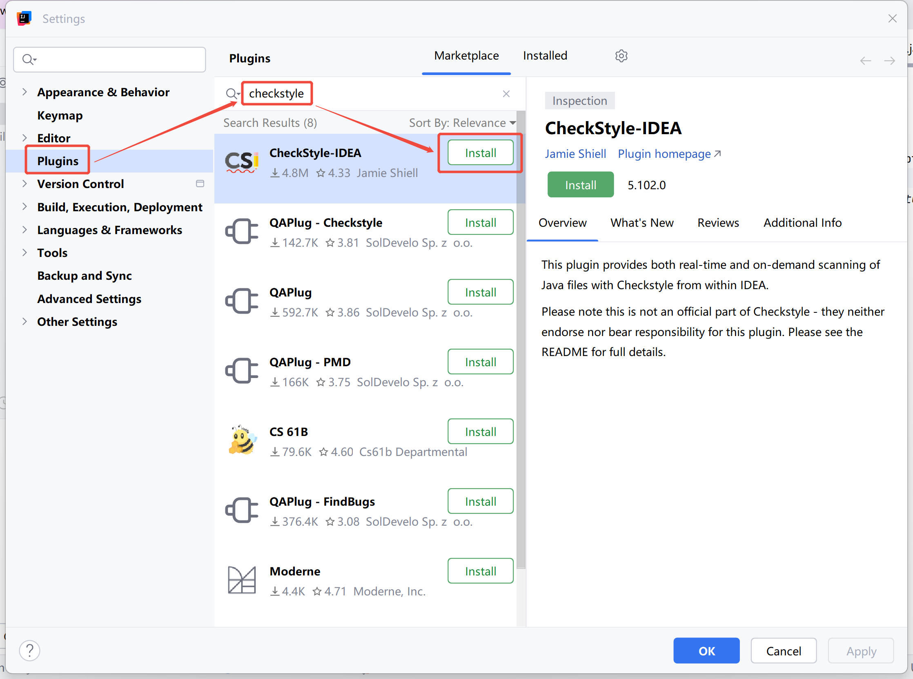
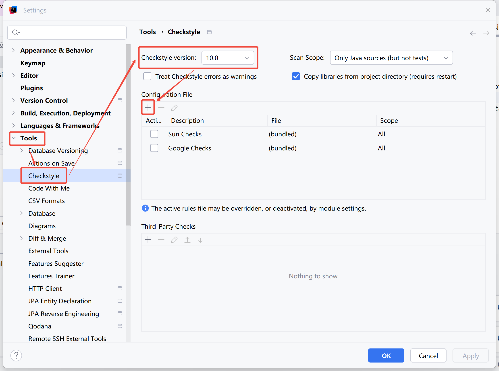
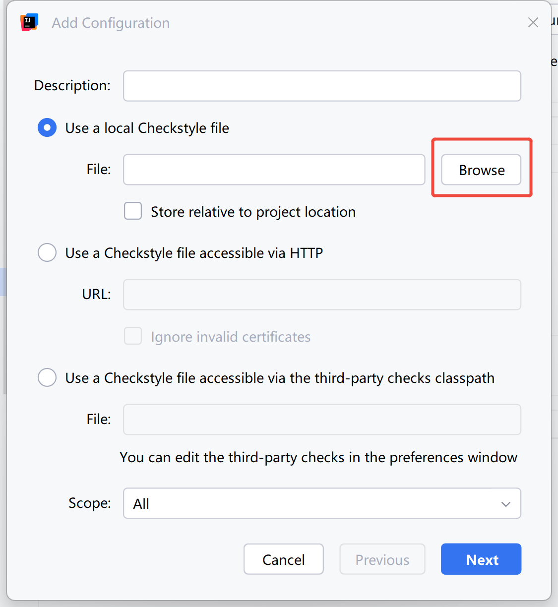
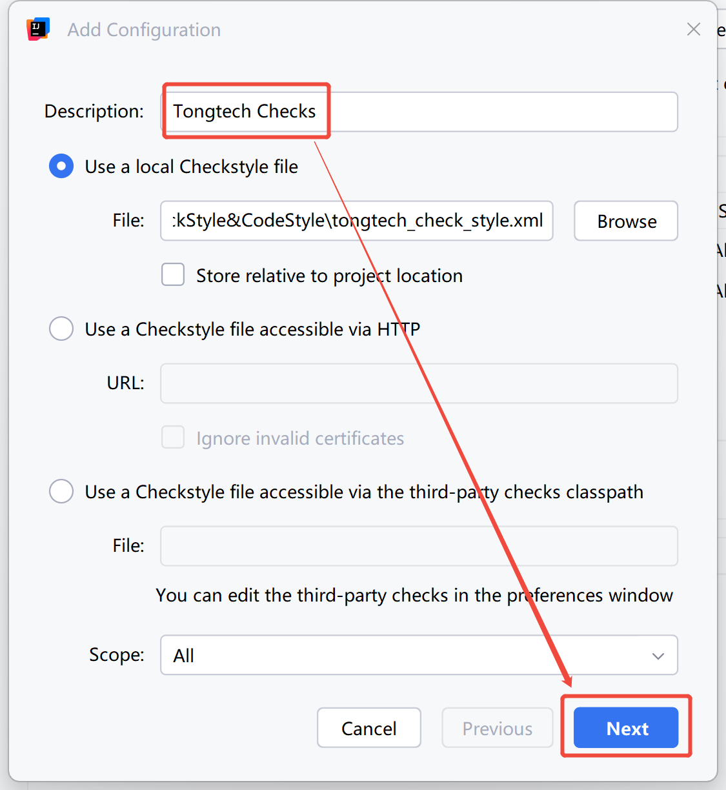
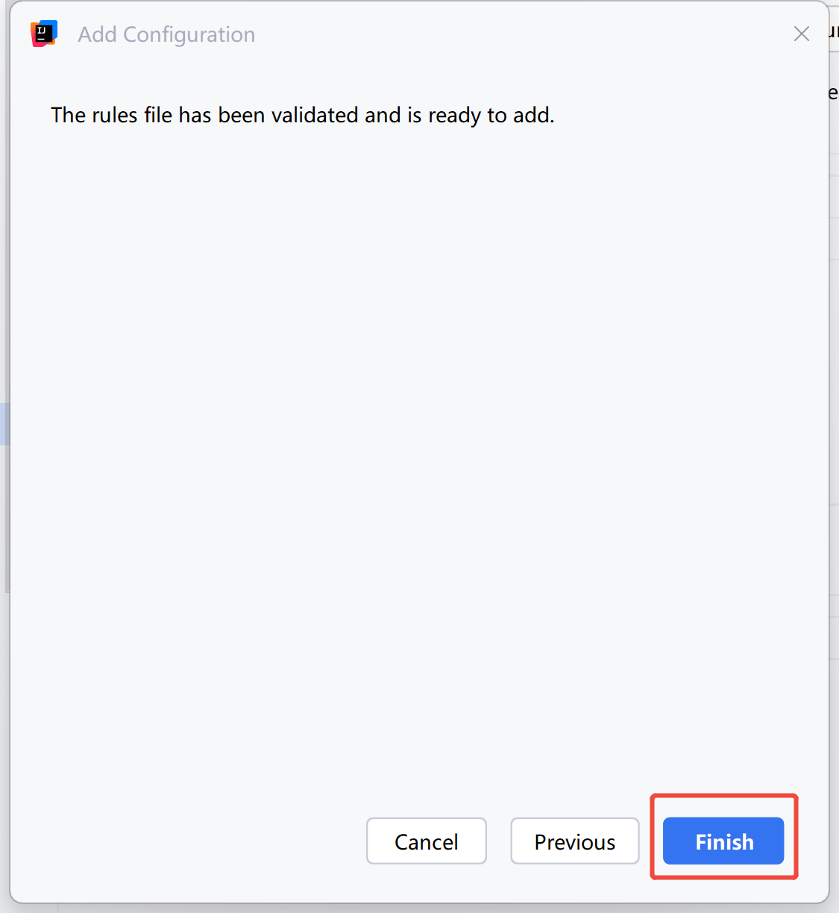
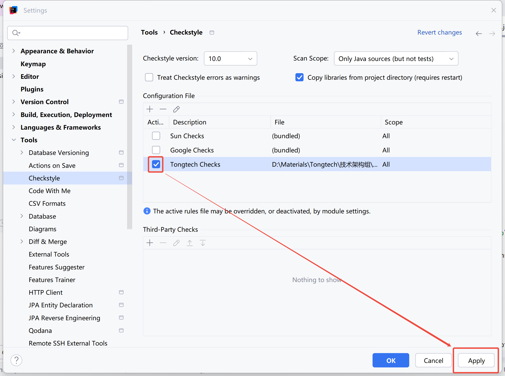
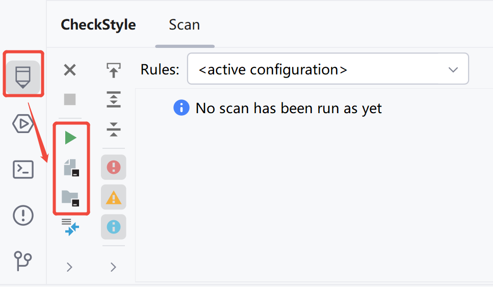
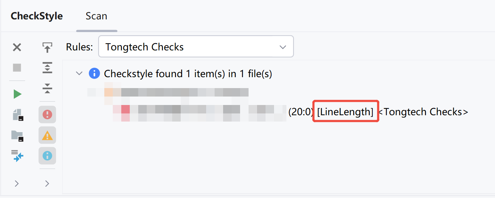
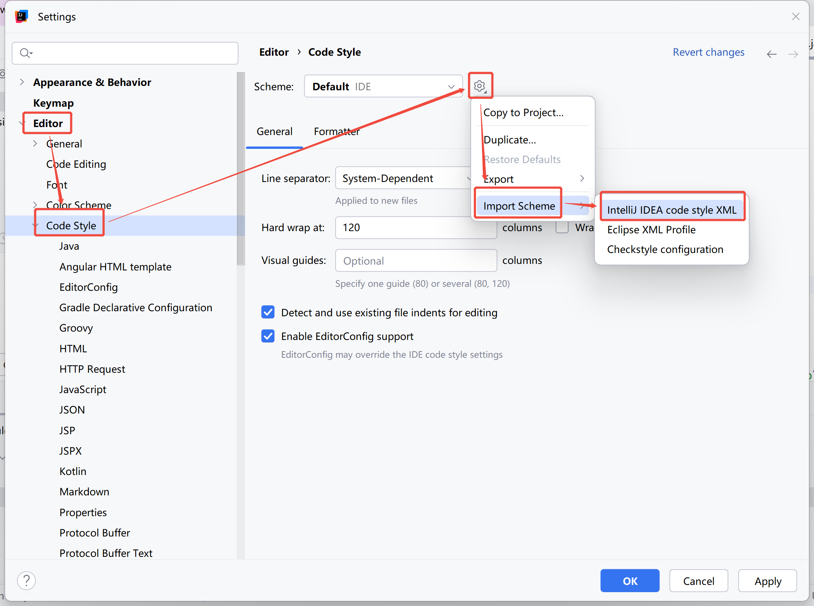
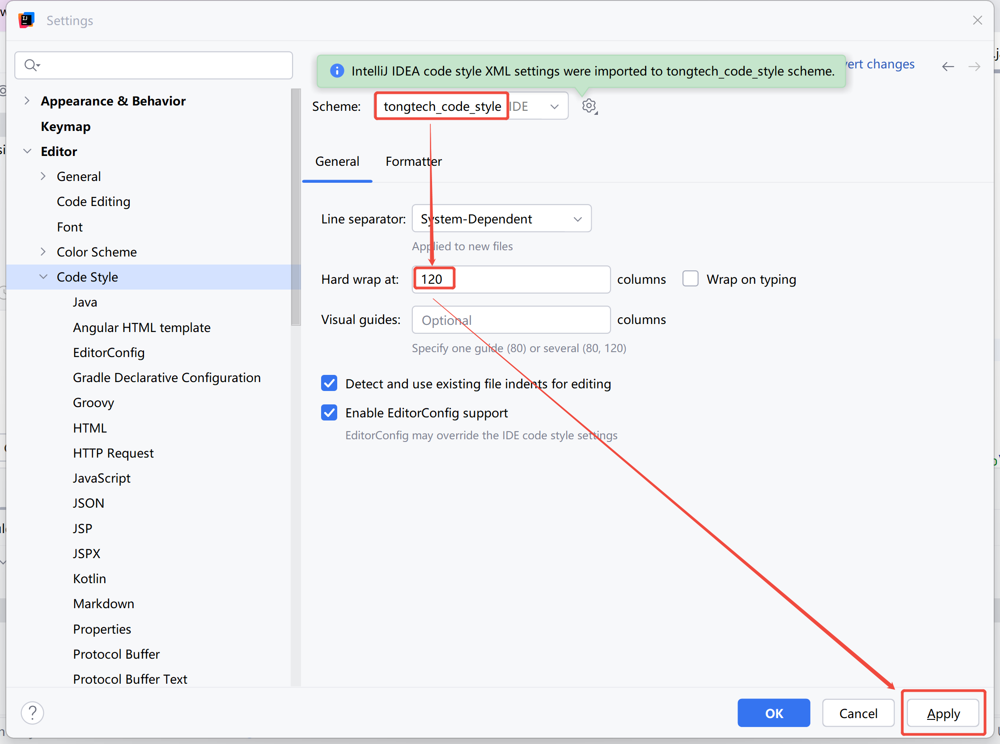

# Idea代码规范插件使用教程

## 1 CheckStyle介绍

`Checkstyle` 是一款开发工具，可帮助程序员编写符合编码标准的 `Java` 代码。它可自动执行检查 `Java` 代码的过程，从而免除人类执行这项枯燥（但重要）的任务。这使其成为希望强制执行编码标准的项目的理想选择。

1. 代码风格检查

    `Checkstyle` 可以检查代码的格式化问题，例如缩进、空格、大括号的使用等，确保代码风格统一。

2. 命名规范检查
  
    它可以检查变量名、方法名、类名等是否符合命名规范（如驼峰命名法、大驼峰命名法等）。

3. 代码质量检查
  
    `Checkstyle` 能够检测一些常见的代码质量问题，例如过长的方法、过大的类、未使用的变量等。

4. 注释检查

    它可以检查代码中的注释是否符合规范，例如是否缺少方法注释、类注释等。

5. 自定义规则

    `Checkstyle` 提供了丰富的配置选项，允许用户根据项目需求自定义检查规则。

## 2 CheckStyle使用说明

### 2.1 配置文件

复制以下内容，保存到本地，命名为 `tongtech_check_style.xml` 。

```xml
<?xml version="1.0"?>
<!DOCTYPE module PUBLIC
          "-//Checkstyle//DTD Checkstyle Configuration 1.3//EN"
          "https://checkstyle.org/dtds/configuration_1_3.dtd">
<module name="Checker">

  <!-- 检查文件是否以一个空行结束 -->
  <module name="NewlineAtEndOfFile"/>

  <!--检查每行的代码长度-->
  <module name="LineLength">
    <!--文件拓展名-->
    <property name="fileExtensions" value="java"/>
    <!--最大长度-->
    <property name="max" value="120"/>
    <!--忽略的正则表达式-->
    <property name="ignorePattern" value="^package.*|^import.*|href\s*=\s*&quot;[^&quot;]*&quot;|http://|https://|ftp://"/>
  </module>

  <!-- 每个java文件一个语法树 -->
  <module name="TreeWalker">
    <!--检查外部类型名称和文件名是否匹配-->
    <module name="OuterTypeFilename"/>

    <!-- import检查-->
    <!-- 避免使用* -->
    <module name="AvoidStarImport"/>
    <!-- 检查是否从非法的包中导入了类 -->
    <module name="IllegalImport"/>
    <!-- 检查是否导入了多余的包 -->
    <module name="RedundantImport"/>
    <!-- 没用的import检查，比如：1.没有被用到2.重复的3.import java.lang的4.import 与该类在同一个package的 -->
    <module name="UnusedImports" />

    <!-- 注释检查 -->
    <!-- 缺少类注释 -->
    <module name="MissingJavadocType">
      <property name="scope" value="protected"/>
      <property name="tokens" value="CLASS_DEF, INTERFACE_DEF, ENUM_DEF,
                      RECORD_DEF, ANNOTATION_DEF"/>
      <property name="excludeScope" value="nothing"/>
    </module>
    <!-- 缺少方法注释 -->
    <module name="MissingJavadocMethod">
      <property name="scope" value="protected"/>
      <property name="allowMissingPropertyJavadoc" value="true"/>
      <property name="allowedAnnotations" value="Override, Test"/>
      <property name="tokens" value="METHOD_DEF, CTOR_DEF, ANNOTATION_FIELD_DEF,
                                   COMPACT_CTOR_DEF"/>
    </module>

    <!-- 命名检查 -->
    <!-- 局部的final变量，包括catch中的参数的检查 -->
    <module name="LocalFinalVariableName" />
    <!-- 局部的非final型的变量，包括catch中的参数的检查 -->
    <module name="LocalVariableName" />
    <!-- 包名的检查（只允许小写字母），默认^[a-z]+(\.[a-zA-Z_][a-zA-Z_0-9_]*)*$ -->
    <module name="PackageName">
      <property name="format" value="^[a-z]+(\.[a-z][a-z0-9]*)*$" />
      <message key="name.invalidPattern" value="包名 ''{0}'' 要符合 ''{1}''格式."/>
    </module>
    <!-- 仅仅是static型的变量（不包括static final型）的检查 -->
    <module name="StaticVariableName" />
    <!-- Class或Interface名检查，默认^[A-Z][a-zA-Z0-9]*$-->
    <module name="TypeName">
      <property name="severity" value="warning"/>
      <message key="name.invalidPattern" value="名称 ''{0}'' 要符合 ''{1}''格式."/>
    </module>
    <!-- 非static型变量的检查 -->
    <module name="MemberName" />
    <!-- 方法名的检查 -->
    <module name="MethodName" />
    <!-- 方法的参数名 -->
    <module name="ParameterName " />
    <!-- 常量名的检查（只允许大写），默认^[A-Z][A-Z0-9]*(_[A-Z0-9]+)*$ -->
    <module name="ConstantName" />

    <!-- 定义检查 -->
    <!-- 检查数组类型定义的样式 -->
    <module name="ArrayTypeStyle"/>
    <!-- 检查long型定义是否有大写的“L” -->
    <module name="UpperEll"/>

    <!-- 缩进检查 -->
    <module name="Indentation">
      <!-- 下一行的缩进 -->
      <property name="basicOffset" value="4"/>
      <!-- 下一行的括号缩进 -->
      <property name="braceAdjustment" value="4"/>
      <!-- 下一行的case缩进 -->
      <property name="caseIndent" value="4"/>
      <!-- 下一行的throws缩进 -->
      <property name="throwsIndent" value="8"/>
      <!-- 下一行的换行缩进 -->
      <property name="lineWrappingIndentation" value="8"/>
      <!-- 下一行的array缩进 -->
      <property name="arrayInitIndent" value="4"/>
    </module>

    <!-- 空格检查-->
    <!-- 方法名后跟左圆括号"(" -->
    <module name="MethodParamPad" />
    <!-- 在类型转换时，不允许左圆括号右边有空格，也不允许与右圆括号左边有空格 -->
    <module name="TypecastParenPad" />
    <!-- 检查在某个特定关键字之后应保留空格 -->
    <module name="NoWhitespaceAfter"/>
    <!-- 检查在某个特定关键字之前应保留空格 -->
    <module name="NoWhitespaceBefore"/>
    <!-- 圆括号空白 -->
    <module name="ParenPad"/>
    <!-- 检查分隔符是否在空白之后 -->
    <module name="WhitespaceAfter"/>
    <!-- 检查分隔符周围是否有空白 -->
    <module name="WhitespaceAround"/>

    <!-- 修饰符检查 -->
    <!-- 检查修饰符的顺序是否遵照java语言规范，默认public、protected、private、abstract、static、final、transient、volatile、synchronized、native、strictfp -->
    <module name="ModifierOrder"/>
    <!-- 检查接口和annotation中是否有多余修饰符，如接口方法不必使用public -->
    <module name="RedundantModifier"/>

    <!-- 代码块检查 -->
    <!-- 检查是否有嵌套代码块 -->
    <module name="AvoidNestedBlocks"/>
    <!-- 检查是否有空代码块 -->
    <module name="EmptyBlock"/>
    <!-- 检查左大括号位置 -->
    <module name="LeftCurly"/>
    <!-- 检查代码块是否缺失{} -->
    <module name="NeedBraces"/>
    <!-- 检查右大括号位置 -->
    <module name="RightCurly"/>

    <!-- 代码检查 -->
    <!-- 检查空的代码段 -->
    <module name="EmptyStatement"/>
    <!-- 检查在重写了equals方法后是否重写了hashCode方法 -->
    <module name="EqualsHashCode"/>
    <!-- 检查子表达式中是否有赋值操作 -->
    <module name="InnerAssignment"/>
    <!-- 检查switch语句是否有default -->
    <module name="MissingSwitchDefault"/>
    <!-- 检查是否有过度复杂的布尔表达式 -->
    <module name="SimplifyBooleanExpression"/>
    <!-- 检查是否有过于复杂的布尔返回代码段 -->
    <module name="SimplifyBooleanReturn"/>

    <!-- 语法 -->
    <!-- String的比较不能用!= 和 == -->
    <module name="StringLiteralEquality"/>
    <!-- clone方法必须调用了super.clone() -->
    <module name="SuperClone" />
    <!-- finalize 必须调用了super.finalize() -->
    <module name="SuperFinalize" />
  </module>
</module>
```

### 2.2 Idea安装CheckStyle

1. 打开 `Settings / 设置`

2. 打开 `Plugins / 插件`

3. 搜索 `checkstyle`

4. 点击 `Install / 安装`

5. 点击 `Restart IDE / 重启IDE`



### 2.3 Idea配置CheckStyle

1. 打开 `Settings / 设置`

2. 打开 `Tools / 工具`

3. 打开 `Checkstyle`

4. 选择 `Checkstyle version` 为 `10.0`

5. 点击 `+`



1. 点击 `Browse`

2. 选择 `tongtech_check_style.xml`



1. 在 `Description` 输入 `Tongtech Checks`

2. 点击 `Next`



1. 点击 `Finish`



1. 勾选 `Tongtech Checks`

2. 点击 `Apply / 应用`



### 2.4 Idea使用CheckStyle

1. 点击 `CheckStyle`

2. 点击 `Check Current File` 检查当前文件

3. 点击 `Check Module` 检查当前模块

4. 点击 `Check Project` 检查当前项目



### 2.5 忽略告警

以 `行长度` 告警为例，添加 `@SuppressWarnings` 注解，并填写对应 `value` 值。

```java
@SuppressWarnings("checkstyle:LineLength")
String a = "123456789012345678901234567890123456789012345678901234567890123456789012345678901234567890123456789012345678901234567890123456789012345678901234567890123456789012345678901234567890123456789012345678901234567890123456789012345678901234567890123456789012345678901234567890123456789012345678901234567890123456789012345678901234567890123456789012345678901234567890123456789012345678901234567890123456789012345678901234567890123456789012345678901234567890123456789012345678901234567890";
```

`value` 值为 `checkstyle:校验规则` ，以下是 `校验规则` 获取方法：



## 3 CodeStyle使用说明

### 3.1 配置文件

复制以下内容，保存到本地，命名为 `tongtech_code_style.xml` 。

```xml
<code_scheme name="tongtech_code_style" version="173">
  <JavaCodeStyleSettings>
    <option name="SPACE_INSIDE_ONE_LINE_ENUM_BRACES" value="true" />
    <option name="CLASS_COUNT_TO_USE_IMPORT_ON_DEMAND" value="999" />
    <option name="NAMES_COUNT_TO_USE_IMPORT_ON_DEMAND" value="999" />
    <option name="PACKAGES_TO_USE_IMPORT_ON_DEMAND">
      <value />
    </option>
  </JavaCodeStyleSettings>
  <codeStyleSettings language="JAVA">
    <option name="RIGHT_MARGIN" value="120" />
    <option name="SPACE_BEFORE_ARRAY_INITIALIZER_LBRACE" value="true" />
    <option name="CALL_PARAMETERS_WRAP" value="1" />
    <option name="METHOD_PARAMETERS_WRAP" value="1" />
    <option name="RESOURCE_LIST_WRAP" value="1" />
    <option name="EXTENDS_LIST_WRAP" value="1" />
    <option name="THROWS_LIST_WRAP" value="1" />
    <option name="EXTENDS_KEYWORD_WRAP" value="1" />
    <option name="THROWS_KEYWORD_WRAP" value="1" />
    <option name="METHOD_CALL_CHAIN_WRAP" value="1" />
    <option name="BINARY_OPERATION_WRAP" value="1" />
    <option name="TERNARY_OPERATION_WRAP" value="1" />
    <option name="FOR_STATEMENT_WRAP" value="1" />
    <option name="ARRAY_INITIALIZER_WRAP" value="1" />
    <option name="ASSIGNMENT_WRAP" value="1" />
    <option name="ASSERT_STATEMENT_WRAP" value="1" />
    <option name="IF_BRACE_FORCE" value="3" />
    <option name="DOWHILE_BRACE_FORCE" value="3" />
    <option name="WHILE_BRACE_FORCE" value="3" />
    <option name="FOR_BRACE_FORCE" value="3" />
    <option name="PARAMETER_ANNOTATION_WRAP" value="1" />
    <option name="VARIABLE_ANNOTATION_WRAP" value="1" />
    <option name="ENUM_CONSTANTS_WRAP" value="1" />
  </codeStyleSettings>
</code_scheme>
```

### 3.2 Idea配置CodeStyle

1. 打开 `Settings / 设置`

2. 打开 `Editor / 编辑器`

3. 打开 `Code Style / 代码样式`

4. 点击 `齿轮`

5. 点击 `Import Scheme / 导入方案`

6. 点击 `IntelliJ IDEA code style XML / IntelliJ IDEA 代码样式 XML`

7. 选择 `tongtech_code_style.xml`



1. 在 `Scheme / 方案` 选择 `tongtech_code_style`

2. 在 `Hard wrap at / 强制换行位置` 输入 `120`

3. 点击 `Applay / 应用`



### 3.3 Idea使用CodeStyle

格式化代码

* `Idea` 快捷键： `Ctrl + Alt + L`

* `Eclipse` 快捷键： `Ctrl + Shift + F`
