# Idea代码质量插件使用教程

## 1 SonarQube介绍

`SonarQube` 是一个开源的代码质量管理平台，主要用于检测代码中的错误、漏洞、代码规范问题、重复代码、单元测试覆盖率等，并提供详细的质量报告。它支持多种编程语言，包括 `Java` 、 `C#` 、 `JavaScript` 、 `Python` 等。 `SonarQube` 通过插件形式，可以集成不同的测试工具、代码分析工具以及持续集成工具，如 `Jenkins` 。

* 主要功能

    * 静态代码分析： `SonarQube` 能够对源代码进行逐行分析，检测代码中的问题，如代码重复、不规范的命名、潜在的错误、代码坏味道等。

    * 代码质量度量和指标：提供丰富的代码质量度量和指标，如代码覆盖率、代码复杂性、代码重复率等，帮助团队评估代码的健康状况。

    * 代码安全性分析：检测代码中的潜在安全漏洞和脆弱性，识别常见的安全问题，如跨站脚本攻击、 `SQL` 注入等。

    * 代码设计分析：分析类之间的关系是否合理，检测循环、耦合等问题，帮助团队优化代码结构。

* 用途

    * 持续集成和持续交付（ `CI/CD` ）流程： `SonarQube` 可以与 `CI/CD` 流程集成，实现代码的持续质量检查。

    * 代码评审和反馈：通过 `SonarQube` 的分析结果，开发团队可以及时发现并修复代码中的问题，提高代码质量。

    * 团队协作：不同角色的团队成员可以通过 `SonarQube` 分享反馈和建议，促进团队协作。

* 组成部分

    * `SonarQube Server` ：用于处理和展示分析结果的服务器。

    * `SonarQube Database` ：存储分析数据的数据库。

    * `SonarQube Plugins` ：扩展 `SonarQube` 功能的插件。

    * `SonarQube Scanner` ：用于扫描项目代码的工具。

* 工作流程

    1. 开发人员在本地使用 `SonarLint` 运行分析。

    2. 将代码提交到代码管理平台（如 `GitLab` 、 `GitHub` ）。

    3. 持续集成工具（如 `Jenkins` ）自动触发构建，调用 `SonarScanner` 对项目代码进行扫描分析。

    4. 分析报告发送到 `SonarQube Server` 进行加工。

    5. `SonarQube Server` 加工并保存分析报告到数据库中，通过 `UI` 展示分析结果。

`SonarQube` 通过上述功能和流程，帮助开发团队在软件开发过程中及早发现、修复和预防代码质量问题，从而提高代码的可维护性、可靠性和安全性。

## 2 SonarLint使用说明

### 2.1 Idea安装SonarLint

1. 打开 `Settings / 设置`

2. 打开 `Plugins / 插件`

3. 搜索 `sonar`

4. 点击 `Install / 安装`

5. 点击 `Restart IDE / 重启IDE`

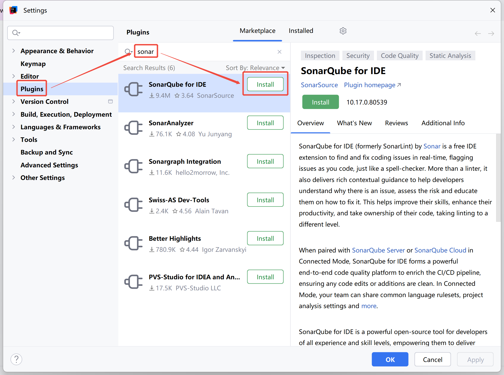

### 2.2 Idea配置SonarLint

1. 打开 `Settings / 设置`

2. 打开 `Tools / 工具`

3. 打开 `SonarQube for IDE`

4. 点击 `+`

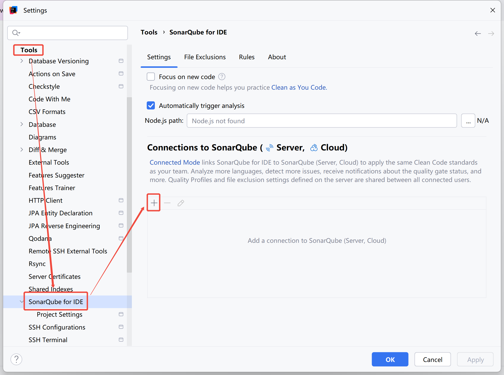

1. 在 `Connection Name` 输入 `Tongtech SonarQube Server`

2. 勾选 `SonarQube Server`

3. 在 `SonarQube Server URL` 输入 `http://172.16.80.65:9001/`

4. 点击 `Next / 下一步`

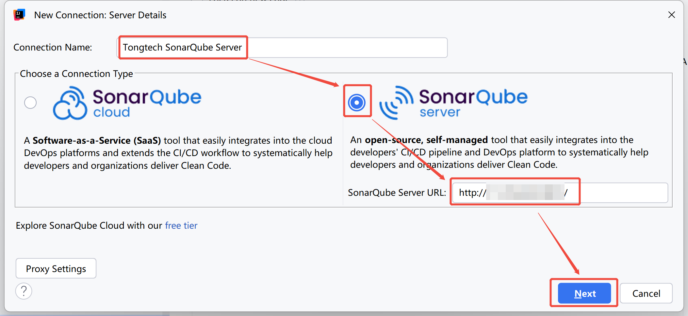

1. 点击 `Create token`

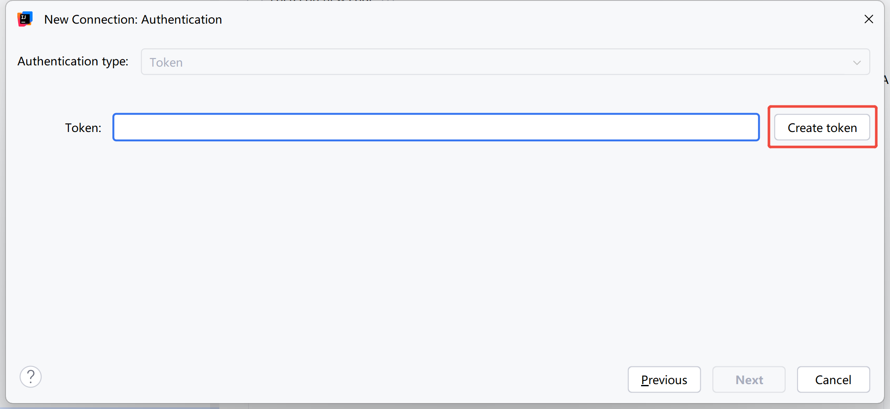

1. 点击 `允许连接`

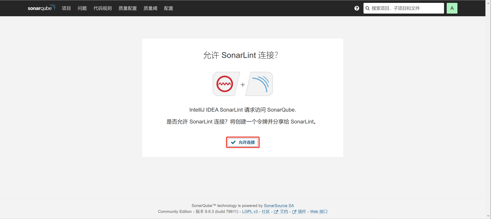

1. 点击 `Next / 下一步`

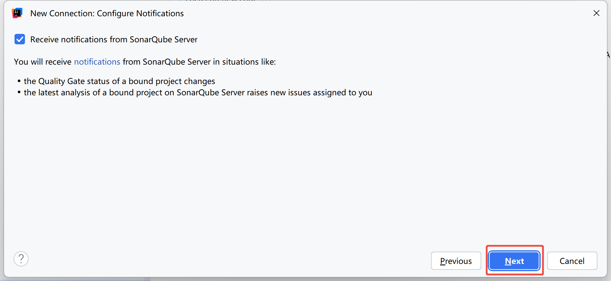

1. 点击 `Create / 创建`

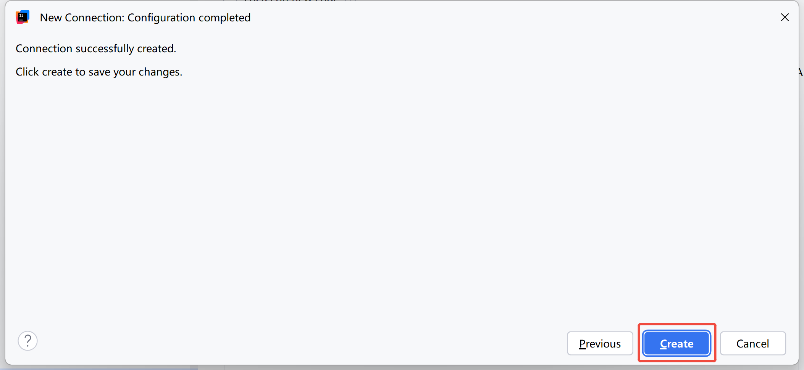

1. 点击 `Applay / 应用`

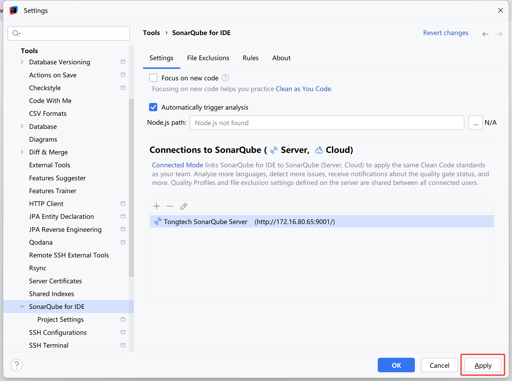

1. 打开 `Settings / 设置`

2. 打开 `Tools / 工具`

3. 打开 `SonarQube for IDE`

4. 打开 `Project Settings`

5. 勾选 `Bind project to SonarQube(Server,Cloud)`

6. 在 `Connection` 选择 `Tongtech SonarQube Server`

7. 点击 `Search in list...`

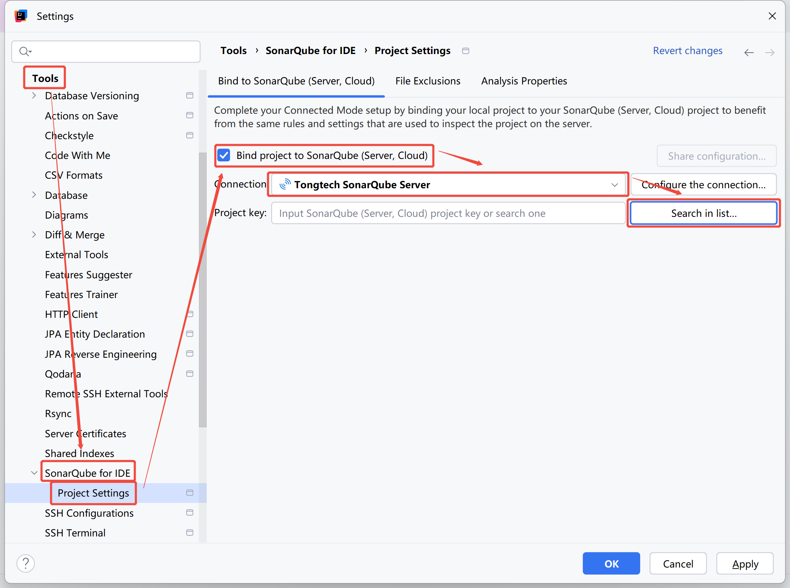

1. 选择 `对应项目`

2. 点击 `OK / 确定`

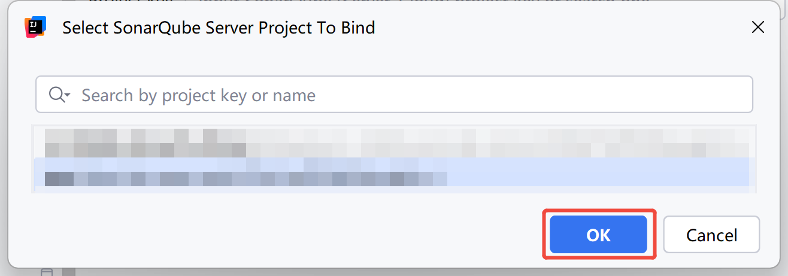

1. 点击 `Apply / 应用`

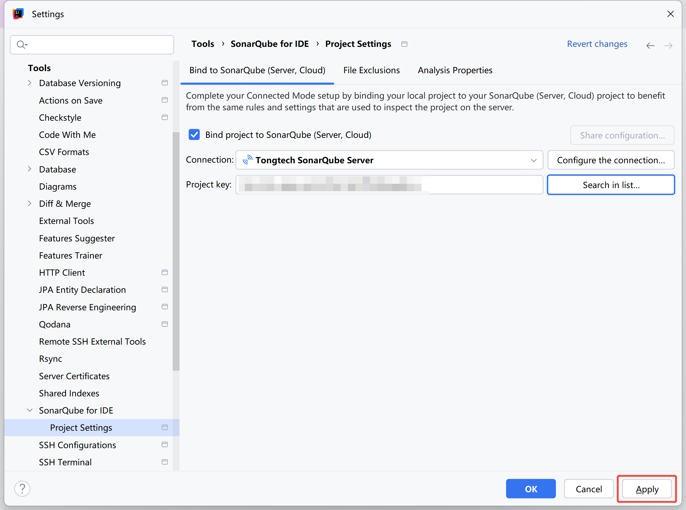

### 2.3 Idea使用SonarLint

#### 2.3.1 方法一

1. 打开 `File / 文件`

2. 点击 `SonarLint`

3. 点击 `Analyze Current File`

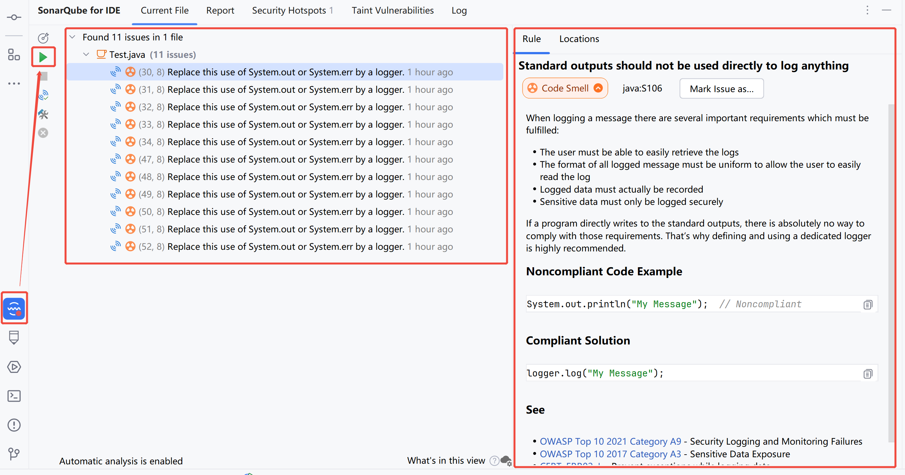

#### 2.3.2 方法二

1. 右键 `Project / 项目` 或 `File / 文件`

2. 选择 `SonarQube for IDE`

3. 点击 `Anaylze with SonarQube for IDE`

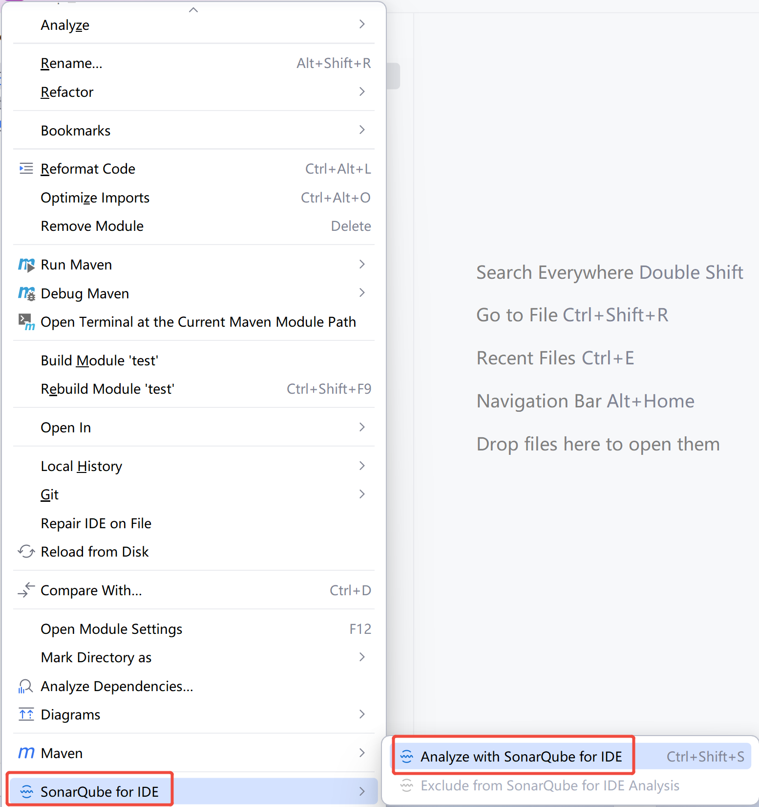
