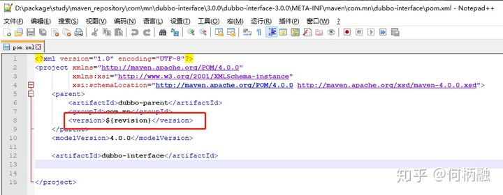

# 1 使用flatten-maven-plugin插件统一管理版本号

## 1 发现问题

当项目分为多个子包时，通常都会引用同一个 `父包（Parent）` 进行依赖版本的统一管理。但是，对于每个子包的版本管理，还是独立的。举个栗子：

* 子包

    

* 父包

    

可以看到，在子包中要写死父包的版本号，这样一来，每次进行版本号更迭时，都要对每个子包进行一次修改。

## 2 解决问题

首先，父包的作用就是统一管理版本，那么理想中的状态就是，当我们修改了父包的版本后，所有子包都会生效，即放弃使用子包中写死的这种写法。在 `Maven 3.5.0-beta-1` 开始，可以使用 `{revision}` 作为版本的占位符，从而达到统一从父包修改的效果。举个栗子：

* 父包

    

* 子包

    

到这一步，已经基本实现了父包的统一管理，但是在install、deploy的时候会出现问题，在打包后的pom文件中 revision 依旧是个变量。举个栗子：



为了解决这个问题，可以在父包中引入 flatten-maven-plugin 插件，其作用就是将 revision 变量替换为实际的值。

```xml
<plugin>
        <groupId>org.codehaus.mojo</groupId>
        <artifactId>flatten-maven-plugin</artifactId>
        <version>1.1.0</version>
        <configuration>
                <updatePomFile>true</updatePomFile>
                <flattenMode>resolveCiFriendliesOnly</flattenMode>
        </configuration>
        <executions>
                <execution>
                        <id>flatten</id>
                        <phase>process-resources</phase>
                        <goals>
                                <goal>flatten</goal>
                        </goals>
                </execution>
                <execution>
                        <id>flatten.clean</id>
                        <phase>clean</phase>
                        <goals>
                                <goal>clean</goal>
                        </goals>
                </execution>
        </executions>
</plugin>
```

在install后，会发现项目目录中多了 `.flattened-pom.xml` ，其原理是将 `.flattened-pom.xml（已替换变量的pom）` 替换到jar包中。

至此，通过使用 `flatten-maven-plugin` 插件实现了在父包中进行统一的版本管理。
