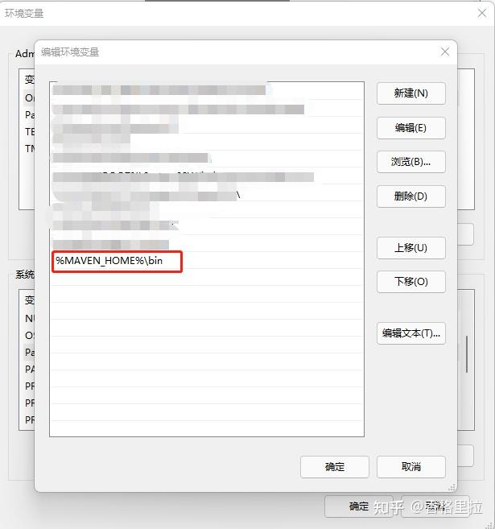

# Maven使用手册

## 1 下载maven

进入官网下载需要的版本：[Maven - 下载Apache Maven](https://maven.apache.org/download.cgi)


## 2 安装maven

将下载的压缩包解压到非中文、没有空格的目录，在解压目录中，我们需要着重关注 `Maven` 的核心配置文件： `conf/settings.xml`

## 3 创建本地仓库

本地仓库这个目录，我们手动创建一个空的目录即可。

## 4 指定本地仓库

本地仓库默认值：用户家目录 `/.m2/repository` 。由于本地仓库的默认位置是在用户的家目录下，而家目录往往是在 `C盘` ，也就是系统盘。将来 `Maven` 仓库中 `jar` 包越来越多，仓库体积越来越大，可能会拖慢 `C盘` 运行速度，影响系统性能。所以建议将 `Maven` 的本地仓库放在其他盘符下。

配置方式如下：
打开 `maven` 里的 `conf` 文件，打开 `setings.xml` 文件，配置本地仓库文件

```xml
<!-- localRepository
| The path to the local repository maven will use to store artifacts.
|
| Default: ${user.home}/.m2/repository
<localRepository>/path/to/local/repo</localRepository>
-->
<localRepository>D:\mavenRepository</localRepository>
<!--mavenRepository是自己创建的仓库名-->
```

!!! tip

    记住：一定要把 `localRepository` 标签从注释中拿出来。

    注意：本地仓库本身也需要使用一个非中文、没有空格的目录。

## 5 配置阿里云提供的镜像仓库

!!! tip

    为什么要配置阿里云提供的镜像仓库？

`Maven` 下载 `jar` 包默认访问境外的中央仓库，速度很慢。改成阿里云提供的镜像仓库，访问国内网站，可以让 `Maven` 下载 `jar` 包的时候速度更快。

配置的方式是：

打开 `maven` 里的 `conf` 文件，打开 `setings.xml` 文件，

将下面 `mirror` 标签整体复制到 `mirrors` 标签的内部。

```xml
<mirrors>
    <mirror>
        <id>nexus-aliyun</id>
        <mirrorOf>central</mirrorOf>
        <name>Nexus aliyun</name>
        <url>http://maven.aliyun.com/nexus/content/groups/public</url>
    </mirror>
</mirrors>
```

## 6 配置Maven工程的基础JDK版本

!!! tip

    如果按照默认配置运行， `Java` 工程使用的 `JDK` 版本是 `1.5` 。

配置的方式是：

打开 `maven` 里的 `conf` 文件，打开 `setings.xml` 文件，

将 `profile` 标签整个复制到 `profiles` 标签内。

```xml
<profiles>
    <profile>
      <id>jdk-1.8</id>
      <activation>
        <activeByDefault>true</activeByDefault>
        <jdk>1.8</jdk>
      </activation>
      <properties>
        <maven.compiler.source>1.8</maven.compiler.source>
        <maven.compiler.target>1.8</maven.compiler.target>
        <maven.compiler.compilerVersion>1.8</maven.compiler.compilerVersion>
      </properties>
    </profile>
</profiles>
```

## 7 配置环境变量

!!! tip

    `Maven` 是一个用 `Java` 语言开发的程序，它必须基于 `JDK` 来运行，需要通过 `JAVA_HOME` 来找到 `JDK` 的安装位置。


可以使用下面的命令验证：

```shell
C:\Users\Administrator>echo %JAVA_HOME%
D:\software\Java
C:\Users\Administrator>java -version
java version "1.8.0_141"
Java(TM) SE Runtime Environment (build 1.8.0_141-b15)
Java HotSpot(TM) 64-Bit Server VM (build 25.141-b15, mixed mode)
```

## 8 配置MAVEN_HOME


配置环境变量的规律：

`XXX_HOME` 指向的是 `bin` 目录的上一级

`PATH` 指向的是 `bin` 目录

配置path：



验证：

```shell
C:\Users\Administrator>mvn -v
Apache Maven 3.5.4 (1edded0938998edf8bf061f1ceb3cfdeccf443fe; 2018-06-18T02:33:14+08:00)
Maven home: D:\software\apache-maven-3.5.4\bin\..
Java version: 1.8.0_141, vendor: Oracle Corporation, runtime: D:\software\Java\jre
Default locale: zh_CN, platform encoding: GBK
OS name: "windows 10", version: "10.0", arch: "amd64", family: "windows"
```

## 9 Maven的仓库和坐标

### 9.1 Maven的仓库

`maven` 的仓库就是 `maven` 存放 `jar` 包的位置，主要分为如下三类仓库

| 仓库名称 | 作用 |
| -- | -- |
| 本地仓库 | 相当于缓存，工程第一次会从远程仓库（互联网）去下载 `jar` 包，将 `jar` 包存在本地仓库（在程序员的电脑上）。第二次不需要从远程仓库去下载。先从本地仓库找，如果找不到才会去远程仓库找。 |
| 中央仓库 | 仓库中 `jar` 由专业团队（ `maven` 团队）统一维护。中央仓库的地址：[https://repo1.maven.org/maven2/](https://repo1.maven.org/maven2/) |
| 远程仓库 | 在公司内部架设一台私服，其它公司架设一台仓库，对外公开。 |

### 9.2 Maven的坐标

`Maven` 的一个核心的作用就是管理项目的依赖，引入我们所需的各种 `jar` 包等。为了能自动化的解析任何一个 `Java` 构件， `Maven` 必须将这些 `Jar` 包或者其他资源进行唯一标识，这是管理项目的依赖的基础，也就是我们要说的坐标。包括我们自己开发的项目，也是要通过坐标进行唯一标识的，这样才能在其它项目中进行依赖引用。坐标的定义元素如下：

* `groupId` ：项目组织唯一的标识符，实际对应 `JAVA` 的包的结构（一般写公司的组织名称 `eg:com.itheima,com.alibaba` ）

* `artifactId` ：项目的名称

* `version` ：定义项目的当前版本

例如：要引入 `druid` ，只需要在 `pom.xml` 配置文件中配置引入 `druid` 的坐标即可：

```xml
<dependecies>
  <!--druid连接池-->
  <dependency>
      <groupId>com.alibaba</groupId>
      <artifactId>druid</artifactId>    
      <version>1.0.9</version>
  </dependency>
    <dependency>
      <groupId>mysql</groupId>
        <artifactId>mysql-connector-java</artifactId>
        <version>5.1.6</version>
    </dependency>
    <dependency>
        <groupId>com.alibaba</groupId>
      <artifactId>fastjson</artifactId>    
      <version>1.1.39</version>
    </dependency>
</dependecies>
```

## 10 在IDEA中集成Maven

### 10.1 配置maven软件的安装路径和本地仓库路径


### 10.2 配置Maven的Runner参数

参数一： `-DarchetypeCatalog=internal` 解决使用骨架构建 `Maven` 项目时候会卡住的问题

参数二： `-Dfile.encoding=GB2312` 解决 `Maven` 工程中控制台输出中文乱码的问题


注意事项：

上述配置如果是在 `settings` 中进行配置则只会对当前 `Project` 生效，后续创建的新的 `Project` 不会生效


如果是在 `New Projects Setup` 里面的 `setting for new projects` 中配置，则会对后续创建的所有新的 `Project` 都生效，但是无法对当前项目生效


## 11 使用IDEA创建基于Maven的工程

使用 `IDEA` 创建基于 `Maven` 的工程有两种方式：

1. 使用 `Maven` 骨架创建（不建议使用，因为构建速度慢，而且容易卡死）

2. 不使用 `Maven` 骨架创建（建议使用），我们以后创建 `Maven` 工程就选择这种方式创建

### 11.1 创建JavaSE工程

1. 第一步

    

2. 第二步

    

创建后的工程目录


引入单元测试的依赖

```xml
<dependency>
    <groupId>junit</groupId>
    <artifactId>junit</artifactId>
    <version>4.13</version>
    <!--指定当前依赖的使用范围，只能在test目录中使用-->
    <scope>test</scope>
</dependency>
```

### 11.2 创建JavaWeb工程

1. 在 `IDEA` 中安装一个插件（ `JBLJavaToWeb` ）

2. 按照创建 `javase` 工程的方式创建（此时创建出来的是 `javase` 工程）

3. 使用 `JBLJavaToWeb` 插件将 `javase` 工程转成 `javaweb` 工程


转换之后会在 `main` 目录中多出一个 `web` 目录，并且 `pom.xml` 文件中会自动添加打包方式为 `<packaging>war<packaging/>`

因为我们需要在 `javaweb` 项目中使用 `Servlet` ，所以需要引入 `Servlet` 的依赖

```xml
<dependency>
    <groupId>javax.servlet</groupId>
    <artifactId>javax.servlet-api</artifactId>
    <version>3.1.0</version>
    <scope>provided</scope>
</dependency>
```

## 12 Maven构建命令

执行 `Maven` 构建命令有两种方式：

1. 如果是自己使用 `IDEA` 创建的 `Maven` 工程，可以自己直接在 `IDEA` 的 `Maven` 面板上执行相应的构建命令

2. 如果是该项目是从其它地方拷贝过来的，并且没有在 `IDEA` 上打开，则可以使用命令行来进行 `Maven` 构建

注意事项：

运行 `Maven` 中和构建操作相关的命令时，必须进入到 `pom.xml` 所在的目录。如果没有在 `pom.xml` 所在的目录运行 `Maven` 的构建命令，那么会看到下面的错误信息：

```shell
The goal you specified requires a project to execute but there is no POM in this directory
```

### 12.1 清理程序

`mvn clean` 命令是清除项目的编译内容，具体的效果是删除 `target` 目录

### 12.2 编译程序

`compile` 命令是对工程进行编译，具体效果是产生 `target` 目录，而编译又分为：编译主程序和编译测试程序

#### 12.2.1 编译主程序

`mvn compile` 命令是编译主程序，主程序编译之后的文件会生成在 `target/classes` 目录中

#### 12.2.2 编译测试程序

`mvn test-compile` 命令是编译测试程序，测试程序编译之后的文件会生成在 `target/test-classes` 目录中

### 12.3 执行测试

`mvn test` 会执行测试程序中的所有测试用例，并且将生成的测试报告存放在 `target/surefire-reports` 目录下。

在执行 `mvn test` 命令的过程中，会自动先执行 `mvn clean` 、 `mvn compile` 、 `mvn test-compile` ，然后再执行 `mvn test` 进行测试

### 12.4 程序打包

`mvn package` 命令会对程序进行打包，如果是 `javase` 工程会打成 `jar` 包，而 `javaweb` 工程则会打成 `war` 包，打包得到的结果会生成在 `target` 目录中

在执行 `mvn package` 命令的过程中，会自动先执行 `mvn clean` 、 `mvn compile` 、 `mvn test-compile` 、 `mvn test` ，然后再执行 `mvn package` 进行打包

### 12.5 安装操作

`mvn install` 命令会将程序打成的包安装到本地仓库（针对 `jar` 包， `war` 包安装到本地仓库意义不大）

在执行 `mvn install` 命令的过程中，会自动先执行 `mvn clean` 、 `mvn compile` 、 `mvn test-compile` 、 `mvn test` 、 `mvn package` ，然后再执行 `mvn package` 进行打包

安装的效果是将本地构建过程中生成的 `jar` 包存入 `Maven` 本地仓库。这个 `jar` 包在 `Maven` 仓库中的路径是根据它的坐标生成的。

坐标信息如下：

```xml
<groupId>com.fm.maven</groupId>
<artifactId>pro01-maven-java</artifactId>
<version>1.0-SNAPSHOT</version>
```

在 `Maven` 仓库中生成的路径如下：

```shell
D:\mavenRepository\com\fm\maven\pro01-maven-java\1.0-SNAPSHOT\pro01-maven-java-1.0-SNAPSHOT.jar
```

另外，安装操作还会将 `pom.xml` 文件转换为 `XXX.pom` 文件一起存入本地仓库。所以我们在 `Maven` 的本地仓库中想看一个 `jar` 包原始的 `pom.xml` 文件时，查看对应 `XXX.pom` 文件即可，它们是名字发生了改变，本质上是同一个文件。

## 13 Maven的依赖

### 13.1 引入依赖

在 `maven` 项目中，我们只需要通过 `jar` 包的 `maven` 坐标去引入 `jar` 包就可以了，而不需要像之前一样手动导入 `jar` 包。至于每一个 `jar` 包的坐标到底怎么写，我们不需要记忆，写代码的时候可以直接复制，如果需要查找则可以到[http://mvnrepository.com/](http://mvnrepository.com/)网站查找即可

例如，引入单元测试的依赖：

```xml
<dependencies>  
  <dependency>    
    <groupId>junit</groupId>    
    <artifactId>junit</artifactId>      
    <version>4.12</version>       
    <scope>test</scope>    
  </dependency>
<dependencies>
```

当前项目的所有依赖都是放在 `<dependencies>` 标签里面，而具体每一个 `jar` 包的坐标则是放在一个 `<dependency>` 标签中

### 13.2 依赖范围

`<scope>` 标签表示依赖的范围，它的位置是在 `dependencies/dependency/scope` ，该标签中的值可以是 `compile` 、 `test` 、 `provided` 、 `runtime` 这四个值中的一个，如果没有手动指定依赖范围，那么依赖范围默认是 `compile`

### 13.3 四种依赖范围的对比

| 依赖范围 | main目录（空间） | test目录（空间） | 编译阶段（时间） | 运行阶段（时间） |
| -- | -- | -- | -- | -- |
| compile | 有效 | 有效 | 有效 | 有效 |
| test | 无效 | 有效 | 有效 | 无效 |
| provided | 有效 | 有效 | 有效 | 无效 |
| runtime | 无效 | 无效 | 无效 | 有效 |

1. `compile` ：该范围的依赖既可以在 `main` 目录使用，又可以在 `test` 目录使用，即在编译阶段使用，又在实际运行阶段使用（会打到 `war/jar` 包中），通常使用的第三方框架的 `jar` 包这样在项目实际运行时真正要用到的 `jar` 包都是以 `compile` 范围进行依赖的。比如 `SSM` 框架所需 `jar` 包。

2. `test` ：该范围的依赖只能在 `test` 目录中使用，不能在 `main` 目录中使用，只能在编译阶段使用，无法在项目运行阶段使用（不会打到 `war/jar` 包中），引入 `junit` 单元测试依赖的时候会使用该范围

3. `provided` ：该范围的依赖即可在 `main` 目录使用，又可以在 `test` 目录使用，但是它只能在编译阶段使用，无法在项目运行阶段使用（不会打到 `war/jar` 包中）。比如说 `Tomcat` 服务器中内置有 `servlet-api` 、 `jsp-api` 等等依赖，所以我们在项目中引入这些依赖的时候的目标仅仅是让我们的代码编译通过，为了避免和服务器上已有的同类 `jar` 包产生冲突，同时减轻服务器的负担我们不会选择将这些依赖打到 `war` 包中。说白了就是：“服务器上已经有了，你就别带啦！”

4. `runtime` ：该范围的依赖既不可在 `main` 目录使用，又不可在 `test` 目录使用，说白了就是它无法在编译阶段使用，只能在项目运行阶段使用（会打到 `war/jar` 包中）。比如说 `MySQL` 驱动的依赖，我们在开发（写代码）的过程中根本不需要使用 `MySQL` 驱动中的任何类（因为都是直接用的 `JDBC` 接口），只在运行阶段需要 `MySQL` 驱动的依赖，所以我们就可以将 `MySQL` 驱动的范围指定为 `runtime` 这样能有助于提升编译效率

### 13.4 依赖的传递性和依赖的排除

#### 13.4.1 依赖的传递性

依赖的传递性指的是： `A` 依赖 `B` ， `B` 依赖 `C` ，那么在 `A` 没有配置对 `C` 的依赖的情况下， `A` 里面能不能直接使用 `C` 。在 `A` 依赖 `B` ， `B` 依赖 `C` 的前提下， `C` 是否能够传递到 `A` ，取决于 `B` 依赖 `C` 时使用的依赖范围。

* `B` 依赖 `C` 时使用 `compile` 范围：可以传递

* `B` 依赖 `C` 时使用 `test` 或 `provided` 范围：不能传递，所以需要这样的 `jar` 包时，就必须在需要的地方明确配置依赖才可以。

#### 13.4.2 依赖的排除

##### 13.4.2.1 什么是依赖排除

当 `A` 依赖 `B` ， `B` 依赖 `C` 而且 `C` 可以传递到 `A` 的时候，但是 `A` 不想要 `C` ，需要在 `A` 里面把 `C` 排除掉。而往往这种情况都是为了避免 `jar` 包之间的冲突。


所以配置依赖的排除其实就是阻止某些 `jar` 包的传递。因为这样的 `jar` 包传递过来会和其他 `jar` 包冲突。

##### 13.4.2.2 怎么实现依赖排除

```xml
<dependency>  
  <groupId>org.springframework</groupId>
  <artifactId>spring-beans</artifactId> 
  <version>4.2.4.RELEASE</version>  
  <!--直接排除-->  
  <exclusions>  
    <exclusion>     
      <groupId>org.springframework</groupId>   
      <artifactId>spring-core</artifactId>     
    </exclusion>   
  </exclusions>
</dependency>
```

## 14 继承和聚合

### 14.1 继承

#### 14.1.1 概念

`Maven` 工程之间， `A` 工程继承 `B` 工程

* `B` 工程：父工程

* `A` 工程：子工程

本质上是 `A` 工程的 `pom.xml` 中的配置继承了 `B` 工程中 `pom.xml` 的配置。

#### 14.1.2 作用

在父工程中统一管理项目中的依赖信息，具体来说是管理依赖信息的版本，各个子工程使用依赖的时候版本就统一了

#### 14.1.3 配置

在子工程的 `pom.xml` 文件中通过 `<parent>` 标签指定当前子工程的父工程

```xml
<parent> 
  <artifactId>maven-parent</artifactId> 
  <groupId>com.fm</groupId> 
  <version>1.0-SNAPSHOT</version>
</parent>
```

#### 14.1.4 继承的实际意义


编写一套符合要求、开发各种功能都能正常工作的依赖组合并不容易。如果公司里已经有人总结了成熟的组合方案，那么再开发新项目时，如果不使用原有的积累，而是重新摸索，会浪费大量的时间。为了提高效率，我们可以使用工程继承的机制，让成熟的依赖组合方案能够保留下来。

如上图所示，公司级的父工程中管理的就是成熟的依赖组合方案，各个新项目、子系统各取所需即可。

### 14.2 聚合

#### 14.2.1 概念

使用一个“总工程”将各个“模块工程”汇集起来，作为一个整体对应完整的项目。

* 项目：整体

* 模块：部分

从继承关系角度来看：

* 父工程

* 子工程

从聚合关系角度来看：

* 总工程

* 模块工程

#### 14.2.2 作用

* 一键执行 `Maven` 命令：很多构建命令都可以在“总工程”中一键执行。以 `mvn install` 命令为例： `Maven` 要求有父工程时先安装父工程；有依赖的工程时，先安装依赖的工程。我们自己考虑这些规则会很麻烦。但是工程聚合之后，在总工程执行 `mvn install` 可以一键完成安装，而且会自动按照正确的顺序执行。

* 配置聚合之后，各个模块工程会在总工程中展示一个列表，让项目中的各个模块一目了然。

#### 14.2.3 配置

##### 14.2.3.1 在总工程的pom.xml中指定总工程的打包方式为pom

```xml
<groupId>com.fm</groupId>
<artifactId>maven-parent</artifactId>
<version>1.0-SNAPSHOT</version>
<packaging>pom</packaging>
```

##### 14.2.3.2 在总工程的pom.xml中指定总工程需要聚合的所有分工程

```xml
<modules>   
  <module>maven-child-01</module> 
  <module>maven-child-02</module>  
  <module>maven-child-03</module>
</modules>
```

##### 14.2.3.3 项目聚合需要注意循环依赖的问题

如果 `A` 工程依赖 `B` 工程， `B` 工程依赖 `C` 工程， `C` 工程又反过来依赖 `A` 工程，那么在执行构建操作时会报下面的错误：

```shell
[ERROR] [ERROR] The projects in the reactor contain a cyclic reference:
```

这个错误的含义是：循环引用。

### 14.3 继承和聚合的具体操作

#### 14.3.1 创建父工程

使用 `maven` 创建 `javase` 工程的方式创建父工程


因为父工程中只需要管理项目依赖的版本，不用编写 `java` ，所以可以删除父工程的src目录，只保留 `pom.xml` 文件


注意：在父工程的 `pom.xml` 中需要指定打包方式为 `pom`

```xml
<groupId>com.fm</groupId>
<artifactId>maven-parent</artifactId>
<version>1.0-SNAPSHOT</version>
<packaging>pom</packaging>
```

#### 14.3.2 在父工程中统一管理项目所需的所有依赖的版本

```xml
<!-- 使用dependencyManagement标签配置对依赖的管理 --><!-- 被管理的依赖并没有真正被引入到工程 -->
<dependencyManagement> 
  <dependencies>    
    <dependency>     
      <groupId>org.springframework</groupId>   
      <artifactId>spring-core</artifactId>      
      <version>4.0.0.RELEASE</version>   
    </dependency> 
    
    <dependency>     
      <groupId>org.springframework</groupId>   
      <artifactId>spring-beans</artifactId>    
      <version>4.0.0.RELEASE</version>    
    </dependency>   
    
    <dependency>      
      <groupId>org.springframework</groupId>  
          <artifactId>spring-context</artifactId>     
      <version>4.0.0.RELEASE</version>    
    </dependency>  
    
    <dependency>    
      <groupId>org.springframework</groupId>    
      <artifactId>spring-expression</artifactId>   
      <version>4.0.0.RELEASE</version>    
    </dependency> 
    
    <dependency>     
      <groupId>org.springframework</groupId>        
      <artifactId>spring-aop</artifactId>      
      <version>4.0.0.RELEASE</version>   
    </dependency> 
  </dependencies>
</dependencyManagement>
```

#### 14.3.3 创建多个子工程

因为需要将子工程创建在父工程下，所以注意要将子工程的路径指定在父工程路径下


所有子工程都创建好之后的项目结构：


观察子工程的 `pom.xml` 文件可以看到， `pom.xml` 文件中自动生成了 `<parent>` 标签用于指定父工程

```xml
<parent>   
  <artifactId>maven-parent</artifactId> 
  <groupId>com.fm</groupId>  
  <version>1.0-SNAPSHOT</version>
</parent>
```

观察父工程的 `pom.xml` 文件可以看到， `pom.xml` 文件中自动生成了 `<modules>` 标签用于指定父工程聚合的所有子工程

```xml
<modules> 
  <module>maven-child-01</module>  
  <module>maven-child-02</module> 
  <module>maven-child-03</module>
</modules>
```

#### 14.3.4 在子工程中引入依赖

因为父工程中已经统一管理了所有依赖的版本，所以子工程引入依赖的时候就不需要写依赖的版本了

```xml
<!-- 子工程引用父工程中的依赖信息时，可以把版本号去掉。  -->
<!-- 把版本号去掉就表示子工程中这个依赖的版本由父工程决定。 -->
<!-- 具体来说是由父工程的dependencyManagement来决定。 -->
<dependencies>   
  <dependency>   
    <groupId>org.springframework</groupId>   
    <artifactId>spring-core</artifactId> 
  </dependency> 
  <dependency>  
    <groupId>org.springframework</groupId>  
    <artifactId>spring-beans</artifactId> 
  </dependency> 
  <dependency>  
    <groupId>org.springframework</groupId>  
    <artifactId>spring-context</artifactId>   
  </dependency>   
  <dependency>    
    <groupId>org.springframework</groupId>   
    <artifactId>spring-expression</artifactId>   
  </dependency>  
  <dependency>    
    <groupId>org.springframework</groupId>    
    <artifactId>spring-aop</artifactId>  
  </dependency>
</dependencies>
```

虽然在子工程中引入依赖的时候没有写依赖的版本，但我们可以看到子工程中实际引入的依赖的版本和父工程中统一管理的版本是一致的


#### 14.4.5  在父工程中自定义属性进行版本锁定

##### 14.4.5.1 什么是自定义属性

在 `pom.xml` 文件中的 `<properties>` 标签中添加子标签进行自定义属性，子标签的标签名就是属性名，子标签的标签体的内容就是属性值，例如：

```xml
<properties> 
  <fm.username>tom</fm.username>
</properties>
```

那么我们在 `pom.xml` 中就可以使用 `${属性名}` 来获取属性值

##### 14.4.5.2 什么是版本锁定

因为父工程在管理项目依赖的时候，需要管理非常多的依赖，而有很多依赖的版本都应该是相同的，比如 `spring` 框架的相关依赖都需要统一版本

```xml
<dependencyManagement>   
  <dependencies>     
    <dependency>     
      <groupId>org.springframework</groupId> 
      <artifactId>spring-core</artifactId>    
      <version>4.0.0.RELEASE</version>   
    </dependency>    
    <dependency>      
      <groupId>org.springframework</groupId>    
      <artifactId>spring-beans</artifactId>     
      <version>4.0.0.RELEASE</version>   
    </dependency>      
    <dependency>        
      <groupId>org.springframework</groupId>     
      <artifactId>spring-context</artifactId>      
      <version>4.0.0.RELEASE</version>     
    </dependency>   
    <dependency>       
      <groupId>org.springframework</groupId>     
      <artifactId>spring-expression</artifactId>     
      <version>4.0.0.RELEASE</version>   
    </dependency>    
    <dependency>    
      <groupId>org.springframework</groupId>    
      <artifactId>spring-aop</artifactId>   
      <version>4.0.0.RELEASE</version>   
    </dependency>    
  </dependencies>
</dependencyManagement>
```

如果未进行版本锁定的话，我们修改 `spring` 框架的版本的时候，就需要手动将每一个依赖的版本都进行修改，这无疑是非常麻烦而且容易出错的操作

所谓版本锁定就是自定义一个属性，属性值就是要统一的版本，然后在 `<version>` 标签体中引入该属性值就行了

```xml
<properties>
    <fm.spring.version>4.0.0.RELEASE</fm.username>
</properties>
<dependencyManagement>
<dependencies>
    <dependency>
        <groupId>org.springframework</groupId>
        <artifactId>spring-core</artifactId>
        <version>${fm.spring.version}</version>
    </dependency>
    <dependency>
        <groupId>org.springframework</groupId>
        <artifactId>spring-beans</artifactId>
        <version>${fm.spring.version}</version>
    </dependency>
    <dependency>
        <groupId>org.springframework</groupId>
        <artifactId>spring-context</artifactId>
        <version>${fm.spring.version}</version>
    </dependency>
    <dependency>
        <groupId>org.springframework</groupId>
        <artifactId>spring-expression</artifactId>
        <version>${fm.spring.version}</version>
    </dependency>
    <dependency>
        <groupId>org.springframework</groupId>
        <artifactId>spring-aop</artifactId>
        <version>${fm.spring.version}</version>
    </dependency>
</dependencies>
</dependencyManagement>
<!--进行版本锁定之后，如果有修改依赖版本的需求，则只需要取修改自定义属性的值就可以了-->
```

## 15 jar包下载失败问题的解决方案

### 15.1 为什么会发生jar包下载失败

`Maven` 替我们去下载 `jar` 包的时候，有可能出现在网络传输过程中数据丢失、中途断网，从而导致下载失败。


### 15.2 Maven正常下载的做法

* `jar` 包在下载过程中， `jar` 包的扩展名是 `xxx.jar.lastUpdated`

* `jar` 包下载成功后， `Maven` 会将 `lastUpdated` 扩展名删除，让 `jar` 包恢复为 `xxx.jar` 这样的名称

### 15.3 下载失败的第一种情况

#### 15.3.1 Maven的行为描述

* `jar` 包在下载过程中， `jar` 包的扩展名是 `xxx.jar.lastUpdated`

* 网络连接丢失，无法继续下载

* `jar` 包没有下载完， `lastUpdated` 扩展名不会被删除

* 当我们要求 `Maven` 重新下载时， `Maven` 看到这个 `jar` 包的扩展名是 `lastUpdated` ， `Maven` 就不会重新下载了

#### 15.3.2 解决办法

手动删除所有以 `lastUpdated` 结尾的文件，然后让 `Maven` 重新下载。可是当仓库中 `lastUpdated` 文件太多的时候，手动删除不可行，所以我们需要借助批处理文件： `clearLastUpdated.bat` 。

代码：

```shell
set REPOSITORY_PATH=E:\mavenRepository
rem 正在搜索...
for /f "delims=" %%i in ('dir /b /s "%REPOSITORY_PATH%\*lastUpdated*"') do (
    del /s /q %%i
)
rem 搜索完毕
pause
```

使用方法：

* 将 `clearLastUpdated.bat` 文件复制到本地仓库的根目录

* 使用文件编辑打开 `clearLastUpdated.bat` 文件

* 修改下面的内容

    ```shell
    SET CLEAR_PATH=设置为本地仓库所在的盘符 SET CLEAR_DIR=设置为本地仓库的根目录的路径
    ```

    例如：

    ```shell
    SET CLEAR_PATH=D: SET CLEAR_DIR=D:\maven-rep1026
    ```

* 在想要执行清理时，双击运行这个文件即可

#### 15.3.3 要求Maven重新下载jar包


### 15.4 下载失败的第二种情况

#### 15.4.1 文件校验工具

`jar` 包表面上看起来是下载完的状态，结尾并没有“ `.lastUpdated` ”扩展名。但是程序运行时找不到这个 `jar` 包中的类。例如：针对 `jar` 包中的类出现 `ClassNotFoundException` 。

遇到类似问题需要先确认一下“有嫌疑”的 `jar` 包是否存在内部损坏问题。此时可以使用上面的文件校验工具。


#### 15.4.2 用法

* 打开文件校验工具

* 将待校验的 `jar` 包拖拽到文件校验工具窗口内

* 将待校验的 `jar` 包旁边的 `*.sha1` 文件打开

* 比较两个 `SHA1` 值

* 一致： `jar` 包完好

* 不一致： `jar` 包损坏

#### 15.4.3 原理

`HASH` 加密包括很多具体加密算法，但是所有 `HASH` 算法都满足下面特征：

* 只要输入数据不变，任何时候执行加密，输出不变

* 输入数据有细微变化，输出数据跟着变化

* 不可逆，不能通过密文反推回明文

* 每一种具体的HASH加密算法加密后长度固定

#### 15.4.4 怎么快速找到有嫌疑的jar包

假设现在出现了一个 `ClassNotFoundException` ，提示找不到类： `org.springframework.expression.Expression` 。此时我们怀疑这个类所在的 `jar` 包下载失败。

* `窍门1` ：类所在的 `package` 命名往往和 `jar` 包坐标的 `groupId` 部分类似。

* `窍门2` ：在 `IDEA` 中按两下 `Shift` 键，使用全类名搜索


#### 15.4.5 删除有问题的jar包所在的目录，然后重新下载
