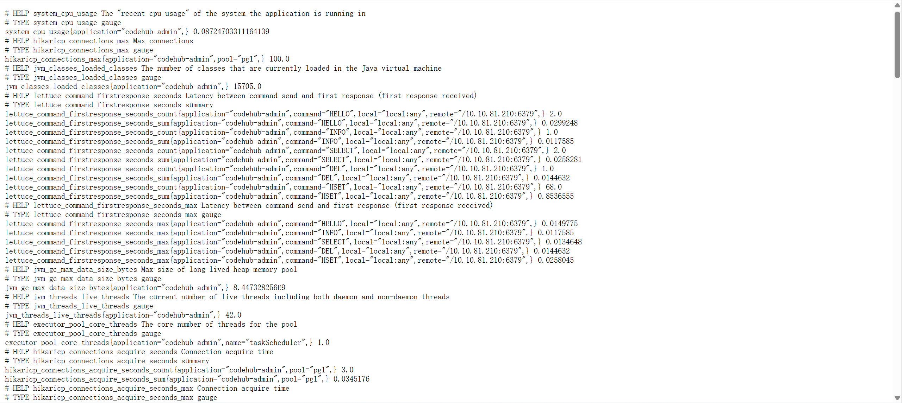

# SpringBoot集成Prometheus教程

## 1 Prometheus介绍

`Prometheus` 是一个开源的系统监控与告警工具包，最初由 `SoundCloud` 开发并于 `2012` 年开源，现已成为云原生计算基金会（ `CNCF` ）的核心项目，广泛应用于容器化环境和微服务架构的监控场景。

`Spring Boot` 接入 `Prometheus` 能够显著提升应用的可观测性和运维效率，主要带来以下核心优势：

1. 开箱即用的指标暴露能力

    * 自动化指标采集：通过 `Spring Boot Actuator` 和 `Micrometer` ，无需手动埋点即可自动暴露 `JVM` 内存、 `HTTP` 请求耗时、 `Tomcat` 连接池等 `100+` 种基础指标。

    * 标准化协议支持： `Actuator` 的 `/actuator/prometheus` 端点直接输出 `Prometheus` 兼容的文本格式，简化数据对接流程。

    * 自定义指标扩展：借助 `Micrometer` 的 `API` ，开发者可灵活添加业务指标（如订单数、接口 `QPS` ），支持 `Counter` 、 `Gauge` 、 `Timer` 等多种类型。

2. 云原生兼容性与动态监控

    * 微服务友好：适用于 `Kubernetes` 等动态环境，支持服务自动发现（如通过 `Consul` 或 `K8s` 标签），无需手动维护监控目标列表。

    * 高效拉取模型： `Prometheus` 的 `Pull` 模式减少被监控应用的资源消耗，尤其适合高并发场景；短期任务可通过 `Pushgateway` 中转数据，避免遗漏。

    * 分布式监控支持：结合 `Thanos` 或 `Cortex` 实现跨集群数据聚合，解决原生 `Prometheus` 单点存储的局限性。

3. 灵活的指标分析与告警

    * 多维度查询（ `PromQL` ）：支持复杂场景分析，如计算接口平均耗时（ `rate(http_server_requests_seconds_sum[5m]) / rate(...)` ）或错误率统计。

    * 实时可视化：通过 `Grafana` 集成，可快速搭建仪表盘（如使用模板 `ID` `12856` 或 `4701` ），直观展示 `JVM` 、线程池等关键指标趋势。

    * 精准告警机制： `Alertmanager` 支持去重、分组和路由策略，可通过邮件、 `Slack` 等渠道通知异常，帮助快速定位故障。

4. 低维护成本与高扩展性

    * 轻量级架构： `Spring Boot` 与 `Prometheus` 均以独立进程运行，资源占用低（单机可处理百万级指标），适合中小规模部署。

    * 生态丰富：超过 `300` 种 `Exporter` 支持第三方系统（如 `MySQL` 、 `Nginx` ）的指标采集，无需重复开发采集逻辑。

    * 社区支持强大：作为 `CNCF` 毕业项目， `Prometheus` 拥有活跃的文档和工具链更新，长期维护有保障。

5. 生产级监控能力增强

    * 健康检查与自愈：通过 `/health` 端点实时探测应用状态，结合 `Kubernetes` 自动重启异常实例。

    * 安全管控：可集成 `Spring Security` 限制 `Actuator` 端点的访问权限，防止敏感数据泄露。

    * 性能优化依据：通过历史数据分析（如内存泄漏趋势），指导容量规划和代码优化。

`Spring Boot` 与 `Prometheus` 的整合不仅降低了监控系统的接入成本，还通过灵活的查询语言、云原生兼容性和丰富的可视化能力，为微服务架构提供了全生命周期的可观测性支持。对于需要快速定位性能瓶颈或实现自动化运维的场景，这种组合是提升系统稳定性和开发效率的关键工具。

## 2 Prometheus集成

`Spring Boot` 集成 `Prometheus` 主要依赖 `Spring Boot Actuator` 和 `Micrometer` 的 `Prometheus` 注册库，通过暴露监控指标并配置 `Prometheus` 抓取数据，实现应用性能的可观测性。

### 2.1 添加依赖

在 `pom.xml` 中引入以下依赖：

```xml
<!-- Actuator 提供基础监控端点 -->
<dependency>
    <groupId>org.springframework.boot</groupId>
    <artifactId>spring-boot-starter-actuator</artifactId>
</dependency>
<!-- Micrometer 的 Prometheus 格式支持 -->
<dependency>
    <groupId>io.micrometer</groupId>
    <artifactId>micrometer-registry-prometheus</artifactId>
</dependency>
```

### 2.2 暴露端点

在 `application.yml` 中配置暴露 `Prometheus` 端点并启用指标导出：

```yml
management:
  endpoints:
    web:
      exposure:
        # 暴露所有端点（或指定为 "prometheus"）
        include: "*"  
  metrics:
    export:
      prometheus:
        enabled: true
    tags:
      # 自定义指标标签  
      application: ${spring.application.name}  
```

启动应用后，访问 `/actuator/prometheus` 地址，返回指标内容如下：



### 2.3 配置 Prometheus 抓取数据

在 `Prometheus` 的 `prometheus.yml` 中添加抓取任务：

```yml
scrape_configs:
  - job_name: 'springboot-app'
    metrics_path: '/actuator/prometheus'
    static_configs:
       # 替换为实际应用地址
      - targets: ['localhost:8080'] 
    # 可选：配置抓取间隔和超时时间
    scrape_interval: 15s
    scrape_timeout: 10s
```

重启 `Prometheus` 后，访问 `http://localhost:9090/targets` 确认服务状态为 `UP` 。

### 2.4 注意事项

如果引用了 `Spring Security` ，则可以参考如下：

```java
@SpringBootApplication(exclude = {SecurityAutoConfiguration.class,
ManagementWebSecurityAutoConfiguration.class})
```

## 3 自定义指标

!!! tip

    官方文档：[https://micrometer.io/](https://micrometer.io/)

通过 `MeterRegistry` 注册自定义指标（如计数器、计时器）：

```java
@Resource
private PrometheusMeterRegistry prometheusMeterRegistry;

@Resource
private MeterRegistry meterRegistry;

public void xxxMethod(){
    // test gauge
    Gauge.builder("test.gauge", 1, Integer::doubleValue)
         .description("this is description")
         .tags(Tags.of("customK1", "customV1", "customK2", "customV2"))
         .register(meterRegistry);

    // test timer
    Timer timer = Timer.builder("test.timer")
                       .description("this is description")
                       .tags(Tags.of("customK1", "customV1", "customK2", "customV2"))
                       .register(meterRegistry);
    timer.record(() -> {
        try {
            Thread.sleep(1000L);
        } catch (InterruptedException e) {
            throw new RuntimeException(e);
        }
    });

    // test counter
    Counter counter = Counter.builder("test.counter")
                             .description("this is description")
                             .tags(Tags.of("customK1", "customV1", "customK2", "customV2"))
                             .register(meterRegistry);
    counter.increment();
}

```

## 4 特殊情况

当 `SpringBoot` 以 `Web` 模式启动时， `Prometheus` 会从 `SpringBoot` 暴露的端点定时拉取监控数据，但是当 `SpringBoot` 以 `非Web` 模式启动时，由于无法暴露端点， `Prometheus` 无法拉取监控数据，那么对于这种特殊情况就需要使用特殊手段处理。

思路是让 `SpringBoot` 定时将监控指标进行本地持久化，并使用 `Prometheus` 的 `Node Exporter` 与 `Prometheus` 进行对接。

```java
@Component
public class PrometheusMetricsScheduler {

    @Resource
    private PrometheusMeterRegistry prometheusMeterRegistry;

    private static final String METRICS_FILE = "/xxx_path/custom_metrics.prom";

    @Scheduled(fixedRate = 30000)
    public void exportMetricsToFile() {
        try (FileWriter writer = new FileWriter(METRICS_FILE, false)) {
            writer.write(prometheusMeterRegistry.scrape());
        } catch (IOException e) {
            e.printStackTrace();
        }
    }

}
```
