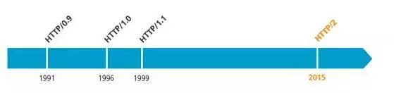
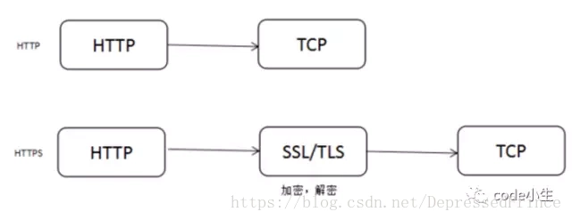
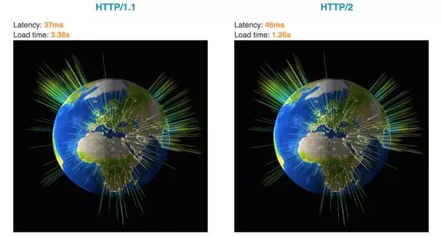
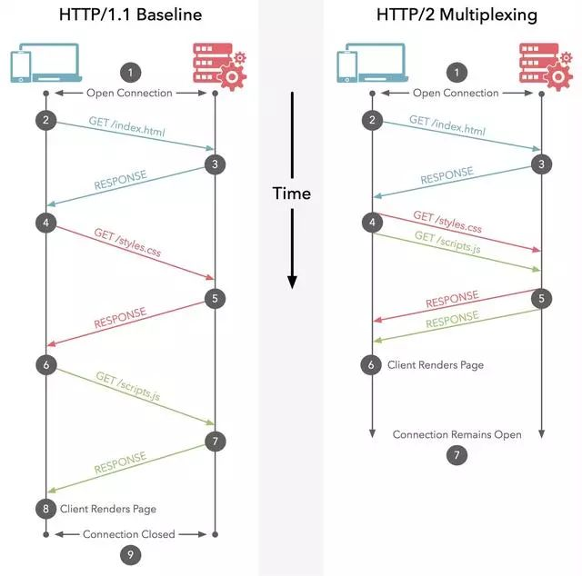
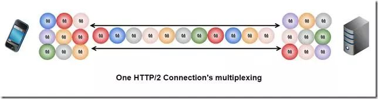
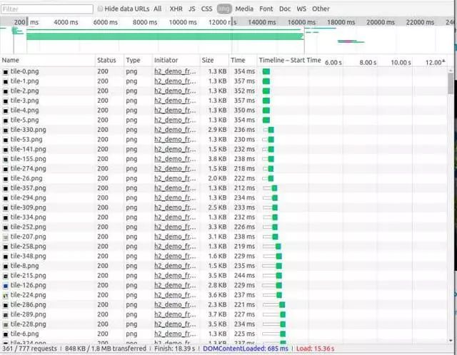
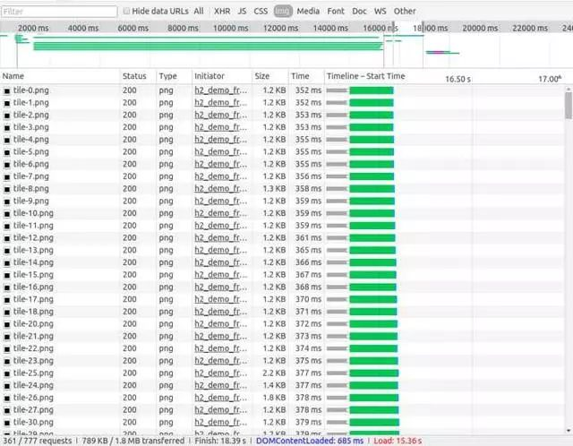
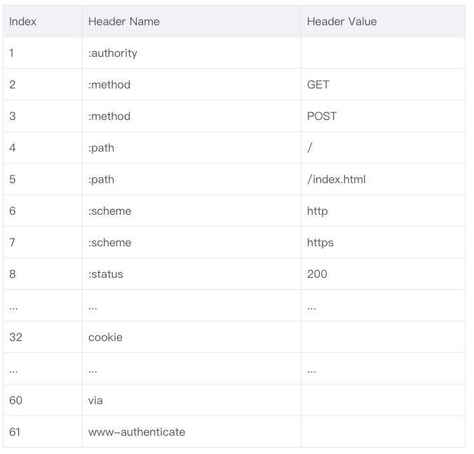
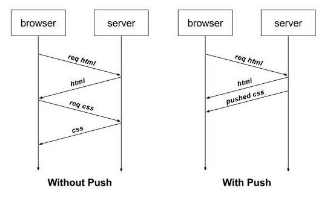

### 一、HTTP定义

HTTP协议(HyperTextTransferProtocol，超文本传输协议)是用于从WWW服务器传输超文本到本地浏览器的传输协议。

### 二、HTTP发展史

### 三、HTTP的基本优化

影响一个HTTP网络请求的因素主要有两个：带宽和延迟。

带宽：如果说我们还停留在拨号上网的阶段，带宽可能会成为一个比较严重影响请求的问题，但是现在网络基础建设已经使得带宽得到极大的提升，我们不再会担心由带宽而影响网速，那么就只剩下延迟了。

延迟：

- 浏览器阻塞(HOL Blocking)：浏览器会因为一些原因阻塞请求。浏览器对于同一个域名，同时只能有4个连接(不同浏览器内核可能会有所差异)，超过浏览器最大连接数限制，后续请求就会被阻塞。

- DNS查询(DNS Lookup)：浏览器需要知道目标服务器的IP才能建立连接。将域名解析为IP的这个系统就是DNS。这个通常可以利用DNS缓存结果来达到减少这个时间的目的。

- 建立连接(Initial Connection)：HTTP是基于TCP协议的，浏览器最快也要在第三次握手时才能捎带HTTP请求报文，达到真正的建立连接，但是这些连接无法复用会导致每次请求都经历三次握手和慢启动。三次握手在高延迟的场景下影响较为明显，慢启动则对文件类大请求影响较大。

### 四、HTTP1.0和HTTP1.1的一些区别

HTTP1.0最早在网页中使用是在1996年，那个时候只是使用一些较为简单的网页上和网络请求上，而HTTP1.1则在1999年才开始广泛应用于现在的各大浏览器网络请求中，同时HTTP1.1也是当前使用最为广泛的HTTP协议。主要区别主要体现在：

- 缓存处理，在HTTP1.0中主要使用header里得If-Modifed-Since，Expires来做为缓存判断的标准，HTTP1.1则引入了更多的缓存控制策略例如Entity tag，If-Unmodified-Since，If-Match，If-None-Match等更多可供选择的缓存头来控制缓存策略。

- 带宽优化及网络连接的使用，HTTP1.0中，存在一些浪费带宽的现象，例如客户端只需要某个对象的一部分，而服务器却将整个对象送过来了，并且不支持断点续传功能，HTTP1.1则在请求头映入了range头域，它允许之请求资源的莫格部分，即返回码是206(Partial Content)，这样就方便了开发者自由的选择以便于充分利用带宽和连接。

- 错误通知的管理，在HTTP1.1中新增了24个错误状态响应码，如409(Confict)表示请求得资源与资源的当前状态发生冲突；410(Gone)表示服务器上的某个资源被永久性的删除。

- Host头处理，在HTTP1.0中认为每台服务器都绑定一个唯一的IP地址，因此，请求消息中的URL并没有传递主机名(hostname)。但随着虚拟主机技术的发展，在一台物理服务器上可以存在多个虚拟主机(Multi-homed Web Servers)，并且他们共享一个IP地址。HTTP1.1的请求消息和响应消息都应支持Host头域，切请求消息中如果没有Host头域会报告一个错误(400 Bad Request)。

- 长连接，HTTP1.1支持长连接(PersistentConnection)和请求的流水线(Pipelining)处理，在一个TCP连接上可以传送多个HTTP请求和响应，减少了建立和关闭连接的消耗和延迟，在HTTP1.1中默认开启Connection：keep-alive，一定程度上弥补了HTTP1.0每次请求都要创建连接的缺点。

### 五、HTTPS和HTTP的区别

- HTTPS协议需要到CA申请证书，一般免费证书很少，需要交费。

- HTTP协议运行在TCP之上，所有传输的内容都是明文，HTTPS运行在SSL/TLS之上，SSL/TLS运行在TCP之上，所有传输的内容都经过加密的。

- HTTP和HTTPS使用的是完全不同的连接方式，用的端口也不一样，前者是80，后者是443。

- HTTPS可以有效的防止运营商的劫持，解决了防劫持的一个大问题。

### 六、HTTP2.0 vs HTTP1.0性能

HTTP2.0的出现，相比于HTTP1.x，大幅度的提升了web性能。

这是Akamai公司建立的一个官方的演示，用以说明HTTP/2相比于之前的HTTP/1.1在性能上的大幅度提升。同时请求379张图片，从Load time的对比可以看出HTTP/2在速度上的优势。

### 七、HTTP2.0和HTTP1.1区别

#### 多路复用

多路复用允许单一的HTTP/2连接同时发起多重的请求-响应消息。看个例子：

整个访问刘晨第一次请求index.html页面，之后浏览器会去请求style.css和script.js文件。左边是顺序加载两个文件，右边则是并行加载两个文件。

我们知道HTTP底层其实依赖的是TCP协议，那问题是在同一个连接里面同时发生两个请求响应是怎么做到的呢?

首先要知道，TCP连接相当于两根管道(一个用于服务器到客户端，一个用于客户端到服务器)，管道里面数据传输是通过字节码传输，传输是有序的，每个字节都是一个一个来传输的。

例如客户端要想服务器发送Hello、World两个单词，只能是先发送Hello再发送World，没办法同时发送这两个单词。不然服务器收到的可能就是HWeolrllod(注意是穿插着发过去了，但是顺还是不会乱)。这样服务器就懵逼了。

接着上面的问题，能付同时发送Hello和World两个单词呢?当然也是可以的，可以将数据拆成包，给每个包打上标签。发的时候是这样的①H②W①e②o①l②r①l②l①o②d。这样到了服务器，服务器根据标签把两个单词分开来。实际的发送效果如下图：

要实现上面的效果我们引入一个新的概念就是：二进制分帧。

二进制分针层在应用层(HTTP/2)和传输层(TCP or UDP)之间。HTTP/2并没有去修改TCP协议，而是尽可能地利用TCP的特性。

在二进制分针层中，HTTP/2会将所有传输的信息分割为帧，并对它们采用二进制格式的编码，其中首部信息会被封装到HEADER frame，而相应的Request Body则封装到DATA frame里面。

HTTP性能优化的关键并不在于高带宽，而是低延迟。TCP连接会随着时间进行自我调谐，起初会限制连接得最大速度，如果数据成功传输，会随着时间的推移提高传输的速度。这种调谐则被成为TCP慢启动。由于这种原因，让原本就具有突发性的短时性的HTTP连接变的十分低效。

HTTP/2通过让所有数据流共用同一个连接，可以更有效地使用TCP连接，让高带宽也能真正的服务于HTTP的性能提升。

通过下面两张图，我们可以更加深入的认是多路复用：

多路复用技术：单连接多资源的方式，减少服务端的连接压力，内存占用更少，连接吞吐量更大；由于减少TCP慢启动时间，提高传输的速度。

#### 首部压缩

为什么要压缩?在HTTP/1中，HTTP请求和响应都是由状态行、请求/响应头部、消息主体三部分组成。一般而言，消息主体都会经过gzip压缩，或者本身传输的就是压缩过后的二进制文件(例如图片、音频)，单状态行和头部却没有经过任何压缩，直接以纯文本传输。

随着Web功能越来越复杂，每个页面产生的请求数也越来越多，导致消耗在头部的流量越来越多，尤其是每次都要传输UserAgent、Cookie等不会频繁变动的内容，完全是一种浪费。

我们再用通俗的语言解释下，压缩的原理。头部压缩需要在支持HTTP/2的浏览器和服务端之间：

- 维护一份相同的静态字典(Static Table)，包含常见的头部名称，以及特别常见的头部名称与值的组合；

- 维护一份相同的动态字典(Dynamic Table)，可以动态的添加内容；

- 址及基于静态哈夫曼码表的哈夫曼编码(Huffman Coding)；

静态字典的作用有两个：

- 对于完全匹配得头部键值对，例如":method:GET"，可以直接使用一个字符表示；

- 对于头部名称可以匹配得键值对，例如"cookiet:xxxx"，可以将名称使用一个字符表示。

HTTP/2中的静态字典如下(已下只截取了部分，完整表格在这里)：

同时，浏览器和服务端都可以像动态字典中添加键值对，之后这个键值对就可以使用一个字符表示了。需要注意的是，动态字典上下文有关，需要为每个HTTP/2连接维护不同的字典。在传输过程中使用，使用字符代替键值对大大减少传输的数据量。

#### HTTP2支持服务器推送

服务端推送是一种在客户端请求之前发送数据的机制。当代网页使用了许多资源：HTML、样式表、脚本、图片等等。在HTTP/1.x中这些资源每一个都必须明确的请求。这可能是一个很慢的过程。浏览器从获取HTML开始，然后在它解析和评估页面的时候，增量的获取更多的资源。因为服务器必须等待浏览器做每一个请求，网络经常是空闲的和未充分使用的。

为了改善延迟，HTTP/2引入了server push，它允许服务端推送资源给浏览器，在浏览器明确的请求之前。一个服务器经常知道一个页面需要很多附加资源，在它响应浏览器第一个请求的时候，可以开始推送这些资源。这允许服务端去完全充分的利用一个可能空闲的网络，改善页面加载时间。

