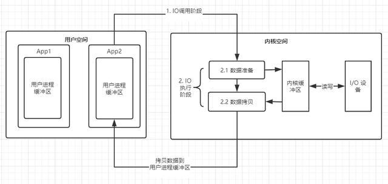
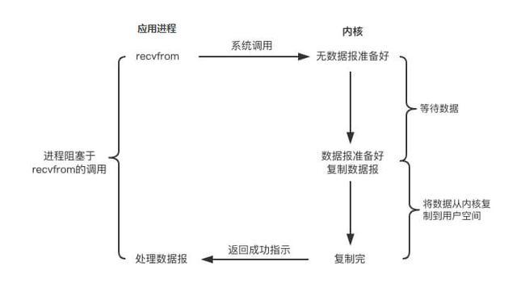
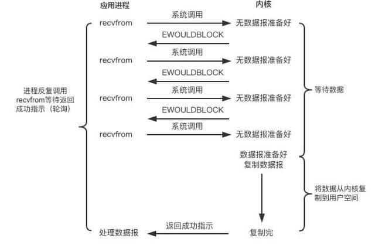
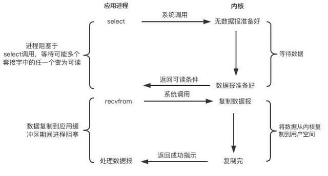
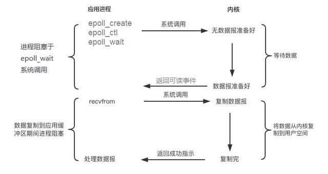
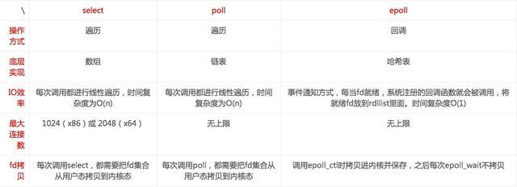
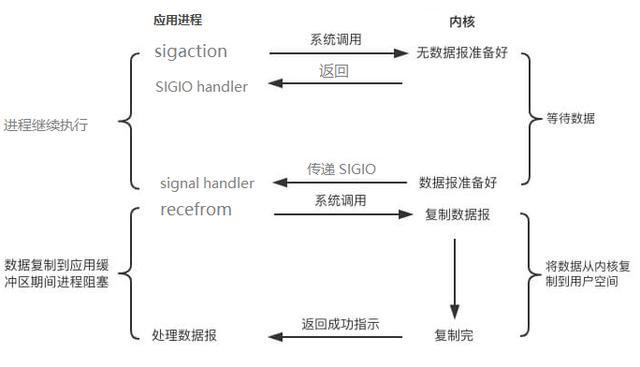
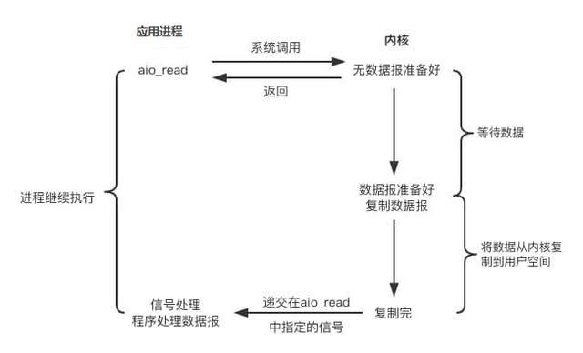
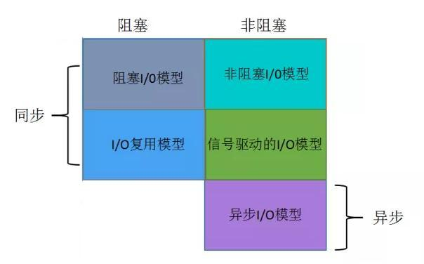

### 一、引言

同步异步I/O，阻塞非阻塞I/O是程序员的老生常谈的话题了。何为同步异步?何为阻塞与非阻塞?二者的区别在哪里?阻塞在何处?为什么会有多种I/O模型，分别用来解决什么问题?常用的框架采用的是何种I/O模型?各种IO模型的优劣势在哪里，适用于何种场景?

简而言之，对于I/O的认知，不能仅仅停留在字面上的认识，了解内部玄机，才能深刻理解I/O，才能看清I/O相关问题的本质。

### 二、I/O的定义

I/O全称是Iput/Output。要想理清I/O这个概念，我们需要从不同的视角去理解它。

#### 1. 计算机视角

冯诺依曼计算机的基础思想中有提到计算机硬件组成应为五大部分：控制器，运算器，存储器，输入和输出。其中输入是指将数据输入到计算机的设备，比如键盘鼠标；输出是指从计算机中获取数据的设备，比如显示器；以及既是输入又是输出设备的硬盘，网卡等。

用户通过操作系统才能完成对计算机的操作。计算机启动时，第一个启动的程序是操作系统的内核，它将负责计算机的资源管理和进程调度。换句话说：操作系统负责从输入设备读取数据并将数据写入到输出设备。

所以I/O之于计算机，有两层意思：

1. I/O设备

1. 对I/O设备的数据读写

对于一次I/O操作，必然涉及2个参与方，一个输入端，一个输出端，而又根据参与双方的设备类型，我们又可以分为磁盘I/O，网络I/O等。

#### 2. 程序视角

应用程序作为一个文件保存在磁盘中，只有加载到内存中才成为一个进程运行。应用程序运行在计算机内存中，必然会涉及到数据交换，比如读写磁盘文件，访问数据库，调用远程API等等。但我们编写的程序并不能像操作系统内核一样直接进行I/O操作。

因为为了确保操作系统的安全稳定运行，操作系统启动后，将会开启保护模式：将内存分为内核空间和用户空间，进行内存隔离。我们构建的程序将运行在用户空间，用户空间无法操作内核空间，也就意味着用户空间的程序不能直接访问由内核管理的I/O，比如：硬盘、网卡等。

但操作系统对外提供API，其由各种类型的系统调用组成，以提供安全的访问控制。所以应用程序要想访问内核管理的I/O，必须通过调用内核提供的系统调用进行间接访问。

所以I/O之于程序来说，强调的通过

1. I/O调用阶段：应用程序进程向内核发起系统调用

1. I/O执行阶段：内核执行I/O操作并返回

1. 准备数据阶段：内核等待I/O设备准备好数据

1. 拷贝数据阶段：将数据从内核缓冲区拷贝到用户空间缓冲区

怎么理解准备数据阶段呢?

1. 对于写请求：等待系统调用的完整请求数据，并写入到内核缓冲区；

1. 对于读请求：等待系统调用的完整请求数据，并读入到内核缓冲区。

而应用程序进程在发起I/O调用至内核执行I/O返回之前，应用程序进程/线程所处的状态，就是我们下面要讨论的阻塞I/O与非阻塞I/O。

### 三、阻塞I/O(BIO)

应用程序中进程在发起I/O调用后至内核执行I/O操作返回结果之前，若发起系统调用的线程一直处于等待状态，则此次I/O操作为阻塞I/O。阻塞I/O简称BIO，Blocking I/O。其处理流程如下图所示：

从上图可知当用户进程发起I/O系统调用后，内核从准备数据到拷贝数据到用户空间的两个阶段期间

因此BIO带来了一个问题：如果内核数据需要消耗很久才能准备好，那么用户进程将被阻塞，浪费性能。为了提升应用的性能，虽然可以通过多线程来提升性能，但线程的创建依然会借助系统调用，同时多线程会导致频繁的线程上下文切换，同样会影响性能。所以要想解决BIO的问题，我们就得看到问题本质，解决

### 四、非阻塞I/O(NIO)

很自然的想到，将阻塞变为非阻塞，那就是用户进程在发起系统调用时指定为非阻塞，内核接收到请求后，就会立即返回，让后用户进程通过轮询的方式来拉取处理结果。也就是如下图所示：

应用程序中进程在发起I/O调用后至内核执行I/O操作返回结果之前，若发起系统调用的线程不会等待而是立即返回，则此次I/O操作为非阻塞I/O模型。非阻塞I/O简称NIO，Non-Blocking I/O。

然后，非阻塞I/O虽然相对于阻塞I/O大幅提升了性能，但依然不是完美的解决方案，其依然存在性能问题，也就是频繁的轮询导致频繁的系统调用，会消耗大量的CPU资源。比如当并发很高时，假设有1000个并发，那么单位时间循环内将会有1000此系统调用去轮询执行结果，而实际上可能只有2个请求结果执行完毕，这就会有998次无效的系统调用，造成严重的性能浪费。有问题就要解决，那

### 五、I/O多路复用

解决NIO的思路就是降解无效的系统调用，如何降解呢?我们一起来看看集中I/O多路复用的解决思路。

#### 1. select/poll

Select是内核提供的系统调用，它支持一次查询多个系统调用的可用状态，当任意一个结果状态可用时就会返回，用户进程再发起一次系统调用进行数据读取。换句话说，就是NIO中N次的系统调用，借助Select，只需要发起一次系统调用就够了。其I/O流程如下所示：

但是，Select有一个限制，就是存在连接数限制，针对于此，又提出了poll。其与Select相比，主要是解决了连接限制。

select/poll虽然解决了NIO重复无效系统调用的问题，但同时又引入了新的问题：

1. 用户空间和内核空间之间，大量的数据拷贝

1. 内核循环遍历I/O状态，浪费CPU时间

换句话说，select/poll虽然减少了用户进程发起的系统调用，但内核的工作量只增不减。在高并发的情况下，内核的性能问题依旧。所以select/poll的问题本质是：内核存在无效的循环遍历。

#### 2.epoll

针对select/poll引入的问题，我们把解决问题的思路转会到内核上，如何减少内核重负无效的循环遍历呢?变主动为被动，基于事件驱动来实现。其流程图如下所示：

epoll相较于select/poll，多了两次系统调用，其中epoll_create建立与内核的连接，epoll_ctl注册事件，epoll_wait阻塞用户进程，等待I/O事件。

epoll已经大大优化了I/O的执行效率，但在I/O执行的第一阶段：数据准备阶段都还是被阻塞的。所以这是一个可以继续优化的点。

### 六、信号驱动I/O

信号驱动I/O与BIO和NIO最大的区别就在于，在I/O执行的数据准备阶段，不会阻塞用户进程。如下图所示：当用户进程需要等待数据的时候，会向内核发送一个信号，告诉内核我要什么数据，然后用户进程就继续做别的事情去了，而当内核重得数据准备好之后，内核立马发给用户进程一个信号，用户进程收到信号之后，立马调用recvfrom，去查收数据。

咋一看，信号驱动I/O模型有种异步操作的感觉，但是在I/O执行的第二阶段，也就是将数据从内核空间复制到用户空间这个阶段，用户进程还是被阻塞的。

综上，你会发现，不管是BIO还是NIO还是SIGIO，他们最终都会被阻塞在I/O执行的第二阶段。那如果能将I/O执行的第二阶段编程非阻塞，那就完美了。

### 七、异步I/O(AIO)

异步I/O真正实现了I/O全流程的非阻塞。用户进程发出系统调用后立即返回，内核等待数据准备完成，然后将数据拷贝到用户进程缓冲区，然后发送信号告诉用户进程I/O操作执行完毕(与SIGIO相比，一个是发送信号告诉用户进程数据准备完毕，一个是I/O执行完毕)。其流程如下：

所以，之所以称为异步I/O，取决于I/O执行得第二阶段是否阻塞。因此前面讲的BIO，NIO和SIGIO均为同步IO。

