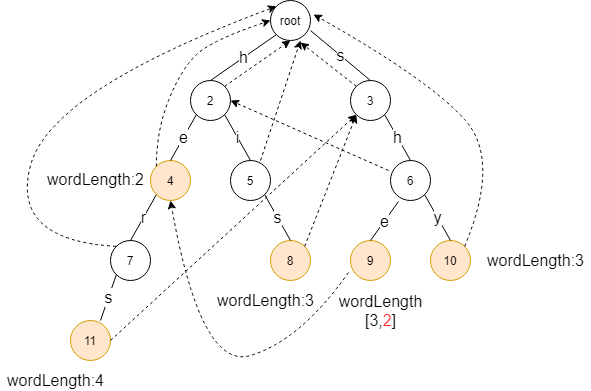

### AC自动机算法

#### 1. 简要概述

什么是AC自动机算法？

AC自动机算法是一种多模式字符串匹配算法，什么是多模式？从但模式说起，举个kmp算法的例子，单模式就是利用kmp算法验证某个敏感词在一个字符串内是否存在；多模式是说验证多个敏感词在一个字符串内是否存在。如果使用kmp来做的话，依次遍历多个敏感词，每个敏感词使用kmp验证，当敏感词数量很多的时候效率很低，这时候就用到AC自动机算法了。

为什么AC自动机算法效率高？

其能在约O(n)的时间复杂度内完成对多个敏感词的查找，而且其时间复杂度只跟搜索串的长度(n)相关，跟敏感词的数量并无关联，原理和kmp算法的next数组类似，只不过这里用的是fail指针。

#### 2. 算法描述

主要分为三步：

- 创建字典树

- 构建fail指针

- 查找匹配

##### 2.1 构建字典树

根据输入的敏感词，构建字典树。在构建字典树的过程中，如果从根节点到某个节点的路径完全匹配上某个敏感词，则记录下这个敏感词。

节点代码如下：

```java
public class ACTrieNode {
    // 当前节点的字符
    private Character character;
    // 子节点
    private Map<Character, ACTrieNode> children = Maps.newConcurrentMap();
    // 失败节点指针
    private ACTrieNode failure;
    // 是否输出
    private Boolean isOutput;
    // 命中关键字
    private String keyword;
}
```

构建字典代码如下：

```java
public void addACTrieNode(String keyword) {
        ACTrieNode parent = root;
        // 遍历关键字的每一个字符
        for (int i = 0; i < keyword.length(); i++) {
            Character character = keyword.charAt(i);
            // 如果节点中不存在则插入
            if (!parent.getChildren().containsKey(character)) {
                parent.getChildren().put(character, new ACTrieNode(character, i == keyword.length() - 1, parent.getKeyword() + character));
            }
            parent = parent.getChildren().get(character);
            // 判断是否结束，结束则标记为输出
            if (i == keyword.length() - 1) {
                parent.setOutput(true);
            }
        }          
    }
```

##### 2.2 创建fail指针

由于fail指针的加入，在节点匹配失败时，不用重新从根节点触发进行查找，可以直接跳到失败指针指向的节点进行下一步查找，从而减少搜索路径，大大提高查找效率。

假设有关键词 



对于fail指针，其定义是发生匹配失败时进行的 

fail指针的构建，其算法如下：

- 根节点的fail指针指向根节点

- 对于非根节点 

- 如果 

- 如果 

构建fail指针代码如下：

```java
public void buildFailureNode() {
	Queue<ACTrieNode[]> queue = new LinkedBlockingQueue<>();
	queue.offer(new ACTrieNode[]{root, root});
	while (!queue.isEmpty()) {
		ACTrieNode[] acTrieNodes = queue.poll();
		ACTrieNode parent = acTrieNodes[0];
		ACTrieNode current = acTrieNodes[1];
		if (current.getCharacter() == null || parent.getCharacter() == null) {
			// 根节点的fail指针指向根节点
			current.setFailure(root);
		} else {
			if (parent.getFailure().getChildren().containsKey(current.getCharacter())) {
				// parent节点的fail指针包含current同值节点temp，则current的fail指针指向temp
				current.setFailure(parent.getFailure().getChildren().get(current.getCharacter()));
			} else {
				 // parent节点的fail指针不包含current同值节点，则current的failhi真指向根节点     
				current.setFailure(root);
			}
		}
		current.getChildren().forEach((character, child) -> {
			queue.offer(new ACTrieNode[]{current, child});
		});
	}
}
```

##### 2.3 查找

查找的过程，先按字典树的查找过程进行匹配，如果在某个节点匹配失败，则运用fail指针跳转到下一个节点继续进行匹配。当查询到某个节点时，如果该节点为输出节点，则对其进行输出，否则不做处理。

查找代码如下：

```java
public List<ACTrieHit> search(String text) {
	ACTrieNode acTrieNode = root;
	List<ACTrieHit> acTrieHitList = Lists.newArrayList();
	for (int i = 0; i < text.length(); i++) {
		Character character = text.charAt(i);
		// 如果查找失败，则跳转到失败节点
		if (!acTrieNode.getChildren().containsKey(character)) {
			acTrieNode = acTrieNode.getFailure();
		}
		// 如果查找成功，则跳转到成功节点
		if (acTrieNode.getChildren().containsKey(character)) {
			acTrieNode = acTrieNode.getChildren().get(character);
		} else {
			continue;
		}
		// 输出查找成功的节点
		if (acTrieNode.getOutput()) {
			acTrieHitList.add(new ACTrieHit(acTrieNode.getKeyword(), i - acTrieNode.getKeyword().length() + 1, i));
		}
		// 输出查找失败的节点
		if (acTrieNode.getFailure().getOutput()) {
			acTrieHitList.add(new ACTrieHit(acTrieNode.getFailure().getKeyword(), i - acTrieNode.getFailure().getKeyword().length() + 1, i));
		}
	}
	return acTrieHitList;
}
```

#### 3. 匹配效率

Trie树构建的复杂度是 

实际在匹配关键词时，关键词的平均长度不会很长，所以字典树大约是个扁长状的树，因此，AC自动机的匹配效率很接近O(n)。