### Boyer-Moore字符串匹配算法

#### 算法介绍

Boyer-Moore算法的主要特点有：

1. 对模式字符的比较顺序是从右向左；

1. 预处理需要O(m+σ)的时间和空间复杂度；

1. 匹配阶段需要O(m×n)的时间复杂度；

1. 匹配阶段在最坏情况下需要3n次字符比较；

1. 最有复杂度O(n/m)；

下面是几种常见的字符串匹配算法的性能比较：

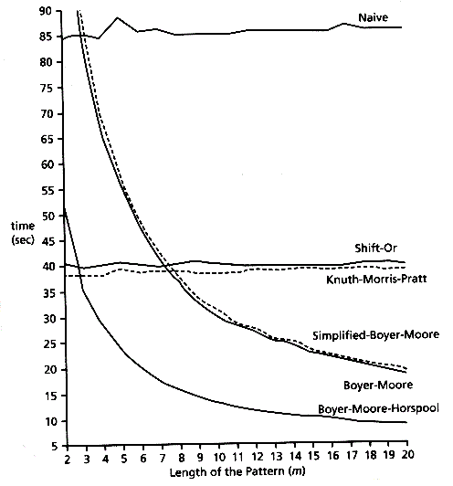

在Naive算法中，如果发现模式P中的字符与文本T中的字符不匹配时，需要将文本T的比较位置向后滑动一位，模式P的比较位置归0并从头开始比较。而KMP算法则是根据预处理的结果进行判断，以使模式P的比较位置可以向后滑动多个位置。Boyer-Moore算法的预处理过程也是为了达到相同效果。

BM算法在对模式P字符串进行预处理时，将采用两种不同的启发式方法。这两种启发式的预处理方法称为：

- 坏字符（Bad Character Heuristic）：当文本T中的某个字符跟模式P的某个字符不匹配时，我们称文本T中的这个失配字符为坏字符。

- 好后缀（Good Suffix Heuristic）：当文本T中的某个字符跟模式P的某个字符不匹配时，我们称文本T中的已经匹配的字符串为好后缀。

BM算法在当字符串匹配时，如果发现模式P中的字符与文本T中的字符不匹配时，将比较两种不同启发法所建议的移动位移长度，选择最大的一个值来对模式P的比较位置进行滑动。

此外，Naive算法和KMP算法对模式P的比较方向是从前向后比较，而BM算法的设计则是从后向前比较，即从尾部向头部方向进行比较。

#### 算法讲解

下面，我们将以下面示例进行讲解：

> Text T : HERE IS A SIMPLE EXAMPLEPattern P : EXAMPLE

1. 首先将文本T与模式P头部对齐，并从尾部开始进行比较。

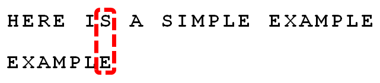

这样如果尾部的字符不匹配，则前面的字符也就无需比较了，直接跳过。我们看到， 

1. 由于字符 

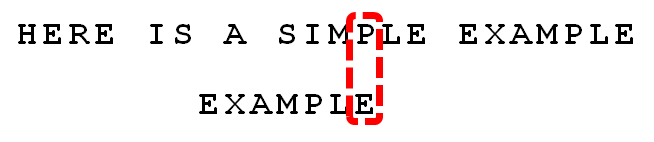

1. 仍然从尾部开始比较，发现 

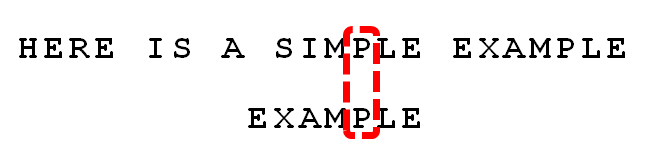

1. 仍然从尾部开始比较，发现 

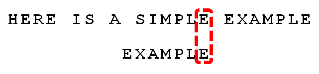

1. 发现 

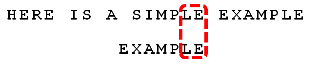

1. 发现 

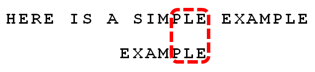

1. 发现 

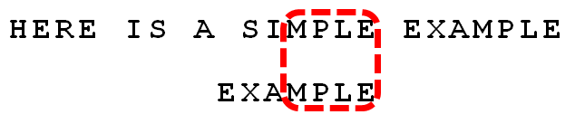

1. 发现 

1. 选择 

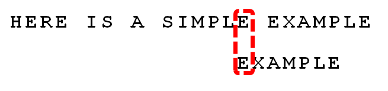

1. 此时，仍然从尾部开始比较。

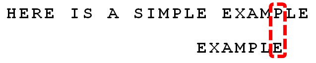

1. 发现 

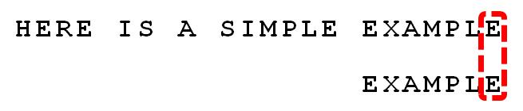

1. 直到发现全部匹配为止。

#### 好后缀与坏字符

- 好后缀

举例说明 

| 后缀 | 索引 | 说明 | 
| -- | -- | -- |
| E | 0 | E,X,A,M,P,L中相同后缀所在位置 | 
| LE | -1 | EX,XA,AM,MP,PL中相同后缀所在位置 | 
| PLE | -1 | EXA,XAM,AMP,MPL中相同后缀所在位置 | 
| MPLE | -1 | EXAM,XAMP,AMPL中相同后缀所在位置 | 
| AMPLE | -1 | EXAMP,XAMPL中相同后缀所在位置 | 
| XAMPLE | -1 | EXAMPL中相同后缀所在位置 | 
| EXAMPLE | -1 | 特殊处理，-1 | 

好后缀对应的索引位置，从右向左，与当前后缀长度及值都相同的字符串的起始位置，不存在为-1。

- 坏字符

举例说明 

| 字符 | 索引 | 说明 | 
| -- | -- | -- |
| E | 6 | E,X,A,M,P,L,E中最后出现该字符的所在位置 | 
| X | 1 | E,X,A,M,P,L,E中最后出现该字符的所在位置 | 
| A | 2 | E,X,A,M,P,L,E中最后出现该字符的所在位置 | 
| M | 3 | E,X,A,M,P,L,E中最后出现该字符的所在位置 | 
| P | 4 | E,X,A,M,P,L,E中最后出现该字符的所在位置 | 
| L | 5 | E,X,A,M,P,L,E中最后出现该字符的所在位置 | 

坏字符对应的索引位置，当前字符在模式中最后出现的索引位置。