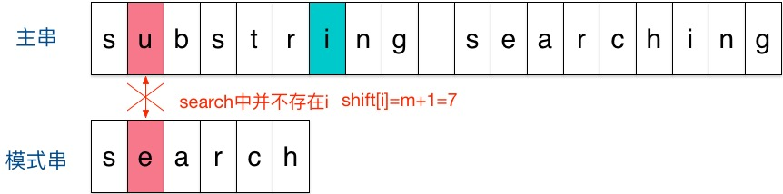
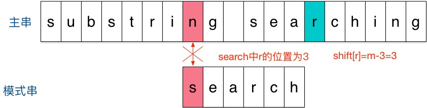
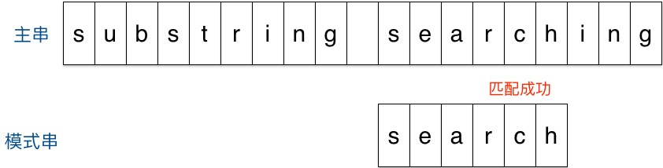

### Sunday算法

Sunday算法是Daniel M.Sunday于1990年提出的，它的思想跟BM算法很相似。

只不过Sunday算法是从前往后匹配，在匹配失败时关注的是主串中参加匹配的最末位字符的下一位字符。

- 如果该字符没有在模式串中出现则直接跳过，即移动位数 = 模式串长度 + 1；

- 否则，其移动位数 = 模式串长度 - 该字符最右出现的位置（从0开始） = 模式串中该字符最右出现的位置到尾部的距离 + 1。

下面举个例子说明下Sunday算法。假设现在要在主串“substring searching”中查找模式串“search”。

- 刚开始时，把模式串与文本串左边对齐：

- 结果发现在第2个字符处发现不匹配，不匹配时关注主串中参加匹配的最末位字符的下一位字符，即标粗的字符 

- 结果第一个字符就不匹配，再看主串中参加匹配的最末位字符的下一位字符，是 

- 匹配成功

回顾整个过程，我们至移动了两次模式串就找到了匹配位置，缘于Sunday算法每一步的移动量都比较大，效率很高。