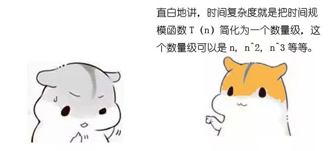
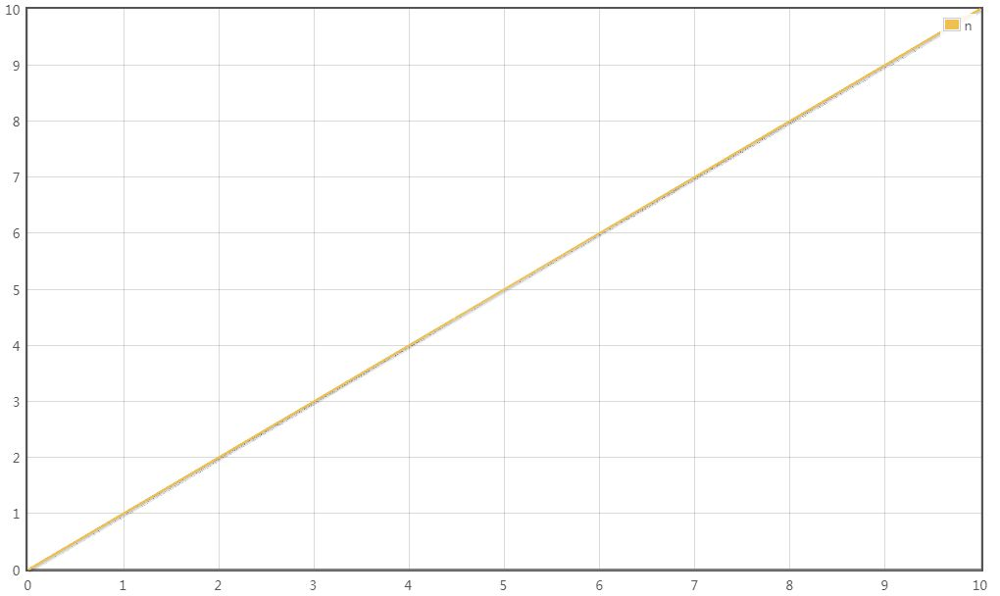
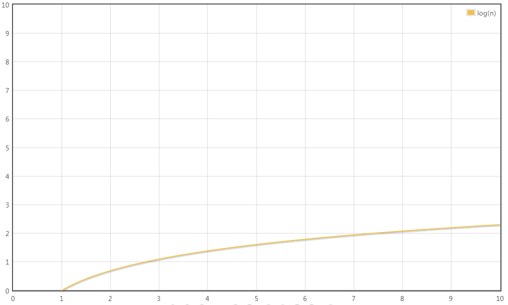
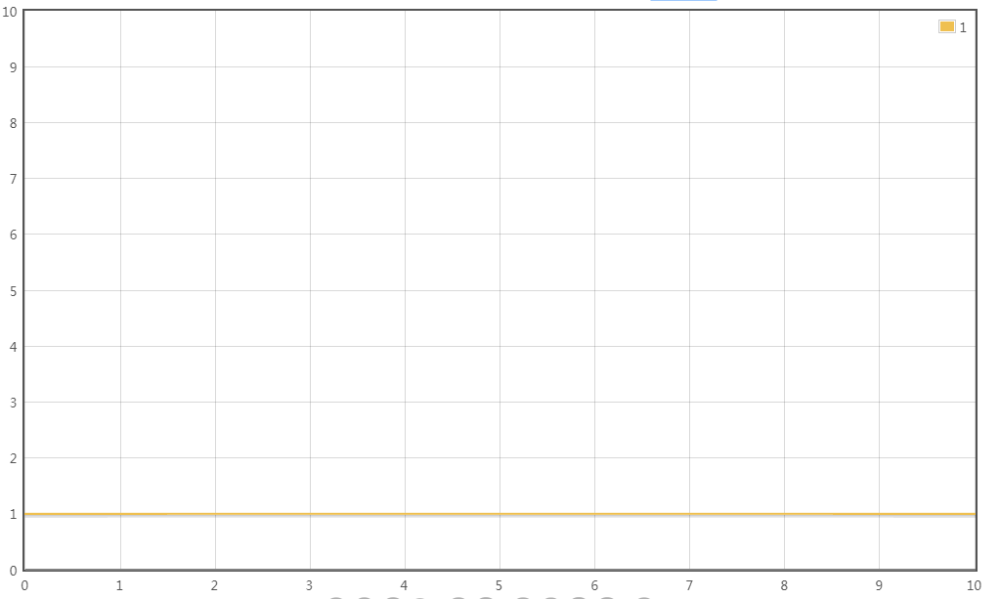
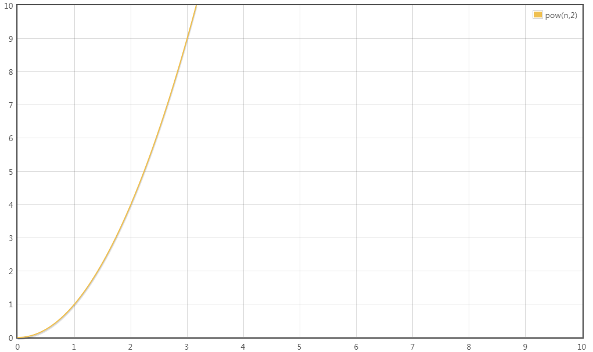
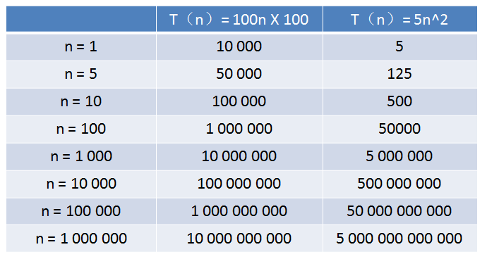

### 正文


### 时间复杂度的意义

究竟什么时时间复杂度呢？让我们来想象一个场景：某一天，小灰和大黄同时加入了一个公司……


一天过后，小灰和大黄各自交付了代码，两端代码实现的功能都差不多。大黄的代码运行一次要花100毫秒，内存占用5MB。小灰的代码运行一次要花100秒，内存占用500MB。于是……


由此可见，衡量代码的好坏，包括两个非常重要的指标：

1. 运行时间；

1. 占用空间。


### 基本操作执行次数

关于代码的基本操作执行次数，我们用四个生活中的场景，来做一下比喻：

- 场景1：给小灰一条长10寸的面包，小灰每3天吃掉1寸，那么吃掉整个面包需要几天？


答案自然是3 * 10 = 30天。

如果面包的长度是N寸呢？

此时吃掉整个面包，需要3 * N = 3N天。

如果用一个函数来表达这个相对时间，可以记作T(n) = 3n。

- 场景2：给小灰一条长16寸的面包，小灰每5天吃点面包剩余长度的一半，第一次吃掉8寸，第二吃掉4寸，第三次吃掉2寸……那么小灰把面包吃得只剩下1寸，需要多少天呢？

这个问题翻译一下，就是数字16不断的除以2，除几次以后的结果等于1？这里要涉及到数学当中的对数，以2为底，16的对数，可以简写为log16。

因此，把面包吃的只剩下1寸，需要5 * log16 = 5 * 4 = 20天。

如果面包的长度是N寸呢？

需要5 * logn = 5logn天，记作T(n) = 5logn。

- 场景3：给小灰一条长10寸的面包和一个鸡腿，小灰每2天吃掉一个鸡腿。那么小灰吃掉整个鸡腿需要多少天呢？

答案自热是2天。因为只说是吃掉鸡腿，和10寸的面包没有关系。

如果面包的长度是N寸呢？

无论面包有多长，吃掉鸡腿的时间仍然是2天，记作T(n) = 2。

- 场景4：给小灰一条长10寸的面包，小灰吃掉第一个一寸需要1天时间，吃掉第二个一寸需要2天时间，吃掉第三个一寸需要3天时间……没多吃一寸，所花的时间也多一天。那么小灰吃掉整个面包需要多少天呢？

答案是从1累加到10的总和，也就是55天。

如果面包的长度是N寸呢？

此时吃掉整个面包，需要1 + 2 + 3 + …… + n-1 + n = 0.5n² + 0.5n。

记作T(n) = 0.5n² + 0.5n。


上面所讲的是吃东西所花费的相对时间，这一思想同样适用于对程序基本操作执行次数的统计。刚才的四个场景，分别对应了程序中最常见的四种方式：

- 场景1：T(n) = 3n，执行次数是线性的。

```java
for (int i=0; i<n; i++) {
    System.out.println("等待一天");
    System.out.println("等待一天");
    System.out.println("吃一寸面包");
}
```

- 场景2：T(n) = 5logn，执行次数是对数的。

```java
for (int i=0; i<n; i*=2) {
    System.out.println("等待一天");
    System.out.println("等待一天");
    System.out.println("等待一天");
    System.out.println("等待一天");
    System.out.println("吃一半面包");
}
```

- 场景3：T(n) = 2，执行次数是常量的。

```java
System.out.println("等待一天");
System.out.println("吃一个鸡腿");
```

- 场景4：T(n) = 0.5n² + 0.5n，执行次数是一个多项式。

```java
for (int i=0; i<n; i++) {
    for (int j=0; j<i; j++) {
        System.out.println("等待一天");
    }
    System.out.println("吃一寸面包");
}
```

### 渐进时间复杂度

有了基本操作执行次数的函数T(n)，是否就可以分析和比较一段代码的运行时间了呢？还是有一定的困难。

比如算法A的相对时间是T(n) = 100n，算法B的相对时间是T(n) = 5n²，这两个到底谁的运行时间更长一些？这就要看n的取值了。

所以，这时候有了渐进时间复杂度（asymptotic time complexity）的概念，官方的定义如下：

> 若存在函数f(n)，使得当前n趋近于无穷大时，T(n)/f(n)的极限值为不等于零的常数，则称f(n)是T(n)的同数量级函数。记作T(n) = O(f(n))，称O(f(n))为算法的渐进时间复杂度，简称时间复杂度。


渐进时间复杂度用大写O来表示，所以也被称为大O表示法。




### 如何推导出时间复杂度呢？有如下几个原则：

1. 如果运行时间是常数量级，用常数1表示；

1. 只保留时间函数中的最高阶项；

1. 如果最高阶项存在，则省去最高阶项前面的系数。

### 让我们回头看看刚才的四个场景。

- 场景1：

T(n) = 3n

最高阶项为3n，省去系数3，转化的时间复杂度为：

T(n) = O(n)



- 场景2：

T(n) = 5logn

最高阶项为5logn，省去系数5，转化的时间复杂度为：

T(n) = O(logn)



- 场景3：

T(n) = 2

只有常数量级，转化的时间复杂度为：

T(n) = O(1)



- 场景4：

T(n) = 0.5n² + 0.5n

最高阶项为0.5n²，省去系数0.5，转化的时间复杂度为：

T(n) = O(n²)



这四种时间复杂度究竟谁用时更长，谁节省时间呢？稍微思考一下就可以得出结论：

O(1) < O(logn) < O(n) < O(n²)

在编程的世界中有着各种各样的算法，除了上述的四个场景，还有许多不同形式的时间复杂度，比如：

O(nlogn)、O(n³)、O(m*n)、O(2^n)、O(n!)

今后遨游在代码的海洋里，我们会陆续遇到上述时间复杂度的算法。


### 时间复杂度的巨大差异


我们来举个例子：

算法A的相对时间规模是T(n) = 100n，时间复杂度是O(n)

算法B的相对时间规模是T(n) = 5n²，时间复杂度是O(n²)

算法A运行在小灰家里的老旧电脑上，算法B运行在某台超级计算机上，运行速度是老旧电脑的100倍。

那么，随着输入规模n的增长，两种算法谁运行更快呢？



从表格中可以看出，当n的值很小的时候，算法A的运行用时要远大于算法B；当n的值达到1000左右，算法A和算法B的运行时间已经接近；当n的值越来越大，达到十万、百万时，算法A的优势开始显现，算法B则越来越慢，差距越来越明显。

这就是不同时间复杂度带来的差距。