# 一、B树

## 1. B树的定义

B树也称B-树，它是一颗多路平衡二叉树。我们描述一颗B树时需要指定它的阶数，阶数表示了一个节点最多有多少的孩子节点，一般使用字母m表示阶数。当m=2时，就是我们常见的二叉搜索树。

一颗m阶的B树定义如下：

- 每个节点最多有m-1个关键字

- 根节点最少可以只有一个关键字

- 非根节点至少有Math.ceil(m/2)-1个关键字

- 每个节点的关键字都按照从小到大的顺序排列，每个关键字的左子树中的所有关键字都小于它，而右子树中的所有关键字都大于它

- 所有叶子节点都位于同一层，或者说根节点到每个叶子节点的路径长度都相同

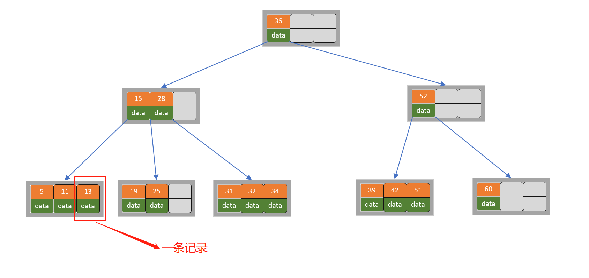

上图表示是一颗4阶B树（当然实际中B树的阶数一般远大于4，通常大于100，这样即使存储大量的数据，B树的高度仍然很低），每个节点最多有3个关键字，每个非根节点最少有Math.ceil(4/2)-1=1个关键字。我们将 

## 2. B树的搜索操作

以上图为例，比如我要查找关键字为25对应的数据，步骤如下：

1. 首先拿到根节点关键字，目标关键字与根节点的关键字key比较，25＜36，去往其左孩子节点查找

1. 获取当前节点的关键字15和28，15＜25＜28，所以查询15和28的中间孩子节点

1. 获取当前节点的关键字19和25，发现25=25，所以直接返回关键字和data数据（如果没有擦汗寻到则返回null）

## 3. B树的插入操作

插入操作是指插入 

### 3.1 基本步骤

1. 根据key找到要插入的叶子节点位置，插入记录

1. 判断当前节点key的个数是否小于等于m-1，如果是直接结束，否则进行第三步

1. 以节点中间的key为中心分裂成左右两部分，然后将这个中间的key插入到父节点中，这个key的左子树指向分裂后的左半部分，这个key的右子树指向分裂后的右半部分，然后将当前指向父节点，继续进行第3步，知道处理完根节点。

### 3.2 图文说明

以5阶B树为例（5阶B树节点最多有4个关键字，最少有2个关键字，其中根节点最少可以只有一个关键字），从初始时刻依次插入数据。

1. 在空树中插入39

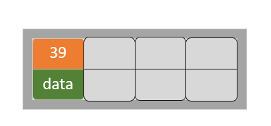

1. 继续插入22，97和41

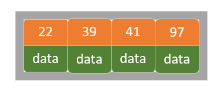

此时根节点有4个关键字

1. 继续插入53

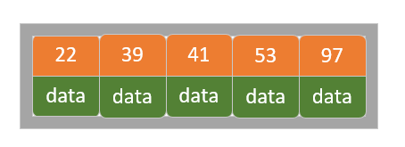

此时发现该节点有5个关键字超过了最大允许的关键字个数4，所以以41为中心进行分裂，分裂后当前节点指向根节点，根节点的关键字为1，满足B树条件，插入操作结束，结果如下所示（注意，如果阶数是偶数，分裂时就不存在排序恰好在中间的key，那么我们选择中间位置的前一个key或中间位置的后一个key为中心进行分裂即可）

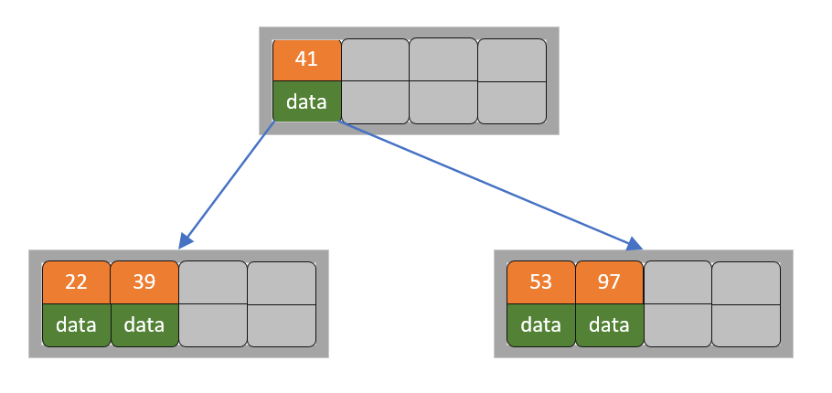

1. 插入13，21，40

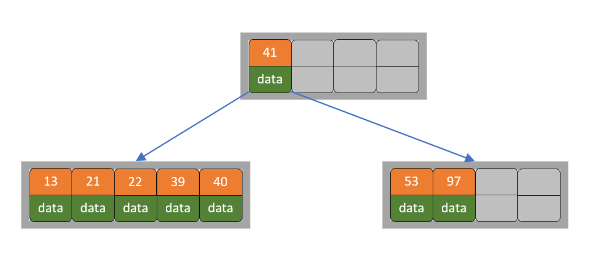

此时当前节点5个关键字，需要以22为中心分裂，22节点插入到其父节点中，分裂后当前节点指向根节点，根节点的关键字为2，满足B树条件，插入操作阶数，结果如下所示

1. 同理依次输入30，27，33，36，35，34，24，29，结果如下所示

1. 继续插入26

此时节点关键字等于5，以27为中心分裂，并将27插入到父节点中，分裂后当前节点指向根节点，如下所示

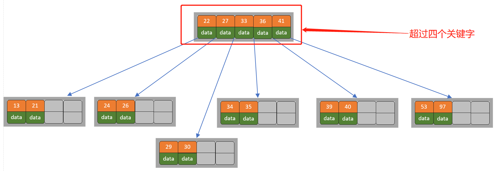

此时27的插入导致当前节点也需要分裂，则以33为中心进行分裂，结果如下

1. 同理最后再依次插入17，28，29，31，32，结果如下图所示

### 3.3 总结

一般来说，对于确定的m和确定类型的记录，节点大小是固定的，无论它实际存储了多少个记录。但是分配固定节点大小的方法会 

## 4. B树的删除操作

删除操作是指根据key删除记录，如果B树种的记录种不存在对应key的记录，则删除失败。

### 4.1 基本步骤

1. 如果当前需要删除的key位于非叶子节点上，则用后继key（这里的后继key均指后继记录的意思）覆盖要删除的key，然后在后继key所在的子支中删除该后继key。此时后继key一定位于叶子节点上，这个过程和二叉搜索树删除节点的方式类似。删除这个记录后执行第2步

1. 该节点key个数大于等于Math.ceil(m/2)-1，结束删除操作，否则执行第3步

1. 如果兄弟节点key个数大于Math.ceil(m/2)-1，则父节点中的key下移到该节点，兄弟节点中的一个key上移，删除操作结束

1. 否则，将 

### 4.2 图文说明

以5阶B数为例（5阶B树节点最多有4个关键字，最少有2个关键字，其中根节点最少可以只有1个关键字）。初始时刻以上述插入操作的最终状态为例。

1. 初始状态

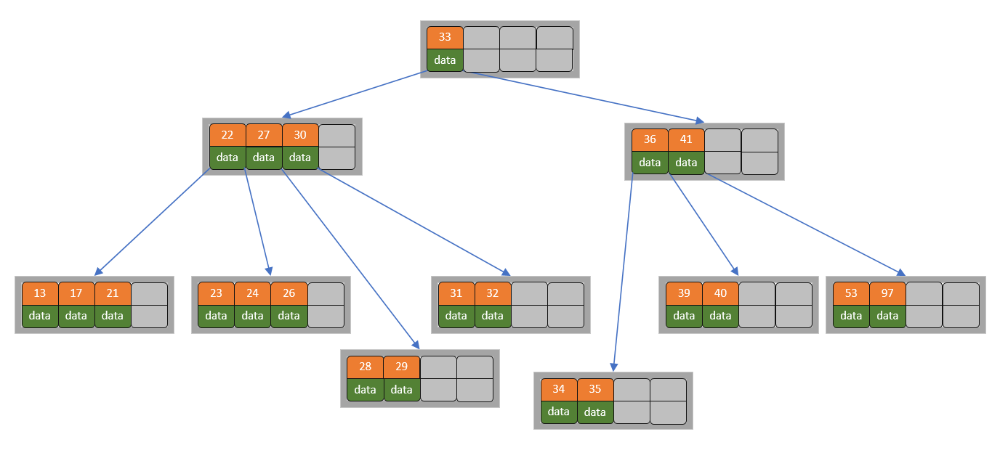

1. 删除节点21

删除后节点中的关键字个数仍然大于2，所以删除结束。

1. 继续删除27，此时27由于是非叶子节点，则由它的后继节点28替换27，再删除28，结果如下所示

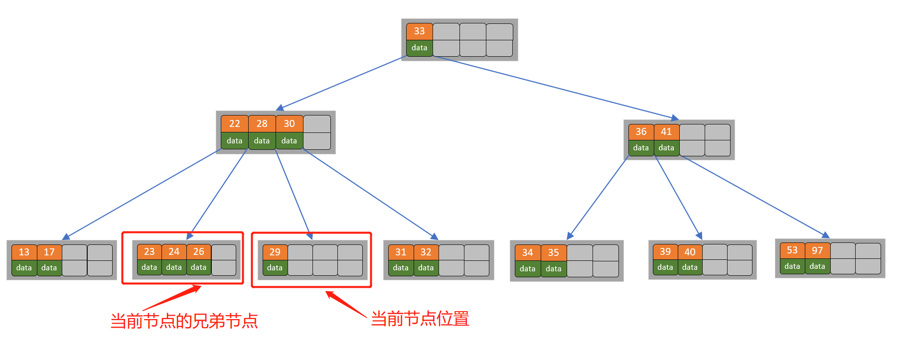

此时发现叶子节点的个数小于2，而它的兄弟节点中有3个记录（当前节点还有一个右兄弟，选择右兄弟就会出现合并节点的情况，不论选哪一个都行，知识最后B树的形态会不一样而已），我们可以从兄弟节点中借取一个key。所以父节点中的28下移，兄弟节点中的26上移，删除结束。结果如下图所示

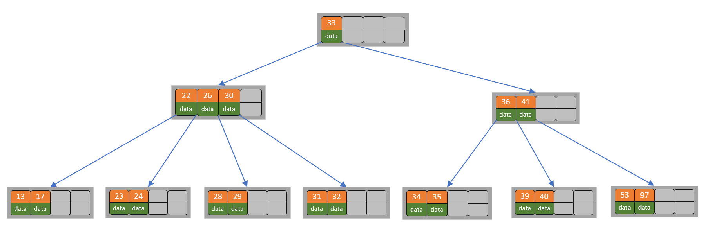

1. 删除32，结果如下图所示

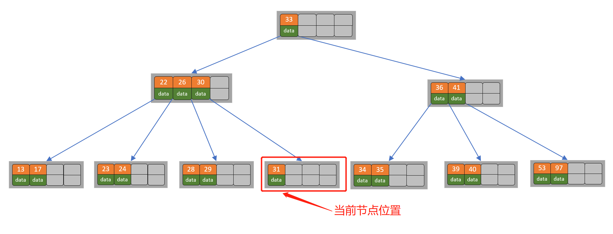

当前节点中只有一个key，而兄弟节点中也仅有2个key。所以只能让 

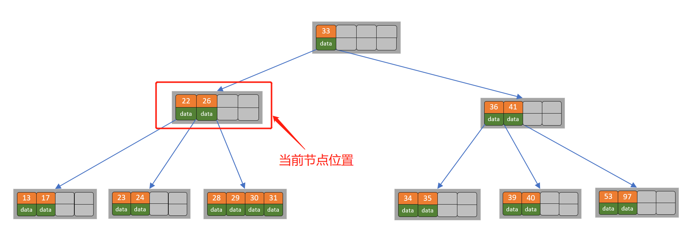

当前节点key的个数满足条件，故删除结束

1. 接着删除key为40的记录，删除后结果如下图所示

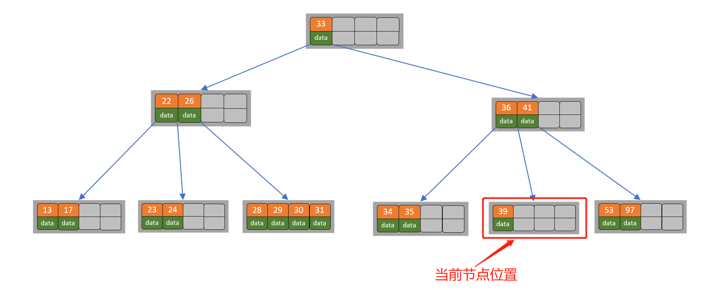

同理，当前节点的记录数小于2，兄弟节点中没有多余key，所以父节点中key下移，和兄弟（这里我们选择左兄弟，选择右兄弟也可以）节点合并，合并后的指针就指向了父节点。如下图所示

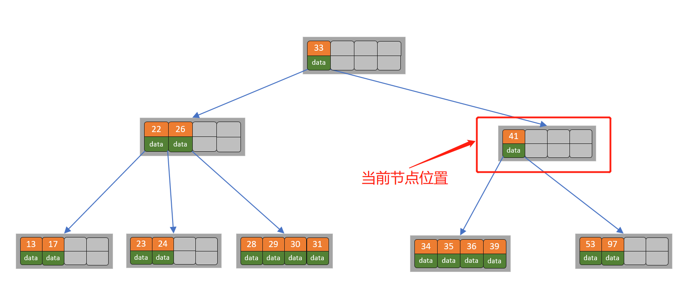

同理，对于当前节点而言只能继续合并了，最后结果如下所示

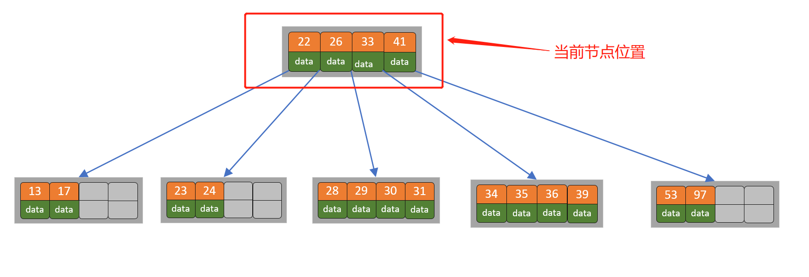

合并后节点满足条件，删除结束。

# 二、B+树

## 1. B+树的定义

B+树是B树的一种变形形式。 

- B+树包含2种类型的节点： 

- B+树与B树最大的不同是 

- m阶B+树表示了 

- 内部节点中的key都按照 

- 每个 

上图是一颗阶数为4的B+树

## 2. B+树的搜索操作

操作流程同B树的搜索流程，只不过如果要找的关键字匹配上了索引节点的关键字，需要继续往下找，因为索引节点不存储数据，所有的数据都存储在叶子节点上。

## 3. B+树的插入操作

### 3.1 基本步骤

1. 若为空树，创建一个叶子节点，然后将记录插入其中，此时这个叶子节点也是根节点，插入操作结束。

1. 针对 

1. 针对 

### 3.2 图文说明

以5阶B+树为例（5阶B+树节点最多有4个关键字，最少有2个关键字，其中根节点最少可以只有一个关键字），从初始时刻依次插入数据。

1. 在空树插入5

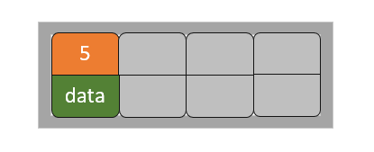

1. 依次插入8，10，15

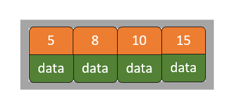

1. 插入16

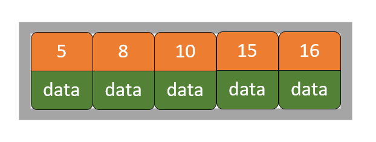

此时节点超过关键字的个数，所以需要进行分裂。由于该节点为叶子节点，所以可以分裂出来左节点2个记录，右边3个记录，中间key成为索引节点中的key（也可以左节点3个记录，右节点2个记录），分裂后当前节点指向了父节点（根节点）。结果如下图所示

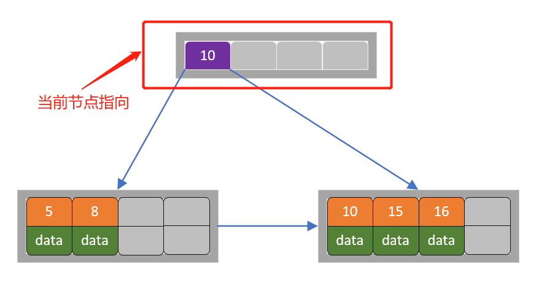

当前节点的关键字个数满足条件，插入结束

1. 插入17

1. 插入18

当前节点超过关键字的个数，进行分裂。由于是叶子节点，分裂成两个节点，左节点2个记录，右节点3个记录，关键字16进位到父节点（索引类型）中，将当前节点的指针指向父节点，如下图所示

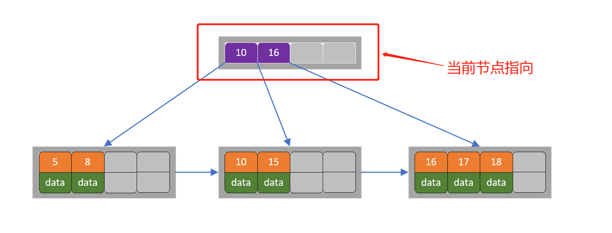

当前节点的关键字个数满足条件，插入结束

1. 同理继续插入6，9，19，细节不再描述

1. 继续插入7

当前节点超过关键字的个数，进行分裂。由于是叶子节点，分裂成两个节点，左节点2个记录，右节点3个记录，关键字7进位到父节点（索引类型）中，将当前节点的指针指向父节点，如下图所示

当前节点超过关键字个数，进行分裂。由于是索引节点，左节点2个关键字，右节点2个关键字，关键字16进入到父节点中，将当前节点指向父节点，如下图所示

当前节点的关键字个数满足条件，插入结束

## 4. B+树的删除操作

### 4.1 基本步骤

如果叶子节点中没有相应的key，则删除失败。否则执行下面的步骤：

1. 删除叶子节点中对应的key。删除后若节点的key的个数大于等于Math.ceil(m/2)，删除操作结束，否则执行第2步。

1. 若兄弟节点key有富余（大于Math.ceil(m/2)），向兄弟节点借一个记录，同时用借到的key替换父节点（指当前节点和兄弟节点共同的父节点）中的key，删除结束。否则执行第3步。

1. 若兄弟节点中没有富余的key，则当前节点和兄弟节点合并成一个新的叶子节点，并删除父节点中的key（父节点中的这个key两边的孩子指针就变成了一个指针，正好指向这个新的叶子节点），将当前节点指向父节点（必为索引节点），执行第4步（第4步以后的操作和B树就完全一样了，主要是为了更新索引节点）。

1. 若索引节点的key的个数大于等于Math.ceil(m/2)，则删除操作结束。否则执行第5步

1. 若兄弟节点有富余，父节点key下移，兄弟节点key上移，删除结束。否则执行第6步

1. 当前节点和兄弟节点及父节点下移合并成一个新的节点。将当前节点指向父节点，重复第4步。

注意，通过B+树的删除操作后，索引节点中存在的key，不一定在叶子节点中存在对应的记录。

### 4.2 图文说明

以5阶B树为例（5阶B树节点最多有个4个关键字，最少有2个关键字，其中根节最少可以只有一个关键字）。初始时刻以上述插入操作的最终状态为例。

1. 初始状态

1. 删除22

删除后叶子节点中key的个数大于等于2，删除结束

1. 删除15

当前节点只有一个key，不满足条件，而兄弟节点有三个key，可以从兄弟节点借一个关键字为9的记录，同时更新将父节点中的关键字由10也变为9，删除结束。

1. 删除7

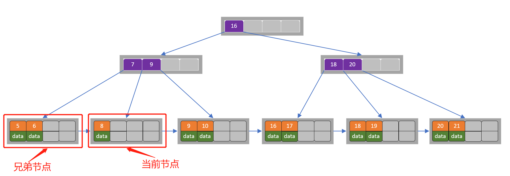

当前节点关键字个数小于2，（左）兄弟节点中也没有富余的关键字（当前节点还有个右兄弟，不过选择任意一个进行分析就可以了，这里我们选择了左边的），所以当前节点和兄弟节点合并，并删除父节点中的key，当前节点只想父节点。

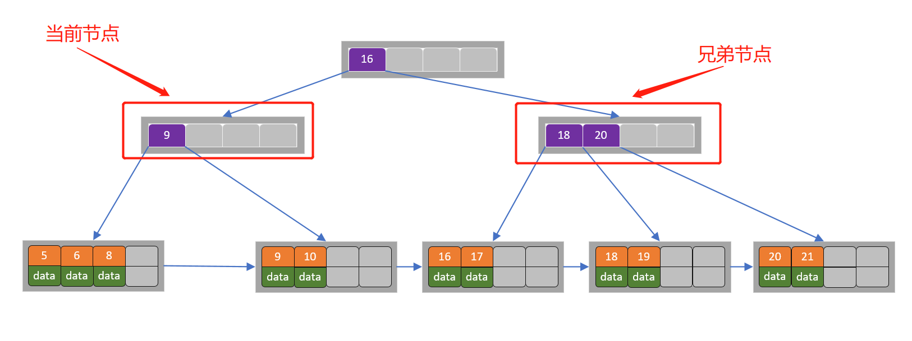

此时当前节点的关键字个数小于2，兄弟节点的关键字也没有富余，所以复系欸但中的关键字下移，和两个孩子节点合并结果如下图所示。

删除结束。