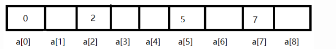

# 一、为什么需要HashMap？

在我们写程序的时候经常会遇到数据检索等操作，对于几百个数据的小程序而言，数据的存储方式或是检索策略没有太大影响，但对于大数据，效率就会差很远。

## 1、线性检索

线性检索是最为直白的方法，把所有数据都遍历一遍，然后找到你所需要的数据。其对应的数据结构就是数组，链表等线性结构，这种方式对于大数据而言效率极低，其 

## 2、二分搜索

二分搜索算是对线性搜索的一个改进，比如说对于[1,2,3,4,5,6,7,8]，我要搜索一个数（假设是2），我先将这个数与4（这个数一般选中位数比较好）比较，小于4则在4的左边[1,2,3]中查找，再与2比较，相等，就成功找到了，这种检索方式好处在于可以省去很多不必要的检索，每次只用查找集合中一半的元素。 

## 3、Hash表中的查找

好了，重点来了，Hash表闪亮登场，这是一种时间复杂度为O(1)的检索，就是说不管你数据有多少只需要查一次就可以找到目标数据。大家请看下图：



大家可以看到这个数组中的值就等于其下标，比如说我要存11，我就把它存在a[11]里面，这样我要找某个数字的时候就直接对应其下标就可以了。这其实是一种 

看了上面的Hash表你肯定想问，如果我只存一个数10000，那我不是要存在a[10000]，这样其他空间不是白白浪费了吗，好吧，不存在的。Hash表已经有了其应对方法，那就是Hash函数。 

## 4、Hash冲突解决策略

看了上面的讲解，有出现了一个问题，通过求余数得到的地址可能是一样的。这种我们称为Hash冲突，如果数据量比较大而Hash桶比较小，这种冲突就很严重。我们采取如下方式解决冲突问题。


我们可以看到12和0的位置冲突了，然后我们把 

上面讲了那么多，那跟我们今天的主题HashMap有什么关系呢？进入正题。我们知道HashMap中的值都是key、value，这里的存储与上面的很像， 

但是又出现了一个问题：如果Hash桶比较小，数据量较大，就会导致链表非常的长。所以就出现了红黑树。

# 二、红黑树的出现

**在JDK1.6，JDK1.7中，HashMap采用位桶+链表实现，即使用链表处理冲突**

**JDK1.8HashMap的红黑树是这样解决的：**

**如果某个桶中的基隆路了过大的话（当前是TREEIFY_THRESHOLD = 8），HashMap会动态的使用一个专门的treemap实现来替换掉它。这样做的结果会更好，是O(logn)，而不是糟糕的O(n)。**

它是如何工作的？前面产生冲突的那些KEY对应的记录只是简单的追加到一个链表后面，这些记录只能通过遍历来进行查找。但是超过这个阈值后HashMap开始将列表升级成一个二叉树， 

# 三、实现原理

HashMap可以看成是一个大的数组，然后每个数组元素的类型是Node类。当添加一个元素（key-value）时，就 

当链表数组的容量超过初始容量的0.75时，再散列将链表数组扩大2倍，把原链表数组的搬移到新的数组中。

# 四、数据结构

上面说过HashMap可以看成是一个大的数组，然后每个数组元素的类型是Node类型，源码里定义如下：

```java
transient Node<K,V>[] table;
```

注意Node类还有两个子类：TreeNode和Entry

```java
TreeNode <K,V> extends Entry<K,V> extends Node<K,V>
```

上图中的链表就是Node类，而红黑树正是TreeNode类。

# 五、HashMap代码分析


## 1、put

```java
public V put(K key, V value) {
    return putVal(hash(key), key, value, false, true);
}
final V putVal(int hash, K key, V value, boolean onlyIfAbsent,
               boolean evict) {
    // 定义一个数组，一个链表，n永远存放数组长度，i用于存放key的hash计算后的值，即key在数组中的索引
    Node<K,V>[] tab; Node<K,V> p; int n, i;
    
    // 判断table是否为空或数组长度为0，如果为空则通过resize()实例化一个数组并让tab作为其引用，并且让n等于实例化tab后的长度
    if ((tab = table) == null || (n = tab.length) == 0)
        n = (tab = resize()).length;
        
    
    //根据key经过hash()方法得到的hash值与数组最大索引做与运算得到当前key所在的索引值，并且将当前索引上的Node赋予给p并判断是否该Node是否存在   
    if ((p = tab[i = (n - 1) & hash]) == null)
        tab[i] = newNode(hash, key, value, null);
        
        // 该位置存在数据的情况
    else {
        // 重新定义一个Node，和一个k 
        Node<K,V> e; K k;
        
        // 该位置上数据Key计算后的hash等于要存放的Key计算后的hash并且该位置上的Key等于要存放的Key
        if (p.hash == hash &&
            ((k = p.key) == key || (key != null && key.equals(k))))
            // true，将该位置的Node赋予给e
            e = p;
        
        // 判断当前桶类型是否是TreeNode
        else if (p instanceof TreeNode)
            // true，进行红黑树插值法，写入数据
            e = ((TreeNode<K,V>)p).putTreeVal(this, tab, hash, key, value);
        else {
            // false，遍历当前位置链表
            for (int binCount = 0; ; ++binCount) {
                //查找当前位置链表上的表尾，表尾的next节点必然为null,找到表尾将数据赋给下一个节点
                if ((e = p.next) == null) {
                    p.next = newNode(hash, key, value, null);
                    // 如果此时已经到第八个了，还没找个表尾，那么从第八个开始就要进行红黑树操作
                    if (binCount >= TREEIFY_THRESHOLD - 1) // -1 for 1st
                        treeifyBin(tab, hash);
                    break;
                }
                //如果当前位置的key与要存放的key的相同，直接跳出，不做任何操作
                if (e.hash == hash &&
                    ((k = e.key) == key || (key != null && key.equals(k))))
                    break;
                //将下一个给到p进行逐个查找节点为空的Node
                p = e;
            }
        }
        if (e != null) { // existing mapping for key
            V oldValue = e.value;
            if (!onlyIfAbsent || oldValue == null)
                e.value = value;
            afterNodeAccess(e);
            return oldValue;
        }
    }
    ++modCount;
    //当最后一次调整之后Size大于了临界值，需要调整数组的容量
    if (++size > threshold)
        resize();
    afterNodeInsertion(evict);
    return null;
}
```

## 2、get

get(key)方法时获取key的hash值，计算hash&(n-1)得到在链表数组中的位置first=tab[hash&(n-1)],先判断first的key是否与参数key相等，不等就遍历后面的链表找到相同的key值返回对应的Value值即可

```java
public V get(Object key) {
    Node<K,V> e;
    return (e = getNode(hash(key), key)) == null ? null : e.value;
}
final Node<K,V> getNode(int hash, Object key) {
    // 定义相关变量
    Node<K,V>[] tab; Node<K,V> first, e; int n; K k;
    
    // 保证map中的数组不为空，并且存储的有值，并且查找的key对应的索引位置上有值
    if ((tab = table) != null && (n = tab.length) > 0 &&
        (first = tab[(n - 1) & hash]) != null) {
        // 第一次就找到了对应的值
        if (first.hash == hash && // always check first node
            ((k = first.key) == key || (key != null && key.equals(k))))
            return first;
        // 判断下一个节点是否存在    
        if ((e = first.next) != null) {
            // true，检测是否是TreeNode
            if (first instanceof TreeNode)
                return ((TreeNode<K,V>)first).getTreeNode(hash, key);
            do {
                // 判断下一个节点是否是要查找的对象
                if (e.hash == hash &&
                    ((k = e.key) == key || (key != null && key.equals(k))))
                    return e;
            } while ((e = e.next) != null);
        }
    }
    return null;
}
```

## 3、resize

```java
final Node<K,V>[] resize() {
    Node<K,V>[] oldTab = table;
    // 为扩容时的数组的容量
    int oldCap = (oldTab == null) ? 0 : oldTab.length;
    int oldThr = threshold;
    // 定义新的容量和临界值
    int newCap, newThr = 0;
    // 当前Map容量大于零，非第一次put值
    if (oldCap > 0) {
        if (oldCap >= MAXIMUM_CAPACITY) {
            // 临界值等于Integer类型的最大值
            threshold = Integer.MAX_VALUE;
            return oldTab;
        }
        // 当前容量在默认值和最大值的一半之间
        else if ((newCap = oldCap << 1) < MAXIMUM_CAPACITY &&
                 oldCap >= DEFAULT_INITIAL_CAPACITY)
            // 新临界值为当前临界值的两倍     
            newThr = oldThr << 1; // double threshold
    }
    // 当前容量为0，但是当前临界值不为0，让新的容量等于当前临界值
    else if (oldThr > 0) // initial capacity was placed in threshold
        newCap = oldThr;
    // 当前容量和临界值都为0，让新的容量为默认值，临界值=初始容量*默认加载因子    
    else {               // zero initial threshold signifies using defaults
        newCap = DEFAULT_INITIAL_CAPACITY;
        newThr = (int)(DEFAULT_LOAD_FACTOR * DEFAULT_INITIAL_CAPACITY);
    }
    // 如果新的临界值为0
    if (newThr == 0) {
        float ft = (float)newCap * loadFactor;
        newThr = (newCap < MAXIMUM_CAPACITY && ft < (float)MAXIMUM_CAPACITY ?
                  (int)ft : Integer.MAX_VALUE);
    }
    // 临界值赋值
    threshold = newThr;
    // 扩容table
    @SuppressWarnings({"rawtypes","unchecked"})
    Node<K,V>[] newTab = (Node<K,V>[])new Node[newCap];
    table = newTab;
    if (oldTab != null) {
        for (int j = 0; j < oldCap; ++j) {
            Node<K,V> e;
            if ((e = oldTab[j]) != null) {
                oldTab[j] = null;
                if (e.next == null)
                    // 此时newCap = oldCap * 2
                    newTab[e.hash & (newCap - 1)] = e;
                else if (e instanceof TreeNode)
                    // 节点为红黑树，进行切割操作
                    ((TreeNode<K,V>)e).split(this, newTab, j, oldCap);
                else { // preserve order
                    // 链表的下一个节点还有值，但系欸但位置有没有超过8
                    // lo就是扩容后仍然在原地的元素链表
                    // hi就是扩容后下标为 原位置+元容量 的元素链表，从而不需要重新计算
                    Node<K,V> loHead = null, loTail = null;
                    Node<K,V> hiHead = null, hiTail = null;
                    Node<K,V> next;
                    do {
                        next = e.next;
                        if ((e.hash & oldCap) == 0) {
                            if (loTail == null)
                                loHead = e;
                            else
                                loTail.next = e;
                            loTail = e;
                        }
                        else {
                            if (hiTail == null)
                                hiHead = e;
                            else
                                hiTail.next = e;
                            hiTail = e;
                        }
                    } while ((e = next) != null);
                    if (loTail != null) {
                        loTail.next = null;
                        newTab[j] = loHead;
                    }
                    if (hiTail != null) {
                        hiTail.next = null;
                        newTab[j + oldCap] = hiHead;
                    }
                }
            }
        }
    }
    return newTab;
}
```

HashMap put与resize的实例图

