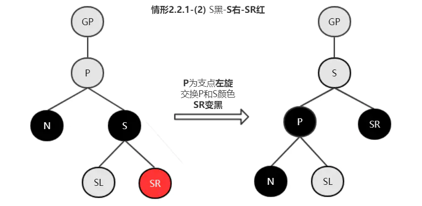

# 红黑树-介绍

## 写在前面

红黑树，对很多同学来说，即熟悉又陌生。学校中学过，只了解大概；工作中不怎么使用，但面试又是重点。每次需要查看红黑树内容时都很难以更生动形象的方式来理解其内容。没错，本文内容就是要解决这个问题，用简单的语言，搭配静图和动图，让你对红黑树有更深入的了解和更清晰的记忆，希望小伙伴们再次遇到红黑树的问题不至于头大， 

通过工具动态感受红黑树的转换过程

> 俺家司令买完东西后，我俩经常会发生这样的一段对话：司令：你猜我买的这个多少钱？我：1000司令：高了我：500司令：低了我：750……直到最后猜中

这样说大家应该已经猜到了是“二分查找法”，通过这个例子我想要引出的是 

程序中的树其实是我们日常看到的树的倒影，或者发挥一下想象，倒影也可以是树根

## 二叉查找树

二叉查找树，Binary Search Tree （BST），要想了解二叉查找树，我们首先看下二叉查找树有哪些特性呢？

1. 某节点的左子树节点值仅包含小于该节点值

1. 某节点的右子树节点值仅包含大于该节点值

1. 左右子树每个也必须是二叉查找树

看了图就轻松理解上面三句话的意思了：

上图，结合二叉查找树的三条约束来看，非常好，没有什么问题。再来看一个图，依旧符合上面三条约束，感觉有问题吗？

1. 这是一个走路一米六，一米八的树

1. 这是一个畸形的树，大风一刮很可能被折断的树

从程序的角度来说这个树不够平衡，查找次数或时间复杂度O(h)可能会随着一条腿长无限增长

理科生在高中学习生物时学过一个关键字“去除顶端优势”，通过去除植物顶端优势，侧芽会迅速生长，慢慢变得强壮和平衡， 

## 红黑树

红黑树，Red-Black Tree（RBT）是一个自平衡（不是绝对的平衡）的二叉查找树（BST），树上的每个节点都遵循下面的规则：

1. 每个节点都有红色或者黑色

1. 树的根始终是黑色的（黑土地孕育黑树根）

1. 没有两个相邻的红色节点（红色节点不能有红色父节点或红色子节点， 

1. 从节点（包括根）到其任何后代NULL节点（叶子节点下方挂的两个空节点，并且认为它们是黑色的）的每条路径都具有相同数量的黑色节点

瞬间懵逼？ 

红黑树也一样，红黑树有两大操作：

1. recolor（重新标记黑色或红色）

1. rotation（旋转，这是树达到平衡的关键）

我们会先尝试recolor，如果recolor布恩那个达到红黑树的4点要求，然后我们尝试rotation，其实红黑树的关键玩法就是弄清楚recolor和rotation的规则，接下来看看详细的算法公式吧。 

假设我们插入的新节点为X

1. 将新插入的节点标记为红色

1. 如果X是根节点（root），则标记为黑色

1. 如果X的parent不是黑色，同时X也不是root

1. 如果X的uncle（叔叔）是红色

1. 将parent和uncle标记为黑色

1. 将grand parent（祖父）标记为红色

1. 让X节点的颜色与X祖父的颜色相同，然后重复步骤2、3

话不多说，看下图

跟着上面的公式走：

1. 将新插入的X标记为红色

1. 发现X的parent(P)同样为红色，这违反了红黑树的第三条规则（不能有两个连续相邻的红色节点）

1. 发现X的uncle(U)同样为红色

1. 将P和U标记为黑色

1. 将X和X的grand parent(G)标记为相同的颜色，即红色，继续重复公式2、3

1. 发现G是根节点，标记为黑色

1. 结束

刚刚说了X的uncle是红色的情况，接下来要说是黑色的情况

1. 3.2 如果X的uncle（叔叔）是黑色

1. 3.2.1 左左（P是G的左孩子，并且X是P的左孩子）

1. 3.2.2 左右（P是G的左孩子，并且X是P的右孩子）

1. 3.2.3 右右（P是G的右孩子，并且X是P的右孩子）

1. 3.2.4 右左（P是G的右孩子，并且X是P的左孩子）

当出现uncle是黑色的时候我们第一步要考虑的是 

- 左左

这种情况很简单，想象这是一根绳子，手提起P节点，然后变色即可

- 左右

左旋：使X的父节点P被X取代，同时父节点P称为X的左孩子，然后再应用 

- 右右

与左左情况一样，想象成一根绳子

- 右左

右旋：使X的父节点P被X取代，同时父节点P称为X的右孩子，然后再应用 

## 实例演示

> 插入10、20、30、15到一个空树中

1. 向空树中第一次插入数字10，肯定是root节点

1. root节点标记称黑色

1. 向树中插入新节点20，标记为红色

1. 20 ＞ 10，并发现10没有叶子节点，将新节点20作为10的右孩子

1. 向树中插入新节点30，标记为红色

1. 30 ＞ 10，查找10的右子树，找到20

1. 30 ＞ 20，继续查找20的右子树，发现20没有叶子节点，将值插在此处

1. 30和20节点都为红色，30为右孩子，20也为右孩子，出发了右右

1. 通过一次旋转，提起20节点

1. 20节点是根节点，标记为黑色

1. 向树中插入新节点15，标记为红色

1. 通过比对大小和判断是否有叶子节点，最终插值为10节点的右孩子

1. 15和10节点都为红色，15的uncle节点30也为红色

1. 按照公式，将15的parent 10和uncle 30变更为黑色

1. 让15节点grand parent 20的颜色与15节点的颜色一样，变为红色

1. 20为根节点，将其改为黑色

# 红黑树-插入

## 红黑树的定义

红黑树在二叉搜索树的基础上，还要求有以下性质：

1. 节点是红色或黑色；

1. 根节点是黑色；

1. 不能有连续的两个红色节点；

1. 从任一节点到其每个叶子的简单路径都包含相同数目的黑色节点。

性质3表明：红色节点的父、左子、右子只能是黑色节点，红色和红色不能直接连一起；而黑色无论红黑都可以连一起。（红色暴脾气互不相容，黑色和可亲谁来都行）；

性质4表明：随便选一个节点，不论怎么走，走到最后叶子节点时，其经过路径的黑色节点数量都是相等的（所谓完全黑平衡）。

而性质3和4共同决定了： 

因为路径长度/高度差有了一定限制，所以称红黑树是有一定平衡性的，不会出现极端倾斜的情况。

有一些红黑树定义（比如维基百科），还有一个性质，叶子是黑色的NULL节点：

引入黑色的NULL节点并不会对之前的定义产生影响（个路径都增加一个黑色节点，黑色数量依然相等），其目的更多是为了简化平衡操作的情况，平衡时可以认为NULL就是黑色节点。此时只需要考虑红和黑这两种情况就行，而不用考虑非红非黑的NULL。

## 旋转

说插入之前，先来看看旋转：

旋转后，原来“左小右大”的特点不会受到影响；影响的是左右子树的高度，右旋左子树高度-1，右子树+1；左旋右子树高度-1，左子树+1。

比如某棵树的左子树高度已经达到3，而右子树只有1，只需要右旋一下，左右子树高度都将调整为2。整棵树来看，高度就相当于降低了1（3→2），这就是高度的“平衡”。

旋转前首先要确定 

另外留意一下b：

右旋前，b是挂在Y的右子，而右旋后，挂到了X的左子了；

左旋前，b是挂在X的左子，而左旋后，挂到了Y的右子了；

## 插入平衡

开始之前，我们先约定一下名称：

红黑树属于二叉搜索树，插入动作也与二叉搜索树一致，只不过红黑树在插入之后，多了平衡动作（旋转与涂色）。

新插入的节点均为红色节点，因为红色不会影响路径上黑色节点的数量，保持性质4。如果父节点为黑色，就直接结束了；如果父节点为红色，则需要另外处理了。

以新插入的节点为当前平衡节点N，插入平衡答题上分为一下情形：

### 情形1. N为根节点（父节点为NULL）

当前平衡节点N为根节点时，直接涂黑根节点即可。

### 情形2. 父黑

父节点为黑色时，无需其他操作，已然平衡。

### 情形3. 父红-叔红

父红-叔红时，将父/叔节点（P/U）点涂黑，祖父节点（GP）涂红；而后以祖父节点（GP）作为新的平衡节点N，递归执行平衡操作。

### 情形4. 父红-叔黑

#### 情形4.1 父节点和N同一边

###### 情形4.1.1 父N同左

“父N同左”指的是： 

此时以 

旋转后，P涂黑是因为原GP的黑色（网上加入弄GP的父节点）；而GP涂红则是因为右旋后，经过U的路径的黑色节点数量+1，涂红进行数量平衡；下同。

###### 情形4.1.2 父N同右

“父N同右”指的是： 

此时以 

#### 情形4.2 父节点和N不在同一边

###### 情形4.2.1 父左N右

“父左N右”指的是： 

此时，以 

###### 情形4.2.2 父右N左

“父右N左”指的是： 

此时，以 

## 插入总结与实例

首先是先插入再说；插入后，以刚插入的节点作为当前平衡节点N，进行平衡操作。现在回头看插入平衡的这几种情形，其实并不复杂：

1. N为根：涂黑完事；

1. 父黑：啥事不用管；

1. 父红叔红：父/叔涂黑，祖父涂红，然后把祖父当作新的平衡节点递归处理（我们下面平衡了，让他老人家和上面沟通吧）；

1. 父红叔黑：父节点和新插入节点同一边的话，扭一下就完事儿了（同左右旋，同右左旋，顺便涂色）；不在同一边的话，先扭到同一边吧。

例：插入10、20、15、30、5、8；

为了简化，图中没有画出NULL的黑色节点。

# 红黑树-删除

## 删除动作

红黑树和二叉搜索树的删除类似，只不过加上颜色属性（这里的子节点均指非NULL节点）：

1. 无子结点时，删除节点可能为红色或者黑色；

1. 如果为红色，直接删除即可，不会影响黑色节点的数量；

1. 如果为黑色，则需要进行删除平衡操作了；

1. 只有一个子节点时，删除节点只能是黑色，其子节点为红色，否则无法满足红黑树的性质了。此时用删除节点的子节点接到父节点，且将子节点颜色涂黑，保证黑色数量。

1. 有两个子节点时，与二叉搜索树一样，使用后继节点作为替换的删除节点，情形转至1或2处理。

我们发现，删除情形3总是会转换为情形1和2的，而情形1.1和情形2处理平衡非常简单，本文主要讨论的是情形1.2：删除 

> 这里的图特意将黑色的NULL节点给加上，这是因为删除节点被摘掉后，我们可用一个黑色的节点接上，从而进行统一处理。

## 删除后的平衡

我们先约定一下节点名称：

h(A→B→叶子)表示从A走到B再走到某一个叶子路径的黑色节点数量（A与B，B与叶子之间可能间隔了多个节点）

本文余下内容均指的是 

因为删除了一个黑色节点（N的父节点D），经过N的路径的黑色数量减1，即h(P→N→叶子)比h(P→S→叶子)少1。平衡的方式有：

1. h(P→N→叶子)不变，h(P→S→叶子)减1，此时已经子平衡；然而H(GP→P→叶子)还是会比h(GP→U→叶子)少1。此时需要将P当作新的N，向上递归处理；

1. h(P→N→叶子)加1，h(P→S→叶子)不变，也就是恢复了原来的状态，此时已经平衡，因为h(GP→P→叶子)=h(GP→U→叶子)。

文本下面的平衡的思路主要就是基于以上两种方式，另外要注意的是，红色和红色不能连一起的约束也不能违反。理解这个比较重要。

> GP→P→叶子的路径，要么经过N，要么经过S，如果h(P→N→叶子)和h(P→S→叶子)均少1了，自然h(GP→P→叶子)会少1。

删除平衡情形，主要根据“兄节点的位置/颜色”、“兄的子节点的颜色”、“父节点颜色”进行分类：

N节点的位置知道后，S的位置自然也就知道了，相反亦可；这里以S位置作为分类，主要是为了便于理解和记忆。

### 情形1 当前节点为根节点（父节点为NULL）

比较特殊的情况，无需平衡操作。因为经过根节点的黑色数量少一个，意味着所有路径都少一个，已然平衡。

### 情形2 兄弟节点为黑色（S=黑）

#### 情形2.1 兄弟的子节点全黑（SL/SR=黑）

兄弟节点的子节点全为黑，也就意味着兄弟节点（S）可以涂红而不会和子冲突。S涂红后，也就实现了子平衡，这时候我们看父节点是红是黑，再做处理。

###### 情形2.1.1 父节点为黑色（P=黑）

此时将S涂红，父节点作为新的平衡节点N，递归上去处理。

这个也就是之前提到的h(P→N→叶子)不变，h(P→S→叶子)减1；而h(GP→P→叶子)，依然会比h(GP→U→叶子)少1，所以要递归上去处理。

###### 情形2.1.2 父节点为红色（P=红）

此时将S涂红，P涂黑，平衡结束。

S涂红后，h(P→N→叶子)不变，h(P→S→叶子)减1，实现子平衡；因为P节点是红色的，如果将他涂黑，h(P→N→叶子)和h(P→S→叶子)均会加1，就可以恢复原来的状态了，而不用递归上去。

#### 情形2.2 兄弟的子节点不全黑

所谓的不全黑包括：“SL红，SR红”、“SL黑，SR红”、“SL红，SR黑”。如果其中一个为黑，另外一个肯定是红。

以全黑/非全黑作为分类，是因为全黑时无论N是在左子还是右子，其处理方式时一样的。

而非全黑则要看N所处的位置（或者说S所处的位置）进行特定方向的旋转。

为了方便理解和记忆，以S进行分组：

S为左子时（即N为右子），主要分两组“SL红”、“SL黑”。

S为右子时（即N为左子），主要分两组“SR红”、“SR黑”。

“S为左子，SL红”与“S为右子，SR红”处理方式对称；

“S为左子，SL黑”与“S为右子，SR黑”处理方式对称。

##### 情形2.2.1 S为左子，SL红；S为右子，SR红

###### 情形2.2.1.1 S为黑色，S为左子，SL红

以P为支点右旋；交换P和S颜色，SL涂黑；平衡结束。

这里的平衡思路其实就是：h(P→S→叶子)不变（因为SL涂黑补回来了），h(P→N→叶子)加1（因为多了个黑色P）。

###### 情形2.2.1.2 S为黑色，S为右子，SR红

以P为支点左旋；交换P和S颜色（S涂为P原颜色，P涂黑），SR涂黑；平衡结束。

##### 情形2.2.2 S为左子，SL黑；S为右子，SR黑

###### 情形2.2.2.1 S为黑色，S为左子，SL黑

以S为支点左旋，交换S和SR颜色（SR涂黑，S涂红），此时转至情形2.2.1.1 S左-SL红进行处理。

S涂红是为了使h(原S→SR→叶子)不变。

###### 情形2.2.2.2 S为黑色，S为右子，SL黑

以S为支点右旋，交换S和SL颜色（SL涂黑，S涂红），此时转至情形2.2.1.2 S右-SR红进行处理。

### 情形3 兄弟节点为红色（S=红）

情形3.1 S为左子时，以P进行右旋；

情形3.2 S为右子时，以P进行左旋；

旋转后交换P和S的颜色（S涂黑，P涂红），N兄弟节点变为黑色，进入情形2 兄弟节点为黑色进行处理。

## 删除总结与实例

1. 删除动作（移除节点）之后，看看这个节点是不是黑色的叶子节点，如果不是，简单处理就可以达到平衡了；

1. 先看N是不是根节点，使得话啥都不用管；不是的话看兄弟什么颜色：

1. 兄弟是红色，进行旋转涂色，去到兄弟为黑色那里处理

1. 兄弟是黑色，看看兄弟子节点是不是全部都是黑

1. 全黑的话，看父什么颜色进行对应处理；

1. 不全黑，看兄在的位置，兄在左的话，看兄的左子是不是红色，进行对应处理；兄在右的话，看兄的右子是不是红色，进行独赢处理。

现在我们右一颗红黑树：

1. 删除50，删除动作-情形3 → 删除动作-情形2，简单处理即可：

1. 删除70，即黑色叶子节点，进行平衡：

1. 删除60：

1. 删除10：

1. 删除20：

